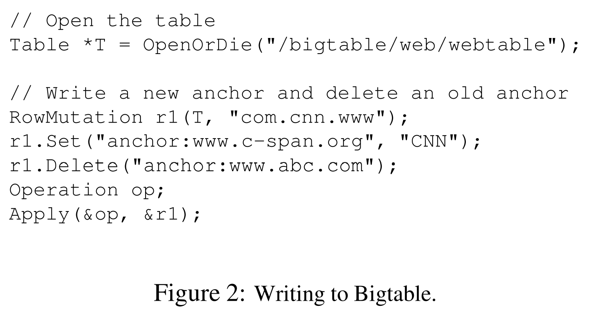
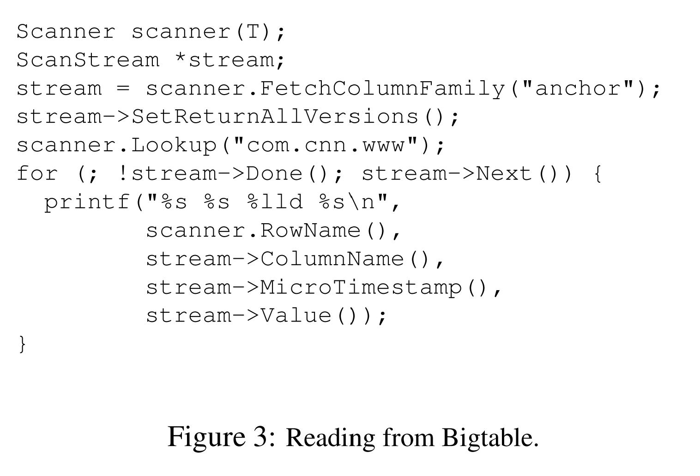

*本篇文章是对论文[Bigtable-OSDI06](https://static.googleusercontent.com/media/research.google.com/zh-CN//archive/bigtable-osdi06.pdf)的原创翻译，转载请严格遵守[CC BY-NC-SA协议](https://creativecommons.org/licenses/by-nc-sa/4.0/)。*

<!--more-->

## 摘要

Bigtable是一个为管理大规模可伸缩的结构化数据而设计的的分布式存储系统，它可以跨上千台商用服务器管理PB级的数据。Google中很多项目将数据存储在Bigtable中，包括web索引、Google Earth和Google Finance。这些应用程序对Bigtable提出了非常不同的需求，这些不同包括数据大小不同（从URL到web页面再到卫星图像）和延迟要求不同（从后端批处理任务到实时数据服务）。尽管需求是多变的，Bigtable还是成功地为Google的所有这些产品提供了灵活的、高性能的解决方案。在本文中，我们描述了Bigtable提供的允许客户端动态控制数据布局和格式的简单数据模型，以及Bigtable的设计与实现。

## 1. 引言

在过去的两年半的时间里，我们在Google设计、实现并部署了一个用来管理结构化数据的分布式存储系统——Bigtable。Bigtable为可靠地适用于PB级数据和上千台机器而设计。Bigtable已经完成了几个目标：适用性广、可伸缩、高性能和高可用。Bigtable在超过60余个Google的产品和项目中被使用，包括Google Analytics、Google Finance、Orkut、个性化搜索、Writely和Google Earth。这些产品使用Bigtable以应对变化多样的负载需求，从吞吐量敏感的批处理程序到面相终端用户的延迟敏感的数据服务。这些产品使用的Bigtable集群配置也变化多样，从几台服务器到数千台服务器，最多的可以存储几百TB的数据。

Bigtable在很多方面都很像一个数据库：Bigtable和数据库的很多实现策略都是相同的。并行数据库和内存数据库已经做到了可伸缩和高性能，但是Bigtable提供了与这类系统不同的接口。Bigtable不支持完整的关系数据模型，取而代之的是，Bigtable提供了一个简单地数据模型，该模型允许客户端动态控制数据布局和格式，且允许客户端参与决策层数据在下层存储中的位置属性。数据通过可用任意字符串命名的行名和列名来索引。Bigtable将数据视为普通字符串且不关注其内容。客户端可以将不同格式的结构化或半结构化数据序列化为字符串。cnt可以小心地选择数据的schema来控制数据的位置。最后欧，Bigtable的schema参数允许客户端动态控制将数据放在内存中还是磁盘中使用。

[第二章](#2-)更详细地介绍了数据模型。[第三章](#3-)给出了客户端API的概览。[第四章](#4-)简要描述了Bigtable依赖的Google的下层基础设施。[第五章](#5-)描述了Bigtable的基本实现。[第六章](#6-)我们为Bigtable的性能做出的改进。[第七章](#7-)提供了Bigtable的性能测试。在[第八章](#8-)中，我们描述了一些关于Bigtable在Google中被如何使用的例子。在[第九章](#9-)中，我们讨论了我们在设计和支持Bigtable时认识到的一些问题。最后，[第十章](#10-)讨论了相关工作，[第十一章](#-)给出了我们的结论。

## 2. 数据模型

Bigtable是一个稀疏的、分布式的、持久化的多维排序映射（map）。该映射通过行键（row key）、列键（column）和时间戳（timestamp）索引，映射中的每个值都是字节数组。

$$(row:string, column:string, time:int64) \rightarrow string$$

在调研了类Bigtable系统的各种潜在用途后，我们决定采用这种数据模型。驱动我们做出部分设计决策的案例是：假设我们想要持有一份可在很多项目中使用的大量web页面和相关信息的副本，我们称这个副本构成的特殊的表为Webtable。在Webtable中，我们使用URL作为行键，网页的不同性质作为列名，并将网页的内容和其被抓取的时间戳存储在“contentes:”列中，如**图1**中个所示。

### 2.1 行

表中行键可以使任意的字符串（目前不能超过64KB，对大部分用户来说通常大小仅为10~100字节）。在单个行键下的读写是原子性的（无论该行中有多少不同的列正在被读写），这种设计决策使客户端对同一行并发更新时能够更容易地判断系统的行为。

Bigtable按照行键以字典序维护数据。表会对行区间动态分区。每个行区间被称为一个tablet，其为分布式和负载均衡的基本单位。这样做在读取较短的行区间时非常高效，且通常仅需要与较少的机器交互。客户端可以通过选择行键来利用这一性质，为数据访问提供更好的数据位置分布。例如，在Webtable中，通过将URL中hostname的各部分反转，可以将域名相同的网页被分组到连续的行中。如，我们会将“maps.google.com/index.thml”的数据使用键“com.google.maps/index。html”存储。将相同域名下的网页存储在相邻的位置可以使一些对主机和域名的分析更加高效。

### 2.2 列族

列键被为一系列的组，这些组被称为“列族（column family）”，列族是访问控制（access control）的基本单位。被存储在同一列族下的数据通常为同一类型的（我们会将同一列族下的数据压缩在一起）。列族必须在数据被存储到该列族中任何列键下之前创建；在列族创建好后，该列族下任何列键都可以使用。我们希望减少表中不同列族的数量（最多在几百以内），且列族在操作期间很少被改变。相反，一个表中可以有无限多的列。

列键使用如下的格式命名：`列族名:限定符`。列族名必须是可打印（printable）的，但限定符可以是任何字符串。Webtable中的一个列族样例名为“language”。在“language”列族下仅使用了一个列键，在列键下存储的是网页的语言ID。该表中另一个很有用的列族为“anchor”。该列族下每个列键都表示一个单独的锚点（译注：若有一个网页引用了该网页，那么引用该网页的网站域名即为该网页的锚点），如**图1**所示。该列族中列键的限定符以引用该网页的网站名来命名，单元格的内容是该锚点的链接。

访问控制以及磁盘和内存统计都在列族级别执行。在我们的Webtable例子中，这些控制让我们能够对不同类型的应用程序做出不同的管理：有些应用程序被允许新增基本数据，有些应用程序被允许读取基本数据并创建派生的列族，有些应用程序仅被允许查看以后数据（且很有可能为隐私考虑无法阅读所有的列族）。

### 2.3 时间戳

Bigtable中的单元格可以包含相同数据的不同版本，这些版本使用时间戳索引。Bigtable的时间戳是64位整型。时间戳可以被Bigtable分配，这样其可以以毫秒来表示当前时间；时间戳还可以通过客户端程序指定。如果应用程序需要避免时间戳碰撞，那么其必须自己生成唯一的时间戳。单元格的不同版本会按照时间戳倒序存储，这样最新的版本可以被最早读取。

为了使管理不同版本的数据更加简便，每个列族支持两种设置。通过设置可以使Bigtable能够自动地对单元格的版本进行垃圾回收。客户端可以指定Bigtable仅保留单元格的最后$n$个版本，或者仅保留足够新的版本（例如，仅保留最近七天内写入的值）。

在我们的Webtable例子中，我们为“content：”列中存储的爬取到的页面设置的时间戳为：该版本的页面被爬取到的实际时间。上文中描述的垃圾回收机制允许我们仅保留每个页面的最近3个版本。

## 3. API

Bigtable的API提供了用于创建、删除表和列族的函数。还提供了修改集群、表和列族的元数据（如访问控制权限）的函数。

客户端程序可以写入或删除Bigtable中的值、从个别行中查找值或者遍历表的子集中的数据。**图2**展示了在c++代码中使用`RowMutation`抽象来执行一系列更新。（省略了不相关的细节以保证示例简洁。）`Apply`调用会对Webtable执行一个原子性的变更：向“www.cnn.com”中增加一个anchor并删除另一个anchor。

**图3**展示了在c++代码中使用`Scanner`抽象遍历特定行的所有anchor。客户端可以遍历多个列族。客户端有几种限制扫描获取的行、列和时间戳的机制。例如，我们可以限制扫描仅获取列名匹配正则表达式`anchor:*.cnn.com`的anchor，或者仅匹配时间戳在当前时间的十天内的anchor。

Bigtable支持其他的一些允许用户通过更复杂的方式操作数据的特性。第一，Bigtable支持单行事务（single-row transaction），该特性可用作原子性地对一个行键下的数据串行地读、改、写。尽管Bigtable的客户端提供了跨行键的批量写入的接口，但是Bigtable目前不支持跨行键的事务。第二，Bigtable允许单元格被用作整型计数器。最后，Bigtable支持服务器的地址空间中执行用户提供的脚本。这些脚本通过Google开发的用于数据处理的Sawzall语言编写。目前，基于Sawzall的API不允许客户端脚本将数据写回Bigtable，但支持多种形式的数据转换、基于任意表达式的数据过滤、使用多种操作符运算。

Bigtable可在MapReduce中使用。MapReduce是一个Google开发的运行大规模并行计算的框架。我们已经编写了一系列的封装，来使Bigtable可以作为MapReduce任务的输入或输出。

## 4. 块的构建

