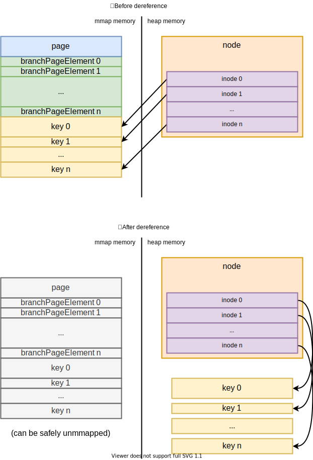

*本文为原创文章，转载请严格遵守[CC BY-NC-SA协议](https://creativecommons.org/licenses/by-nc-sa/4.0/)。*


<!--more-->

## 0. 引言

boltdb是需要通过磁盘来持久化数据的kv数据库。为了平衡内存与磁盘的读写性能，boltdb使用了B+Tree来保存并索引数据。B+Tree（B+树）是B-Tree（B树）的一种变体，本文不会详细介绍有关B-Tree或B+Tree的具体操作，而仅给出B-Tree与B+Tree的概念，并通过boltdb对B+Tree的实现介绍。

一棵$m$阶B-Tree的性质如下：
1. 每个节点最多有$m$个孩子。
2. 除根节点外的每个非叶子节点至少有$\lceil m/2 \rceil$个孩子。
3. 如果根节点不是叶子节点，那么根节点至少有2个孩子。
4. 非叶子节点有$k$个孩子，$k-1$个key，key从小到大排列，且$k-1$个key划分了$k$个孩子中key的范围。
5. 所有叶子节点都在同一层。

B-Tree有如下的优点：
1. 树高度低，$\lceil \log_{m}{(n+1)} \rceil -1 \le h \le \lfloor \log_{ \lceil m/2 \rceil }{\frac{n+1}{2}} \rfloor$。底数为$O(m)$。
2. 与平衡二叉树相比，I/O次数少，适合基于磁盘的实现。
3. 读取节点数据时能够充分利用缓存。

B+Tree在B-Tree的基础上，进一步做了一些优化。一棵$m$阶B+Tree的性质如下：
1. 每个节点最多有$m$个孩子。
2. 除根节点外的每个非叶子节点至少有$\lceil m/2 \rceil$个孩子。
3. 中间节点的key只作为索引，key同时存在于其孩子中，且是相应孩子的最大（或最小）的key。
4. 数据由且仅由叶子节点保存，叶子节点还有一个链指针，按从小到大的顺序指向下一个叶子节点。

相比B-Tree，B+Tree还有如下优点：
1. 中间节点不保存数据，一个块中能保存更多元素，I/O次数更少。
2. 所有查询都要落到叶子节点，性能更加稳定。
3. 叶子节点形成有序链表，范围查询更方便。

无论B-Tree还是B+Tree都是为优化磁盘I/O设计的高级数据结构。其实现涉及到很多与I/O、缓存相关问题。因此，B+Tree并没有一种“标准”的实现，B+Tree的设计也与存储系统的使用场景、硬件环境密相关。由于boltdb是一个基于磁盘的kv数据库，其保存的key与value都是变长的，因此，boltdb中B+Tree的实现有如下特点：
1. 由于boltdb的key是变长的，其没有使用$m$阶的概念，而是使用*数据填充率*来限制节点大小。数据填充率为节点大小与`pageSize`的比值。理论上，节点的数据填充率不能大于1，除根节点外的每个非叶子节点的数据填充率不小于设置的参数`fillPercent`。但实际上，由于一些key/value数据过大，节点填充率可能超过1但不可再分，这样的节点也是合法的节点。
2. 叶子节点的value直接保存在叶子节点中，而不是通过指针指向其它页。这样可以减少一次I/O且在范围查询时可以充分利用缓存。
3. 为了简化实现，boltdb的叶子节点没有实现链指针。因此在进行范围查询时，cursor需要通过栈来保存遍历路径。
4. 为了保证事务的ACID性质并减少I/O次数，boltdb的B+Tree只有在需要写入到文件时才会进行调整以保持平衡。也就是说，在内存中，boltdb的B+Tree可能并不是平衡的。

## 1. boltdb中B+Tree的实现

boltdb的B+Tree节点实现可分为存储中的实现（mmap memory）与内存中的实现（heap memory）两部分。

B+Tree节点存储部分的实现即branchNodePage与leafNodePage。branchNodePage中每个`branchPageElement`的`pos`与`ksize`字段标识了branch node中的每个key的位置、`pgid`字段标识了该key所对应的孩子节点的页id；leafNodePage中`pos`、`ksize`、`vsize`字段标识的leaf node中每个实际存储的key/value的位置、`flags`字段标识了该元素的类型（是普通的key/value还是bucket）。

虽然boltdb通过mmap的方式将数据库文件映射到了内存中，但是page是copy-on-write的，相当于mmap的page是只读的。因此，boltdb还需要一种通过heap memory表示的B+Tree节点。

B+Tree节点内存部分主要由node结构体实现。本节将详细介绍node结构体及其相关方法的实现。

boltdb中node是按需实例化的，对于不需要修改的node，boltdb直接从page中读取数据；而当boltdb需要修改B+Tree的某个节点时，则会将该节点从page实例化为node。在修改node时，boltdb会为其分配page buffer（dirty page），等到事务提交时，才会将这些page buffer中的数据统一落盘。

本文主要关注boltdb中B+Tree在内存中的实现（heap memory），B+Tree在存储中的实现（mmap memory - page）笔者已经在本系列的[存储与缓存](/posts/code-reading/boltdb-made-simple/1-storage-cache/)中介绍过，这里不再赘述。而node实例化的具体时机与boltdb中cursor的实现有关，因此笔者将其留到了本系列的后续文章中介绍。

### 1.1 node结构体

boltdb中B+Tree的实现主要在`node.go`中。node结构体表示了boltdb中B+Tree的节点，其实现如下：

```go

// node represents an in-memory, deserialized page.
type node struct {
	bucket     *Bucket
	isLeaf     bool
	unbalanced bool
	spilled    bool
	key        []byte
	pgid       pgid
	parent     *node
	children   nodes
	inodes     inodes
}

// inode represents an internal node inside of a node.
// It can be used to point to elements in a page or point
// to an element which hasn't been added to a page yet.
type inode struct {
	flags uint32
	pgid  pgid
	key   []byte
	value []byte
}

type inodes []inode

```

| 字段<div style="width: 14em"> | 描述 |
| :-: | :- |
| `bucket *Bucket` | 该node所属的bucket指针。 |
| `isLeaf bool` | 当前node是否为叶子节点。 |
| `unbalanced bool` | 当前node是否可能不平衡。 |
| `spilled bool` | 当前node是否已被调整过。 |
| `key []byte` | 保存node初始化时的第一个key，用于在调整时索引。 |
| `pgid pgid` | 当前node在mmap内存中相应的页id。 |
| `parent *node` | 父节点指针。 |
| `children nodes` | 保存已实例化的孩子节点的node，用于`spill`时递归向下更新node。 |
| `inodes inodes` | 该node的内部节点，即该node所包含的元素。 |

### 1.2 node在内存与存储中的关系

node的存储结构即为branchNodePage或leafNodePage，因此，boltdb仅持久化保存了node的`isLeaf`、`pgid`、`inodes`信息，其它信息都是在node创建或加载时指定的。node的`write`、`read`方法揭示了node是怎样被序列化或反序列化的：

```go

// read initializes the node from a page.
func (n *node) read(p *page) {
	n.pgid = p.id
	n.isLeaf = ((p.flags & leafPageFlag) != 0)
	n.inodes = make(inodes, int(p.count))

	for i := 0; i < int(p.count); i++ {
		inode := &n.inodes[i]
		if n.isLeaf {
			elem := p.leafPageElement(uint16(i))
			inode.flags = elem.flags
			inode.key = elem.key()
			inode.value = elem.value()
		} else {
			elem := p.branchPageElement(uint16(i))
			inode.pgid = elem.pgid
			inode.key = elem.key()
		}
		_assert(len(inode.key) > 0, "read: zero-length inode key")
	}

	// Save first key so we can find the node in the parent when we spill.
	if len(n.inodes) > 0 {
		n.key = n.inodes[0].key
		_assert(len(n.key) > 0, "read: zero-length node key")
	} else {
		n.key = nil
	}
}

// write writes the items onto one or more pages.
func (n *node) write(p *page) {
	// Initialize page.
	if n.isLeaf {
		p.flags |= leafPageFlag
	} else {
		p.flags |= branchPageFlag
	}

	if len(n.inodes) >= 0xFFFF {
		panic(fmt.Sprintf("inode overflow: %d (pgid=%d)", len(n.inodes), p.id))
	}
	p.count = uint16(len(n.inodes))

	// Stop here if there are no items to write.
	if p.count == 0 {
		return
	}

	// Loop over each item and write it to the page.
	b := (*[maxAllocSize]byte)(unsafe.Pointer(&p.ptr))[n.pageElementSize()*len(n.inodes):]
	for i, item := range n.inodes {
		_assert(len(item.key) > 0, "write: zero-length inode key")

		// Write the page element.
		if n.isLeaf {
			elem := p.leafPageElement(uint16(i))
			elem.pos = uint32(uintptr(unsafe.Pointer(&b[0])) - uintptr(unsafe.Pointer(elem)))
			elem.flags = item.flags
			elem.ksize = uint32(len(item.key))
			elem.vsize = uint32(len(item.value))
		} else {
			elem := p.branchPageElement(uint16(i))
			elem.pos = uint32(uintptr(unsafe.Pointer(&b[0])) - uintptr(unsafe.Pointer(elem)))
			elem.ksize = uint32(len(item.key))
			elem.pgid = item.pgid
			_assert(elem.pgid != p.id, "write: circular dependency occurred")
		}

		// If the length of key+value is larger than the max allocation size
		// then we need to reallocate the byte array pointer.
		//
		// See: https://github.com/boltdb/bolt/pull/335
		klen, vlen := len(item.key), len(item.value)
		if len(b) < klen+vlen {
			b = (*[maxAllocSize]byte)(unsafe.Pointer(&b[0]))[:]
		}

		// Write data for the element to the end of the page.
		copy(b[0:], item.key)
		b = b[klen:]
		copy(b[0:], item.value)
		b = b[vlen:]
	}

	// DEBUG ONLY: n.dump()
}

```

需要注意的是，当读取page构建node时，`inode`的key与value是直接引用的page的地址，即node构建后并非完全不在依赖其page中的数据。但是随着数据库增大，当boltdb需要重新mmap以扩展存储空间时，boltdb需要执行`dereference`操作：

```go

// dereference causes the node to copy all its inode key/value references to heap memory.
// This is required when the mmap is reallocated so inodes are not pointing to stale data.
func (n *node) dereference() {
	if n.key != nil {
		key := make([]byte, len(n.key))
		copy(key, n.key)
		n.key = key
		_assert(n.pgid == 0 || len(n.key) > 0, "dereference: zero-length node key on existing node")
	}

	for i := range n.inodes {
		inode := &n.inodes[i]

		key := make([]byte, len(inode.key))
		copy(key, inode.key)
		inode.key = key
		_assert(len(inode.key) > 0, "dereference: zero-length inode key")

		value := make([]byte, len(inode.value))
		copy(value, inode.value)
		inode.value = value
	}

	// Recursively dereference children.
	for _, child := range n.children {
		child.dereference()
	}

	// Update statistics.
	n.bucket.tx.stats.NodeDeref++
}

```

`dereference`会递归向下地将B+Tree中已实例化的node中的数据拷贝到heap memory中（非mmap映射的内存空间），以避免unmmap时node还在引用旧的mmap的内存地址。执行`dereference`前后，node在内存中的示意图如下：



### 1.3 node中用于查询的方法

除了node的字段外，node的一些方法也用来查询或索引数据（leafNode没有孩子，其child指其内部元素，即inode）：

| 方法<div style="width: 14em"> | 描述 |
| :-: | :- |
| `root() *node` | 当前node所在B+Tree的根节点。 |
| `minKeys() int` | 节点至少应有的key的个数，leafNode返回1，branchNode返回2。 |
| `size() int` | 当前节点序列化后的字节数。 |
| ` sizeLessThan(v int) bool` | 判断当前节点序列化后字节数是否小于给定值，当累加计算超出给定值时立即返回false，用于比较时性能比直接调用`size`方法好一些。 |
| `pageElementSize() int` | 当前类型节点的inode的header大小，用于计算序列化后字节数。 |
| `childAt(index int) *node` | 返回节点当前第`index`个孩子的指针（而不是初始时的第`index`个孩子）。 |
| `childIndex(child *node) int` | 返回给定的节点在当前节点的inode中的序号（而不是初始时的序号）。 |
| `numChildren() int` | 当前节点的孩子（inode）的个数。 |
| `nextSibling() *node` | 当前节点的下一个兄弟节点（通过查询父节点获取）。 |
| `prevSibling() *node` | 当前节点的上一个兄弟节点（通过查询父节点获取）。 |

这些方法的实现都非常简单，这里不再赘述。

### 1.4 node中用于修改的方法

node还提供了在当前节点上插入（或修改）与删除inode的`put`、`del`方法：

```go

// put inserts a key/value.
func (n *node) put(oldKey, newKey, value []byte, pgid pgid, flags uint32) {
	if pgid >= n.bucket.tx.meta.pgid {
		panic(fmt.Sprintf("pgid (%d) above high water mark (%d)", pgid, n.bucket.tx.meta.pgid))
	} else if len(oldKey) <= 0 {
		panic("put: zero-length old key")
	} else if len(newKey) <= 0 {
		panic("put: zero-length new key")
	}

	// Find insertion index.
	index := sort.Search(len(n.inodes), func(i int) bool { return bytes.Compare(n.inodes[i].key, oldKey) != -1 })

	// Add capacity and shift nodes if we don't have an exact match and need to insert.
	exact := (len(n.inodes) > 0 && index < len(n.inodes) && bytes.Equal(n.inodes[index].key, oldKey))
	if !exact {
		n.inodes = append(n.inodes, inode{})
		copy(n.inodes[index+1:], n.inodes[index:])
	}

	inode := &n.inodes[index]
	inode.flags = flags
	inode.key = newKey
	inode.value = value
	inode.pgid = pgid
	_assert(len(inode.key) > 0, "put: zero-length inode key")
}

// del removes a key from the node.
func (n *node) del(key []byte) {
	// Find index of key.
	index := sort.Search(len(n.inodes), func(i int) bool { return bytes.Compare(n.inodes[i].key, key) != -1 })

	// Exit if the key isn't found.
	if index >= len(n.inodes) || !bytes.Equal(n.inodes[index].key, key) {
		return
	}

	// Delete inode from the node.
	n.inodes = append(n.inodes[:index], n.inodes[index+1:]...)

	// Mark the node as needing rebalancing.
	n.unbalanced = true
}

```
`put`方法与`del`方法的实现思路相似，二者都是在node的`inodes`上进行二分搜索，找到第一个大于等于用于查询的key（`put`中为`oldKey`，`del`中为`key`）的位置，然后判断当前位置的key与用于查询的key是否相等。若二者相等，则修改或删除该key，否则插入新key或直接返回。此外，因为`del`操作可能导致node的数据填充率低于阈值，因此`del`会将node的`unbalanced`置为true，以便后续操作检查该节点是否需要进行`rebalance`操作。

### 1.5 B+Tree的调整

在上文中笔者介绍过，boltdb只有在需要将B+Tree写入到文件时才需要调整B+Tree的结构，因此`put`和`del`不需要调整B+Tree的结构，实现非常简单。

boltdb的B+Tree实现中，用来调整B+Tree结构的方法有两个：`rebalance`和`spill`。`rebalance`用于检查node是否由于删除了inode而导致数据填充率低于阈值，并将数据填充率低于阈值的node与其兄弟节点合并，`rebalance`还会将只有一个孩子的根节点与该其唯一的孩子合并。`spill`则可以进一步分为两个步骤，`spill`首先会检查并将填充率过高的节点拆分为多个小节点（split），并维护B+Tree的结构，然后将更新后的节点写到新的page中。因此，在事务提交时，boltdb会先对B+Tree执行`rebalance`操作再执行`spill`操作。

#### 1.5.1 rebalance

首先分析`rebalance`的实现：

```go

// rebalance attempts to combine the node with sibling nodes if the node fill
// size is below a threshold or if there are not enough keys.
func (n *node) rebalance() {
	if !n.unbalanced {
		return
	}
	n.unbalanced = false

	// Update statistics.
	n.bucket.tx.stats.Rebalance++

	// Ignore if node is above threshold (25%) and has enough keys.
	var threshold = n.bucket.tx.db.pageSize / 4
	if n.size() > threshold && len(n.inodes) > n.minKeys() {
		return
	}

	// Root node has special handling.
	if n.parent == nil {
		// If root node is a branch and only has one node then collapse it.
		if !n.isLeaf && len(n.inodes) == 1 {
			// Move root's child up.
			child := n.bucket.node(n.inodes[0].pgid, n)
			n.isLeaf = child.isLeaf
			n.inodes = child.inodes[:]
			n.children = child.children

			// Reparent all child nodes being moved.
			for _, inode := range n.inodes {
				if child, ok := n.bucket.nodes[inode.pgid]; ok {
					child.parent = n
				}
			}

			// Remove old child.
			child.parent = nil
			delete(n.bucket.nodes, child.pgid)
			child.free()
		}

		return
	}

	// If node has no keys then just remove it.
	if n.numChildren() == 0 {
		n.parent.del(n.key)
		n.parent.removeChild(n)
		delete(n.bucket.nodes, n.pgid)
		n.free()
		n.parent.rebalance()
		return
	}

	_assert(n.parent.numChildren() > 1, "parent must have at least 2 children")

	// Destination node is right sibling if idx == 0, otherwise left sibling.
	var target *node
	var useNextSibling = (n.parent.childIndex(n) == 0)
	if useNextSibling {
		target = n.nextSibling()
	} else {
		target = n.prevSibling()
	}

	// If both this node and the target node are too small then merge them.
	if useNextSibling {
		// Reparent all child nodes being moved.
		for _, inode := range target.inodes {
			if child, ok := n.bucket.nodes[inode.pgid]; ok {
				child.parent.removeChild(child)
				child.parent = n
				child.parent.children = append(child.parent.children, child)
			}
		}

		// Copy over inodes from target and remove target.
		n.inodes = append(n.inodes, target.inodes...)
		n.parent.del(target.key)
		n.parent.removeChild(target)
		delete(n.bucket.nodes, target.pgid)
		target.free()
	} else {
		// Reparent all child nodes being moved.
		for _, inode := range n.inodes {
			if child, ok := n.bucket.nodes[inode.pgid]; ok {
				child.parent.removeChild(child)
				child.parent = target
				child.parent.children = append(child.parent.children, child)
			}
		}

		// Copy over inodes to target and remove node.
		target.inodes = append(target.inodes, n.inodes...)
		n.parent.del(n.key)
		n.parent.removeChild(n)
		delete(n.bucket.nodes, n.pgid)
		n.free()
	}

	// Either this node or the target node was deleted from the parent so rebalance it.
	n.parent.rebalance()
}

// removes a node from the list of in-memory children.
// This does not affect the inodes.
func (n *node) removeChild(target *node) {
	for i, child := range n.children {
		if child == target {
			n.children = append(n.children[:i], n.children[i+1:]...)
			return
		}
	}
}

// free adds the node's underlying page to the freelist.
func (n *node) free() {
	if n.pgid != 0 {
		n.bucket.tx.db.freelist.free(n.bucket.tx.meta.txid, n.bucket.tx.page(n.pgid))
		n.pgid = 0
	}
}

```

`rebalance`方法依次做了如下操作：
1. 如果当前节点没执行过`del`方法（`unbalanced`为`false`），跳过当前节点。
2. 如果当前节点的填充率大于25%且inode数量比最少数量大，则不处理该节点，以免`rebalance`操作太频繁导致性能下降。
3. 如果当前节点为根节点且只有一个孩子，那么将该根节点与唯一的孩子合并。需要注意的是，该孩子节点可能还有孩子，因此合并的时候需要修改相应的指针。合并后，释放孩子节点使用的page。
4. 如果当前节点为空节点，删除当前节点并释放占用的page，并递归对父节点执行`rebalance`操作。
5. 否则，与兄弟节点合并。此时，如果当前节点在父节点中不是首个孩子，则默认与后继兄弟节点合并，否则与前驱兄弟节点合并。合并后，释放占用的page，并递归对父节点执行`rebalance`操作。

注意，这里“释放page”，指将占用的page加到当前事务的`pending`列表中，而不是立即释放，因此此时可能仍有只读事务正在读取旧page。由于在合并时，一定在父节点中删除了当前节点的key，因此父节点会变为`unbalanced`状态，所以需要递归对父节点进行`rebalance`操作。

#### 1.5.2 spill

接下来分析`spill`及相关方法的实现：

```go

// split breaks up a node into multiple smaller nodes, if appropriate.
// This should only be called from the spill() function.
func (n *node) split(pageSize int) []*node {
	var nodes []*node

	node := n
	for {
		// Split node into two.
		a, b := node.splitTwo(pageSize)
		nodes = append(nodes, a)

		// If we can't split then exit the loop.
		if b == nil {
			break
		}

		// Set node to b so it gets split on the next iteration.
		node = b
	}

	return nodes
}

// splitTwo breaks up a node into two smaller nodes, if appropriate.
// This should only be called from the split() function.
func (n *node) splitTwo(pageSize int) (*node, *node) {
	// Ignore the split if the page doesn't have at least enough nodes for
	// two pages or if the nodes can fit in a single page.
	if len(n.inodes) <= (minKeysPerPage*2) || n.sizeLessThan(pageSize) {
		return n, nil
	}

	// Determine the threshold before starting a new node.
	var fillPercent = n.bucket.FillPercent
	if fillPercent < minFillPercent {
		fillPercent = minFillPercent
	} else if fillPercent > maxFillPercent {
		fillPercent = maxFillPercent
	}
	threshold := int(float64(pageSize) * fillPercent)

	// Determine split position and sizes of the two pages.
	splitIndex, _ := n.splitIndex(threshold)

	// Split node into two separate nodes.
	// If there's no parent then we'll need to create one.
	if n.parent == nil {
		n.parent = &node{bucket: n.bucket, children: []*node{n}}
	}

	// Create a new node and add it to the parent.
	next := &node{bucket: n.bucket, isLeaf: n.isLeaf, parent: n.parent}
	n.parent.children = append(n.parent.children, next)

	// Split inodes across two nodes.
	next.inodes = n.inodes[splitIndex:]
	n.inodes = n.inodes[:splitIndex]

	// Update the statistics.
	n.bucket.tx.stats.Split++

	return n, next
}

// splitIndex finds the position where a page will fill a given threshold.
// It returns the index as well as the size of the first page.
// This is only be called from split().
func (n *node) splitIndex(threshold int) (index, sz int) {
	sz = pageHeaderSize

	// Loop until we only have the minimum number of keys required for the second page.
	for i := 0; i < len(n.inodes)-minKeysPerPage; i++ {
		index = i
		inode := n.inodes[i]
		elsize := n.pageElementSize() + len(inode.key) + len(inode.value)

		// If we have at least the minimum number of keys and adding another
		// node would put us over the threshold then exit and return.
		if i >= minKeysPerPage && sz+elsize > threshold {
			break
		}

		// Add the element size to the total size.
		sz += elsize
	}

	return
}

// spill writes the nodes to dirty pages and splits nodes as it goes.
// Returns an error if dirty pages cannot be allocated.
func (n *node) spill() error {
	var tx = n.bucket.tx
	if n.spilled {
		return nil
	}

	// Spill child nodes first. Child nodes can materialize sibling nodes in
	// the case of split-merge so we cannot use a range loop. We have to check
	// the children size on every loop iteration.
	sort.Sort(n.children)
	for i := 0; i < len(n.children); i++ {
		if err := n.children[i].spill(); err != nil {
			return err
		}
	}

	// We no longer need the child list because it's only used for spill tracking.
	n.children = nil

	// Split nodes into appropriate sizes. The first node will always be n.
	var nodes = n.split(tx.db.pageSize)
	for _, node := range nodes {
		// Add node's page to the freelist if it's not new.
		if node.pgid > 0 {
			tx.db.freelist.free(tx.meta.txid, tx.page(node.pgid))
			node.pgid = 0
		}

		// Allocate contiguous space for the node.
		p, err := tx.allocate((node.size() / tx.db.pageSize) + 1)
		if err != nil {
			return err
		}

		// Write the node.
		if p.id >= tx.meta.pgid {
			panic(fmt.Sprintf("pgid (%d) above high water mark (%d)", p.id, tx.meta.pgid))
		}
		node.pgid = p.id
		node.write(p)
		node.spilled = true

		// Insert into parent inodes.
		if node.parent != nil {
			var key = node.key
			if key == nil {
				key = node.inodes[0].key
			}

			node.parent.put(key, node.inodes[0].key, nil, node.pgid, 0)
			node.key = node.inodes[0].key
			_assert(len(node.key) > 0, "spill: zero-length node key")
		}

		// Update the statistics.
		tx.stats.Spill++
	}

	// If the root node split and created a new root then we need to spill that
	// as well. We'll clear out the children to make sure it doesn't try to respill.
	if n.parent != nil && n.parent.pgid == 0 {
		n.children = nil
		return n.parent.spill()
	}

	return nil
}

```

在分析`spill`前，先分析其依赖的`split`方法的实现。`split`方法用于将当前节点分割为若干个较小的节点。随着数据库的运行，node的数据大小会超过pageSize。此时，如果该node中key的个数可以拆分到两个node中（因为单个key或key/value过大无法拆分），则应拆分node以使其符合B+Tree的性质。`split`会遍历当前节点及从当前节点拆分出的新节点，调用`splitTwo`方法试图将其拆分为一个符合B+Tree性质的节点和余下的部分，知道无法再拆分。

`spill`方法依次做了如下操作：
1. 如果当前节点已经执行过`spill`，则跳过当前节点（为了避免特殊情况下node被二次`spill`的问题，详见[pull#227](https://github.com/boltdb/bolt/pull/227)）。
2. 对`children`中记录的已实例化为node的孩子节点递归调用`spill`方法。
3. `split`当前节点。
4. 遍历当前节点拆分出的若干个节点，并执行如下操作：
	1. 如果当前节点引用的page非空（`split`出的新节点的页引用为空），则将释放当前占用的page。
	2. 分配足以容下当前节点的page（page buffer）。
	3. 将当前节点写入到分配出的page中，并设置相关字段。
	4. 若当前节点不是根节点，则将当前节点插入到父节点的`inodes`中。同时设置当前节点的`key`字段，用来在父节点中索引当前节点。
5. 如果当前节点不是根节点，且父节点不是新节点（因为如果父节点是新节点则其会在之后执行`spill`操作），那么递归对父节点执行`spill`操作。

由于boltdb是在需要写文件时才调整B+Tree的结构，因此在`node.go`中只有`rebalance`和`spill`的实现，其调用在事务相关的逻辑中。

## 2. 总结

本文介绍了B-Tree及其变体B+Tree的基本概念，并分析了boltdb中B+Tree的实现。

由于boltdb使用了mmap方式将数据库文件映射到了内存中，且mmap仅作为读取的方式而不作为写入的方式，所以当没有接触过类似实现的读者阅读分析其源码时经常会因混淆mmap memory和heap memory而困惑。对此比较困惑的读者可以再次阅读本系列《深入浅出boltdb —— 0x01 存储与缓存》中[3. boltdb的读写与缓存策略](/posts/code-reading/boltdb-made-simple/1-storage-cache/#3-boltdb的读写与缓存策略)一节。