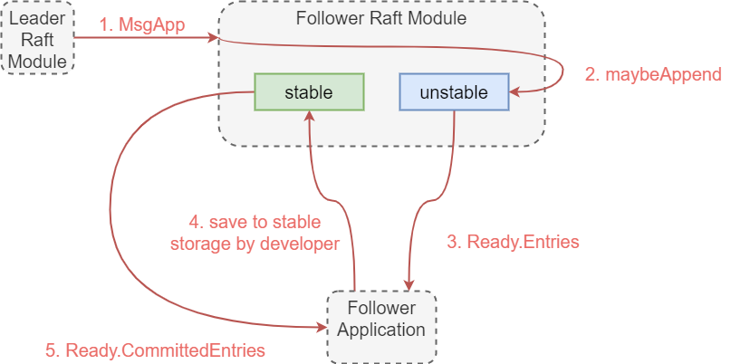

*本文为原创文章，转载请严格遵守[CC BY-NC-SA协议](https://creativecommons.org/licenses/by-nc-sa/4.0/)。*

<!--more-->

Raft算法的故障容错依赖持久化的日志，日志的实现也是Raft实现中重要的部分。本文将分析etcd中Raft日志的相关实现。

## 1. raftLog概要介绍

在分析Raft日志的源码前，笔者先直观地介绍etcd/raft中日志`raftLog`的逻辑结构。


在`raftLog`中，日志可以分为两部分：已经写入稳定存储的部分（stable）和还未写入稳定存储的部分（unstable）。显然，stable的日志在unstable的日志之前。同时，每部分日志又可能包含快照（snapshot）和普通的日志条目（entries），每部分的snapshot都在entries之前。




需要注意的是，在etcd的实现中，同一时刻，`raftLog`的这4段内容可能不会同时存在。但每段的相对位置始终符合上图。



`raftLog`中有几个关键的日志索引：

| 索引名 | 描述 |
| - | - |
| committed | 在该节点所知的被法定数量（quorum）的节点保存到了稳定存储中的日志里，index最高的日志的index。 |
| applied | 在该节点的应用程序已应用到其状态机的日志里，index最高的日志的index。<br> 其中， $ applied \le committed $ 总是成立的。 |
| firstIndex | 在该节点的日志中，最新的快照之后的第一条日志的index。 |
| lastIndex | 在该节点的日志中，最后一条日志的index。 |

`raftLog`的很多操作都依赖以上几个索引。正如上文中提到的，在etcd/raft的实现中，同一时刻`raftLog`中的4个段可能不会同时存在，因此，想弄清楚`firstIndex`和`lastIndex`的实现，就要先了解分别用来记录stable和unstable日志的`Storage`和`unstable`。

## 2. Storage分析

`Storage`是etcd/raft依赖的稳定存储接口。该接口在*go.etcd.io/etcd/storage.go*中定义，开发者可以根据该接口实现自己的稳定存储接口。

```go

// Storage is an interface that may be implemented by the application
// to retrieve log entries from storage.
//
// If any Storage method returns an error, the raft instance will
// become inoperable and refuse to participate in elections; the
// application is responsible for cleanup and recovery in this case.
type Storage interface {
	// TODO(tbg): split this into two interfaces, LogStorage and StateStorage.

	// InitialState returns the saved HardState and ConfState information.
	InitialState() (pb.HardState, pb.ConfState, error)
	// Entries returns a slice of log entries in the range [lo,hi).
	// MaxSize limits the total size of the log entries returned, but
	// Entries returns at least one entry if any.
	Entries(lo, hi, maxSize uint64) ([]pb.Entry, error)
	// Term returns the term of entry i, which must be in the range
	// [FirstIndex()-1, LastIndex()]. The term of the entry before
	// FirstIndex is retained for matching purposes even though the
	// rest of that entry may not be available.
	Term(i uint64) (uint64, error)
	// LastIndex returns the index of the last entry in the log.
	LastIndex() (uint64, error)
	// FirstIndex returns the index of the first log entry that is
	// possibly available via Entries (older entries have been incorporated
	// into the latest Snapshot; if storage only contains the dummy entry the
	// first log entry is not available).
	FirstIndex() (uint64, error)
	// Snapshot returns the most recent snapshot.
	// If snapshot is temporarily unavailable, it should return ErrSnapshotTemporarilyUnavailable,
	// so raft state machine could know that Storage needs some time to prepare
	// snapshot and call Snapshot later.
	Snapshot() (pb.Snapshot, error)
}

```

`Storage`接口仅定义了读取稳定存储中有关数据的方法。而如何向稳定存储中写数据，取决于开发者自己的实现。

在该文件中，有一个对`Storage`接口的官方实现——`MemoryStorage`，其也是etcd中使用的`Storage`的实现。`MemoryStorage`使用内存数组来保存日志条目，其不但实现了`Storage`中定义的读方法，还实现了相关的写方法。



有些读者可能有疑问：既然`Storage`是稳定存储接口的定义，那么为什么etcd使用了内存实现的存储？

这是因为etcd使用了预写日志（Write Ahead Log，WAL），wal是保存在稳定存储（磁盘文件系统）中的。在向`MemoryStorage`写入日志前，日志会先写入到wal中。这样，在每次重启时，首先要通过保存在稳定存储中的wal和快照恢复`MemoryStorage`的状态。也就是说，在etcd的实现中，日志的稳定存储是通过快照、wal、`MemoryStorage`共同实现的。

官方示例*go.etcd.io/etcd/contrib/raftexample*也采用了这一设计，对wal不熟悉的读者可以参考该实例理解其使用方式。



```go

// MemoryStorage implements the Storage interface backed by an
// in-memory array.
type MemoryStorage struct {
	// Protects access to all fields. Most methods of MemoryStorage are
	// run on the raft goroutine, but Append() is run on an application
	// goroutine.
	sync.Mutex

	hardState pb.HardState
	snapshot  pb.Snapshot
	// ents[i] has raft log position i+snapshot.Metadata.Index
	ents []pb.Entry
}

```

`MemoryStorage`中保存了Raft的`HardState`、快照`Snapshot`、和日志条目`[]Entry`。



etcd/raft中的`HardState`对应论文中的*Persistent State*，即需要持久化保存的状态；相应地，`SoftState`对应论文中的*Volatile State* ，即不需要持久化保存的易失状态。

etcd/raft对原文中的算法做了一些优化，因此`HardState`和`SoftState`的字段与原论文中稍有不同，后续的文章中，我们会分析etcd对Raft算法的优化。



其中，`Memstory`用来保存日志条目的字段`ents`是一个切片，该切片的头元素并非真正的日志条目，而是记录了快照中最后一条日志的`term`和`index`的*dummy entry*。因此，`MemoryStorage`中的日志结构如下图所示。


图中的*first index*和*last index*是`Storage`接口定义的索引，不是整个`raftLog`中的索引。在`MemoryStorage`的方法中，可以看到对*dummy entry*的处理。因为`MemoryStorage`的实现较为简单，这里不再对其做过多的分析。另外，`MemoryStorage`是线程安全的，其通过排它锁避免资源的争用。

## 3. unstable分析

`unstable`结构体中保存了还未被写入稳定存储的快照和日志条目。

```go

// unstable.entries[i] has raft log position i+unstable.offset.
// Note that unstable.offset may be less than the highest log
// position in storage; this means that the next write to storage
// might need to truncate the log before persisting unstable.entries.
type unstable struct {
	// the incoming unstable snapshot, if any.
	snapshot *pb.Snapshot
	// all entries that have not yet been written to storage.
	entries []pb.Entry
	offset  uint64

	logger Logger
}

```

`unstable`的`offset`字段是其保存的日志条目中第一条日志的index。需要注意的是，`unstable`中的日志可能与`Storage`中的日志有重叠的部分，因此在处理二者的关系时，需要对日志进行适当的裁剪。与`Storage`不同的是，`unstable`没有实现其自己的*first index*和*last index*，而是通过`maybeFirstIndex`和`maybeLastIndex`两个方法表示其是否有相对于整个`raftLog`的*first index*和*last index*及相应的索引值。

```go

// maybeFirstIndex returns the index of the first possible entry in entries
// if it has a snapshot.
func (u *unstable) maybeFirstIndex() (uint64, bool) {
	if u.snapshot != nil {
		return u.snapshot.Metadata.Index + 1, true
	}
	return 0, false
}

// maybeLastIndex returns the last index if it has at least one
// unstable entry or snapshot.
func (u *unstable) maybeLastIndex() (uint64, bool) {
	if l := len(u.entries); l != 0 {
		return u.offset + uint64(l) - 1, true
	}
	if u.snapshot != nil {
		return u.snapshot.Metadata.Index, true
	}
	return 0, false
}

```

`maybeFirstIndex`只有在`unstable`中存在快照时，才会返回快照中最后一条日志的下一条日志的index。而当`unstable`中没有快照是，此时对于整个`raftLog`来说，*first index*应在`Storage`中，因此`maybeFirstIndex`的第二个返回值会被置为false。在`raftLog`实现`first index`时，首先检查其是否在`unstable`中，如果不存在，会继续询问`Storage`，我们可以在`raftLog`的实现中看到这段逻辑。

同样，如果`unstable`中存在日志条目，`maybeLastIndex`会返回其最后一个日志条目的index；如果没有日志条目但是有快照，则会返回快照中最后一条日志的index；如果连快照也没有，则会返回false，让`raftLog`继续向`Storage`询问。



etcd/raft的实现中，以maybe开头的方法往往用在所访问的日志条目信息可能无法通过该结构获取的情况。



`unstable`中方法的逻辑也比较简单，这里不做过多的分析。在`unstable`中，有一个对字段`entries`的优化方法`shrinkEntriesArray`。

```go

// shrinkEntriesArray discards the underlying array used by the entries slice
// if most of it isn't being used. This avoids holding references to a bunch of
// potentially large entries that aren't needed anymore. Simply clearing the
// entries wouldn't be safe because clients might still be using them.
func (u *unstable) shrinkEntriesArray() {
	// We replace the array if we're using less than half of the space in
	// it. This number is fairly arbitrary, chosen as an attempt to balance
	// memory usage vs number of allocations. It could probably be improved
	// with some focused tuning.
	const lenMultiple = 2
	if len(u.entries) == 0 {
		u.entries = nil
	} else if len(u.entries)*lenMultiple < cap(u.entries) {
		newEntries := make([]pb.Entry, len(u.entries))
		copy(newEntries, u.entries)
		u.entries = newEntries
	}
}

```

`shrinkEntriesArray`方法会在将日志条目应用到稳定存储中的`stableTo`的方法最后调用。`shrinkEntriesArray`会判断切片`entires`中剩余的元素数量，当`entries`中没有条目剩余时，将其置为`nil`，或当剩余元素数量小于一定比例时（默认为$\frac{1}{2}$），将`entires`指向一个刚好能装下剩余元素的切片中，并将原切片中的剩余元素拷贝到新的`entries`中。这样做，可以避免在`unstable`中大多日志都已经被应用到了稳定存储后，仍持有占用空间较大的切片。需要注意的是，这里不能直接清空切片释放空间，因为其它代码可能还持有着通过`unstable`的`slice`方法获取的`entries`的切片。

## 4. raftLog分析

### 4.1 raftLog的结构

`raftLog`结构体的定义如下：

```go

type raftLog struct {
	// storage contains all stable entries since the last snapshot.
	storage Storage

	// unstable contains all unstable entries and snapshot.
	// they will be saved into storage.
	unstable unstable

	// committed is the highest log position that is known to be in
	// stable storage on a quorum of nodes.
	committed uint64
	// applied is the highest log position that the application has
	// been instructed to apply to its state machine.
	// Invariant: applied <= committed
	applied uint64

	logger Logger

	// maxNextEntsSize is the maximum number aggregate byte size of the messages
	// returned from calls to nextEnts.
	maxNextEntsSize uint64
}

```

`raftLog`结构体中的大部分字段我们在[第一部分](#1-raftlog概要介绍)中已经介绍过了，这里不再赘述。

`raftLog`中有很多与日志操作相关的重要方法，这里先给出这些方法及其描述，后文会对这些方法进行分析。

| 方法 | 描述 |
| - | - |
| newLog(storage Storage, logger Logger) *raftLog | 新建raftLog。 |
| newLogWithSize(storage Storage, logger Logger, maxNextEntsSize uint64) *raftLog | 新建有`maxNextEntsSize`属性的raftLog（该属性作用见`nextEnts`方法描述）。 |
| maybeAppend(index, logTerm, committed uint64, ents ...pb.Entry) (lastnewi uint64, ok bool) | 尝试向raftLog追加日志，需要传入这批日志的第一条index、这批日志的term、和此时的新`commited`索引（从leader的消息中获得）。 |
| nextEnts() (ents []pb.Entry) | 获取raftLog中接下来可以应用给状态机的日志。其返回的日志长度不超过`maxNextEntsSize`的限制。该方法会调用`raftLog`的`slice`方法。 |
| hasNextEnts() bool | 当仅想检查raftLog中是否有接下来可以应用给状态机的日志时，可以使用该方法。该方法不会调用`raftLog`的`slice`方法，因此效率更高。 |
| snapshot() (pb.Snapshot, error) | 获取最新的快照。 |
| firstIndex() uint64 | 获取*first index*索引。 |
| lastIndex() uint64 | 获取*last index*索引。 |
| commitTo(tocommit uint64) | 提升`committed`索引到给定位置，该方法保证`committed`索引仅前进而不会回退。 |
| appliedTo(i uint64) | 提升`applied`索引到给定位置，该方法保证`applied`索引仅前进而不会回退，且保证$applied \le committed$。 |
| lastTerm() uint64 | 获取raftLog中最后一条日志的term。 |
| term(i uint64) (uint64, error) | 获取raftLog中给定index的日志的条目的term（如果还能获取到的话。） |
| entries(i, maxsize uint64) ([]pb.Entry, error) | 获取从index为`i`的日志开始的最多`maxsize`条日志。 |
| slice(lo, hi, maxSize uint64) ([]pb.Entry, error) | 获取index从`lo`到`hi`的日志。 |
| unstableEntries() | 获取所有unstable中的日志条目。 |
| restore(s pb.Snapshot) | 根据快照恢复raftLog中unstable的部分。 |

除了这些方法外，`raftLog`中还有一些其它方法。我们不会详细分析上表中的所有方法，仅挑选几个较为重要的方法介绍。

### 4.2 raftLog的创建

我们先来看一下新建日志的实现：

```go

// newLog returns log using the given storage and default options. It
// recovers the log to the state that it just commits and applies the
// latest snapshot.
func newLog(storage Storage, logger Logger) *raftLog {
	return newLogWithSize(storage, logger, noLimit) // 注：const noLimit = math.MaxUint64
}

// newLogWithSize returns a log using the given storage and max
// message size.
func newLogWithSize(storage Storage, logger Logger, maxNextEntsSize uint64) *raftLog {
	if storage == nil {
		log.Panic("storage must not be nil")
	}
	log := &raftLog{
		storage:         storage,
		logger:          logger,
		maxNextEntsSize: maxNextEntsSize,
	}
	firstIndex, err := storage.FirstIndex()
	if err != nil {
		panic(err) // TODO(bdarnell)
	}
	lastIndex, err := storage.LastIndex()
	if err != nil {
		panic(err) // TODO(bdarnell)
	}
	log.unstable.offset = lastIndex + 1
	log.unstable.logger = logger
	// Initialize our committed and applied pointers to the time of the last compaction.
	log.committed = firstIndex - 1
	log.applied = firstIndex - 1

	return log
}

```

在`raftLog`初始化时，其首先会获取`Storage`的*first index*和*last index*，然后将`unstable`的`offset`置为`Storage`的*last index*+1、将`committed`和`applied`两个索引置为`Storage`的*first index*-1（即稳定存储的快照中最后一条日志的index）。

### 4.3 向raftLog中追加日志

接下来，我们对`raftLog`中追加日志的方法进行分析。

```go

// maybeAppend returns (0, false) if the entries cannot be appended. Otherwise,
// it returns (last index of new entries, true).
func (l *raftLog) maybeAppend(index, logTerm, committed uint64, ents ...pb.Entry) (lastnewi uint64, ok bool) {
	if l.matchTerm(index, logTerm) {
		lastnewi = index + uint64(len(ents))
		ci := l.findConflict(ents)
		switch {
		case ci == 0:
		case ci <= l.committed:
			l.logger.Panicf("entry %d conflict with committed entry [committed(%d)]", ci, l.committed)
		default:
			offset := index + 1
			l.append(ents[ci-offset:]...)
		}
		l.commitTo(min(committed, lastnewi))
		return lastnewi, true
	}
	return 0, false
}

func (l *raftLog) append(ents ...pb.Entry) uint64 {
	if len(ents) == 0 {
		return l.lastIndex()
	}
	if after := ents[0].Index - 1; after < l.committed {
		l.logger.Panicf("after(%d) is out of range [committed(%d)]", after, l.committed)
	}
	l.unstable.truncateAndAppend(ents)
	return l.lastIndex()
}

```

`maybeAppend`方法会检查参数的合法性，当可以追加时，其会返回追加的最后一条日志的index与true，否则返回0与false。其参数有需要追加的日志的第一个条目的`index`、这批日志条目的`term`、新确认的`committed`索引、和待追加的日志条目`ents`。

首先，`maybeAppend`方法会检查这批日志的第一个条目的index和这批日志的term与`raftLog`对应条目的index与term是否匹配，如果不匹配则返回(0, false)。当首条日志匹配时，其会调用`findConflict`方法寻找待追加的日志与已有日志的第一个冲突条目的index或第一条新日志的index。为了进一步分析，我们先来看一下`findConflict`的实现方式。

```go

// findConflict finds the index of the conflict.
// It returns the first pair of conflicting entries between the existing
// entries and the given entries, if there are any.
// If there is no conflicting entries, and the existing entries contains
// all the given entries, zero will be returned.
// If there is no conflicting entries, but the given entries contains new
// entries, the index of the first new entry will be returned.
// An entry is considered to be conflicting if it has the same index but
// a different term.
// The first entry MUST have an index equal to the argument 'from'.
// The index of the given entries MUST be continuously increasing.
func (l *raftLog) findConflict(ents []pb.Entry) uint64 {
	for _, ne := range ents {
		if !l.matchTerm(ne.Index, ne.Term) {
			if ne.Index <= l.lastIndex() {
				l.logger.Infof("found conflict at index %d [existing term: %d, conflicting term: %d]",
					ne.Index, l.zeroTermOnErrCompacted(l.term(ne.Index)), ne.Term)
			}
			return ne.Index
		}
	}
	return 0
}

```

`findConflict`返回的情况可以分为3种：

1. 如果给定的日志与已有的日志的index和term冲突，其会返回第一条冲突的日志条目的index。
2. 如果没有冲突，且给定的日志的所有条目均已在已有日志中，返回0.
3. 如果没有冲突，且给定的日志中包含已有日志中没有的新日志，返回第一条新日志的index。

接下来我们回到`maybeAppend`中，其在检查第一条日志匹配后，其调用了`findConflict`方法，并根据其返回值确定下一步操作：

1. 如果返回0，说明既没有冲突又没有新日志，直接进行下一步处理。
2. 如果返回值小于当前的`committed`索引，说明`committed`前的日志发生了冲突，这违背了Raft算法保证的**Log Matching**属性，因此会引起panic。
3. 如果返回值大于`committed`，既可能是冲突发生在`committed`之后，也可能是有新日志，但二者的处理方式都是相同的，即从将从冲突处或新日志处开始的日志覆盖或追加到当前日志中即可。

对于第3中情况，程序会调用`raftLog`的`append`方法，该方法会再次检查传入的日志起点是否在`committed`之前，如果在`committed`之前会引起panic。因此，在调用`append`方法时，其只传入了从冲突处或新日志处开始的日志。`append`方法会调用`unstable`的`truncateAndAppend`方法，该方法会适当地裁剪`unstable`中的日志，以保证日志的连续性。注意，新日志的第一条日志的index比`unstable`的`offset`小也是合法的，因此`unstable`中的日志可能与`Storage`中的日志有部分重叠。

```go

func (u *unstable) truncateAndAppend(ents []pb.Entry) {
	after := ents[0].Index
	switch {
	case after == u.offset+uint64(len(u.entries)):
		// after is the next index in the u.entries
		// directly append
		u.entries = append(u.entries, ents...)
	case after <= u.offset:
		u.logger.Infof("replace the unstable entries from index %d", after)
		// The log is being truncated to before our current offset
		// portion, so set the offset and replace the entries
		u.offset = after
		u.entries = ents
	default:
		// truncate to after and copy to u.entries
		// then append
		u.logger.Infof("truncate the unstable entries before index %d", after)
		u.entries = append([]pb.Entry{}, u.slice(u.offset, after)...)
		u.entries = append(u.entries, ents...)
	}
}

```

除了会引起panic的情况外，接下来`maybeAppend`方法都会将调用`commitTo`方法，使`committed`索引前进到最后一条新日志的索引`lastnewi`和传入的新`committed`中较小的一个。其中`commitTo`方法保证了`committed`索引只会前进而不会回退。使用`lastnewi`和传入的`committed`中的最小值则是因为传入的数据可能有如下两种情况：

1. leader给follower复制日志时，如果复制的日志条目超过了单个消息的上限，则可能出现leader传给follower的`committed`值大于该follower复制完这条消息中的日志后的最大index。此时，该follower的新`committed`值为`lastnewi`。
2. follower能够跟上leader，leader传给follower的日志中有未确认被法定数量节点稳定存储的日志，此时传入的`committed`比`lastnewi`小，该follower的新`committed`值为传入的`committed`值。

### 4.4 获取raftLog中指定片段的日志

`slice`是`raftLog`的重要方法，该方法会返回指定的日志片段，且会检查给定的范围是否可以访问。

```go

// slice returns a slice of log entries from lo through hi-1, inclusive.
func (l *raftLog) slice(lo, hi, maxSize uint64) ([]pb.Entry, error) {
	err := l.mustCheckOutOfBounds(lo, hi)
	if err != nil {
		return nil, err
	}
	if lo == hi {
		return nil, nil
	}
	var ents []pb.Entry
	if lo < l.unstable.offset {
		storedEnts, err := l.storage.Entries(lo, min(hi, l.unstable.offset), maxSize)
		if err == ErrCompacted {
			return nil, err
		} else if err == ErrUnavailable {
			l.logger.Panicf("entries[%d:%d) is unavailable from storage", lo, min(hi, l.unstable.offset))
		} else if err != nil {
			panic(err) // TODO(bdarnell)
		}

		// check if ents has reached the size limitation
		if uint64(len(storedEnts)) < min(hi, l.unstable.offset)-lo {
			return storedEnts, nil
		}

		ents = storedEnts
	}
	if hi > l.unstable.offset {
		unstable := l.unstable.slice(max(lo, l.unstable.offset), hi)
		if len(ents) > 0 {
			combined := make([]pb.Entry, len(ents)+len(unstable))
			n := copy(combined, ents)
			copy(combined[n:], unstable)
			ents = combined
		} else {
			ents = unstable
		}
	}
	return limitSize(ents, maxSize), nil
}

```

在获取`raftLog`中的日志切片时，该方法首先会通过`mustCheckOutOfBounds`方法检查给定的范围是否越界。

```go

// l.firstIndex <= lo <= hi <= l.firstIndex + len(l.entries)
func (l *raftLog) mustCheckOutOfBounds(lo, hi uint64) error {
	if lo > hi {
		l.logger.Panicf("invalid slice %d > %d", lo, hi)
	}
	fi := l.firstIndex()
	if lo < fi {
		return ErrCompacted
	}

	length := l.lastIndex() + 1 - fi
	if hi > fi+length {
		l.logger.Panicf("slice[%d,%d) out of bound [%d,%d]", lo, hi, fi, l.lastIndex())
	}
	return nil
}

```

`mustCheckOutOfBounds`检查了如下几个方面：

1. 是否满足$lo \ le hi$。（`slice`获取的是左闭右开区间$[lo,hi)$的日志切片。）
2. 是否满足$lo \ge firstIndex$，否则该范围中部分日志已被压缩，无法获取。
3. 是否满足$hi \le lastIndex+1$，否则该范围中部分日志还没被追加到当前节点的日志中，无法获取。

当`slice`检查完给定范围没有越界后，如果这段范围跨了stable和unstable两部分，那么该方法会分别从`Storage`获取$[lo,unstable.offset)$、从`unstable`获取$[unstable.offset,hi)$；否则直接从其中一部分获取完整的切片。在返回切片前，`silce`还会按照`maxSize`参数限制返回的切片长度。

## 5. 日志条目追加流程

在前文中，我们已经对etcd/raft的Raft日志`raftLog`的实现中关键的部分进行了分析。我们着重地分析了其中关键方法的实现，所以可能读者对日志追加的流程还没有总体上的认识。（例如，细心的读者可能会发现`raftLog`仅通过`Storage`接口读取稳定存储，而没有在`raftLog`中实现将日志从`unstable`到`stable`的转移。）因此，本节将简要概括leader给follower复制日志条目时，被复制的日志条目的追加流程。

在介绍etcd/raft的Raft算法实现时，我们还会详细地分析这一过程。因此，本节仅从顶层的视角对其进行简要的介绍。在阅读本节前，读者应先了解etcd/raft的使用方式，即如何与`Node`接口打交道，及如何处理`Ready`结构体（这部分在介绍*go.etcd.io/etcd/contrib/raftexample*时有简单提到过）。



1. 首先，leader向follower发送`MsgApp`消息，其中包含了需要复制的日志和最新的`committed`索引等信息。
2. 当follower的raft模块收到该消息后，会通过`maybeAppend`方法将其追加到其`unstable`日志中。
3. 当使用了raft模块的应用程序通过`Ready`信道获取来自raft模块的消息时，raft模块会将`unstable`中的日志条目作为`Ready`结构体的`Entries`字段传给应用程序。
4. 应用程序收到`Ready`结构体后，需要负责将`Entries`字段中的日志条目保存在稳定存储（`stable`）中。
5. raft模块会根据`committed`索引和`applied`索引，将稳定存储中的日志条目通过`Ready`结构体的`CommittedEntries`字段传给应用程序，应用程序会负责将这些日志应用到其状态机中。