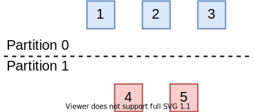
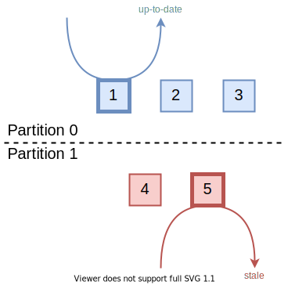
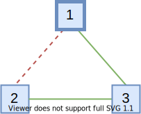

*本文为原创文章，转载请严格遵守[CC BY-NC-SA协议](https://creativecommons.org/licenses/by-nc-sa/4.0/)。*

<!--more-->

## 0. 引言

本文会对etcd/raft中Raft选举算法的实现与优化进行分析。这里假定读者阅读过Diego Ongaro的《In Search of an Understandable Consensus Algorithm (Extended Version)》（这里有笔者的[翻译](/posts/paper-reading/raft-extended/)，笔者英语水平一般，欢迎指正。），其中提到的部分，本文中不会做详细的解释。对etcd/raft的总体结构不熟悉的读者，可以先阅读[《深入浅出etcd/raft —— 0x02 etcd/raft总体设计》](/posts/code-reading/etcdraft-made-sample/2-overview/)。

本文首先会简单介绍etcd/raft对Raft选举部分的算法优化，然后通过源码分析etcd/raft的选举实现。

## 1. Raft选举算法优化

在leader选举方面，etcd/raft对《In Search of an Understandable Consensus Algorithm (Extended Version)》中介绍的基本Raft算法做了三种优化。这三种优化都在Diego Ongaro的博士论文《CONSENSUS: BRIDGING THEORY AND PRACTICE》的*6.4 Processing read-only queries more efficiently*和*9.6 Preventing disruptions when a server rejoins the cluster*中有提到。

etcd/raft实现的与选举有关的优化有**Pre-Vote**、**Check Quorum**、和**Leader Lease**。在这三种优化中，只有**Pre-Vote**和**Leader Lease**最初是对选举过程的优化，**Check Quorum**期初是为了更高效地实现线性一致性读（Linearizable Read）而做出的优化，但是由于**Leader Lease**需要依赖**Check Quorum**，因此我们也将其放在这里一起讲解。本系列将etcd/raft对实现线性一致性读的优化留在了后续的文章中，本文仅介绍为了实现更高效的线性一致性读需要在选举部分做出的优化。

除此之外，etcd/raft还实现了**Leader Transfer**，即主动地进行leader的交接。其实现方式比较简单，只需要让希望成为新leader节点主动发起投票请求即可，这里不再过多讲解。需要注意的是，**Leader Transfer**不保证交接一定成功，只有希望成为新leader的节点能够得到数量达到quorum的选票时才能当选leader，**Leader Transfer**类型的投票不受**Pre-Vote**、**Check Quorum**、**Leader Lease**机制约束。

### 1.1 Pre-Vote

如下图所示，当Raft集群的网络发生分区时，会出现节点数达不到quorum（达成共识至少需要的节点数）的分区，如图中的*Partition 1*。



在节点数能够达到quorum的分区中，选举流程会正常进行，该分区中的所有节点的term最终会稳定为新选举出的leader节点的term。不幸的是，在节点数无法达到quorum的分区中，如果该分区中没有leader节点，因为节点总是无法收到数量达到quorum的投票而不会选举出新的leader，所以该分区中的节点在*election timeout*超时后，会增大term并发起下一轮选举，这导致该分区中的节点的term会不断增大。

如果网络一直没有恢复，这是没有问题的。但是，如果网络分区恢复，此时，达不到quorum的分区中的节点的term值会远大于能够达到quorum的分区中的节点的term，这会导致能够达到quorum的分区的leader退位（step down）并增大自己的term到更大的term，使集群产生一轮不必要的选举。

**Pre-Vote**机制就是为了解决这一问题而设计的，其解决的思路在于不允许达不到quorum的分区正常进入投票流程，也就避免了其term号的增大。为此，**Pre-Vote**引入了“预投票”，也就是说，当节点*election timeout*超时时，它们不会立即增大自身的term并请求投票，而是先发起一轮预投票。收到预投票请求的节点不会退位。只有当节点收到了达到quorum的预投票响应时，节点才能增大自身term号并发起投票请求。这样，达不到quorum的分区中的节点永远无法增大term，也就不会在分区恢复后引起不必要的一轮投票。

### 1.2 Check Quorum

在Raft算法中，保证线性一致性读取的最简单的方式，就是讲读请求同样当做一条Raft提议，通过与其它日志相同的方式执行，因此这种方式也叫作*Log Read*。显然，*Log Read*的性能很差。而在很多系统中，读多写少的负载是很常见的场景。因此，为了提高读取的性能，就要试图绕过日志机制。

但是，直接绕过日志机制从leader读取，可能会读到陈旧的数据，也就是说存在*stale read*的问题。在下图的场景中，假设网络分区前，*Node 5*是整个集群的leader。在网络发生分区后，*Partition 0*分区中选举出了新leader，也就是图中的*Node 1*。



但是，由于网络分区，*Node 5*无法收到*Partition 0*中节点的消息，*Node 5*不会意识到集群中出现了新的leader。此时，虽然它不能成功地完成日志提交，但是如果读取时绕过了日志，它还是能够提供读取服务的。这会导致连接到*Node 5*的client读取到陈旧的数据。

**Check Quorum**可以减轻这一问题带来的影响，其机制也非常简单：让leader每隔一段时间主动地检查follower是否活跃。如果活跃的follower数量达不到quorum，那么说明该leader可能是分区前的旧leader，所以此时该leader会主动退位转为follower。

需要注意的是，**Check Quorum**并不能完全避免*stale read*的发生，只能减小其发生时间，降低影响。如果需要严格的线性一致性，需要通过其它机制实现。

### 1.3 Leader Lease

分布式系统中的网络环境十分复杂，有时可能出现网络不完全分区的情况，即整个整个网络拓补图是一个连通图，但是可能并非任意的两个节点都能互相访问。



这种现象不止会出现在网络故障中，还会出现在成员变更中。在通过`ConfChange`移除节点时，不同节点应用该`ConfChange`的时间可能不同，这也可能导致这一现象发生。

在上图的场景下，*Node 1*与*Node 2*之间无法通信。如果它们之间的通信中断前，*Node 1*是集群的leader，在通信中断后，*Node 2*无法再收到来自*Node 1*的心跳。因此，*Node 2*会开始选举。如果在*Node 2*发起选举前，*Node 1*和*Node 3*中都没有新的日志，那么*Node 2*仍可以收到能达到quorum的投票（来自*Node 2*本身的投票和来自*Node 3*的投票），并成为leader。

**Leader Lease**机制对投票引入了一条新的约束以解决这一问题：当节点在*election timeout*超时前，如果收到了leader的消息，那么它不会为其它发起投票或预投票请求的节点投票。也就是说，**Leader Lease**机制会阻止了正常工作的集群中的节点给其它节点投票。

**Leader Lease**需要依赖**Check Quorum**机制才能正常工作。接下来我们通过一个例子说明其原因。

假如在一个5个节点组成的Raft集群中，出现了下图中的分区情况：*Node 1*与*Node 2*互通，*Node 3*、*Node 4*、*Node 5*之间两两互通、*Node 5*与任一节点不通。在网络分区前，*Node 1*是集群的leader。


在既没有**Leader Lease**也没有**Check Quorum**的情况下，*Node 3*、*Node 4*会因收不到leader的心跳而发起投票，因为*Node 2*、*Node 3*、*Node 4*互通，该分区节点数能达到quorum，因此它们可以选举出新的leader。

而在使用了**Leader Lease**而不使用**Check Quorum**的情况下，由于*Node 2*仍能够收到原leader *Node 1*的心跳，受**Leader Lease**机制的约束，它不会为其它节点投票。这会导致即使整个集群中存在可用节点数达到quorum的分区，但是集群仍无法正常工作。

而如果同时使用了**Leader Lease**和**Check Quorum**，那么在上图的情况下，*Node 1*会在*election timeout*超时后因检测不到数量达到quorum的活跃节点而退位为follower。这样，*Node 2*、*Node 3*、*Node 4*之间的选举可以正常进行。

### 1.4 引入的新问题与解决方案

引入**Pre-Vote**和**Check Quorum**（etcd/raft的实现中，开启**Check Quorum**会自动开启**Leader Lease**）会为Raft算法引入一些新的问题。

当一个节点收到了term比自己低的消息时，原本的逻辑是直接忽略该消息，因为term比自己低的消息仅可能是因网络延迟的迟到的旧消息。然而，开启了这些机制后，在如下的场景中会出现问题：


**场景1：** 如上图所示，在开启了**Check Quorum / Leader Lease**后（假设没有开启**Pre-Vote**，**Pre-Vote**的问题在下一场景中讨论），数量达不到quorum的分区中的leader会退位，且该分区中的节点永远都无法选举出leader，因此该分区的节点的term会不断增大。当该分区与整个集群的网络恢复后，由于开启了**Check Quorum / Leader Lease**，即使该分区中的节点有更大的term，由于原分区的节点工作正常，它们的选举请求会被丢弃。同时，由于该节点的term比原分区的leader节点的term大，因此它会丢弃原分区的leader的请求。这样，该节点永远都无法重新加入集群，也无法当选新leader。（详见[issue #5451](https://github.com/etcd-io/etcd/pull/5451)、[issue #5468](https://github.com/etcd-io/etcd/pull/5468)）。


**场景2：** **Pre-Vote**机制也有类似的问题。如上图所示，假如发起预投票的节点，在预投票通过后正要发起正式投票的请求时出现网络分区。此时，该节点的term会高于原集群的term。而原集群因没有收到真正的投票请求，不会更新term，继续正常运行。在网络分区恢复后，原集群的term低于分区节点的term，但是日志比分区节点更新。此时，该节点发起的预投票请求因没有日志落后会被丢弃，而原集群leader发给该节点的请求会因term比该节点小而被丢弃。同样，该节点永远都无法重新加入集群，也无法当选新leader。（详见[issue #8501](https://github.com/etcd-io/etcd/issues/8501)、[issue #8525](https://github.com/etcd-io/etcd/pull/8525)）。

**场景3：** 在更复杂的情况中，比如，在变更配置时，开启了原本没有开启的**Pre-Vote**机制。此时可能会出现与上一条类似的情况，即可能因term更高但是log更旧的节点的存在导致整个集群的死锁，所有节点都无法预投票成功。这种情况比上一种情况更危险，上一种情况只有之前分区的节点无法加入集群，在这种情况下，整个集群都会不可用。（详见[issue #8501](https://github.com/etcd-io/etcd/issues/8501)、[issue #8525](https://github.com/etcd-io/etcd/pull/8525)）。

为了解决以上问题，节点在收到term比自己低的请求时，需要做特殊的处理。处理逻辑也很简单：

1. 如果收到了term比当前节点term低的消息，且集群开启了**Check Quorum / Leader Lease**或**Pre-Vote**，那么发送一条term为当前term的消息，触发term低的节点成为follower。（针对**场景1**、**场景2**）
2. 对于term比当前节点term第的预投票请求，无论是否开启了**Check Quorum / Leader Lease**或**Pre-Vote**，都要通过一条term为当前term的消息，迫使其转为follower并更新term。（针对**场景3**）

## 2. etcd/raft中Raft选举的实现

本节中，我们将分析etcd/raft中选举部分的实现。
### 2.1 MsgHup与hup

在etcd/raft的实现中，选举的触发是通过`MsgHup`消息实现的，无论是主动触发选举还是因*election timeout*超时都是如此：

```go

// *** node.go ***

func (n *node) Campaign(ctx context.Context) error { return n.step(ctx, pb.Message{Type: pb.MsgHup}) }

// *** rawnode.go ***

func (rn *RawNode) Campaign() error {
	return rn.raft.Step(pb.Message{
		Type: pb.MsgHup,
	})
}

// *** raft.go ***

// tickElection is run by followers and candidates after r.electionTimeout.
func (r *raft) tickElection() {
	r.electionElapsed++

	if r.promotable() && r.pastElectionTimeout() {
		r.electionElapsed = 0
		r.Step(pb.Message{From: r.id, Type: pb.MsgHup})
	}
}

```

因此，我们可以跟着`MsgHup`的处理流程，分析etcd/raft中选举的实现。正如我们在[《深入浅出etcd/raft —— 0x02 etcd/raft总体设计》](/posts/code-reading/etcdraft-made-sample/2-overview/)中所说，etcd/raft通过`raft`结构体的`Step`方法实现Raft状态机的状态转移。

```go

func (r *raft) Step(m pb.Message) error {
	// ... ...
	switch m.Type {
	case pb.MsgHup:
		if r.preVote {
			r.hup(campaignPreElection)
		} else {
			r.hup(campaignElection)
		}
	// ... ...
	}
	// ... ...
}

```

`Step`方法在处理`MsgHup`消息时，会根据当前配置中是否开启了`Pre-Vote`机制，以不同的`CampaignType`调用`hup`方法。`CampaignType`是一种枚举类型（go语言的枚举实现方式），其可能值如下表所示。

| 值 | 描述 |
| - | - |
| `campaignPreElection` | 表示**Pre-Vote**的预选举阶段。 |
| `campaignElection` | 表示正常的选举阶段（仅超时选举，不包括**Leader Transfer**）。 |
| `campaignTransfer` | 表示**Leader Transfer**阶段。 |

接下来我们进入`hup`的实现。

```go

func (r *raft) hup(t CampaignType) {
	if r.state == StateLeader {
		r.logger.Debugf("%x ignoring MsgHup because already leader", r.id)
		return
	}

	if !r.promotable() {
		r.logger.Warningf("%x is unpromotable and can not campaign", r.id)
		return
	}
	ents, err := r.raftLog.slice(r.raftLog.applied+1, r.raftLog.committed+1, noLimit)
	if err != nil {
		r.logger.Panicf("unexpected error getting unapplied entries (%v)", err)
	}
	if n := numOfPendingConf(ents); n != 0 && r.raftLog.committed > r.raftLog.applied {
		r.logger.Warningf("%x cannot campaign at term %d since there are still %d pending configuration changes to apply", r.id, r.Term, n)
		return
	}

	r.logger.Infof("%x is starting a new election at term %d", r.id, r.Term)
	r.campaign(t)
}

```

`hup`方法会对节点当前状态进行一些检查，如果检查通过才会试图让当前节点发起投票或预投票。首先，`hup`会检查当前节点是否已经是leader，如果已经是leader那么直接返回。接下来，`hup`通过`promotable()`方法判断当前节点能否提升为leader。

```go

// promotable indicates whether state machine can be promoted to leader,
// which is true when its own id is in progress list.
func (r *raft) promotable() bool {
	pr := r.prs.Progress[r.id]
	return pr != nil && !pr.IsLearner && !r.raftLog.hasPendingSnapshot()
}

```

`promotable()`的判定规则有三条：

1. 当前节点是否已被集群移除。（通过`ProgressTracker.ProgressMap`映射中是否有当前节点的id的映射判断。当节点被从集群中移除后，被移除的节点id会被从该映射中移除。我们会在后续讲解集群配置变更的文章中详细分析其实现。）
2. 当前节点是否为learner节点。
3. 当前节点是否还有未被保存到稳定存储中的快照。

这三条规则中，只要有一条为真，那么当前节点就无法成为leader。在`hup`方法中，除了需要`promotable()`为真，还需要判断一条规则：

1. 当前的节点已提交的日志中，是否有还未被应用的集群配置变更`ConfChange`消息。

如果当前节点已提交的日志中还有未应用的`ConfChange`消息，那么该节点也无法提升为leader。

只有当以上条件都满足后，`hup`方法才会调用`campaign`方法，根据配置，开始投票或预投票。

### 2.2 campaign

`campaign`是用来发起投票或预投票的重要方法。

```go

// campaign transitions the raft instance to candidate state. This must only be
// called after verifying that this is a legitimate transition.
func (r *raft) campaign(t CampaignType) {
	if !r.promotable() {
		// This path should not be hit (callers are supposed to check), but
		// better safe than sorry.
		r.logger.Warningf("%x is unpromotable; campaign() should have been called", r.id)
	}
	var term uint64
	var voteMsg pb.MessageType
	if t == campaignPreElection {
		r.becomePreCandidate()
		voteMsg = pb.MsgPreVote
		// PreVote RPCs are sent for the next term before we've incremented r.Term.
		term = r.Term + 1
	} else {
		r.becomeCandidate()
		voteMsg = pb.MsgVote
		term = r.Term
	}
	if _, _, res := r.poll(r.id, voteRespMsgType(voteMsg), true); res == quorum.VoteWon {
		// We won the election after voting for ourselves (which must mean that
		// this is a single-node cluster). Advance to the next state.
		if t == campaignPreElection {
			r.campaign(campaignElection)
		} else {
			r.becomeLeader()
		}
		return
	}
	var ids []uint64
	{
		idMap := r.prs.Voters.IDs()
		ids = make([]uint64, 0, len(idMap))
		for id := range idMap {
			ids = append(ids, id)
		}
		sort.Slice(ids, func(i, j int) bool { return ids[i] < ids[j] })
	}
	for _, id := range ids {
		if id == r.id {
			continue
		}
		r.logger.Infof("%x [logterm: %d, index: %d] sent %s request to %x at term %d",
			r.id, r.raftLog.lastTerm(), r.raftLog.lastIndex(), voteMsg, id, r.Term)

		var ctx []byte
		if t == campaignTransfer {
			ctx = []byte(t)
		}
		r.send(pb.Message{Term: term, To: id, Type: voteMsg, Index: r.raftLog.lastIndex(), LogTerm: r.raftLog.lastTerm(), Context: ctx})
	}
}

```

因为调用`campaign`的方法不止有`hup`，`campaign`方法首先还是会检查`promotable()`是否为真。

```go

	if t == campaignPreElection {
		r.becomePreCandidate()
		voteMsg = pb.MsgPreVote
		// PreVote RPCs are sent for the next term before we've incremented r.Term.
		term = r.Term + 1
	} else {
		r.becomeCandidate()
		voteMsg = pb.MsgVote
		term = r.Term
	}

```

在开启**Pre-Vote**后，首次调用`campaign`时，参数为`campaignPreElection`。此时会调用`becomePreCandidate`方法，该方法不会修改当前节点的`Term`值，因此发送的`MsgPreVote`消息的`Term`应为当前的`Term + 1 `。而如果没有开启**Pre-Vote**或已经完成预投票进入正式投票的流程或是**Leader Transfer**时（即使开启了**Pre-Vote**，**Leader Transfer**也不会进行预投票），会调用`becomeCandidate`方法。该方法会增大当前节点的`Term`，因此发送`MsgVote`消息的`Term`就是此时的`Term`。`becomeXXX`用来将当前状态机的状态与相关行为切换相应的角色，我们会在后文详细分析其实现与修改后的行为。

接下来，`campaign`方法开始发送投票请求。在向其它节点发送请求之前，该节点会先投票给自己：

```go

		if _, _, res := r.poll(r.id, voteRespMsgType(voteMsg), true); res == quorum.VoteWon {
		// We won the election after voting for ourselves (which must mean that
		// this is a single-node cluster). Advance to the next state.
		if t == campaignPreElection {
			r.campaign(campaignElection)
		} else {
			r.becomeLeader()
		}
		return
	}

```

`poll`方法会在更新本地的投票状态并获取当前投票结果。如果节点投票给自己后就赢得了选举，这说明集群是以单节点的模式启动的，那么如果当前是预投票阶段当前节点就能立刻开启投票流程、如果已经在投票流程中或是在**Leader Transfer**就直接当选leader即可。如果集群不是以单节点的模式运行的，那么就需要向其它有资格投票的节点发送投票请求：

```go

	var ids []uint64
	{
		idMap := r.prs.Voters.IDs()
		ids = make([]uint64, 0, len(idMap))
		for id := range idMap {
			ids = append(ids, id)
		}
		sort.Slice(ids, func(i, j int) bool { return ids[i] < ids[j] })
	}
	for _, id := range ids {
		if id == r.id {
			continue
		}
		r.logger.Infof("%x [logterm: %d, index: %d] sent %s request to %x at term %d",
			r.id, r.raftLog.lastTerm(), r.raftLog.lastIndex(), voteMsg, id, r.Term)

		var ctx []byte
		if t == campaignTransfer {
			ctx = []byte(t)
		}
		r.send(pb.Message{Term: term, To: id, Type: voteMsg, Index: r.raftLog.lastIndex(), LogTerm: r.raftLog.lastTerm(), Context: ctx})
	}

```

请求的`Term`字段就是我们之前记录的`term`，即预投票阶段为当前`Term + 1`、投票阶段为当前的`Term`。

### 2.3 Step方法与step

在前文中，我们提到过`Step`函数是Raft状态机状态转移的入口方法，`Step`方法的参数是Raft消息。`Step`方法会检查消息的`Term`字段，对不同的情况进行不同的处理。`Step`方法还会对与选举相关的一些的消息进行特殊的处理。最后，`Step`会调用`raft`接口体`step`字段中记录的函数签名。`step`字段的定义如下：

```go

// Definition of `stepFunc`
type stepFunc func(r *raft, m pb.Message) error

// step field in struct `raft`
step stepFunc

```

上一节中提到的`becomeXXX`函数会让状态机切换到相应角色，并切换`raft`结构体的`step`字段中记录的函数。让不同角色的节点能够用不同的逻辑来处理Raft消息。

在调用`step`字段记录的函数处理请求前，`Step`会根据消息的`Term`字段，进行一些预处理。

#### 2.3.1 对Term为0的消息的预处理

```go

	// Handle the message term, which may result in our stepping down to a follower.
	switch {
	case m.Term == 0:
		// local message
	
	// case ... ...
	
	}

```

etcd/raft使用`Term`为0的消息作为本地消息，`Step`不会对本地消息进行特殊处理，直接进入之后的逻辑。

#### 2.3.2 对Term大于当前节点Term的消息的预处理

```go

	case m.Term > r.Term:
		if m.Type == pb.MsgVote || m.Type == pb.MsgPreVote {
			force := bytes.Equal(m.Context, []byte(campaignTransfer))
			inLease := r.checkQuorum && r.lead != None && r.electionElapsed < r.electionTimeout
			if !force && inLease {
				// If a server receives a RequestVote request within the minimum election timeout
				// of hearing from a current leader, it does not update its term or grant its vote
				r.logger.Infof("%x [logterm: %d, index: %d, vote: %x] ignored %s from %x [logterm: %d, index: %d] at term %d: lease is not expired (remaining ticks: %d)",
					r.id, r.raftLog.lastTerm(), r.raftLog.lastIndex(), r.Vote, m.Type, m.From, m.LogTerm, m.Index, r.Term, r.electionTimeout-r.electionElapsed)
				return nil
			}
		}
		switch {
		case m.Type == pb.MsgPreVote:
			// Never change our term in response to a PreVote
		case m.Type == pb.MsgPreVoteResp && !m.Reject:
			// We send pre-vote requests with a term in our future. If the
			// pre-vote is granted, we will increment our term when we get a
			// quorum. If it is not, the term comes from the node that
			// rejected our vote so we should become a follower at the new
			// term.
		default:
			r.logger.Infof("%x [term: %d] received a %s message with higher term from %x [term: %d]",
				r.id, r.Term, m.Type, m.From, m.Term)
			if m.Type == pb.MsgApp || m.Type == pb.MsgHeartbeat || m.Type == pb.MsgSnap {
				r.becomeFollower(m.Term, m.From)
			} else {
				r.becomeFollower(m.Term, None)
			}
		}


```

对于`Term`大于当前节点的`Term`的消息，如果消息类型为`MsgVote`或`MsgPreVote`，先要检查这些消息是否需要处理。其判断规则如下：

1. `force`：如果该消息的`CampaignType`为`campaignTransfer`，`force`为真，表示该消息必须被处理。
2. `inLease`：如果开启了**Check Quorum**（开启**Check Quorum**会自动开启**Leader Lease**），且*election timout*超时前收到过leader的消息，那么`inLease`为真，表示当前Leader Lease还没有过期。

如果`!force && inLease`，说明该消息不需要被处理，可以直接返回。

对于`Term`大于当前节点的`Term`的消息，`Step`还需要判断是否需要切换自己的身份为follower，其判断规则如下：

1. 如果消息为`MsgPreVote`消息，那么不需要转为follower。
2. 如果消息为`MsgPreVoteResp`且`Reject`字段不为真时<sup>注1</sup>，那么不需要转为follower。
3. 否则，转为follower。



初次接触Raft算法的读者需要注意，Raft的通信模型不是**Request-Respone**模型的，例如，如果节点不同意`MsgPreVote`或`MsgVote`，那么节点不会发送`MsgPreVoteResp`或`MsgVoteResp`。

因此，如果收到了`Reject`为真的`MsgPreVoteResp`或`MsgVoteResp`消息，不代表该节点的请求被发送`MsgPreVoteResp`或`MsgVoteResp`消息的节点拒绝，而是节点应该立即放弃选举并转为follower，以优化效率并避免[1.4节](#14-引入的新问题与解决方案)中提到的问题。



在转为follower时，新的`Term`就是该消息的`Term`。如果消息类型是`MsgApp`、`MsgHeartbeat`、`MsgSnap`，说明这是来自leader的消息，那么将`lead`字段直接置为该消息的发送者的id，否则暂时不知道当前的leader节点是谁。

#### 2.3.3 对Term大于当前节点Term的消息的预处理

最后，如果消息的`Term`比当前`Term`小，因存在[1.4节](#14-引入的新问题与解决方案)中提到的问题，除了忽略消息外，还要做额外的处理：

```go

case m.Term < r.Term:
		if (r.checkQuorum || r.preVote) && (m.Type == pb.MsgHeartbeat || m.Type == pb.MsgApp) {
			// We have received messages from a leader at a lower term. It is possible
			// that these messages were simply delayed in the network, but this could
			// also mean that this node has advanced its term number during a network
			// partition, and it is now unable to either win an election or to rejoin
			// the majority on the old term. If checkQuorum is false, this will be
			// handled by incrementing term numbers in response to MsgVote with a
			// higher term, but if checkQuorum is true we may not advance the term on
			// MsgVote and must generate other messages to advance the term. The net
			// result of these two features is to minimize the disruption caused by
			// nodes that have been removed from the cluster's configuration: a
			// removed node will send MsgVotes (or MsgPreVotes) which will be ignored,
			// but it will not receive MsgApp or MsgHeartbeat, so it will not create
			// disruptive term increases, by notifying leader of this node's activeness.
			// The above comments also true for Pre-Vote
			//
			// When follower gets isolated, it soon starts an election ending
			// up with a higher term than leader, although it won't receive enough
			// votes to win the election. When it regains connectivity, this response
			// with "pb.MsgAppResp" of higher term would force leader to step down.
			// However, this disruption is inevitable to free this stuck node with
			// fresh election. This can be prevented with Pre-Vote phase.
			r.send(pb.Message{To: m.From, Type: pb.MsgAppResp})
		} else if m.Type == pb.MsgPreVote {
			// Before Pre-Vote enable, there may have candidate with higher term,
			// but less log. After update to Pre-Vote, the cluster may deadlock if
			// we drop messages with a lower term.
			r.logger.Infof("%x [logterm: %d, index: %d, vote: %x] rejected %s from %x [logterm: %d, index: %d] at term %d",
				r.id, r.raftLog.lastTerm(), r.raftLog.lastIndex(), r.Vote, m.Type, m.From, m.LogTerm, m.Index, r.Term)
			r.send(pb.Message{To: m.From, Term: r.Term, Type: pb.MsgPreVoteResp, Reject: true})
		} else {
			// ignore other cases
			r.logger.Infof("%x [term: %d] ignored a %s message with lower term from %x [term: %d]",
				r.id, r.Term, m.Type, m.From, m.Term)
		}
		return nil
	}

```

这段代码实现了[1.4节](#14-引入的新问题与解决方案)中的解决方案，这里不再赘述。



这里修复逻辑可能有些奇怪，例如采用`MsgAppResp`类型的消息作为回复，这只是因为etcd社区认为没必要为其新增一种消息类型。所以这里的代码建议读者阅读相应的commit与issue下的讨论（相应的issue已在[1.4节](#14-引入的新问题与解决方案)中给出）。



#### 2.3.4 不通过step处理的情况

除了在预处理阶段中直接丢弃的消息外，还有一些消息不会通过`step`字段记录的函数处理。我们先来介绍这些消息，之后分角色介绍`step`与`becomeXXX`在不同情况下的处理方式。

```go

	switch m.Type {
	case pb.MsgHup:
		if r.preVote {
			r.hup(campaignPreElection)
		} else {
			r.hup(campaignElection)
		}

	case pb.MsgVote, pb.MsgPreVote:
		// We can vote if this is a repeat of a vote we've already cast...
		canVote := r.Vote == m.From ||
			// ...we haven't voted and we don't think there's a leader yet in this term...
			(r.Vote == None && r.lead == None) ||
			// ...or this is a PreVote for a future term...
			(m.Type == pb.MsgPreVote && m.Term > r.Term)
		// ...and we believe the candidate is up to date.
		if canVote && r.raftLog.isUpToDate(m.Index, m.LogTerm) {
			// Note: it turns out that that learners must be allowed to cast votes.
			// This seems counter- intuitive but is necessary in the situation in which
			// a learner has been promoted (i.e. is now a voter) but has not learned
			// about this yet.
			// For example, consider a group in which id=1 is a learner and id=2 and
			// id=3 are voters. A configuration change promoting 1 can be committed on
			// the quorum `{2,3}` without the config change being appended to the
			// learner's log. If the leader (say 2) fails, there are de facto two
			// voters remaining. Only 3 can win an election (due to its log containing
			// all committed entries), but to do so it will need 1 to vote. But 1
			// considers itself a learner and will continue to do so until 3 has
			// stepped up as leader, replicates the conf change to 1, and 1 applies it.
			// Ultimately, by receiving a request to vote, the learner realizes that
			// the candidate believes it to be a voter, and that it should act
			// accordingly. The candidate's config may be stale, too; but in that case
			// it won't win the election, at least in the absence of the bug discussed
			// in:
			// https://github.com/etcd-io/etcd/issues/7625#issuecomment-488798263.
			r.logger.Infof("%x [logterm: %d, index: %d, vote: %x] cast %s for %x [logterm: %d, index: %d] at term %d",
				r.id, r.raftLog.lastTerm(), r.raftLog.lastIndex(), r.Vote, m.Type, m.From, m.LogTerm, m.Index, r.Term)
			// When responding to Msg{Pre,}Vote messages we include the term
			// from the message, not the local term. To see why, consider the
			// case where a single node was previously partitioned away and
			// it's local term is now out of date. If we include the local term
			// (recall that for pre-votes we don't update the local term), the
			// (pre-)campaigning node on the other end will proceed to ignore
			// the message (it ignores all out of date messages).
			// The term in the original message and current local term are the
			// same in the case of regular votes, but different for pre-votes.
			r.send(pb.Message{To: m.From, Term: m.Term, Type: voteRespMsgType(m.Type)})
			if m.Type == pb.MsgVote {
				// Only record real votes.
				r.electionElapsed = 0
				r.Vote = m.From
			}
		} else {
			r.logger.Infof("%x [logterm: %d, index: %d, vote: %x] rejected %s from %x [logterm: %d, index: %d] at term %d",
				r.id, r.raftLog.lastTerm(), r.raftLog.lastIndex(), r.Vote, m.Type, m.From, m.LogTerm, m.Index, r.Term)
			r.send(pb.Message{To: m.From, Term: r.Term, Type: voteRespMsgType(m.Type), Reject: true})
		}

	default:
		err := r.step(r, m)
		if err != nil {
			return err
		}
	}
	return nil
}

```

第一种情况是我们熟悉的`MsgHup`消息，这种消息的处理见[2.1节](#21-msghup与hup)。

第二种情况是`MsgVote`和`MsgPreVote`消息。首先需要判断该节点能否为其投票。其判断规则有3条：

1. 如果该节点当前已为消息的发送者投过票，说明这可能是重复的消息，该节点可以安全地为其重新投票。
2. 如果该节点还没有投过票且当前term内还没有leader，那么该节点可以为其投票。
3. 如果这是`MsgPreVote`消息且其`Term`大于当前节点的`Term`，那么该节点可以为其投票。

如果满足以上3个条件中的任一条，且该消息中的`Index`和`Term`至少与当前节点的日志一样新，那么该节点为其发送相应的投票消息。如果该消息的是`MsgVote`消息，该节点需要记录其将选票投给了谁，并重置`election timout`的计时器。

否则，节点会为其发送一条`Reject`为真的消息，以避免[1.4节](#14-引入的新问题与解决方案)中提到的问题。

除了这些情况外，消息都会通过`step`字段记录的函数，按照不同的节点角色进行处理。

### 2.4 becomeXXX与stepXXX

在上文中我们介绍过，`becomeXXX`函数用于将切换Raft状态机的角色，`stepXXX`是Raft状态机的相应角色下状态转移的行为。etcd/raft中`becomeXXX`共有四种：`becomeFollower`、`becomeCandidate`、`becomePreCandidate`、`becomeLeader`，`stepXXX`共有三种：`stepLeader`、`stepCandidate`、`stepFollower`，`becomeCandidate`和`becomePreCandidate`相应的行为均为`stepCandidate`。

本节中，我们将介绍`becomeXXX`和`stepXXX`中与选举相关的逻辑。

#### 2.4.1 Candidate、PreCandidate

`Candidate`和`PreCandidate`的行为有很多相似之处，本节我们将分析二者行为并比对异同之处。

```go

func (r *raft) becomeCandidate() {
	// ... ...
	r.step = stepCandidate
	r.reset(r.Term + 1)
	r.tick = r.tickElection
	r.Vote = r.id
	r.state = StateCandidate
	r.logger.Infof("%x became candidate at term %d", r.id, r.Term)
}

func (r *raft) becomePreCandidate() {
	// ... ...
	// Becoming a pre-candidate changes our step functions and state,
	// but doesn't change anything else. In particular it does not increase
	// r.Term or change r.Vote.
	r.step = stepCandidate
	r.prs.ResetVotes()
	r.tick = r.tickElection
	r.lead = None
	r.state = StatePreCandidate
	r.logger.Infof("%x became pre-candidate at term %d", r.id, r.Term)
}

```

首先，`becomeCandidate`与`becomePreCandidate`


```go

func (r *raft) reset(term uint64) {
	if r.Term != term {
		r.Term = term
		r.Vote = None
	}
	r.lead = None

	r.electionElapsed = 0
	r.heartbeatElapsed = 0
	r.resetRandomizedElectionTimeout()

	r.abortLeaderTransfer()

	r.prs.ResetVotes()
	r.prs.Visit(func(id uint64, pr *tracker.Progress) {
		*pr = tracker.Progress{
			Match:     0,
			Next:      r.raftLog.lastIndex() + 1,
			Inflights: tracker.NewInflights(r.prs.MaxInflight),
			IsLearner: pr.IsLearner,
		}
		if id == r.id {
			pr.Match = r.raftLog.lastIndex()
		}
	})

	r.pendingConfIndex = 0
	r.uncommittedSize = 0
	r.readOnly = newReadOnly(r.readOnly.option)
}

```

#### 2.4.2 Follower

#### 2.4.3 Leader

***施工中... ...***