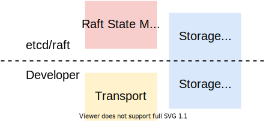

*本文为原创文章，转载请严格遵守[CC BY-NC-SA协议](https://creativecommons.org/licenses/by-nc-sa/4.0/)。*

<!--more-->

## 0. 引言

本文会对etcd/raft中Raft日志复制算法的实现与优化进行分析。这里假定读者阅读过Diego Ongaro的《In Search of an Understandable Consensus Algorithm (Extended Version)》（这里有笔者的[翻译](/posts/paper-reading/raft-extended/)，笔者英语水平一般，欢迎指正。），其中提到的部分，本文中不会做详细的解释。对etcd/raft的总体结构不熟悉的读者，可以先阅读[《深入浅出etcd/raft —— 0x02 etcd/raft总体设计》](/posts/code-reading/etcdraft-made-sample/2-overview/)。

本文首先介绍了etcd/raft中日志复制部分的优化。由于etcd/raft中对日志复制的优化大部分属于实现上的优化，这些优化是在系统中很常见的优化，因此本文会一笔带过其理论部分，而着重于讲解etcd/raft中日志复制的实现。

因为日志复制的逻辑涉及到的方面多、逻辑复杂、经过数年的版本演进部分逻辑难以理解，因此本文后半部分详细地分析了etcd/raft中与日志复制相关的几乎所有逻辑，以供读者参考。这里不建议读者通读本文讲解实现的部分，而是按照自己的节奏阅读源码，在遇到难以理解的部分时可以将本文作为补充参考。

## 1. etcd/raft日志复制优化

本节将介绍etcd/raft中日志复制部分采用的优化。

### 1.1 快速回退

在《In Search of an Understandable Consensus Algorithm (Extended Version)》和《CONSENSUS: BRIDGING THEORY AND PRACTICE》介绍Raft算法基本概念时，提到了一种快速回退*next index*的方法。当follower拒绝leader的AppendEntries RPC（`MsgApp`）请求时，follower会通过响应消息（`MsgAppResp`）的一个字段（`RejectHint`）告知leader日志冲突的位置与当前term的第一条日志的index。这样，leader可以直接将该follower的*next index*回退到该位置，然后继续以“一次回退一条”的方式检查冲突。

etcd/raft中也实现了类似的优化，但是其将follower的最后一条日志作为该字段的值。正如Diego Ongaro所说，故障不会经常发生，因此出现很多不一致的日志条目的可能性不大（etcd/raft该部分的作者也是这样想的，详见[pull#2021](https://github.com/etcd-io/etcd/pull/2021)），所以回退到follower的最后一条日志后继续检查冲突即可。

### 1.2 并行写入

《CONSENSUS: BRIDGING THEORY AND PRACTICE》的*10.2.1 Writing to the leader’s disk in parallel*介绍了一种减少Raft算法关键路径上的磁盘写入的优化。在朴素的实现方式中，leader需要先将新日志写入本地稳定存储之后再为follower复制这些日志，这会大大增加处理的延迟。

事实上，这次关键路径上的磁盘写入是可以优化的。leader可以在为follower复制日志的同时将这些日志写入其本地稳定存储。为了简化实现，leader自己的*match index*表示其写入到了稳定存储的最后一条日志的索引。当当前term的某日志被大多数的*match index*覆盖时，leader便可以使*commit index*前进到该节点处。这种优化是安全的，通过这种优化，leader甚至可以在日志写入本地稳定存储完成之前提交日志。

### 1.3 微批处理

微批处理是各种系统提高吞吐量的常用方式，etcd/raft也不例外。在etcd/raft的实现中。并不是所有地方都是收到消息后立刻对其进行处理的，而是会积累一定量的消息，之后一起处理，以充分地利用I/O。

在etcd/raft的实现中，有两处体现了这种设计，一处是网络，一处是存储：

- 网络：leader在为稳定的follower复制日志时，会用一条消息复制多条日志，且每次可能同时发送多条消息。后文会介绍相关实现。
- 存储：在前文中笔者介绍过数据的存储时etcd/raft的使用者的责任，使用者需要将`Ready`结构体中的`HardStates`、`Entries`、`Snapshot`保存到稳定存储，然后在处理完所有字段后调用`Advance`方法以接收下一批数据。`Ready`和`Advance`的设计即体现了微批处理的思想。

### 1.4 流水线化

流水线（pipeline）同样是各种系统常用的提高吞吐量的方式。在etcd/raft的实现中，leader在向follower发送完日志复制请求后，不会等待follower响应，而是立即更新其*nextIndex*，并继续处理，以提高吞吐量。

在正常且稳定的情况下，消息应恰好一次且有序到达。但是在异常情况下，可能出现消息丢失、消息乱序、消息超时等等情况，在前文[深入浅出etcd/raft —— 0x03 Raft选举](/posts/code-reading/etcdraft-made-sample/3-election/)介绍`Step`方法时，介绍了一些对过期消息的处理方式，重复的地方本文不再赘述。当follower收到过期的日志复制请求时，会拒绝该请求，随后follower会回退其*nextIndex*以重传之后的日志。

## 2. etcd/raft中的日志结构

在分析etcd/raft的日志复制的实现时，首先要了解etcd/raft中Raft日志结构的实现方式。etcd/raft中Raft日志是通过结构体`raftLog`实现的。本节将介绍`raftLog`的设计与实现。

### 2.1 raftLog的设计

etcd/raft中Raft日志是通过`raftLog`结构体记录的。`raftLog`结构体中，既有还未持久化的数据，也有已经持久化到稳定存储的数据；其中数据既有日志条目，也有快照。如果直观的给出`raftLog`中数据的逻辑结构，其大概如下图所示。


`raftLog`中的数据，按照是否已持久化到稳定存储，可分为两部分：已持久化到稳定存储的部分（stable）和还未持久化到稳定存储的部分（unstable）。无论是stable的部分还是unstable的部分中，都可能包含快照或日志，且每部分的快照中包含的已压缩的日志比该部分相应的未压缩的日志更旧。需要注意的是，在etcd/raft的实现中，在同一时刻，`raftLog`中的4个段可能并不是同时存在的。

在etcd/raft的日志操作中，有4个经常使用的索引：

| 索引名 | 描述 |
| - | - |
| committed | 在该节点所知数量达到quorum的节点保存到了稳定存储中的日志里，index最高的日志的index。 |
| applied | 在该节点的应用程序已应用到其状态机的日志里，index最高的日志的index。<br> 其中， $ applied \le committed $ 总是成立的。 |
| firstIndex | 在该节点的日志中，最新的快照之后的第一条日志的index。 |
| lastIndex | 在该节点的日志中，最后一条日志的index。 |

这里需要注意的是，所有的这些索引都是相对于当前节点而不是整个集群的，例如，当index为$i_1$的日志已被集群中数量达到quorum的节点保存到稳定存储时，一些节点可能还不知道$i_1$已被commit。

`raftLog`中unstable的部分保存在`unstable`结构体中，而stable的部分稍有些复杂。为了让使用etcd/raft模块的开发者能够根据自己的需求自定义Raft日志存储，stable的部分不是直接通过内部的结构体实现的。`go.etcd.io/etcd/raft/storage.go`文件中定义了`Storage`接口，只要实现了该接口，都可以用来存储stable日志。在[深入浅出etcd/raft —— 0x02 etcd/raft总体设计](/posts/code-reading/etcdraft-made-sample/2-overview/)的引言中，笔者提到`Storage`接口只定义了读取稳定存储中的日志、快照、状态的方法（如下图所示），etcd/raft并不关心也不知道开发者写入稳定存储的方式。那么，etcd/raft是怎样将unstable中的数据写入到稳定存储中的呢？



在[深入浅出etcd/raft —— 0x01 raftexample](/posts/code-reading/etcdraft-made-sample/1-raftexample/)中，笔者通过了官方提供的raftexample示例，介绍了使用etcd/raft的开发者与`Node`接口打交道并处理`Ready`结构体的方式（在[深入浅出etcd/raft —— 0x02 etcd/raft总体设计](/posts/code-reading/etcdraft-made-sample/2-overview/)中也有提到）。其中，开发者需要将`Ready`结构体`Entities`和`Snapshot`字段中的数据保存到稳定存储中，这就是将数据从unstable转移到stable中的过程，这种设计也让etcd/raft不需要依赖稳定存储的具体写入方法。下图直观地表示了follower节点从收到leader发来的日志到将其保存至稳定存储中的大致流程（快照的处理方式也同理）。


接下来，笔者对`Storage`和`unstable`进行分析。其中，对`Storage`的分析包括etcd采用的`Storage`实现——`MemoryStorage`。



`Storage`接口定义的是稳定存储的读取方法。之所以etcd使用了基于内存的`MemoryStorage`，是因为etcd在写入`MemoryStorage`前，需要先写入预写日志（Write Ahead Log，WAL）或快照。而预写日志和快照是保存在稳定存储中的。这样，在每次重启时，etcd可以基于保存在稳定存储中的快照和预写日志恢复`MemoryStorage`的状态。也就是说，etcd的稳定存储是通过快照、预写日志、`MemoryStorage`三者共同实现的。



### 2.2 Storage的设计与实现

`Storage`接口定义了etcd/raft中需要的读取稳定存储中日志、快照、状态等方法。

```go

// Storage is an interface that may be implemented by the application
// to retrieve log entries from storage.
//
// If any Storage method returns an error, the raft instance will
// become inoperable and refuse to participate in elections; the
// application is responsible for cleanup and recovery in this case.
type Storage interface {
	// TODO(tbg): split this into two interfaces, LogStorage and StateStorage.

	// InitialState returns the saved HardState and ConfState information.
	InitialState() (pb.HardState, pb.ConfState, error)
	// Entries returns a slice of log entries in the range [lo,hi).
	// MaxSize limits the total size of the log entries returned, but
	// Entries returns at least one entry if any.
	Entries(lo, hi, maxSize uint64) ([]pb.Entry, error)
	// Term returns the term of entry i, which must be in the range
	// [FirstIndex()-1, LastIndex()]. The term of the entry before
	// FirstIndex is retained for matching purposes even though the
	// rest of that entry may not be available.
	Term(i uint64) (uint64, error)
	// LastIndex returns the index of the last entry in the log.
	LastIndex() (uint64, error)
	// FirstIndex returns the index of the first log entry that is
	// possibly available via Entries (older entries have been incorporated
	// into the latest Snapshot; if storage only contains the dummy entry the
	// first log entry is not available).
	FirstIndex() (uint64, error)
	// Snapshot returns the most recent snapshot.
	// If snapshot is temporarily unavailable, it should return ErrSnapshotTemporarilyUnavailable,
	// so raft state machine could know that Storage needs some time to prepare
	// snapshot and call Snapshot later.
	Snapshot() (pb.Snapshot, error)
}

```

`Storage`中定义了需要从稳定存储读取的6种方法（具体定义见上面给出的代码与注释，这里不再赘述）。其中`HardState`指Raft状态机需要在本地稳定存储中持久化保存的状态，对应论文中的*Persistent State*（etcd/raft为了优化Raft日志，其保存的字段与原文稍有不同），相应的，`SoftState`只不需要持久化保存的状态，对应论文中的*Volatile State*；另外，由于陈旧的日志会被压缩成快照，因此有些方法并不总能获取到所需的值。

接下来对`MemoryStorage`的实现进行分析。`MemoryStorage`是etcd中使用的`Storage`实现，其实现了`Storage`中定义的读取稳定存储的方法，还实现了相应的写入稳定存储的方法。`MemoryStorage`结构体中的字段如下：

```go

// MemoryStorage implements the Storage interface backed by an
// in-memory array.
type MemoryStorage struct {
	// Protects access to all fields. Most methods of MemoryStorage are
	// run on the raft goroutine, but Append() is run on an application
	// goroutine.
	sync.Mutex

	hardState pb.HardState
	snapshot  pb.Snapshot
	// ents[i] has raft log position i+snapshot.Metadata.Index
	ents []pb.Entry
}

```

其中，`ents`字段就是用来保存日志条目的切片。该切片的首元素被设计为用来保存元数据的条目，而不是真正的日志条目，其保存了快照的最后一条日志对应的term和index，该条目也被成为*dummy entry*。`MemoryStorage`中`ents`字段可以直观表示为下图的结构。


注意，图中的*first index*和*last index*是`Storage`接口的`FirstIndex`和`LastIndex`方法定义的索引，而不是整个`raftLog`的*first index*或*last index*。

`MemoryStorage`的实现不是很复杂，其中很多逻辑是在处理越界和*dummy entry*，这里不再占用篇幅详细解释。此外，`MemoryStorage`通过互斥锁保证其操作是线程安全的。

### 2.3 unstable的设计与实现

`unstable`结构体中保存了还未被保存到稳定存储中的快照或日志条目。

```go

// unstable.entries[i] has raft log position i+unstable.offset.
// Note that unstable.offset may be less than the highest log
// position in storage; this means that the next write to storage
// might need to truncate the log before persisting unstable.entries.
type unstable struct {
	// the incoming unstable snapshot, if any.
	snapshot *pb.Snapshot
	// all entries that have not yet been written to storage.
	entries []pb.Entry
	offset  uint64

	logger Logger
}

```

`unstable`结构体中的`offset`字段记录了unstable的日志起点，该起点可能比`Storage`中index最高的日志条目旧，也就是说`Storage`和`unstable`中的日志可能有部分重叠，因此在处理二者之间的日志时，有一些裁剪日志的操作。

`unstable`中较为重要的方法如下表所示。

| 方法<div style="width: 18em"></div> | 描述 |
| :-: | :- |
| `maybeFirstIndex() (uint64, bool)` | 获取相对整个`raftLog`的*first index*，当`unstable`无法得知该值时，第二个返回值返回`false`。 | 
| `maybeLastIndex() (uint64, bool)` | 获取相对整个`raftLog`的*last index*，当`unstable`无法得知该值时，第二个返回值返回`false`。 | 
| `maybeTerm(i uint64) (uint64, bool)` | 获取给定index的日志条目的term，当`unstable`无法得知该值时，第二个返回值返回`false` |
| `stableTo(i, t uint64)` | 通知`unstable`当前index为`i`、term为`t`及其之前的日志已经被保存到了稳定存储中，可以裁剪掉`unstable`中的这段日志了。裁剪后会根据空间利用率适当地对空间进行优化。 |
| `stableSnapTo(i uint64)` | 通知`unstable`当前index在`i`及其之前的快照已经保存到了稳定存储中，如果`unstable`中保存了该快照，那么可以释放该快照了。 |
| `restore(s pb.Snapshot)` | 根据快照恢复`unstable`的状态（设置`unstbale`中的`offset`、`snapshot`，并将`entries`置空）。
| `truncateAndAppend(ents []pb.Entry)` | 对给定的日志切片进行裁剪，并将其加入到`unstable`保存的日志中。 |
| `slice(lo uint64, hi uint64)` | 返回给定范围内的日志切片。首先会通过`mustCheckOutOfBounds(lo, hi uint64)`方法检查是否越界，如果越界会因此panic。 |

`unstable`中的*first index*和*last index*的实现与`Storage`稍有不同。`unstable`的`maybeFirstIndex`方法与`maybeLastIndex`方法获取的是相对整个`raftLog`的*first index*或*last index*，当`unstable`无法得知整个`raftLog`的*first index*或*last index*时，这两个方法的第二个返回值会被置为`false`。这种设计与`raftLog`的实现有关，在`raftLog`的`firstIndex`和`lastIndex`方法中，首先会调用`unstable`的`maybeFirstIndex`方法或`maybeLastIndex`方法，如果查询的索引不在`unstable`中时，其会继续询问`Storage`。`unstable`中`maybeFirstIndex`方法与`maybeLastIndex`方法的实现如下。

```go

// maybeFirstIndex returns the index of the first possible entry in entries
// if it has a snapshot.
func (u *unstable) maybeFirstIndex() (uint64, bool) {
	if u.snapshot != nil {
		return u.snapshot.Metadata.Index + 1, true
	}
	return 0, false
}

// maybeLastIndex returns the last index if it has at least one
// unstable entry or snapshot.
func (u *unstable) maybeLastIndex() (uint64, bool) {
	if l := len(u.entries); l != 0 {
		return u.offset + uint64(l) - 1, true
	}
	if u.snapshot != nil {
		return u.snapshot.Metadata.Index, true
	}
	return 0, false
}

```

简单来说，只有`unstable`中包含快照时，`unstable`才可能得知整个`raftLog`的*first index*的位置（快照前的日志不会影响快照后的状态）；而只有当`unstable`中既没有日志也没有快照时，`unstable`才无法得知*last index*的位置。

`unstable`中另一处比较重要的方法是`truncateAndAppend`。当`raftLog`需要将新日志保存到`unstable`中时会调用该方法。该方法会根据给定的日志切片的范围和当前`unstable`中日志切片的范围对二者进行适当地裁剪，其逻辑如下。

```go

func (u *unstable) truncateAndAppend(ents []pb.Entry) {
	after := ents[0].Index
	switch {
	case after == u.offset+uint64(len(u.entries)):
		// after is the next index in the u.entries
		// directly append
		u.entries = append(u.entries, ents...)
	case after <= u.offset:
		u.logger.Infof("replace the unstable entries from index %d", after)
		// The log is being truncated to before our current offset
		// portion, so set the offset and replace the entries
		u.offset = after
		u.entries = ents
	default:
		// truncate to after and copy to u.entries
		// then append
		u.logger.Infof("truncate the unstable entries before index %d", after)
		u.entries = append([]pb.Entry{}, u.slice(u.offset, after)...)
		u.entries = append(u.entries, ents...)
	}
}

```

该方法首先会获取给定日志切片中第一个日志条目的index（`after`），将其与`unstable`中已有日志的index进行比较，以确定处理方法：

1. 当`after`恰好是`unstable`的下一条日志时，直接将其追加到`unstable`当前保存的日志之后。
2. 当`after`比`unstable`的第一条日志还早时，此时给定的日志切片与`unstable`中的日志可能有冲突的部分（如Raft算法中leader强制覆盖follower中的日志时），为了更简单地处理冲突，直接将`unstable`中保存的日志替换为给定日志。
3. 当`after`在`offset`之后但与`unstable`中部分日志重叠时，重叠部分和之后部分可能会有冲突，因此裁剪掉`unstable`的日志中在`after`及其之后的部分，并将给定日志追加到其后。

另外，在`unstable`的`stableTo`方法裁剪完日志后，会调用`shrinkEntriesArray`方法优化空间利用率。即如果剩余日志条目小于用来保存日志的切片容量的一半时，将剩余的日志拷贝到容量恰好为剩余日志长度的新切片中，并释放对原切片的引用。需要注意的是，这里不能直接释放原切片的空间或在原切片上进行修改，因为程序的其它部分可能还持有对原切片的引用。

```go

// shrinkEntriesArray discards the underlying array used by the entries slice
// if most of it isn't being used. This avoids holding references to a bunch of
// potentially large entries that aren't needed anymore. Simply clearing the
// entries wouldn't be safe because clients might still be using them.
func (u *unstable) shrinkEntriesArray() {
	// We replace the array if we're using less than half of the space in
	// it. This number is fairly arbitrary, chosen as an attempt to balance
	// memory usage vs number of allocations. It could probably be improved
	// with some focused tuning.
	const lenMultiple = 2
	if len(u.entries) == 0 {
		u.entries = nil
	} else if len(u.entries)*lenMultiple < cap(u.entries) {
		newEntries := make([]pb.Entry, len(u.entries))
		copy(newEntries, u.entries)
		u.entries = newEntries
	}
}

```

### 2.4 raftLog的实现

在介绍了`Storage`接口和`unstable`结构体后，接下来继续看`raftLog`的具体实现。`raftLog`结构体源码如下：

```go

type raftLog struct {
	// storage contains all stable entries since the last snapshot.
	storage Storage

	// unstable contains all unstable entries and snapshot.
	// they will be saved into storage.
	unstable unstable

	// committed is the highest log position that is known to be in
	// stable storage on a quorum of nodes.
	committed uint64
	// applied is the highest log position that the application has
	// been instructed to apply to its state machine.
	// Invariant: applied <= committed
	applied uint64

	logger Logger

	// maxNextEntsSize is the maximum number aggregate byte size of the messages
	// returned from calls to nextEnts.
	maxNextEntsSize uint64
}

```

可以看到，`raftLog`由`Storage`接口实例`storage`和`unstable`结构体实例`unstable`组成。在[2.1节](#21-raftlog的设计)提到的4个常用索引中，`committed`和`applied`索引是通过`raftLog`的字段实现的，而`firstIndex`和`lastIndex`是通过`raftLog`的方法实现的：

```go

func (l *raftLog) firstIndex() uint64 {
	if i, ok := l.unstable.maybeFirstIndex(); ok {
		return i
	}
	index, err := l.storage.FirstIndex()
	if err != nil {
		panic(err) // TODO(bdarnell)
	}
	return index
}

func (l *raftLog) lastIndex() uint64 {
	if i, ok := l.unstable.maybeLastIndex(); ok {
		return i
	}
	i, err := l.storage.LastIndex()
	if err != nil {
		panic(err) // TODO(bdarnell)
	}
	return i
}

```

`firstIndex`和`lastIndex`的实现方式在[2.3节](#23-unstable的设计与实现)中已经介绍过，这里不再赘述。`raftLog`在创建时，会将`unstable`的`offset`置为`storage`的*last index + 1*，并将`committed`和`applied`置为`storage`的*forst index - 1*。

```go

// newLog returns log using the given storage and default options. It
// recovers the log to the state that it just commits and applies the
// latest snapshot.
func newLog(storage Storage, logger Logger) *raftLog {
	return newLogWithSize(storage, logger, noLimit)
}

// newLogWithSize returns a log using the given storage and max
// message size.
func newLogWithSize(storage Storage, logger Logger, maxNextEntsSize uint64) *raftLog {
	if storage == nil {
		log.Panic("storage must not be nil")
	}
	log := &raftLog{
		storage:         storage,
		logger:          logger,
		maxNextEntsSize: maxNextEntsSize,
	}
	firstIndex, err := storage.FirstIndex()
	if err != nil {
		panic(err) // TODO(bdarnell)
	}
	lastIndex, err := storage.LastIndex()
	if err != nil {
		panic(err) // TODO(bdarnell)
	}
	log.unstable.offset = lastIndex + 1
	log.unstable.logger = logger
	// Initialize our committed and applied pointers to the time of the last compaction.
	log.committed = firstIndex - 1
	log.applied = firstIndex - 1

	return log
}

```

`raftLog`提供了如下的较为重要的方法：

| 方法<div style="width: 16em"></div> | 描述 |
| :-: | - |
| `maybeAppend(index, logTerm, committed uint64, ents ...pb.Entry)` | 尝试追加新日志，并更新*committed*索引（详见下文分析）。 |
| `unstableEntries() []pb.Entry` | 返回全部`unstable`中的日志条目。 |
| `nextEnts() (ents []pb.Entry)` | 返回可被应用到状态机的日志条目（已提交但还未应用），返回的长度受创建`raftLog`时指定的`maxNextEntsSize`限制。 |
| `hasNextEnts() bool` | 返回是否存在可被应用到状态机的日志。该方法不会调用`slice`方法，性能更高。 |
| `hasPendingSnapshot() bool` | 返回是否有未应用到状态机的快照（即`unstable`中保存的快照）。 |
| `commitTo(tocommit uint64)` | 更新`committed`索引，该方法会检查参数合法性。 |
| `appliedTo(i uint64)` | 更新`applied`索引，该方法会检查参数合法性。 |
| `stableTo(i, t uint64)` | 通知`unstable`当前已保存到稳定存储中最后的日志的index与term，让其适当裁剪日志。 |
| `stableSnapTo(i uint64)` | 通知`unstable`当前已保存到稳定存储中最后的快照的index，让其释放快照。 |
| `lastTerm() uint64` | 获取最后一条日志的term。 |
| `term(i uint64) (uint64, error)` | 获取给定index的日志条目的term。 |
| `entries(i, maxsize uint64) ([]pb.Entry, error)` | 获取index从`i`开始的最多`maxsize`条日志。 |
| `allEntries() []pb.Entry` | 获取全部日志条目。 |
| `isUpToDate(lasti, term uint64) bool` | 判断给定的term和index对应的日志条目是否至少与当前最后一个日志条目一样新。 |
| `matchTerm(i, term uint64) bool` | 判断给定的index与term是否日志中相应index的条目的term匹配。 |
| `maybeCommit(maxIndex, term uint64) bool` | 如果给定的index和term对应的日志条目还未被提交，将日志提交到给日志条目处并返回`true`，否则返回`false`。 |
| `restore(s pb.Snapshot)` | 将给定快照应用到（unstable）日志中。 |
| `slice(lo, hi, maxSize uint64) ([]pb.Entry, error)` | 返回index从`lo`到`hi`的最多`maxSize`条日志，该方法会检查参数是否合法。 |


`append`与`maybeAppend`是向`raftLog`写入日志的方法。二者的区别在于`append`不会检查给定的日志切片是否与已有日志有冲突，因此leader向`raftLog`中追加日志时会调用该函数；而`maybeAppend`会检查是否有冲突并找到冲突位置，并试图通过覆盖本地日志的方式解决冲突。但是，二者都会检查给定的日志起点是否在`committed`索引位置之前，如果在其之前，这违背了Raft算法的**Log Matching**性质，因此会引起panic（其实follower不会将`committed`之前的日志传给该函数，因此永远不会进入该分支）。源码如下：

```go

// maybeAppend returns (0, false) if the entries cannot be appended. Otherwise,
// it returns (last index of new entries, true).
func (l *raftLog) maybeAppend(index, logTerm, committed uint64, ents ...pb.Entry) (lastnewi uint64, ok bool) {
	if l.matchTerm(index, logTerm) {
		lastnewi = index + uint64(len(ents))
		ci := l.findConflict(ents)
		switch {
		case ci == 0:
		case ci <= l.committed:
			l.logger.Panicf("entry %d conflict with committed entry [committed(%d)]", ci, l.committed)
		default:
			offset := index + 1
			l.append(ents[ci-offset:]...)
		}
		l.commitTo(min(committed, lastnewi))
		return lastnewi, true
	}
	return 0, false
}

func (l *raftLog) append(ents ...pb.Entry) uint64 {
	if len(ents) == 0 {
		return l.lastIndex()
	}
	if after := ents[0].Index - 1; after < l.committed {
		l.logger.Panicf("after(%d) is out of range [committed(%d)]", after, l.committed)
	}
	l.unstable.truncateAndAppend(ents)
	return l.lastIndex()
}

```

`maybeAppend`方法会检查参数的合法性，当可以追加时，其会返回追加的最后一条日志的index与true，否则返回0与false。其需要的参数有这批日志的前一个日志条目的index与term（用于校验匹配）、leader最新确认的`committed`索引、和待追加的日志`ents`。

首先，`maybeAppend`方法会检查这批日志的前一个条目的index和这批日志的term与`raftLog`对应条目的index与term是否匹配，如果不匹配则返回(0, false)。如果匹配无误，其会调用`findConflict`方法寻找待追加的日志与已有日志的第一个冲突条目的index或第一条新日志的index。在进一步分析前，先看一下`findConflict`的实现方式：

```go

// findConflict finds the index of the conflict.
// It returns the first pair of conflicting entries between the existing
// entries and the given entries, if there are any.
// If there is no conflicting entries, and the existing entries contains
// all the given entries, zero will be returned.
// If there is no conflicting entries, but the given entries contains new
// entries, the index of the first new entry will be returned.
// An entry is considered to be conflicting if it has the same index but
// a different term.
// The first entry MUST have an index equal to the argument 'from'.
// The index of the given entries MUST be continuously increasing.
func (l *raftLog) findConflict(ents []pb.Entry) uint64 {
	for _, ne := range ents {
		if !l.matchTerm(ne.Index, ne.Term) {
			if ne.Index <= l.lastIndex() {
				l.logger.Infof("found conflict at index %d [existing term: %d, conflicting term: %d]",
					ne.Index, l.zeroTermOnErrCompacted(l.term(ne.Index)), ne.Term)
			}
			return ne.Index
		}
	}
	return 0
}

```

`findConflict`返回的情况可以分为3种：

1. 如果给定的日志与已有的日志的index和term冲突，其会返回第一条冲突的日志条目的index。
2. 如果没有冲突，且给定的日志的所有条目均已在已有日志中，返回0.
3. 如果没有冲突，且给定的日志中包含已有日志中没有的新日志，返回第一条新日志的index。

`maybeAppend`会根据`findConflict`的返回值确定接下来的处理方式：

1. 如果返回0，说明既没有冲突又没有新日志，直接进行下一步处理。
2. 如果返回值小于当前的`committed`索引，说明`committed`前的日志发生了冲突，这违背了Raft算法保证的**Log Matching**性质，因此会引起panic。
3. 如果返回值大于`committed`，既可能是冲突发生在`committed`之后，也可能是有新日志，但二者的处理方式都是相同的，即从将从冲突处或新日志处开始的日志覆盖或追加到当前日志中即可。

除了会引起panic的情况外，该方法接下来会调用`commitTo`方法，更新当前的`committed`索引为给定的新日志中最后一条日志的index（`lastnewi`）和传入的新的`committed`中较小的一个。`commitTo`方法保证了`committed`索引只会前进而不会回退，而使用`lastnewi`和传入的`committed`中的最小值则是因为传入的数据可能有如下两种情况：

1. leader给follower复制日志时，如果复制的日志条目超过了单个消息的上限，则可能出现leader传给follower的`committed`值大于该follower复制完这条消息中的日志后的最大index。此时，该follower的新`committed`值为`lastnewi`。
2. follower能够跟上leader，leader传给follower的日志中有未确认被法定数量节点稳定存储的日志，此时传入的`committed`比`lastnewi`小，该follower的新`committed`值为传入的`committed`值。

`raftLog`的`slice`方法是会返回指定的日志片段，该方法会检查给定的范围是否可以访问。

```go

// slice returns a slice of log entries from lo through hi-1, inclusive.
func (l *raftLog) slice(lo, hi, maxSize uint64) ([]pb.Entry, error) {
	err := l.mustCheckOutOfBounds(lo, hi)
	if err != nil {
		return nil, err
	}
	if lo == hi {
		return nil, nil
	}
	var ents []pb.Entry
	if lo < l.unstable.offset {
		storedEnts, err := l.storage.Entries(lo, min(hi, l.unstable.offset), maxSize)
		if err == ErrCompacted {
			return nil, err
		} else if err == ErrUnavailable {
			l.logger.Panicf("entries[%d:%d) is unavailable from storage", lo, min(hi, l.unstable.offset))
		} else if err != nil {
			panic(err) // TODO(bdarnell)
		}

		// check if ents has reached the size limitation
		if uint64(len(storedEnts)) < min(hi, l.unstable.offset)-lo {
			return storedEnts, nil
		}

		ents = storedEnts
	}
	if hi > l.unstable.offset {
		unstable := l.unstable.slice(max(lo, l.unstable.offset), hi)
		if len(ents) > 0 {
			combined := make([]pb.Entry, len(ents)+len(unstable))
			n := copy(combined, ents)
			copy(combined[n:], unstable)
			ents = combined
		} else {
			ents = unstable
		}
	}
	return limitSize(ents, maxSize), nil
}

```

在获取`raftLog`中的日志切片时，该方法首先会通过`mustCheckOutOfBounds`方法检查给定的范围是否越界。

```go

// l.firstIndex <= lo <= hi <= l.firstIndex + len(l.entries)
func (l *raftLog) mustCheckOutOfBounds(lo, hi uint64) error {
	if lo > hi {
		l.logger.Panicf("invalid slice %d > %d", lo, hi)
	}
	fi := l.firstIndex()
	if lo < fi {
		return ErrCompacted
	}

	length := l.lastIndex() + 1 - fi
	if hi > fi+length {
		l.logger.Panicf("slice[%d,%d) out of bound [%d,%d]", lo, hi, fi, l.lastIndex())
	}
	return nil
}

```

`mustCheckOutOfBounds`检查了如下几个方面：

1. 是否满足$lo \le hi$。（`slice`获取的是左闭右开区间$[lo,hi)$的日志切片。）
2. 是否满足$lo \ge firstIndex$，否则该范围中部分日志已被压缩，无法获取。
3. 是否满足$hi \le lastIndex+1$，否则该范围中部分日志还没被追加到当前节点的日志中，无法获取。

当`slice`确保给定范围没有越界后，如果这段范围跨了stable和unstable两部分，那么该方法会分别从`Storage`获取$[lo,\text{unstable.offset})$、从`unstable`获取$[\text{unstable.offset},hi)$；否则直接从其中一部分获取完整的切片。在返回切片前，`silce`还会按照`maxSize`参数限制返回的切片长度。

## 3. 复制进度跟踪

在《In Search of an Understandable Consensus Algorithm (Extended Version)》中，leader只通过 *nextInext[]* 和 *matchIndex[]* 来跟踪follower的日志进度。而etcd/raft为了解耦不同情况下的日志复制逻辑并实现一些日志复制相关的优化，还需要记录一些其它信息。因此，etcd/raft中leader使用`Progress`结构体来跟踪每个follower（和learner）的日志复制进度。

### 3.1 Progress结构体

`Progess`结构体是leader用来跟踪follower日志复制进度的结构，即“表示从leader视角看到的follower的进度”。leader会为每个follower（和learner）维护各自的`Progress`结构。官方提供了`Progress`的[设计文档](https://github.com/etcd-io/etcd/blob/master/raft/design.md)，该文档简单介绍了其设计与功能。

`Progress`的结构如下：

```go

// Progress represents a follower’s progress in the view of the leader. Leader
// maintains progresses of all followers, and sends entries to the follower
// based on its progress.
//
// NB(tbg): Progress is basically a state machine whose transitions are mostly
// strewn around `*raft.raft`. Additionally, some fields are only used when in a
// certain State. All of this isn't ideal.
type Progress struct {
	Match, Next uint64
	// State defines how the leader should interact with the follower.
	//
	// When in StateProbe, leader sends at most one replication message
	// per heartbeat interval. It also probes actual progress of the follower.
	//
	// When in StateReplicate, leader optimistically increases next
	// to the latest entry sent after sending replication message. This is
	// an optimized state for fast replicating log entries to the follower.
	//
	// When in StateSnapshot, leader should have sent out snapshot
	// before and stops sending any replication message.
	State StateType

	// PendingSnapshot is used in StateSnapshot.
	// If there is a pending snapshot, the pendingSnapshot will be set to the
	// index of the snapshot. If pendingSnapshot is set, the replication process of
	// this Progress will be paused. raft will not resend snapshot until the pending one
	// is reported to be failed.
	PendingSnapshot uint64

	// RecentActive is true if the progress is recently active. Receiving any messages
	// from the corresponding follower indicates the progress is active.
	// RecentActive can be reset to false after an election timeout.
	//
	// TODO(tbg): the leader should always have this set to true.
	RecentActive bool

	// ProbeSent is used while this follower is in StateProbe. When ProbeSent is
	// true, raft should pause sending replication message to this peer until
	// ProbeSent is reset. See ProbeAcked() and IsPaused().
	ProbeSent bool

	// Inflights is a sliding window for the inflight messages.
	// Each inflight message contains one or more log entries.
	// The max number of entries per message is defined in raft config as MaxSizePerMsg.
	// Thus inflight effectively limits both the number of inflight messages
	// and the bandwidth each Progress can use.
	// When inflights is Full, no more message should be sent.
	// When a leader sends out a message, the index of the last
	// entry should be added to inflights. The index MUST be added
	// into inflights in order.
	// When a leader receives a reply, the previous inflights should
	// be freed by calling inflights.FreeLE with the index of the last
	// received entry.
	Inflights *Inflights

	// IsLearner is true if this progress is tracked for a learner.
	IsLearner bool
}

```

`Progress`中有两个重要的索引：`match`与`next`。`match`表示leader所知的该follower的日志中匹配的日志条目的最高index，如果leader不知道该follower的日志状态时，`match`为0；`next`表示leader接下来要给该follower发送的日志的第一个条目的index。根据Raft算法论文，`next`是可能因异常回退的，而`match`是单调递增的。`next`小于`match`的节点会被认为是落后的节点。

`Progress`的一些常用的方法如下表所示：

| 方法<div style="width: 14em"></div> | 描述 |
| :-: | - |
| `ResetState(state StateType)` | 重置状态为目标状态，该方法会清空所有状态记录的数据。该方法由`BecomeXXX`方法调用。 | 
| `BecomeProbe()` | 将follower转为Probe状态。 |
| `BecomeReplicate()` | 将follower转为Replicate状态。 |
| `BecomeSnapshot(snapshoti uint64)` | 将follower转为Snapshot状态，并指定需要为其发送的快照的index。 |
| `MaybeUpdate(n uint64) bool` | 用于更新follower的进度（*match index*），如果传入的进度比当前进度旧，则不会更新进度并返回false，该方法还会根据传入的进度更新*next index*。leader会在收到来自follower的`MsgAppResp`消息时调用该方法。 |
| `OptimisticUpdate(n uint64)` | 不做检查直接更新*next index*，用于`StateReplicate`状态下日志复制流水线优化。 |
| `MaybeDecrTo(rejected, last uint64) bool` | 用于回退*next index*，该方法会根据参数判断是否需要回退，如果参数是来自过期的消息，那么不会回退。如果回退，则会返回true。 |
| `IsPaused() bool` | 判断为该follower发送消息的发送窗口是否阻塞，发送窗口大小与该follower的状态和`Raft`的配置有关。 |

以上的很多方法都与follower的状态有关，因此这里先介绍`Progress`中规定的3中follower状态。

### 3.2 follower的3种状态

为了更加清晰地处理leader为follower复制日志的各种情况，etcd/raft将leader向follower复制日志的行为分成三种，记录在`Progress`的`State`字段中：

1. `StateProbe`：当leader刚刚当选时，或当follower拒绝了leader复制的日志时，该follower的进度状态会变为`StateProbe`类型。在该状态下，leader每次心跳期间仅为follower发送一条`MsgApp`消息，且leader会根据follower发送的相应的`MsgAppResp`消息调整该follower的进度。
2. `StateReplicate`：该状态下的follower处于稳定状态，leader会优化为其复制日志的速度，每次可能发送多条`MsgApp`消息（受`Progress`的流控限制，后文会详细介绍）。
3. `StateSnapshot`：当follower所需的日志已被压缩无法访问时，leader会将该follower的进度置为`StateSnapshot`状态，并向该follower发送快照。leader不会为处于`StateSnapshot`状态的follower发送任何的`MsgApp`消息，直到其成功收到快照。



每条`MsgApp`消息可以包含多个日志条目。



`Progress`中的`PendingSnapshot`、`ProbeSent`字段是`StateProebe`和`StateSnapshot`状态下需要记录的字段，后文会详细讲解。

`Progress`中的`RecentActive`字段用来标识该follower最近是否是“活跃”的。该字段除了用于**Check Quorum**外（详见[深入浅出etcd/raft —— 0x03 Raft选举](/posts/code-reading/etcdraft-made-sample/3-election/)），在日志复制时，leader不会将不活跃的follower转为`StateSnapshot`状态或发送快照。（这是为了修复[issue#3378](https://github.com/etcd-io/etcd/issues/3778)中提到的问题，感兴趣的读者可以查看该issue和[issue#3976](https://github.com/etcd-io/etcd/issues/3778)）。

`Progress`的`Inflights`字段是对日志复制操作进行流控的字段。虽然`Config`的`MaxSizePerMsg`字段限制了每条`MsgApp`消息的字节数，但是在`StateReplicate`状态下优化日志复制时，每次可能会发送多条`MsgApp`消息。因此，`Config`中又加入了`MaxInflightMsgs`字段来限制每次发送的`MsgApp`消息数。`Inflights`实现了`MaxInflightMsgs`字段配置的流控。

`Inflights`结构体实现了一个动态扩容的FIFO队列，其中记录了每条`MsgApp`的`Index`字段的值，以在收到`MsgAppResp`的ack时释放队列。`Inflights`的实现也比较简单，感兴趣的读者可以自行阅读源码学习其实现，这里不再赘述。

`Progress`的三种状态看做是不同大小的`Inflights`下的行为（其实并不是这样实现的）:

1. `StateProbe` => `Inflight.size = 1`
2. `StateReplicate` => `Inflight.size = MaxInflightMsgs`
3. `StateSnapshot` => `Inflight.size = 0`

从`IsPaused`方法中看到类似的逻辑：

```go

// IsPaused returns whether sending log entries to this node has been throttled.
// This is done when a node has rejected recent MsgApps, is currently waiting
// for a snapshot, or has reached the MaxInflightMsgs limit. In normal
// operation, this is false. A throttled node will be contacted less frequently
// until it has reached a state in which it's able to accept a steady stream of
// log entries again.
func (pr *Progress) IsPaused() bool {
	switch pr.State {
	case StateProbe:
		return pr.ProbeSent
	case StateReplicate:
		return pr.Inflights.Full()
	case StateSnapshot:
		return true
	default:
		panic("unexpected state")
	}
}

```

### 3.3 状态转换与更新回退

在进一步分析etcd/raft的日志复制实现时，需要先简单了解`BecomeXXX`在进行状态转换时的做的操作及更新进度、回退进度的操作。

```go

// BecomeProbe transitions into StateProbe. Next is reset to Match+1 or,
// optionally and if larger, the index of the pending snapshot.
func (pr *Progress) BecomeProbe() {
	// If the original state is StateSnapshot, progress knows that
	// the pending snapshot has been sent to this peer successfully, then
	// probes from pendingSnapshot + 1.
	if pr.State == StateSnapshot {
		pendingSnapshot := pr.PendingSnapshot
		pr.ResetState(StateProbe)
		pr.Next = max(pr.Match+1, pendingSnapshot+1)
	} else {
		pr.ResetState(StateProbe)
		pr.Next = pr.Match + 1
	}
}

```

`BecomeProbe`分为两种情况，一种是从`StateSnapshot`进入`StateProbe`状态，当leader得知follower成功应用了快照后，需要调用`Node`的`ReportSnapshot`方法，该方法会调用`BecomeProbe`将该follower的进度状态转为`StateProbe`。此时，可以将*next index*置为该快照的index的下一条。在一般情况下，则从*match index*处开始检测冲突（`Next`是下一条应为该follower发送的日志的index，因此应为当前认为的最后一条匹配日志的index+1）。

```go

// BecomeReplicate transitions into StateReplicate, resetting Next to Match+1.
func (pr *Progress) BecomeReplicate() {
	pr.ResetState(StateReplicate)
	pr.Next = pr.Match + 1
}

// BecomeSnapshot moves the Progress to StateSnapshot with the specified pending
// snapshot index.
func (pr *Progress) BecomeSnapshot(snapshoti uint64) {
	pr.ResetState(StateSnapshot)
	pr.PendingSnapshot = snapshoti
}

```

`BecomeReplicate`和`BecomeSnapshot`逻辑都很简单，在重置状态后，二者分别设置了相应的*next index*和正在发送的快照的index。

接下来分析更新*match index*和*next index*与回退*next index*的相关逻辑：

```go

// MaybeUpdate is called when an MsgAppResp arrives from the follower, with the
// index acked by it. The method returns false if the given n index comes from
// an outdated message. Otherwise it updates the progress and returns true.
func (pr *Progress) MaybeUpdate(n uint64) bool {
	var updated bool
	if pr.Match < n {
		pr.Match = n
		updated = true
		pr.ProbeAcked()
	}
	pr.Next = max(pr.Next, n+1)
	return updated
}

// OptimisticUpdate signals that appends all the way up to and including index n
// are in-flight. As a result, Next is increased to n+1.
func (pr *Progress) OptimisticUpdate(n uint64) { pr.Next = n + 1 }

```

`MaybeUpdate`会根据传入的index更新`Match`和`Next`到更高的值，如果`Match`更新，则会返回true，同时立刻对`StateProbe`状态的follower进行确认，否则返回false。其调用者会根据返回值判断该follower是否跟上了复制进度。

```go

// MaybeDecrTo adjusts the Progress to the receipt of a MsgApp rejection. The
// arguments are the index the follower rejected to append to its log, and its
// last index.
//
// Rejections can happen spuriously as messages are sent out of order or
// duplicated. In such cases, the rejection pertains to an index that the
// Progress already knows were previously acknowledged, and false is returned
// without changing the Progress.
//
// If the rejection is genuine, Next is lowered sensibly, and the Progress is
// cleared for sending log entries.
func (pr *Progress) MaybeDecrTo(rejected, last uint64) bool {
	if pr.State == StateReplicate {
		// The rejection must be stale if the progress has matched and "rejected"
		// is smaller than "match".
		if rejected <= pr.Match {
			return false
		}
		// Directly decrease next to match + 1.
		//
		// TODO(tbg): why not use last if it's larger?
		pr.Next = pr.Match + 1
		return true
	}

	// The rejection must be stale if "rejected" does not match next - 1. This
	// is because non-replicating followers are probed one entry at a time.
	if pr.Next-1 != rejected {
		return false
	}

	pr.Next = max(min(rejected, last+1), 1)
	pr.ProbeSent = false
	return true
}

```

`MaybeDecrTo`的参数有follower拒绝的`MsgApp`请求的index（`rejected`，即`MsgApp`或`MsgAppResp`的`Index`）和该follower最后一条日志的索引（`last`，即`MsgAppResp`的`RejectHint`）。其中，`rejected`参数是用来判断该消息是否是过期的消息的，其判断逻辑如下：

- 如果follower的状态为`StateReplicate`，`Next`应该是跟上`Match`的进度的，那么如果`rejected`不大于`Match`，那么该消息过期。
- 在其它状态下，`Next`可能没有跟上`Match`的进度，因此不能通过`Match`判断。由于其它状态下至多只会为其发送一条日志复制请求，因此只要`rejected`不等于`Next-1`，该消息就是过期的。

`MaybeDecrTo`不会对过期的消息进行处理。否则，将回退`Next`。`Next`的回退有两种方案：

- 回退一条日志。即新的`Next`为上一条`Next-1`，这里的`Next-1`即为发送`MsgApp`时用于日志匹配的`Index`字段的值，也是`rejected`的值。
- 快速回退，回退到该follower的最后一条日志。即新的`Next`为该follower最后一条日志的后一条日志的index，即`last+1`。

## 4. etcd/raft中日志复制实现

### 4.1 节点启动时日志处理

在节点启动时，日志的*last index*就是稳定存储`Storage`的*last index*。follower和candidate不需要对日志进行额外的处理，而leader需要获取每个follower（和learner）的进度，并以当前term提交一条空日志条目，以提交之前term的日志（详见《In Search of an Understandable Consensus Algorithm (Extended Version)》中*5.4.2 Committing entries from previous terms*）。同样，当新leader当选时，也需要做同样的操作。如下是`becomeLeader`与`reset`中与日志复制有关的源码：

```go

func (r *raft) becomeLeader() {
	// ... ...
	r.reset(r.Term)
	// ... ...

	// Followers enter replicate mode when they've been successfully probed
	// (perhaps after having received a snapshot as a result). The leader is
	// trivially in this state. Note that r.reset() has initialized this
	// progress with the last index already.
	r.prs.Progress[r.id].BecomeReplicate()

	// ... ...

	emptyEnt := pb.Entry{Data: nil}
	if !r.appendEntry(emptyEnt) {
		// This won't happen because we just called reset() above.
		r.logger.Panic("empty entry was dropped")
	}
	// As a special case, don't count the initial empty entry towards the
	// uncommitted log quota. This is because we want to preserve the
	// behavior of allowing one entry larger than quota if the current
	// usage is zero.
	r.reduceUncommittedSize([]pb.Entry{emptyEnt})
	r.logger.Infof("%x became leader at term %d", r.id, r.Term)
}

func (r *raft) reset(term uint64) {
	// ... ...
	r.prs.ResetVotes()
	r.prs.Visit(func(id uint64, pr *tracker.Progress) {
		*pr = tracker.Progress{
			Match:     0,
			Next:      r.raftLog.lastIndex() + 1,
			Inflights: tracker.NewInflights(r.prs.MaxInflight),
			IsLearner: pr.IsLearner,
		}
		if id == r.id {
			pr.Match = r.raftLog.lastIndex()
		}
	})
	// ... ...
}

```

在`becomeLeader`调用`reset`方法时，会初始化所有节点的*next index*为leader日志的*last index + 1*。因为leader刚当选时不知道除了自己之外的节点的复制进度，将除自己外的所有节点的*match index*置为0，而将自己的*match index*置为自己的*last index*。

随后，leader会在当前term为自己的日志追加一条空日志条目，以提交之前term的日志（详见《In Search of an Understandable Consensus Algorithm (Extended Version)》中*5.4.2 Committing entries from previous terms*）。

在将控日志条目加入到日志后，有一行`r.reduceUncommittedSize([]pb.Entry{emptyEnt})`代码。想了解这样代码的作用，需要先了解etcd/raft中避免新日志过多无法处理速度跟不上的机制。

在`Config`中，可以看到如下的一条配置：

```go

	// MaxUncommittedEntriesSize limits the aggregate byte size of the
	// uncommitted entries that may be appended to a leader's log. Once this
	// limit is exceeded, proposals will begin to return ErrProposalDropped
	// errors. Note: 0 for no limit.
	MaxUncommittedEntriesSize uint64

```

该配置用于限制leader日志中未提交日志的最大字节数，如果超过该值则丢弃新提议，以避免新日志过多处理速度跟不上。当该值为0时，表示不设限制。etcd/raft是以如下方式实现该约束的：

- 在leader调用`appendEntry`方法向日志追加新条目时，`appendEntry`方法会调用`increaseUncommittedSize(ents []pb.Entry) bool`方法，该方法会根据配置与`raft`结构体中的`uncommittedSize`字段判断追加后会不会超过`MaxUncommittedEntriesSize`的限制，如果超过了该限制，会返回false，`appendEntry`方法会拒绝这些提议，如果没有超过限制，则仅增大`uncommittedSize`字段字段并返回true。需要注意的是，当`uncommittedSize`字段为0时不会拒绝提议，以保证leader不会因单条较大的`MsgProp`消息阻塞；同样该方法也不会拒绝空日志条目，因为其常用于新当选的leader提交之前的term的日志或离开*joint configuration*。
- 在etcd/raft的使用者调用`Node`的`Advance`方法时，会调用`reduceUncommittedSize(ents []pb.Entry)`方法，以释放流控容量。

`increaseUncommittedSize`和`reduceUncommittedSize`的源码如下：

```go

// increaseUncommittedSize computes the size of the proposed entries and
// determines whether they would push leader over its maxUncommittedSize limit.
// If the new entries would exceed the limit, the method returns false. If not,
// the increase in uncommitted entry size is recorded and the method returns
// true.
//
// Empty payloads are never refused. This is used both for appending an empty
// entry at a new leader's term, as well as leaving a joint configuration.
func (r *raft) increaseUncommittedSize(ents []pb.Entry) bool {
	var s uint64
	for _, e := range ents {
		s += uint64(PayloadSize(e))
	}

	if r.uncommittedSize > 0 && s > 0 && r.uncommittedSize+s > r.maxUncommittedSize {
		// If the uncommitted tail of the Raft log is empty, allow any size
		// proposal. Otherwise, limit the size of the uncommitted tail of the
		// log and drop any proposal that would push the size over the limit.
		// Note the added requirement s>0 which is used to make sure that
		// appending single empty entries to the log always succeeds, used both
		// for replicating a new leader's initial empty entry, and for
		// auto-leaving joint configurations.
		return false
	}
	r.uncommittedSize += s
	return true
}

// reduceUncommittedSize accounts for the newly committed entries by decreasing
// the uncommitted entry size limit.
func (r *raft) reduceUncommittedSize(ents []pb.Entry) {
	if r.uncommittedSize == 0 {
		// Fast-path for followers, who do not track or enforce the limit.
		return
	}

	var s uint64
	for _, e := range ents {
		s += uint64(PayloadSize(e))
	}
	if s > r.uncommittedSize {
		// uncommittedSize may underestimate the size of the uncommitted Raft
		// log tail but will never overestimate it. Saturate at 0 instead of
		// allowing overflow.
		r.uncommittedSize = 0
	} else {
		r.uncommittedSize -= s
	}
}

```

而在`becomeLeader`中，写入空日志条目后，空日志条目也可能会占用一部分容量（与计算日志大小的方式有关，之前etcd/raft中直接通过protobuf生成的`Size()`方法计算，其会受其它字段影响，详见[pull#10199](https://github.com/etcd-io/etcd/pull/10199)）。因此，为了不将空日志条目的大小记在其中，其调用了`reduceUncommittedSize`方法。

在`becomeLeader`执行完后，就会进入正常的处理逻辑。此时，所有follower的进度状态为默认状态`StateProbe`，以便leader获取follower的进度。

### 4.2 leader中的日志提议

“提议”是新的日志条目的起点，因此这里从日志的提议开始分析。

日志的提议是通过`MsgProp`消息实现的。candidate或pre candidate直接丢弃`MsgProp`消息，follower会将`MsgProp`消息转发给leader，只有leader会对`MsgProp`消息做真正的处理：

```go
	// stepCandidate
	// ... ...
	case pb.MsgProp:
		r.logger.Infof("%x no leader at term %d; dropping proposal", r.id, r.Term)
		return ErrProposalDropped

	// stepFollower :
	// ... ...
	case pb.MsgProp:
		if r.lead == None {
			r.logger.Infof("%x no leader at term %d; dropping proposal", r.id, r.Term)
			return ErrProposalDropped
		} else if r.disableProposalForwarding {
			r.logger.Infof("%x not forwarding to leader %x at term %d; dropping proposal", r.id, r.lead, r.Term)
			return ErrProposalDropped
		}
		m.To = r.lead
		r.send(m)

	// stepLeader :
	// ... ...
	case pb.MsgProp:
		if len(m.Entries) == 0 {
			r.logger.Panicf("%x stepped empty MsgProp", r.id)
		}
		if r.prs.Progress[r.id] == nil {
			// If we are not currently a member of the range (i.e. this node
			// was removed from the configuration while serving as leader),
			// drop any new proposals.
			return ErrProposalDropped
		}
		if r.leadTransferee != None {
			r.logger.Debugf("%x [term %d] transfer leadership to %x is in progress; dropping proposal", r.id, r.Term, r.leadTransferee)
			return ErrProposalDropped
		}

		// Process ConfChange Msg
		//... ...

		if !r.appendEntry(m.Entries...) {
			return ErrProposalDropped
		}
		r.bcastAppend()
		return nil

```

在leader将`MsgProp`中的提议追加到本地日志之前，还需要做一些判断与处理：

1. 首先leader会检查自己的`Progress`结构是否还存在，以判断自己是否已经被`ConfChange`操作移出了集群，如果该leader被移出了集群，则不会处理该提议。
2. 接着，leader还会判断当前是否在进行*leader transfer*，如果该leader正在将领导权转移给其它节点，那么同样不会处理该提议。
3. 如果提议中包含`ConfChange`消息，会做特殊处理，在后文介绍`ConfChange`时会分析这部分逻辑，这里暂时不做介绍。
4. 如果在追加提议中的日志后会超过`MaxUncommittedSize`的限制，则不会追加该提议。这部分逻辑在[4.1 节点启动时日志处理](#41-节点启动时日志处理)已经做过介绍，这里不再赘述。

如果leader成功地将这些日志追加到了本地日志中，leade会调用`bcastAppend`方法，为所有follower（和learner）广播日志追加消息。

### 4.3 leader为follower复制日志

leader通过`bcastAppend`方法为follower（和learner）复制日志，该方法及其相关方法源码如下：

```go

// bcastAppend sends RPC, with entries to all peers that are not up-to-date
// according to the progress recorded in r.prs.
func (r *raft) bcastAppend() {
	r.prs.Visit(func(id uint64, _ *tracker.Progress) {
		if id == r.id {
			return
		}
		r.sendAppend(id)
	})
}

// sendAppend sends an append RPC with new entries (if any) and the
// current commit index to the given peer.
func (r *raft) sendAppend(to uint64) {
	r.maybeSendAppend(to, true)
}

// maybeSendAppend sends an append RPC with new entries to the given peer,
// if necessary. Returns true if a message was sent. The sendIfEmpty
// argument controls whether messages with no entries will be sent
// ("empty" messages are useful to convey updated Commit indexes, but
// are undesirable when we're sending multiple messages in a batch).
func (r *raft) maybeSendAppend(to uint64, sendIfEmpty bool) bool {
	pr := r.prs.Progress[to]
	if pr.IsPaused() {
		return false
	}
	m := pb.Message{}
	m.To = to

	term, errt := r.raftLog.term(pr.Next - 1)
	ents, erre := r.raftLog.entries(pr.Next, r.maxMsgSize)
	if len(ents) == 0 && !sendIfEmpty {
		return false
	}

	if errt != nil || erre != nil { // send snapshot if we failed to get term or entries

		// ... ... #1

	} else {

		// ... ... #2

	}
	r.send(m)
	return true
}

```

leader在调用`bcastAppend`方法时，会向所有其它节点广播`MsgApp`或`MsgSnap`消息，且即使是空消息也会广播。这里需要关注的是`maybeSendAppend`的实现，该函数是向一个节点发送`MsgApp`或`MsgSnap`消息的方法。

该方法的大致流程如下：

1. 首先通过`Prgoress`的`IsPaused`方法检查该节点进度，如果该节点进度阻塞了，那么不会向其发送消息。
2. 获取用于日志匹配的日志条目（index为`next index - 1`的日志）的term。
3. 获取该节点的*next index*之后的日志。
4. 如果日志长度为0且不需要发送空日志，那么直接返回。
5. 如果步骤2、3中任一步骤产生了错误，说明用于日志匹配的条目已被压缩，该节点落后了太多，因此需要为其发送`MsgSnap`消息；否则，发送`MsgApp`消息。
6. 调用`send`方法，填充需要发送的消息中缺失的字段（如`Term`、`From`，具体逻辑见`send`方法的源码，这里不再赘述），并将消息放入该节点的信箱。由于etcd/raft不负责通信模块，因此这里不会真正发送，而是通过`Ready`结构体将需要发送的消息交给etcd/raft的使用者处理。

接下来先来分析第5步中`MsgApp`消息的生成方式：

```go

		// ... ... #2

		m.Type = pb.MsgApp
		m.Index = pr.Next - 1
		m.LogTerm = term
		m.Entries = ents
		m.Commit = r.raftLog.committed
		if n := len(m.Entries); n != 0 {
			switch pr.State {
			// optimistically increase the next when in StateReplicate
			case tracker.StateReplicate:
				last := m.Entries[n-1].Index
				pr.OptimisticUpdate(last)
				pr.Inflights.Add(last)
			case tracker.StateProbe:
				pr.ProbeSent = true
			default:
				r.logger.Panicf("%x is sending append in unhandled state %s", r.id, pr.State)
			}
		}

```

这段逻辑配置了`MsgApp`消息的相关字段。`Index`和`LogTerm`字段是用于日志匹配的日志（即发送的日志的上一条日志）的index与term（用于日志匹配的term字段为`LogTerm`，消息的`Term`字段为该节点当前的term，部分消息需要自己指定，部分消息由`send`方法填充）。`Entries`字段保存了需要复制的日志条目。`Commit`字段为leader提交的最后一条日志的索引。

如果该消息携带的日志非空，该方法还会更新该follower的进度状态：

- 如果节点处于`StateReplicate`状态，此时通过流水线的方式优化日志复制速度，直接更新其`Next`索引（详见[1.4节](#14-流水线化)），并通过`Inflights`进行流控（详见[3.2节](#32-follower的3种状态)）。
- 如果节点处于`StateProbe`状态，此时将`ProbeSent`置为true，阻塞后续的消息，直到收到确认。

在分析了`MsgApp`消息的生成方式后，接下来分析`MsgSnap`消息的生成：

```go

		// ... ... #1

		if !pr.RecentActive {
			r.logger.Debugf("ignore sending snapshot to %x since it is not recently active", to)
			return false
		}

		m.Type = pb.MsgSnap
		snapshot, err := r.raftLog.snapshot()
		if err != nil {
			if err == ErrSnapshotTemporarilyUnavailable {
				r.logger.Debugf("%x failed to send snapshot to %x because snapshot is temporarily unavailable", r.id, to)
				return false
			}
			panic(err) // TODO(bdarnell)
		}
		if IsEmptySnap(snapshot) {
			panic("need non-empty snapshot")
		}
		m.Snapshot = snapshot
		sindex, sterm := snapshot.Metadata.Index, snapshot.Metadata.Term
		r.logger.Debugf("%x [firstindex: %d, commit: %d] sent snapshot[index: %d, term: %d] to %x [%s]",
			r.id, r.raftLog.firstIndex(), r.raftLog.committed, sindex, sterm, to, pr)
		pr.BecomeSnapshot(sindex)
		r.logger.Debugf("%x paused sending replication messages to %x [%s]", r.id, to, pr)

```

在准备快照之前，这段逻辑线判断了该follower节点最近是否是活跃的，如果不活跃则不会为其发送快照（详见[3.2节](#32-follower的3种状态)）。

在生成快照并检测快照无误后，需要通过`BecomeSnapshot`方法将该follower的状态转为`StateSnapshot`，以阻塞该节点后续的`MsgApp`消息。

在follower转为`StateSnapshot`后，只有两种跳出`StateSnapshot`的方法：

1. follower节点应用快照后会发送`MsgAppResp`消息，该消息会报告当前follower的*last index*。如果follower应用了快照后*last index*就追赶上了其*match index*，那么leader会直接将follower的状态转移到`StateRelicate`状态，为其继续复制日志。
2. leader节点的使用者还需要主动调用`Node`的`ReportSnapshot`方法告知leader节点快照的应用状态，leader会将该follower的状态转移到`StateProbe`状态（与方法1重复的消息会被忽略）。

方法1的逻辑会在后文介绍leader对`MsgAppResp`消息的处理时介绍，这里仅介绍方法2。

在`Ready`的`Entries`字段的注释中可以看到，如果需要发送的日志中包含`MsgSnap`消息，那么当前节点（一定是leader节点）必须在目标节点应用完该消息后调用`Node`的`ReportSnapshot`方法上报快照状态。该方法在`rawnode`中的实现方式如下：

```go

// ReportSnapshot reports the status of the sent snapshot.
func (rn *RawNode) ReportSnapshot(id uint64, status SnapshotStatus) {
	rej := status == SnapshotFailure

	_ = rn.raft.Step(pb.Message{Type: pb.MsgSnapStatus, From: id, Reject: rej})
}

```

`ReportSnapshot`方法会将一条`MsgSnapStatus`消息应用给leader状态机。如果快照应用失败，该消息的`Reject`字段会被置为true。只有leader需要处理`MsgSnapStatus`消息，其处理方式如下：

```go

		// stepLeader
		// ... ...

		case pb.MsgSnapStatus:
		if pr.State != tracker.StateSnapshot {
			return nil
		}
		// TODO(tbg): this code is very similar to the snapshot handling in
		// MsgAppResp above. In fact, the code there is more correct than the
		// code here and should likely be updated to match (or even better, the
		// logic pulled into a newly created Progress state machine handler).
		if !m.Reject {
			pr.BecomeProbe()
			r.logger.Debugf("%x snapshot succeeded, resumed sending replication messages to %x [%s]", r.id, m.From, pr)
		} else {
			// NB: the order here matters or we'll be probing erroneously from
			// the snapshot index, but the snapshot never applied.
			pr.PendingSnapshot = 0
			pr.BecomeProbe()
			r.logger.Debugf("%x snapshot failed, resumed sending replication messages to %x [%s]", r.id, m.From, pr)
		}
		// If snapshot finish, wait for the MsgAppResp from the remote node before sending
		// out the next MsgApp.
		// If snapshot failure, wait for a heartbeat interval before next try
		pr.ProbeSent = true

```

从这段逻辑中可以看到，无论快照应用是否成功，leader都会将该follower的进度状态转为`StateProbe`状态。不同之处仅在于在调用`BecomeProbe`方法之前是否将`PendingSnapshot`的值置为0。读者可以回顾`ResetState(StateProbe)`的实现（详见[3.3节](#33-状态转换与更新回退)），在没有将其置为0时，下一次检测日志匹配时会从该follower的*match index + 1*和该快照的index+1二者中较大者开始检测；而将其置为0后，只会从该follower的*match index + 1*开始检测。

### 4.4 follower处理来自leader的日志

follower处理来自leader的日志复制消息时，同样分为对`MsgApp`和对`MsgSnap`的处理，`handleAppendEntries`方法用来处理`MsgApp`消息、`handleSnapshot`用来处理`MsgSnap`消息。在处理这两种消息时，都会使用`MsgAppResp`方法对其进行相应。

```go

func (r *raft) handleAppendEntries(m pb.Message) {
	if m.Index < r.raftLog.committed {
		r.send(pb.Message{To: m.From, Type: pb.MsgAppResp, Index: r.raftLog.committed})
		return
	}

	if mlastIndex, ok := r.raftLog.maybeAppend(m.Index, m.LogTerm, m.Commit, m.Entries...); ok {
		r.send(pb.Message{To: m.From, Type: pb.MsgAppResp, Index: mlastIndex})
	} else {
		r.logger.Debugf("%x [logterm: %d, index: %d] rejected MsgApp [logterm: %d, index: %d] from %x",
			r.id, r.raftLog.zeroTermOnErrCompacted(r.raftLog.term(m.Index)), m.Index, m.LogTerm, m.Index, m.From)
		r.send(pb.Message{To: m.From, Type: pb.MsgAppResp, Index: m.Index, Reject: true, RejectHint: r.raftLog.lastIndex()})
	}
}

```

follower对`MsgApp`消息的处理可分为如下情况：

1. 如果用于日志匹配的条目在`committed`之前，说明这是一条过期的消息，因此直接返回`MsgAppResp`消息，并将消息的`Index`字段置为`committed`的值，以让leader快速更新该follower的*next index*。
2. 接下来，验证用于日志匹配的字段`Term`与`Index`是否与本地的日志匹配。如果匹配并保存了日志，则返回`MsgAppResp`消息，并将消息的`Index`字段置为本地最后一条日志的index，以让leader发送后续的日志。
3. 如果日志不匹配，返回的`MsgAppResp`的`Reject`字段会被置为true，且`RejectHint`字段值为本地最后一条日志的索引，以便leader快速回退其*next index*。同时，`MsgApp`的`Index`字段会透传给`MsgAppResp`，以便leader校验该消息是否为过期的消息。

关于`RejectHint`的使用在[1.1节](#11-快速回退)和[3.3节](#33-状态转换与更新回退)中已经介绍过，这里不再赘述。需要注意的是，这里的“返回”，指的同样是将消息存入相应节点的信箱中，等待etcd/raft模块的使用者处理`Ready`结构体时发送给相应的节点。

而`handleSnapshot`的处理方式如下：

```go

func (r *raft) handleSnapshot(m pb.Message) {
	sindex, sterm := m.Snapshot.Metadata.Index, m.Snapshot.Metadata.Term
	if r.restore(m.Snapshot) {
		r.logger.Infof("%x [commit: %d] restored snapshot [index: %d, term: %d]",
			r.id, r.raftLog.committed, sindex, sterm)
		r.send(pb.Message{To: m.From, Type: pb.MsgAppResp, Index: r.raftLog.lastIndex()})
	} else {
		r.logger.Infof("%x [commit: %d] ignored snapshot [index: %d, term: %d]",
			r.id, r.raftLog.committed, sindex, sterm)
		r.send(pb.Message{To: m.From, Type: pb.MsgAppResp, Index: r.raftLog.committed})
	}
}

```

处理`MsgSnap`消息时，`handleSnapshot`方法会调用`restore`方法尝试应用快照。如果快照应用功能成功，则返回一条`MsgAppResp`消息，该消息的`Index`字段为本地最后一条日志的index；而如果快照没有被应用，那么返回的`MsgAppResp`消息的`Index`字段会被置为本地的`committed`索引。

可以看出，对`MsgSnap`消息的处理，重点在`restore`方法的实现。

```go

// restore recovers the state machine from a snapshot. It restores the log and the
// configuration of state machine. If this method returns false, the snapshot was
// ignored, either because it was obsolete or because of an error.
func (r *raft) restore(s pb.Snapshot) bool {
	if s.Metadata.Index <= r.raftLog.committed {
		return false
	}
	
	// ... ...

	// Now go ahead and actually restore.

	if r.raftLog.matchTerm(s.Metadata.Index, s.Metadata.Term) {
		r.logger.Infof("%x [commit: %d, lastindex: %d, lastterm: %d] fast-forwarded commit to snapshot [index: %d, term: %d]",
			r.id, r.raftLog.committed, r.raftLog.lastIndex(), r.raftLog.lastTerm(), s.Metadata.Index, s.Metadata.Term)
		r.raftLog.commitTo(s.Metadata.Index)
		return false
	}

	r.raftLog.restore(s)

	// ... ...

	r.logger.Infof("%x [commit: %d, lastindex: %d, lastterm: %d] restored snapshot [index: %d, term: %d]",
		r.id, r.raftLog.committed, r.raftLog.lastIndex(), r.raftLog.lastTerm(), s.Metadata.Index, s.Metadata.Term)
	return true
}

```

`restore`方法中有一些对`ConfChange`的处理，这部分会在本系列后续的文章中介绍，这里暂时略过。除此之外，`restore`中还有一些防止不应发生的情况的“Defense in depth”代码，这里也不做介绍，感兴趣的读者可以自行结合注释了解。

`restore`对快照做了如下处理：

1. 如果快照的index没超过本地的`committed`索引，这说明快照过旧，因此不做处理直接返回false。
2. 将快照的index和term与本地日志匹配，如果成功匹配，说明本地日志已经包含了快照覆盖的日志，因此不要应用该快照。同时，因为快照覆盖的日志都应是已被提交的日志，这也说明了本地的`committed`索引落后了，因此调用`raftLog`的`commitTo`方法，让本地`committed`索引快速前进到该快照的index，然后直接返回false。
3. 如果到这里方法仍没返回，则可以将快照应用到本地。调用`raftLog`的`restore`方法，并返回true。

无论是处理`MsgApp`消息还是处理`MsgSnap`消息，返回的消息都是`MsgAppResp`。下一节中将分析leader对`MsgAppResp`消息的处理方式。

### 4.5 leader处理来自follower的日志复制响应

`stepLeader`方法在处理`MsgAppResp`消息时，会根据该消息和发送该消息的follower的状态来进行不同的处理：

```go
	
	// stepLeader
	// ... ...

	case pb.MsgAppResp:
		pr.RecentActive = true

		if m.Reject {
			r.logger.Debugf("%x received MsgAppResp(MsgApp was rejected, lastindex: %d) from %x for index %d",
				r.id, m.RejectHint, m.From, m.Index)
			if pr.MaybeDecrTo(m.Index, m.RejectHint) {
				r.logger.Debugf("%x decreased progress of %x to [%s]", r.id, m.From, pr)
				if pr.State == tracker.StateReplicate {
					pr.BecomeProbe()
				}
				r.sendAppend(m.From)
			}
		} else {
			oldPaused := pr.IsPaused()
			if pr.MaybeUpdate(m.Index) {
				switch {
				case pr.State == tracker.StateProbe:
					pr.BecomeReplicate()
				case pr.State == tracker.StateSnapshot && pr.Match >= pr.PendingSnapshot:
					// TODO(tbg): we should also enter this branch if a snapshot is
					// received that is below pr.PendingSnapshot but which makes it
					// possible to use the log again.
					r.logger.Debugf("%x recovered from needing snapshot, resumed sending replication messages to %x [%s]", r.id, m.From, pr)
					// Transition back to replicating state via probing state
					// (which takes the snapshot into account). If we didn't
					// move to replicating state, that would only happen with
					// the next round of appends (but there may not be a next
					// round for a while, exposing an inconsistent RaftStatus).
					pr.BecomeProbe()
					pr.BecomeReplicate()
				case pr.State == tracker.StateReplicate:
					pr.Inflights.FreeLE(m.Index)
				}

				if r.maybeCommit() {
					r.bcastAppend()
				} else if oldPaused {
					// If we were paused before, this node may be missing the
					// latest commit index, so send it.
					r.sendAppend(m.From)
				}
				// We've updated flow control information above, which may
				// allow us to send multiple (size-limited) in-flight messages
				// at once (such as when transitioning from probe to
				// replicate, or when freeTo() covers multiple messages). If
				// we have more entries to send, send as many messages as we
				// can (without sending empty messages for the commit index)
				for r.maybeSendAppend(m.From, false) {
				}
				
				// ... ...

			}
		}

```

这段逻辑首先处理了`MsgAppResp`的`Reject`字段为true的情况，这只会在follower处理`MsgApp`消息时发现日志条目不匹配时发生。因此，处理这种消息时，调用了`MaybeDecrTo`方法回退其`Next`索引。如果回退失败，说明这是一条过期的消息，不做处理；如果回退成功，且该节点为`StateReplicate`状态，则调用`BecomeProbe`使其转为`StateProbe`状态来查找最后一条匹配日志的位置。回退成功时，还会再次为该节点调用`sendAppend`方法，以为其发送`MsgApp`消息。

在处理`MsgAppResp`的`Reject`为false的消息时，其会调用`MaybeUpdate`方法来判断该消息的`Index`字段是否跟上了该follower的*match index*，并在需要时更新其*next index*。如果该消息没有跟上*match index*，那么不会对该消息做其它处理。其原因有三：

1. 这条消息是过期的消息，不需要处理。
2. 这条消息可能是follower应用快照发来的响应，且此时该follower仍未跟上其*match index*（可能是follower重启恢复后导致的）。此处后续处理逻辑即为在[4.3节](#43-leader为follower复制日志)中提到的跳出`StateSnapshot`的第1中情况；如果这里因没跟上*match index*而没有跳出`StateSnapshot`状态，也会在etcd/raft模块使用者主动调用`ReportSnapshot`方法时跳出该状态。因此不会阻塞。
3. 这条消息可能是StateProbe状态的follower发来的确认相应，但此时该follower仍未跟上其*match index*（可能是follower重启恢复后导致的）。因在一次心跳周期内，leader仅应向处于`StateProbe`状态的follower发送1条`MsgApp`消息，因此其释放应在心跳相关的逻辑中，该逻辑会在后文分析。因此也不会阻塞。

在分析完为什么这里仅处理跟上*match index*的`MsgAppResp`消息后，接下来其处理方式。

首先，该方法会根据发送该消息的follower的状态进行处理：

1. 如果该follower处于`StateProbe`状态且现在跟上了进度，则将其转为`StateReplica`状态。
2. 如果该follower处于`StateSnapshot`状态且现在跟上了进度，且从该follower发送该消息后到leader处理这条消息时，leader没有为其发送新快照（通过比较`Match`与`PendingSnapshot`判断），则将其转为`StateReplica`状态。
3. 如果该follower处于`StateReplicate`状态，那么释放`Inflights`中该消息的`Index`字段值之前的所有消息。因为收到的`MsgAppResp`可能是乱序的，因此需要释放之前的所有消息（过期消息不会被处理）。

接下来，该方法调用了`maybeCommit`方法，该方法会根据所有节点的进度更新leader的*commit index*，在*commit index*有更新时返回true，否则返回false（该方法中有与成员变更相关的逻辑，这里暂时不对其进行分析，而是将其留给后续的文章，这里只需要知道其功能即可）。如果*commit index*有更新，那么调用`bcastAppend`方法广播新的`committed`索引。如果*commit index*没有更新，还需要进一步判断该follower之前是否是阻塞的，如果是那么为该follower发送一条日志复制消息以更新其`committed`索引，因为在该节点阻塞时可能错过了`committed`索引的更新消息。

接着，通过for循环继续为该节点发送新的日志复制消息。因为日志复制部分有流控逻辑，因此这里的循环不会成为死循环。这样做可以尽可能多地为节点复制日志，以提高日志复制效率。

最后这里还有一处*leader transfer*的逻辑，此处在本系列介绍Raft选举时有提到过，这里不再赘述。

### 4.6 心跳消息中日志复制相关操作

除了`MsgApp`、`MsgSnap`、`MsgAppResp`消息外，心跳消息`MsgHeartbeat`即其相应的相应消息`MsgHeartbeatResp`中也有一些与日志复制相关的逻辑（如`StateProbe`状态下释放阻塞状态的逻辑）。虽然这部分逻辑不多但同样重要，本节分析这部分逻辑。

首先是leader为follower发送心跳消息时的相关逻辑：

```go

// stepLeader
// ... ...
case pb.MsgBeat:
	r.bcastHeartbeat()

// ... ...

// sendHeartbeat sends a heartbeat RPC to the given peer.
func (r *raft) sendHeartbeat(to uint64, ctx []byte) {
	// Attach the commit as min(to.matched, r.committed).
	// When the leader sends out heartbeat message,
	// the receiver(follower) might not be matched with the leader
	// or it might not have all the committed entries.
	// The leader MUST NOT forward the follower's commit to
	// an unmatched index.
	commit := min(r.prs.Progress[to].Match, r.raftLog.committed)
	m := pb.Message{
		To:      to,
		Type:    pb.MsgHeartbeat,
		Commit:  commit,
		Context: ctx,
	}

	r.send(m)
}

```

在`tickHeartbeat`方法中，每次心跳会将一条`MsgBeat`应用到状态机。该消息会触发`bcastHeartbeat`方法，为其它节点广播心跳消息。`bcastHeartbeat`方法中有一些与实现线性一致性读相关的逻辑，这里将其留给本系列的后续文章。这里只需要看该方法最后调用的`sendHeartbeat`方法，方法生成的`MsgHeartbeat`消息中的`Index`字段为leader的`committed`索引。而在follower处理`MsgHeartbeat`消息时，会根据该字段更新自己的`committed`索引，以避免空闲集群没有新提议无法更新follower的`committed`状态的问题。

```go

func (r *raft) handleHeartbeat(m pb.Message) {
	r.raftLog.commitTo(m.Commit)
	r.send(pb.Message{To: m.From, Type: pb.MsgHeartbeatResp, Context: m.Context})
}

```

随后，follower会向leader发送`MsgHeartbeatResp`消息作为响应。leader在处理该消息时，主要做的也是线性一致性读相关的处理，但也有部分与日志复制相关的逻辑：

```go

	case pb.MsgHeartbeatResp:
		pr.RecentActive = true
		pr.ProbeSent = false

		// free one slot for the full inflights window to allow progress.
		if pr.State == tracker.StateReplicate && pr.Inflights.Full() {
			pr.Inflights.FreeFirstOne()
		}
		if pr.Match < r.raftLog.lastIndex() {
			r.sendAppend(m.From)
		}
		
		// ... ...

```

在leader收到新条例响应时，会重置`ProbeSent`为false，以在下一个心跳周期继续为处于`StateProbe`的follower复制日志。

同时，如果该follower处于`StateReplicate`状态且其用于流控的`Inflights`已满，leader会为其释放一个`Inflights`的槽位，以保证在每个心跳周期处于`StateReplicate`状态的follower都至少能收到一条`MsgApp`消息。

最后，如果该节点的*match index*小于leader当前最后一条日志，则为其调用`sendAppend`方法来复制新日志。

## 5. 总结

本文会对etcd/raft中Raft日志复制算法的实现与优化进行分析。由于etcd/raft中对日志复制的优化大部分属于实现上的优化，因此本文讲解优化理论的部分较少，而讲解etcd/raft中日志复制实现的部分较多。

因为日志复制的逻辑涉及到的方面多、逻辑复杂、经过数年的版本演进部分逻辑难以理解，因此本文详细地分析了etcd/raft中与日志复制相关的几乎所有逻辑，以供读者参考。这里不建议读者通读本文讲解实现的部分，而是按照自己的节奏阅读源码，在遇到难以理解的部分时可以将本文作为补充参考。