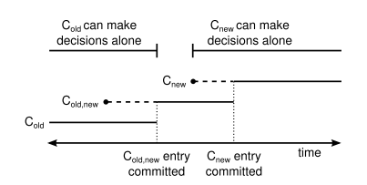

*本文为原创文章，转载请严格遵守[CC BY-NC-SA协议](https://creativecommons.org/licenses/by-nc-sa/4.0/)。*

<!--more-->

## 0. 引言

本文会对etcd/raft中Raft成员变更算法的实现与优化进行分析。这里假定读者阅读过Diego Ongaro的《In Search of an Understandable Consensus Algorithm (Extended Version)》（这里有笔者的[翻译](/posts/paper-reading/raft-extended/)，笔者英语水平一般，欢迎指正。），其中提到的部分，本文中不会做详细的解释。对etcd/raft的总体结构不熟悉的读者，可以先阅读[《深入浅出etcd/raft —— 0x02 etcd/raft总体设计》](/posts/code-reading/etcdraft-made-sample/2-overview/)。



本文不严格区分成员变更（membership changes）与配置变更(configuration chagnes)。



## 1. 成员变更算法

《CONSENSUS: BRIDGING THEORY AND PRACTICE》的*Chapter 4 Cluster membership changes*介绍了两种成员变更算法，一种是一次操作一个节点的简单算法，另一种是联合共识（joint consensus）算法。两种算法都是为了避免由于节点切换配置时间不同导致的同一term出现不只一个leader的问题，如下图所示。


为了本文的连贯性，这里简单地介绍一下这两种算法，详细内容请读者自行阅读《CONSENSUS: BRIDGING THEORY AND PRACTICE》的*Chapter 4 Cluster membership changes*。

简单成员变更算法限制每次只能增加或移除一个节点。这样可以保证新配置与旧配置的quorum至少有一个相同的节点，因为一个节点在同一term仅能给一个节点投票，所以这能避免多主问题。


联合共识算法可以一次变更多个成员，但是需要在进入新配置前先进入一个“联合配置（joint configuration）”，在联合配置的quorum分别需要新配置和旧配置的majority（大多数）节点，以避免多主问题。当联合配置成功提交后，集群可以开始进入新配置。



etcd/raft的`ConfChangeV2`既支持简单的“one at a time”的成员变更算法，也支持完整的联合共识算法。需要注意的是，etcd/raft中的配置的应用时间与论文中的不同。在论文<sup>引文1</sup>中，节点会在追加配置变更日志时应用相应的配置，而在etcd/raft的实现中<sup>引文2</sup>，当节点应用（apply）配置变更日志条目时才会应用相应的配置。etcd/raft在“apply-time”应用新配置的方式，可以保证配置在应用前已被提交，因此不需要论文中提到的回滚旧配置的操作。但是这种方式需要引入新机制来解决影响集群liveness的边际情况下的问题。



这种"apply-time"的方式仍存在一些“liveness”的问题，在编写本文时，etcd社区正在修复这一问题（详见[issue#12359 raft: liveness problems during apply-time configuration change](https://github.com/etcd-io/etcd/issues/12359)）。

本文中的源码基于master分支的[commit#a3174d0](https://github.com/etcd-io/etcd/tree/a3174d0f8ec6ec58827d7d86448bb4df08ae69e4)版本，目前还没有修复这一issue。本文会在issue修复后，基于新版算法进行修改。




另外，需要注意的是，同一时间只能有一个正在进行的配置变更操作，在提议配置变更请求时，如果已经在进行配置变更，那么该提议会被丢弃（被改写成一条无任何意义的日志条目）。



The new configuration takes effect on each server as soon as it is added to that server’s log: the $C_{new}$ entry is replicated to the $C_{new}$ servers, and a majority of the new configuration is used to determine the $C_{new}$ entry’s commitment. This means that servers do not wait for configuration entries to be committed, and each server always uses the latest configuration found in its log.

... ...

As with the single-server configuration change algorithm, each server starts using a new configuration as soon as it stores the configuration in its log.






Note that contrary to Joint Consensus as outlined in the Raft paper, configuration changes become active when they are *applied* to the state machine (not when they are appended to the log).



## 2. etcd/raft配置的实现

etcd/raft实现的配置是按照*joint configuration*组织的，本节笔者将以自底向上的方法介绍etcd/raft中配置的实现。

### 2.1 MajorityConfig

在*joint consensus*中，中间状态$C_{old},C_{new}$的quorum同时需要$C_{old}$和$C_{new}$各自的majority。$C_{old}$或$C_{new}$配置中voter的集合（voter即有投票权的角色，包括candidate、follower、leader，而不包括learner），是通过`MajorityConfig`表示的，`MajorityConfig`还包括了一些统计majority信息的方法。

```go

// MajorityConfig is a set of IDs that uses majority quorums to make decisions.
type MajorityConfig map[uint64]struct{}

```

`MajorityConfig`的实现非常简单，其只是voter节点id的集合，但`MajorityConfig`提供了一些很实用的与majority有关方法，如下表所示（仅给出主要方法）：

| 方法<div style="width: 12em"></div> | 描述 |
| :-: | :- |
| `CommittedIndex(l AckedIndexer) Index` | 根据给定的`AckedIndexer`计算被大多数节点接受了的*commit index* 。 |
| `VoteResult(votes map[uint64]bool) VoteResult` | 根据给定的投票统计计算投票结果。 |

`CommittedIndex`是根据该`MajorityConfig`计算被大多数接受的*commit index*，其参数`AckedIndexer`是一个接口：

```go

// quorum.go

// AckedIndexer allows looking up a commit index for a given ID of a voter
// from a corresponding MajorityConfig.
type AckedIndexer interface {
	AckedIndex(voterID uint64) (idx Index, found bool)
}

// tracker.go

type matchAckIndexer map[uint64]*Progress

// AckedIndex implements IndexLookuper.
func (l matchAckIndexer) AckedIndex(id uint64) (quorum.Index, bool) {
	pr, ok := l[id]
	if !ok {
		return 0, false
	}
	return quorum.Index(pr.Match), true
}

```

`AckedIndexer`接口中只定义了一个方法`AckedIndex`，该方法用来返回给定id的voter的一种索引的值。通过实现该接口与方法，在调用`CommittedIndex`时，可以根据不同的index来计算被大多数接受的*commit index*。上面的源码中给出了*tracker.go*中的一种`AckedIndexer`实现——`matchAckIndexer`，其实现的`AckedIndex`方法返回了voter的*match index*。etcd/raft在计算*commit index*时，就是根据节点的*match index*来计算的。

`CommittedIndex`的实现也很简单，其通过排序来计算第$n/2+1$小的索引，即为被大多数节点接受的最小索引。该方法中还有针对小切片的分配优化，感兴趣的读者可以自行阅读源码，这里不再赘述。

`VoteResult`方法的实现也很简单，其根据参数中的投票情况与该`MajorityConfig`中的voter，计算投票结果。投票结果有三种：`VoteWon`表示赢得投票、`VoteLost`表示输掉投票、`VotePending`表示投票还未完成（既没被大多数接受，也没被大多数拒绝），需要继续等待投票。

### 2.2 JointConfig

`JointConfig`表示*joint consensus*下的配置，即$C_{old}$与$C_{new}$的组合：

```go

// JointConfig is a configuration of two groups of (possibly overlapping)
// majority configurations. Decisions require the support of both majorities.
type JointConfig [2]MajorityConfig

```

为了实现方便，`JointConfig`的元素0表示$C_{new}$或非*joint consensus*状态下的当前配置，元素0表示$C_{old}$，在非*joint consensus*状态下的元素1应是一个空配置。

`JointConfig`提供的方法与`MajorityConfig`几乎一样，其也提供了`CommittedIndex`方法与`VoteResult`方法。

`JointConfig`的`CommittedIndex`方法会获取两个`MajorityConfig`的`CommittedIndex`的返回值（若`MajorityConfig`为空配置，其返回类型最大值），并返回较小的结果，即被$C_{old}$和$C_{new}$都接受的*commit index*。

`JointConfig`的`VoteResult`方法也会获取两个`MajorityConfig`的`VoteResult`，如果二者结果相同可以直接返回，否则如果其中之一为`VoteLost`则直接返回`VoteLost`，否则还无法给出结果，返回`VotePending`。

```go

// VoteResult takes a mapping of voters to yes/no (true/false) votes and returns
// a result indicating whether the vote is pending, lost, or won. A joint quorum
// requires both majority quorums to vote in favor.
func (c JointConfig) VoteResult(votes map[uint64]bool) VoteResult {
	r1 := c[0].VoteResult(votes)
	r2 := c[1].VoteResult(votes)

	if r1 == r2 {
		// If they agree, return the agreed state.
		return r1
	}
	if r1 == VoteLost || r2 == VoteLost {
		// If either config has lost, loss is the only possible outcome.
		return VoteLost
	}
	// One side won, the other one is pending, so the whole outcome is.
	return VotePending
}

```

### 2.3 Config

`Config`记录了全部的成员配置，既包括voter也包括learner。

```go

// Config reflects the configuration tracked in a ProgressTracker.
type Config struct {
	Voters quorum.JointConfig
	// AutoLeave is true if the configuration is joint and a transition to the
	// incoming configuration should be carried out automatically by Raft when
	// this is possible. If false, the configuration will be joint until the
	// application initiates the transition manually.
	AutoLeave bool
	// Learners is a set of IDs corresponding to the learners active in the
	// current configuration.
	//
	// Invariant: Learners and Voters does not intersect, i.e. if a peer is in
	// either half of the joint config, it can't be a learner; if it is a
	// learner it can't be in either half of the joint config. This invariant
	// simplifies the implementation since it allows peers to have clarity about
	// its current role without taking into account joint consensus.
	Learners map[uint64]struct{}
	// When we turn a voter into a learner during a joint consensus transition,
	// we cannot add the learner directly when entering the joint state. This is
	// because this would violate the invariant that the intersection of
	// voters and learners is empty. For example, assume a Voter is removed and
	// immediately re-added as a learner (or in other words, it is demoted):
	//
	// Initially, the configuration will be
	//
	//   voters:   {1 2 3}
	//   learners: {}
	//
	// and we want to demote 3. Entering the joint configuration, we naively get
	//
	//   voters:   {1 2} & {1 2 3}
	//   learners: {3}
	//
	// but this violates the invariant (3 is both voter and learner). Instead,
	// we get
	//
	//   voters:   {1 2} & {1 2 3}
	//   learners: {}
	//   next_learners: {3}
	//
	// Where 3 is now still purely a voter, but we are remembering the intention
	// to make it a learner upon transitioning into the final configuration:
	//
	//   voters:   {1 2}
	//   learners: {3}
	//   next_learners: {}
	//
	// Note that next_learners is not used while adding a learner that is not
	// also a voter in the joint config. In this case, the learner is added
	// right away when entering the joint configuration, so that it is caught up
	// as soon as possible.
	LearnersNext map[uint64]struct{}
}

```

`Config`的`Voter`字段类型即为上文介绍的`JointConfig`，`AutoLeaver`字段是标识*joint consensus*情况下离开*joint configuration*的方式，后文介绍配置变更的实现时会对其进行介绍。`Config`中与learner相关的字段有两个，分别是`Learners`和`LearnsNext`。`Learners`是当前的learner集合，`LearnersNext`是在*joint consensus*情况下，在离开*joint configuration*时需要新加入learner集合的节点。

etcd/raft为了简化配置变更的实现，其配置需要满足一条约束：配置的voter集合与learner集合不能有交集。在*joint consensus*方法下，可能出现如下情况：

$C_{old}$：`voters: {1 2 3}, learners: {}`，$C_{new}$：`voters: {1 2}, learners: {3}`。此时，$C_{new,old}$：`voters: {1 2} & {1 2 3}, learners: {3}`，这违背了上文中的约束。

为此，`Config`中引入了`LearnsNext`字段，在*joint configuration*中，如果新的learn集合与voter集合有冲突，那么先将该learn加入到`LearnerNext`中，在退出*joint consensus*再将该`LearnersNext`中的节点加入到`Learners`中。例如：

1. $C_{old}$：`voters: {1 2 3}, learns: {}, next_learns: {}`
2. $C_{new,old}$：`voters: {1 2} & {1 2 3}, learns: {}, next_learners: {3}`
3. $C_{new}$：`voters: {1 2}, learns: {3}, next_learns: {}`

### 2.4 ProgressTracker

本系列前文中在介绍etcd/raft的选举与日志复制的实现时，其实已经简单接触过了`ProgressTracker`。因为leader用来追踪follower复制进度的字段`Progress`和记录选票的`Vote`字段就在`ProgressTracker`中。

```go

// ProgressTracker tracks the currently active configuration and the information
// known about the nodes and learners in it. In particular, it tracks the match
// index for each peer which in turn allows reasoning about the committed index.
type ProgressTracker struct {
	Config

	Progress ProgressMap

	Votes map[uint64]bool

	MaxInflight int
}

```

`ProgressTracker`提供了如下方法：

| 方法<div style="width: 20em"></div> | 描述 |
| :-: | :- |
| `func MakeProgressTracker(maxInflight int) ProgressTracker` | 新建空配置。 |
| `ConfState() pb.ConfState` | 返回当前激活的配置。 |
| `IsSingleton() bool` | 判断当前配置是否为单节点模式（voter数为0，且不处于*joint configuration*中）。 |
| `Committed() uint64` | 返回被quorum接受的*commit index*。 |
| `Visit(f func(id uint64, pr *Progress))` | 有序遍历追踪的所有进度，并对其执行传入的函数闭包。 |
| `QuorumActive() bool` | 判断是否有达到quorum数量的节点处于活跃状态（用于**Check Quorum**）。 |
| `VoterNodes() []uint64` | 返回有序的voter节点id集合。 |
| `LearnerNodes() []uint64` | 返回有序的learner节点id集合。 |
| `ResetVotes()` | 重置记录的选票。 |
| `RecordVote(id uint64, v bool)` | 记录来自节点`id`的选票。 |
| `TallyVotes() (granted int, rejected int, _ quorum.VoteResult)` | 返回选票中赞同数、反对数、与当前投票结果。 |

## 3. etcd/raft配置变更的实现

etcd/raft中新配置是在*apply-time*生效的，也就是说，如果etcd/raft模块的使用者在处理`Ready`结构体的`CommittedEntries`字段时遇到了实现了`ConfChangeI`接口的消息时（包括`ConfChangeV2`和兼容的旧版本`ConfChange`），需要主动调用`Node`的`ApplyConfChange`方法通知Raft状态机使用新配置。该方法最终会调用`raft`结构体的`applyConfChange`方法，切换到相应的配置。

本节笔者将分析这一流程的实现。

### 3.1 ConfChange类型

在介绍配置变更的实现之前，本节先介绍一下etcd/raft支持的配置变更类型。由于旧版本的配置变更消息`ConfChange`仅支持“one node a time”的简单算法，这里不再赘述，仅介绍`ConfChangeV2`中支持的配置变更类型。

`ConfChangeV2`的`Transition`字段表示切换配置的行为，其支持的行为有3种：

1. `ConfChangeTransitionAuto`（默认）：自动选择行为，当配置变更可以通过简单算法完成时，直接使用简单算法；否则使用`ConfChangeTransitionJointImplicit`行为。
2. `ConfChangeTransitionJointImplicit`：强制使用*joint consensus*，并在适当时间通过`Changes`为空的`ConfChangeV2`消息自动退出*joint consensus*。该方法适用于希望减少*joint consensus*时间且不需要在状态机中保存*joint configuraiont*的程序。
3. `ConfChangeTransitionJointExplicit`：强制使用*joint consensus*，但不会自动退出*joint consensus*，而是需要etcd/raft模块的使用者通过提交`Changes`为空的`ConfChangeV2`消息退出*joint consensus*。该方法适用于希望显式控制配置变更的程序，如自定义了`Context`字段内容的程序。

`ConfChangeV2`的`Changes`字段表示一系列的节点操作，其支持的操作有：

1. `ConfChangeAddNode`：添加新节点。
2. `ConfChangeRemoveNode`：移除节点。
3. `ConfChangeUpdateNode`：用于状态机更新节点url等操作，etcd/raft模块本身不会对节点进行任何操作。
4. `ConfChangeAddLearnerNode`：添加learner节点。

### 3.2 提议ConfChange

```go

		// stepLeader
		// case pb.MsgProp:
		// ... ...

		for i := range m.Entries {
			e := &m.Entries[i]
			var cc pb.ConfChangeI
			if e.Type == pb.EntryConfChange {
				var ccc pb.ConfChange
				if err := ccc.Unmarshal(e.Data); err != nil {
					panic(err)
				}
				cc = ccc
			} else if e.Type == pb.EntryConfChangeV2 {
				var ccc pb.ConfChangeV2
				if err := ccc.Unmarshal(e.Data); err != nil {
					panic(err)
				}
				cc = ccc
			}
			if cc != nil {
				alreadyPending := r.pendingConfIndex > r.raftLog.applied
				alreadyJoint := len(r.prs.Config.Voters[1]) > 0
				wantsLeaveJoint := len(cc.AsV2().Changes) == 0

				var refused string
				if alreadyPending {
					refused = fmt.Sprintf("possible unapplied conf change at index %d (applied to %d)", r.pendingConfIndex, r.raftLog.applied)
				} else if alreadyJoint && !wantsLeaveJoint {
					refused = "must transition out of joint config first"
				} else if !alreadyJoint && wantsLeaveJoint {
					refused = "not in joint state; refusing empty conf change"
				}

				if refused != "" {
					r.logger.Infof("%x ignoring conf change %v at config %s: %s", r.id, cc, r.prs.Config, refused)
					m.Entries[i] = pb.Entry{Type: pb.EntryNormal}
				} else {
					r.pendingConfIndex = r.raftLog.lastIndex() + uint64(i) + 1
				}
			}
		}

		// ... ...

```

在`stepLeader`方法处理`MsgProp`时，如果发现`ConfChange`消息或`ConfChangeV2`消息，会反序列化消息数据并对其进行一些预处理。

1. `alreadyPending`：上一次合法的`ConfChange`还没被应用时为真。
2. `alreadyJoint`：当前配置正处于*joint configuration*时为真。
3. `wantsLeaveJoint`：如果消息（旧格式的消息会转为`V2`处理）的`Changes`字段为空时，说明该消息为用于退出*joint configuration*而转到$C_{new}$的消息。

根据以上3个条件，拒绝该`ConfChange`的情况有3种：

1. `alreadyPending`：Raft同一时间只能有一个未被提交的`ConfChange`，因此拒绝新提议。
2. `alreadyJoint`为真但`wantsLeaveJoint`为假：处于*joint configuration*的集群必须先退出*joint configuration*并转为$C_{new}，才能开始新的`ConfChange`，因此拒绝提议。
3. `alreadyJoint`为假单`wantsLeaveJoint`为真，未处于*joint configuration*，忽略不做任何变化空`ConfChange`消息。

对需要拒绝的提议的处理非常简单，只需要将该日志条目替换为没有任何意义的普通空日志条目`pb.Entry{Type: pb.EntryNormal}`即可。

而对于合法的`ConfChange`，除了将其追加到日志中外，还需要修改`raft`结构体的`pendingConfIndex`字段，将其置为$[上一条ConfChange.Index, 当前ConfChange.Index)$的值<sup>引文3</sup>（这里置为了处理该`MsgProp`之前的最后一条日志的index），以供之后遇到`ConfChange`消息时判断当前`ConfChange`是否已经被应用。



*pendingConfIndex*字段注释：

Only one conf change may be pending (in the log, but not yet applied) at a time. This is enforced via pendingConfIndex, which is set to a value >= the log index of the latest pending configuration change (if any). Config changes are only allowed to be proposed if the leader's applied index is greater than this value.



### 3.3 应用ConfChange

上文中已经提到，etcd/raft需要使用者自行调用`Node`的`ApplyConfChange`方法来应用新配置，该方法最终会调用`raft`结构体的`applyConfChange`方法，其源码如下：

```go

func (r *raft) applyConfChange(cc pb.ConfChangeV2) pb.ConfState {
	cfg, prs, err := func() (tracker.Config, tracker.ProgressMap, error) {
		changer := confchange.Changer{
			Tracker:   r.prs,
			LastIndex: r.raftLog.lastIndex(),
		}
		if cc.LeaveJoint() {
			return changer.LeaveJoint()
		} else if autoLeave, ok := cc.EnterJoint(); ok {
			return changer.EnterJoint(autoLeave, cc.Changes...)
		}
		return changer.Simple(cc.Changes...)
	}()

	if err != nil {
		// TODO(tbg): return the error to the caller.
		panic(err)
	}

	return r.switchToConfig(cfg, prs)
}

```

该方法首先通过检查`ConfChangeV2`的行为与变更内容，并通过`confChange.Changer`创建新的配置与用于进度跟踪的字典，最后调用`switchToConfig`方法切换到新配置并更新进度跟踪映射。其中`confChange.Changer`主要用于校验`ConfChangeV2`是否合法并生成新配置等，感兴趣的读者可以自行阅读其源码实现，本文不再赘述。下面来分析`switchToConfig`的实现：

```go

// switchToConfig reconfigures this node to use the provided configuration. It
// updates the in-memory state and, when necessary, carries out additional
// actions such as reacting to the removal of nodes or changed quorum
// requirements.
//
// The inputs usually result from restoring a ConfState or applying a ConfChange.
func (r *raft) switchToConfig(cfg tracker.Config, prs tracker.ProgressMap) pb.ConfState {
	r.prs.Config = cfg
	r.prs.Progress = prs

	r.logger.Infof("%x switched to configuration %s", r.id, r.prs.Config)
	cs := r.prs.ConfState()
	pr, ok := r.prs.Progress[r.id]

	// Update whether the node itself is a learner, resetting to false when the
	// node is removed.
	r.isLearner = ok && pr.IsLearner

	if (!ok || r.isLearner) && r.state == StateLeader {
		// This node is leader and was removed or demoted. We prevent demotions
		// at the time writing but hypothetically we handle them the same way as
		// removing the leader: stepping down into the next Term.
		//
		// TODO(tbg): step down (for sanity) and ask follower with largest Match
		// to TimeoutNow (to avoid interruption). This might still drop some
		// proposals but it's better than nothing.
		//
		// TODO(tbg): test this branch. It is untested at the time of writing.
		return cs
	}

	// The remaining steps only make sense if this node is the leader and there
	// are other nodes.
	if r.state != StateLeader || len(cs.Voters) == 0 {
		return cs
	}

	if r.maybeCommit() {
		// If the configuration change means that more entries are committed now,
		// broadcast/append to everyone in the updated config.
		r.bcastAppend()
	} else {
		// Otherwise, still probe the newly added replicas; there's no reason to
		// let them wait out a heartbeat interval (or the next incoming
		// proposal).
		r.prs.Visit(func(id uint64, pr *tracker.Progress) {
			r.maybeSendAppend(id, false /* sendIfEmpty */)
		})
	}
	// If the the leadTransferee was removed or demoted, abort the leadership transfer.
	if _, tOK := r.prs.Config.Voters.IDs()[r.leadTransferee]; !tOK && r.leadTransferee != 0 {
		r.abortLeaderTransfer()
	}

	return cs
}

```

该方法会将新的`Config`与`ProgressMap`应用到`ProgressTracker`。应用后，获取激活的新状态，并检查该节点是否在新的`ProgressMap`。如果节点不造`ProgressMap`中，说明节点已被移除集群。根据不同的新状态，执行如下操作：

1. 如果该节点原来为leader，但在新配置中成为了learner或被移除了集群，那么直接返回，该节点会在下个term退位且无法再发起投票请求。此时状态机可以停止`Node`。
2. 如果节点原来不是leader节点，或新配置中不包含任何voter，那么该节点同样不需要进行任何操作，直接返回。
3. 否则，该节点原来为leader且继续运行。需要执行一些操作。

如果该节点原来为leader且继续运行，那么按需广播日志复制请求与*commit index*。最后，该leader检查此时是否在进行**leader transfer**，如果正在进行**leader transfer**但目标节点已被从配置中移除，那么终止**leader transfer**。

### 3.4 AutoLeave

当`ConfChange`的类型为`ConfChangeTransitionAuto`或`ConfChangeTransitionJointImplicit`时，退出*joint configuration*由etcd/raft自动实现。由于配置是在用户处理`Ready`结构体时主动调用`ConfChange`方法时生效的，因此实现“auto leave”的代码在`Advance`方法的实现`advance`方法中，即`ConfChange`已被用户应用后。在`advance`方法中，有如下代码：

```go

		if r.prs.Config.AutoLeave && oldApplied <= r.pendingConfIndex && newApplied >= r.pendingConfIndex && r.state == StateLeader {
			// If the current (and most recent, at least for this leader's term)
			// configuration should be auto-left, initiate that now. We use a
			// nil Data which unmarshals into an empty ConfChangeV2 and has the
			// benefit that appendEntry can never refuse it based on its size
			// (which registers as zero).
			ent := pb.Entry{
				Type: pb.EntryConfChangeV2,
				Data: nil,
			}
			// There's no way in which this proposal should be able to be rejected.
			if !r.appendEntry(ent) {
				panic("refused un-refusable auto-leaving ConfChangeV2")
			}
			r.pendingConfIndex = r.raftLog.lastIndex()
			r.logger.Infof("initiating automatic transition out of joint configuration %s", r.prs.Config)
		}

```

该方法判断调用`Advance`方法前处理的最后一个`Ready`中是否包含合法的`ConfChange`，如果有合法的`ConfChange`且当前配置开启了`AutoLeave`，同时该节点是leader的话，那么向其日志中追加一条空的`ConfChangeV2`消息，以用来触发退出*joint configuration*的操作。


### 3.5 补充说明

在本系列之前的文章中，为了避免提前引入过多概念，在分析源码时省略了一些与配置相关的部分。在阅读完本文后，相信读者已经可以理解之前省略的代码中与成员变更相关的部分了，因此这里不再对之前省略的代码进行分析，读者可以找到自己之前不理解的地方自行阅读分析。

### 4. 总结

本文介绍了etcd/raft中才用的Raft成员变更算法的实现，这部分etcd/raft的改动不是很多，因此更重要的是熟悉论文中的方法。同样，成员变更操作很多零碎的代码也分散在etcd/raft的实现中的各个位置，这里建议读者按照自己的节奏阅读源码，将本文作为参考。

## 参考文献

<div class="reference">

[1] Ongaro D, Ousterhout J. In search of an understandable consensus algorithm[C]//2014 {USENIX} Annual Technical Conference ({USENIX}{ATC} 14). 2014: 305-319.

[2] Ongaro D, Ousterhout J. In search of an understandable consensus algorithm (extended version)[J]. Retrieved July, 2016, 20: 2018.

[3] Ongaro D. Consensus: Bridging theory and practice[D]. Stanford University, 2014.

</div>