*本文为原创文章，转载请严格遵守[CC BY-NC-SA协议](https://creativecommons.org/licenses/by-nc-sa/4.0/)。*

## 0. 前言

在深入学习etcd中raft的源码之前，首先应该学会使用etcd的raft模块。幸运的是，etcd官方提供了一个基于etcd/raft的简单kvstore的实现，该实现在etcd/contrib/raftexample下。raftexample使用了raft模块的一些基本功能，实现了简单的分布式kv存储。该项目的根目录下还提供了该分布式kv存储示例的使用方法和基本设计思路，这里建议读者先按照其`READ.md`完整运行一遍示例，再继续接下来的学习。

## 1. raftexample设计思路

该项目的`README.md`的`Design`一节简单介绍了其设计思路：

> 注意：
> 
> 为了叙述的一致性，本文将“submit”或“issue”译为“提出”，以与raft协议中的“提交（commit）”进行区分。


> raftexample由三个组件组成：由raft支持的kv存储、REST API服务器、和基于etcd/raft实现的共识服务器。
> 
> 由raft支持的kv存储是一个持有所有已提交的键值对的map。该存储建立了raft服务器和REST服务器间的通信桥梁。键值对的更新通过该存储提交给raft服务器。当raft服务器报告有更新被提交后，该存储便会更新其map。
> 
> REST服务器通过访问由raft支持的kv存储的方式暴露出当前raft达成的共识。
> 
> GET命令会在存储中查找键，如果键存在则会返回该键的值。
> 
> 一个带键值的PUT命令会向存储提出一个更新提议。
> 
> raft服务器和其集群中的对等节点（peer）会参与共识的达成。
> 
> 当REST服务器提交提议时，raft服务器会将该提议发送给其对等节点。
> 
> 当raft达成共识时，服务器会通过一个提交信道来发布所有已提交的更新。
> 
> 在raftexample中，提交信道的消费者是键值存储。

简单来说，raftexample的设计可以用一张图来表示。



接下来，我们自下而上地学习raftexample的实现。

## 2. httpapi

`httpapi.go`是REST服务器的实现。这并不是我们关注的重点。我们需要关注的只是其通过`kvstore`中的哪些方法来提供服务。

```go
func (h *httpKVAPI) ServeHTTP(w http.ResponseWriter, r *http.Request) {
	//... ...
	switch {
	case r.Method == "PUT":
		// ... ...
		h.store.Propose(key, string(v))    
		// ... ...
	case r.Method == "GET":
		if v, ok := h.store.Lookup(key); ok {
			// ... ...
		}
		// ... ...
	case r.Method == "POST":
		url, err := ioutil.ReadAll(r.Body)
		// ... ...
		cc := raftpb.ConfChange{
			Type:    raftpb.ConfChangeAddNode,
			NodeID:  nodeId,
			Context: url,
		}
		h.confChangeC <- cc
		// ... ...
	case r.Method == "DELETE":
		// ... ...
		cc := raftpb.ConfChange{
			Type:   raftpb.ConfChangeRemoveNode,
			NodeID: nodeId,
		}
		h.confChangeC <- cc
		// ... ...
	default:
		// ... ...
	}
}
```

上面的代码中，省略的一些对消息的序列化与反序列化及对性能的小优化，我们主要关注其通过哪些方法为请求提供服务。

| 请求方法 | 处理方式 | 功能 |
| - | - | - |
| PUT | kvstore.Propose(k,v) | 更新键值对 |
| GET | kvstore.Lookup(k) | 查找键对应的值 |
| POST | confChangeC <- cc | 将新节点加入集群 |
| DELETE | confChangeC <- cc | 从集群中移除节点 |

从表中我们可以看出，与键值对相关的请求都会通过`kvstore`提供的方法处理，而有关集群配置的请求则是会编码为`etcd/raft/v3/raftpb`中proto定义的消息格式，直接传入`confChangeC`信道。从`main.go`可以看出，该信道的消费者是raft模块，我们在介绍该模块时会详细介绍其作用。（因此，前文中给出的raftexample设计图并不准确，REST服务器会将有关集群配置变更的消息直接交给raft服务器处理。）

## 3. kvstore

`kvstore`是连接raft服务器与REST服务器的桥梁，是实现键值存储功能的重要组件，但是其实现很简单。接下来，我们来看看`kvstore.go`中的实现。

`kvstore.go`中`kvstore`结构体非常简单，其只有4个字段。

```go
// a key-value store backed by raft
type kvstore struct {
	proposeC    chan<- string // channel for proposing updates
	mu          sync.RWMutex
	kvStore     map[string]string // current committed key-value pairs
	snapshotter *snap.Snapshotter
}
```

其中，`proposeC`信道我们将在之后讲解。除此之外，该结构体中只有一个读写锁`mu`、一个由map实现的键值存储`kvStore`，和一个etcd提供的默认快照管理模块实现的指针`snapshotter`。

目前，从`kvstore`中，我们看不到多少有用的信息。接下来，我们关注一下创建kv存储的函数。

```go
func newKVStore(snapshotter *snap.Snapshotter, proposeC chan<- string, commitC <-chan *string, errorC <-chan error) *kvstore {
	s := &kvstore{proposeC: proposeC, kvStore: make(map[string]string), snapshotter: snapshotter}
	// replay log into key-value map
	s.readCommits(commitC, errorC)
	// read commits from raft into kvStore map until error
	go s.readCommits(commitC, errorC)
	return s
}
```

`newKVStore`函数的参数除了`snapshotter`外，`proposeC`、`commitC`、`errorC`均为信道。其中`propseC`为输入信道，`commitC`和`errorC`为输出信道。我们可以推断出，`kvstore`会通过`proposeC`与raft模块交互，并通过`commitC`与`errorC`接收来自raft模块的消息。（可以在`main.go`中证实，这里不再赘述。）这种方式在etcd的实现中随处可见，因此对于go语言和channel不是很熟悉的小伙伴建议预先学习一下相关概念与使用方法。（当熟悉了这种设计后，便会发现go语言并发编程的魅力所在。）

`newKVStore`中的逻辑也非常简单，将传入的参数写入`kvstore`结构体相应的字段中。然后先调用一次`kvstore`的`readCommits`方法，等待raft模块重放日志完成的信号；然后启动一个goroutine来循环处理来自raft模块发送过来的消息。

`readCommits`方法稍有些复杂，我们先来看看其它较为简单的部分。


```go
func (s *kvstore) Lookup(key string) (string, bool) {
	s.mu.RLock()
	defer s.mu.RUnlock()
	v, ok := s.kvStore[key]
	return v, ok
}

func (s *kvstore) Propose(k string, v string) {
	var buf bytes.Buffer
	if err := gob.NewEncoder(&buf).Encode(kv{k, v}); err != nil {
		log.Fatal(err)
	}
	s.proposeC <- buf.String()
}

func (s *kvstore) getSnapshot() ([]byte, error) {
	s.mu.RLock()
	defer s.mu.RUnlock()
	return json.Marshal(s.kvStore)
}

func (s *kvstore) recoverFromSnapshot(snapshot []byte) error {
	var store map[string]string
	if err := json.Unmarshal(snapshot, &store); err != nil {
		return err
	}
	s.mu.Lock()
	defer s.mu.Unlock()
	s.kvStore = store
	return nil
}
```

`Lookup`方法会通过读锁来访问其用来记录键值的map，防止查找时数据被修改返回错误的结果。`Propose`方法将要更新的键值对编码为string，并传入`proposeC`信道，交给raft模块处理。`getSnapshot`和`recoverFromSnapshot`方法分别将记录键值的map序列化与反序列化，并加锁防止争用。

```go
func (s *kvstore) readCommits(commitC <-chan *string, errorC <-chan error) {
	for data := range commitC {
		if data == nil {
			// done replaying log; new data incoming
			// OR signaled to load snapshot
			snapshot, err := s.snapshotter.Load()
			if err == snap.ErrNoSnapshot {
				return
			}
			if err != nil {
				log.Panic(err)
			}
			log.Printf("loading snapshot at term %d and index %d", snapshot.Metadata.Term, snapshot.Metadata.Index)
			if err := s.recoverFromSnapshot(snapshot.Data); err != nil {
				log.Panic(err)
			}
			continue
		}

		var dataKv kv
		dec := gob.NewDecoder(bytes.NewBufferString(*data))
		if err := dec.Decode(&dataKv); err != nil {
			log.Fatalf("raftexample: could not decode message (%v)", err)
		}
		s.mu.Lock()
		s.kvStore[dataKv.Key] = dataKv.Val
		s.mu.Unlock()
	}
	if err, ok := <-errorC; ok {
		log.Fatal(err)
	}
}
```

接下来，我们深入`readCommits`的实现。该方法会循环遍历`commitC`信道中raft模块传来的消息。从`commitC`中收到的消息可能为nil或非nil。因为raftexample功能简单，因此其通过nil表示raft模块完成重放日志的信号或用来通知`kvstore`从上一个快照恢复的信号。

当`data`为nil时，该方法会通过`kvstore`的快照管理模块`snapshotter`尝试加载上一个快照。如果快照存在，说明这是通知其恢复快照的信号，接下来会调用`recoverFromSnapshot`方法从该快照中恢复，随后进入下一次循环，等待日志重放完成的信号；如果没找到快照，那么说明这是raft模块通知其日志重放完成的信号，因此直接返回。

> 注意：
> 
> 这段代码实际上有bug，结合`raft.go`中`replayWAL`的实现，可以发现当节点从已有快照的状态重启时，`newKVStore`中第一个`readCommits`循环无法正确跳出，导致其无法执行`main`函数中后续逻辑。截止2020-12-12T20:21:48+08:00时，该bug仍未修复。
> 
> 为了便于读者理解raftexample其它部分的实现，在下文中不再分析该bug的产生原因。

当`data`非nil时，说明这是raft模块发布的已经通过共识提交了的键值对。此时，先从字节数组数据中反序列化出键值对，并加锁修改map中的键值对。

我们可以看到，`kvstore`中基本上没有多少与raft相关的处理逻辑，大部分代码是对键值存储抽象本身的实现。

## 4. raft

最后，我们来学习raft服务器的实现，这也是raftexample中最重要也是最需要好好学习的部分。

raft服务器的实现在`raft.go`中，其对etcd/raft提供的接口进行了一层封装，以便于`kvstore`使用。

### 4.1 raftNode结构体

在raftexample中，raft服务器被封装成了一个`raftNode`结构体。我们先来看看该结构体中的字段内容。

```go
// A key-value stream backed by raft
type raftNode struct {
	proposeC    <-chan string            // proposed messages (k,v)
	confChangeC <-chan raftpb.ConfChange // proposed cluster config changes
	commitC     chan<- *string           // entries committed to log (k,v)
	errorC      chan<- error             // errors from raft session

	id          int      // client ID for raft session
	peers       []string // raft peer URLs
	join        bool     // node is joining an existing cluster
	waldir      string   // path to WAL directory
	snapdir     string   // path to snapshot directory
	getSnapshot func() ([]byte, error)
	lastIndex   uint64 // index of log at start

	confState     raftpb.ConfState
	snapshotIndex uint64
	appliedIndex  uint64

	// raft backing for the commit/error channel
	node        raft.Node
	raftStorage *raft.MemoryStorage
	wal         *wal.WAL

	snapshotter      *snap.Snapshotter
	snapshotterReady chan *snap.Snapshotter // signals when snapshotter is ready

	snapCount uint64
	transport *rafthttp.Transport
	stopc     chan struct{} // signals proposal channel closed
	httpstopc chan struct{} // signals http server to shutdown
	httpdonec chan struct{} // signals http server shutdown complete
}
```

在结构体中，有4个用于与其它组件交互的信道：

| 信道 | 描述 |
| - | - |
| proposeC <-chan string | 接收来自其它组件传入的需要通过raft达成共识的普通提议。 |
| confChangeC <-chan raftpb.ConfChange | 接收来自其它组件的需要通过raft达成共识的集群变更提议。 |
| commitC chan<- *string | 用来已通过raft达成共识的已提交的提议通知给其它组件的信道。 |
| errorC chan<- error | 用来将错误报告给其它组件的信道。 |

结构体中，还有一些用来记录节点信息的字段：

| 字段 | 描述 |
| - | - |
| id int| 节点id，同样也作为raft会话中的client id。 |
| peer []string | 对等raft节点的url。 |
| join bool | 如果该节点是以加入已有集群的方式启动，那么该值为true；否则是false。 |
| waldir string | 预写日志（Write Ahead Log，WAL）的路径。 |
| snapdir stirng | 保存快照的目录路径 |
| getSnapshot func()([]byte, error) | 获取快照的方法签名。 |
| lastIndex uint64 | 节点启动重启后会先恢复状态，其恢复到的状态的最后一条日志的索引。 |
| confState raftpb.ConfState | 集群配置状态（详见其声明）。 |
| snapshotIndex uint64 | 快照中的状态下最后一条日志的索引。 |
| appliedIndex uint64 | 已应用的最后一条日志的索引。 |

在结构体中，还保存了etcd/raft提供的接口与其所需的相关组件：

| 字段 | 描述 |
| - | - |
| node raft.Node | etcd/raft的核心接口，对于一个最简单的实现来说，开发者只需要与该接口打交道即可实现基于raft的服务。 |
| raftStorage *raft.MemoryStorage | 用来保存raft状态的接口，etcd/raft/storage.go中定义了etcd/raft模块所需的稳定存储接口，并提供了一个实现了该接口的内存存储`MemoryStorage`<sup>注1</sup>，raftexample中就使用了该实现。 |
| wal *wal.WAL | 预写日志实现，raftexample直接使用了etcd/wal模块中的实现。 |
| snapshotter *snap.Snapshotter | 快照管理器的指针 |
| snapshotterReady chan *snap.Snapshotter | 一个用来发送snapshotter加载完毕的信号的“一次性”信道。因为snapshotter的创建对于新建raftNode来说是一个异步的过程，因此需要通过该信道来通知创建者snapshotter已经加载完成。 |
| snapCount uint64 | 当wal中的日志超过该值时，触发快照操作并压缩日志。 |
| transport *rafthttp.Transport | etcd/raft模块通信时使用的接口。同样，这里使用了基于http的默认实现。 |

> 注 1：
>
> etcd/raft中的`Storage`接口和`Transport`接口让用户能够根据需求自定义稳定存储模块与通信模块。
> 
> 使用`Storage`存储的数据需要被稳定存储，也就是说，即使服务器因掉电等问题关机，在服务器重启后其也能够恢复到掉电前的最终状态。有些读者可能会有疑惑，这里的raftexample使用的是`MemoryStorage`，而内存是易失存储，为什么可以当做稳定存储使用？这是因为在raftexample的实现中，每次重启时都会通过快照和预写日志恢复`MemoryStorage`，而快照和预写日志是保存在稳定存储上的。这样，通过快照、预写日志、`MemoryStorage`的结合，可以实现稳定存储。这样做的好处之一是，预写日志是仅追加（Append-Only）的且快照写入的是连续的空间，这样可以减少对稳定存储的随机写入，提高系统吞吐量。

此外，在结构体中，还有一些通过`chan struct{}`信道实现的信号量：

| 信号 | 描述 |
| - | - |
| stopc | 提议信道关闭信号 |
| httpstopc | 通知用于raft通信的http服务器关闭的信号 |
| httpdonec | 用于raft通信的http服务器关闭的信号 |

为了方便不熟悉go语言并发编程或channel的读者理解，下面将简单介绍这种信号量的设计与意义。

### 4.2 go语言中将struct\{\}信道用作信号的tips

这里为那些对go语言并发编程或channel使用不熟悉的读者简单介绍一下这种信号设计的使用方式。

首先，我们需要了解的是，在go语言中，无缓冲信道的读写是阻塞的。只有当在不同goroutine的生产者和消费者分别通过信道写入和读取时，它们所在的goroutine才能继续执行：

```go

c := make(chan int)

go func(){
  c <- 1 // block until there is a consumer
}()

go func(){
  <- c // block until there is a producer
}

```

然而，在读取被关闭的信道时，该信道会立即返回空值（如果采用两个变量接收信道的值，第二个布尔变量的值为false）。

```go
close(c)
msg, ok := <- c // return immediately, msg is a empty value, ok is false
```

假设我们需要循环等待来自一个或多个无缓冲信道的消息，且需要在想要关闭程序时能够退出循环。如果我们通过基于一个标识符的方式判断是否需要退出循环，我们需要这样编写代码：

```go
// flag : false -> break loop

for {
  if !flag {
    break
  }
  select {
  case <- c1:
    // ... ...
  case <- c2:
    // ... ...
  }
}
```

这种写法实际上是有问题的。在每次循环中，当if判断后会执行select，此时当前goroutine会阻塞，直到有一个信道可以操作。假如在当前goroutine进入select时将flag置为了false，此时，该goroutine无法立刻检测到flag的变化，因此需要等到下一次循环后才能退出循环。

显然，这不是我们想要的行为。我们希望当我们想要关闭时，如果该goroutine正阻塞在select中时，能够立即退出。此时，我们只需要通过一个`chan struct{}`信道来表示该信号接收器。上面这段代码可以改写为：

```go

// doneC : chan struct{}

for {
  select {
  case <- doneC:
    break
  case <- c1:
    // ... ...
  case <- c2:
    // ... ...
  }
}
```

此时，如想要通知该goroutine退出循环，只需要关闭`doneC`。在前文中我们提到，当读取已关闭的信道时，其会立即返回一个空值。因此，即使当前的goroutine阻塞在select中，一旦`doneC`被关闭，该select会进入`case <- doneC`的分支中，退出循环。

在`raft.go`中和etcd中，都有很多这种传递信号的方式。这一方式的另一个好处是，只要关闭一次信道，所有等待该信号的select语句都会进入该信号对应的分支。我们会在后文的例子中看到将`chan struct{}`信道作为信号使用的例子。

### 4.3 raftNode的创建与启动

在创建raftNode时，需要提供节点`id`、对等节点url`peers`、是否是要加入已存在的集群`join`、获取快照的函数签名`getSnapshot`、提议信道`proposeC`、配置变更提议信道`confChangeC`这些参数。

```go
// newRaftNode initiates a raft instance and returns a committed log entry
// channel and error channel. Proposals for log updates are sent over the
// provided the proposal channel. All log entries are replayed over the
// commit channel, followed by a nil message (to indicate the channel is
// current), then new log entries. To shutdown, close proposeC and read errorC.
func newRaftNode(id int, peers []string, join bool, getSnapshot func() ([]byte, error), proposeC <-chan string,
	confChangeC <-chan raftpb.ConfChange) (<-chan *string, <-chan error, <-chan *snap.Snapshotter) {

	commitC := make(chan *string)
	errorC := make(chan error)

	rc := &raftNode{
		proposeC:    proposeC,
		confChangeC: confChangeC,
		commitC:     commitC,
		errorC:      errorC,
		id:          id,
		peers:       peers,
		join:        join,
		waldir:      fmt.Sprintf("raftexample-%d", id),
		snapdir:     fmt.Sprintf("raftexample-%d-snap", id),
		getSnapshot: getSnapshot,
		snapCount:   defaultSnapshotCount,
		stopc:       make(chan struct{}),
		httpstopc:   make(chan struct{}),
		httpdonec:   make(chan struct{}),

		snapshotterReady: make(chan *snap.Snapshotter, 1),
		// rest of structure populated after WAL replay
	}
	go rc.startRaft()
	return commitC, errorC, rc.snapshotterReady
}
```

在`newRaftNode`函数中，仅初始化了`raftNode`的部分参数，其余的参数会在重放预写日志后配置。随后，该函数启动了一个协程，该协程调用了`raftNode`的`startRaft()`方法来启动raft节点。当前函数会将raft模块用来通知已提交的提议的信道、报错信道、和快照管理器加载完成信号的信道返回给调用者。

接下来，我们跟随该方法进入`raftNode.startRaft()`方法中。

```go
func (rc *raftNode) startRaft() {
	if !fileutil.Exist(rc.snapdir) {
		if err := os.Mkdir(rc.snapdir, 0750); err != nil {
			log.Fatalf("raftexample: cannot create dir for snapshot (%v)", err)
		}
	}
	rc.snapshotter = snap.New(zap.NewExample(), rc.snapdir)
	rc.snapshotterReady <- rc.snapshotter

	oldwal := wal.Exist(rc.waldir)
	rc.wal = rc.replayWAL()

	rpeers := make([]raft.Peer, len(rc.peers))
	for i := range rpeers {
		rpeers[i] = raft.Peer{ID: uint64(i + 1)}
	}
	c := &raft.Config{
		ID:                        uint64(rc.id),
		ElectionTick:              10,
		HeartbeatTick:             1,
		Storage:                   rc.raftStorage,
		MaxSizePerMsg:             1024 * 1024,
		MaxInflightMsgs:           256,
		MaxUncommittedEntriesSize: 1 << 30,
	}

	if oldwal {
		rc.node = raft.RestartNode(c)
	} else {
		startPeers := rpeers
		if rc.join {
			startPeers = nil
		}
		rc.node = raft.StartNode(c, startPeers)
	}

	rc.transport = &rafthttp.Transport{
		Logger:      zap.NewExample(),
		ID:          types.ID(rc.id),
		ClusterID:   0x1000,
		Raft:        rc,
		ServerStats: stats.NewServerStats("", ""),
		LeaderStats: stats.NewLeaderStats(zap.NewExample(), strconv.Itoa(rc.id)),
		ErrorC:      make(chan error),
	}

	rc.transport.Start()
	for i := range rc.peers {
		if i+1 != rc.id {
			rc.transport.AddPeer(types.ID(i+1), []string{rc.peers[i]})
		}
	}

	go rc.serveRaft()
	go rc.serveChannels()
}
```

`startRaft`方法虽然看上去很长，但是实现的功能很简单。

首先，`startRaft`方法检查快照目录是否存在，如果不存在为其创建目录。然后创建基于该目录的快照管理器。创建完成后，向`snapshotterReady`信道写入该快照管理器，通知其快照管理器已经创建完成。

接着，程序检查是否有旧的预写日志存在，并重放旧的预写日志，重放代码在下文中会进一步分析。

在重放完成后，程序设置了etcd/raft模块所需的配置，并从该配置上启动或重启节点（取决于有没有旧的预写日志文件）。`etcd/raft`中的`raft.StartNode`和`raft.RestartNode`函数分别会根据配置启动或重启raft服务器节点，并返回一个`Node`接口的实例。正如前文中提到的，`Node`接口是开发者依赖etcd/raft实现时唯一需要与其打交道的接口。程序将`Node`接口的实例记录在了`raftNode`的`node`字段中。

在`node`创建完成后，程序配置并开启了通信模块，开始与集群中的其它raft节点通信。

在一切接续后，程序启动了两个goroutine，分别是`raftNode.serveRaft()`和`raftNode.serveChannels()`。其中`raftNode.serveRaft()`用来监听来自其它raft节点的消息，消息的处理主要在`Transport`接口的实现中编写，因此在这里不对其进行详细的分析，感兴趣的读者可以自行参考源码中的实现；`raftNode.serveChannels()`用来处理`raftNode`中各种信道，后文会对其进行详细分析。

下面，我们先来分析一下重放预写日志的逻辑。

```go

// replayWAL replays WAL entries into the raft instance.
func (rc *raftNode) replayWAL() *wal.WAL {
	log.Printf("replaying WAL of member %d", rc.id)
	snapshot := rc.loadSnapshot()
	w := rc.openWAL(snapshot)
	_, st, ents, err := w.ReadAll()
	if err != nil {
		log.Fatalf("raftexample: failed to read WAL (%v)", err)
	}
	rc.raftStorage = raft.NewMemoryStorage()
	if snapshot != nil {
		rc.raftStorage.ApplySnapshot(*snapshot)
	}
	rc.raftStorage.SetHardState(st)

	// append to storage so raft starts at the right place in log
	rc.raftStorage.Append(ents)
	// send nil once lastIndex is published so client knows commit channel is current
	if len(ents) > 0 {
		rc.lastIndex = ents[len(ents)-1].Index
	} else {
		rc.commitC <- nil
	}
	return w
}

```

`replayWAL`方法为`raftNode`重放其预写日志并返回日志文件。首先该方法会通过`raftNode.loadSnapshot()`方法加载快照，如果快照该方法不存在会返回`nil`。接着，通过`raftNode.openWAL(snapshot)`方法打开预写日志。该方法会根据快照中的日志元数据（这里的元数据与论文中的一样，记录了快照覆盖的最后一个日志条目的index和term）打开相应的预写日志，如果快照不存在，则会为打开或创建一个从初始状态开始的预写日志（当节点第一次启动时，既没有快照文件又没有预写日志文件，此时会为其创建预写日志文件；而节点是重启但重启前没有记录过日志，则会为其打开已有的从初始状态开始的预写日志）。之后，程序将快照应用到raft的存储（`MemoryStorage`）中，并将预写日志中记录的硬状态（`HardState`）应用到存储中（硬状态是会被持久化的状态，etcd/raft对论文中的实现进行了优化，因此保存的状态稍有不同。本文目的是通过示例介绍etcd/raft模块的简单使用方式，给读者对etcd中raft实现的基本印象，其实现机制会在后续的文章中分析）。

除了快照之外，重放时还需要将预写日志中的日志条目应用到存储中（快照之后的持久化状态）。如果预写日志中没有条目，说明节点重启前的最终状态就是快照的状态（对于第一次启动的来说则为初始状态），此时会通过向`commitC`信道写入`nil`值通知`kvstore`已经完成日志的重放；而如果预写日志中有条目，则这些日志需要被重放，为了复用代码，这部分日志的重放逻辑没有在`replayWAL`中实现，在`replayWAL`中仅将这部分日志的最后一个日志条目的`Index`记录到`raftNode.lastIndex`中。在应用日志条目的代码中，程序会检查应用的日志的`Index`是否等于`raftNode.lastIndex`，如果相等，说明旧日志重放完毕，然后`commitC`信道写入`nil`值通知`kvstore`已经完成日志的重放。

### 4.4 信道的处理

`raftNode.serveChannels()`是raft服务器用来处理各种信道的输入输出的方法，也是与etcd/raft模块中`Node`接口的实现交互的方法。

`serverChannels()`方法可以分为两个部分，该方法本身会循环处理raft有关的逻辑，如处理定时器信号驱动`Node`、处理`Node`传入的`Ready`结构体、处理通信模块报告的错误或停止信号灯等；该方法还启动了一个goroutine，该goroutine中循环处理来自`proposeC`和`confChangeC`两个信道的消息。

在这两部分开始前，该方法先做了一些初始化。

```go

func (rc *raftNode) serveChannels() {
	snap, err := rc.raftStorage.Snapshot()
	if err != nil {
		panic(err)
	}
	rc.confState = snap.Metadata.ConfState
	rc.snapshotIndex = snap.Metadata.Index
	rc.appliedIndex = snap.Metadata.Index

	defer rc.wal.Close()

	ticker := time.NewTicker(100 * time.Millisecond)
	defer ticker.Stop()

	// ... ...

}
```
首先，该方法从当前的快照的元数据设置`raftNode`的相关字段，并设置一个每100毫秒产生一个信号的循环定时器。`serveChannels`的循环会根据这个信号调用`Node`接口的`Tick()`方法，驱动`Node`执行。

接下来，我们先来看`serveChannels`中启动的用来处理来自`proposeC`和`confChangeC`两个信道的消息的goroutine。

```go
func (rc *raftNode) serveChannels() {

	// ... ...

	// send proposals over raft
	go func() {
		confChangeCount := uint64(0)

		for rc.proposeC != nil && rc.confChangeC != nil {
			select {
			case prop, ok := <-rc.proposeC:
				if !ok {
					rc.proposeC = nil
				} else {
					// blocks until accepted by raft state machine
					rc.node.Propose(context.TODO(), []byte(prop))
				}

			case cc, ok := <-rc.confChangeC:
				if !ok {
					rc.confChangeC = nil
				} else {
					confChangeCount++
					cc.ID = confChangeCount
					rc.node.ProposeConfChange(context.TODO(), cc)
				}
			}
		}
		// client closed channel; shutdown raft if not already
		close(rc.stopc)
	}()

	// ... ...

}
```

这部分逻辑很简单。因为在循环中，如果`proposeC`或`confChangeC`中的一个被关闭，程序会将其置为`nil`，所以只有二者均不是`nil`时才执行循环。每次循环会通过select选取一个有消息传入的信道，通过`Node`接口提交给raft服务器。当循环结束后，关闭`stopc`信道，即发送关闭信号。这种方式在[4.2-go语言中将struct{}信道用作信号的tips](#42-go语言中将struct信道用作信号的tips)中介绍过。

`serveChannels`中的循环是与`Node`接口交互的重要逻辑。

```go
func (rc *raftNode) serveChannels() {

	// ... ...

	// event loop on raft state machine updates
	for {
		select {
		case <-ticker.C:
			rc.node.Tick()

		// store raft entries to wal, then publish over commit channel
		case rd := <-rc.node.Ready():
			rc.wal.Save(rd.HardState, rd.Entries)
			if !raft.IsEmptySnap(rd.Snapshot) {
				rc.saveSnap(rd.Snapshot)
				rc.raftStorage.ApplySnapshot(rd.Snapshot)
				rc.publishSnapshot(rd.Snapshot)
			}
			rc.raftStorage.Append(rd.Entries)
			rc.transport.Send(rd.Messages)
			if ok := rc.publishEntries(rc.entriesToApply(rd.CommittedEntries)); !ok {
				rc.stop()
				return
			}
			rc.maybeTriggerSnapshot()
			rc.node.Advance()

		case err := <-rc.transport.ErrorC:
			rc.writeError(err)
			return

		case <-rc.stopc:
			rc.stop()
			return
		}
	}

	// ... ...

}
```

该循环同时监听4个信道：

1. 循环定时器的信道，每次收到信号后，调用`Node`接口的`Tick`函数驱动`Node`。
2. `Node.Ready()`返回的信道，每当`Node`准备好一批数据后，会将数据通过该信道发布。开发者需要对该信道收到的`Ready`结构体中的各字段进行处理。在处理完成一批数据后，开发者还需要调用`Node.Advance()`告知`Node`这批数据已处理完成，可以继续传入下一批数据。
3. 通信模块报错信道，收到来自该信道的错误后`raftNode`会继续上报该错误，并关闭节点。
4. 用来表示停止信号的信道，当该信道被关闭时，阻塞的逻辑会从该分支运行，关闭节点。

其中，`Node.Ready()`返回的信道逻辑最为复杂。因为其需要处理raft状态机传入的各种数据，并交付给相应的模块处理。etcd/raft的`Ready`结构体中包含如下数据：

```go

// Ready encapsulates the entries and messages that are ready to read,
// be saved to stable storage, committed or sent to other peers.
// All fields in Ready are read-only.
type Ready struct {
	// The current volatile state of a Node.
	// SoftState will be nil if there is no update.
	// It is not required to consume or store SoftState.
	*SoftState

	// The current state of a Node to be saved to stable storage BEFORE
	// Messages are sent.
	// HardState will be equal to empty state if there is no update.
	pb.HardState

	// ReadStates can be used for node to serve linearizable read requests locally
	// when its applied index is greater than the index in ReadState.
	// Note that the readState will be returned when raft receives msgReadIndex.
	// The returned is only valid for the request that requested to read.
	ReadStates []ReadState

	// Entries specifies entries to be saved to stable storage BEFORE
	// Messages are sent.
	Entries []pb.Entry

	// Snapshot specifies the snapshot to be saved to stable storage.
	Snapshot pb.Snapshot

	// CommittedEntries specifies entries to be committed to a
	// store/state-machine. These have previously been committed to stable
	// store.
	CommittedEntries []pb.Entry

	// Messages specifies outbound messages to be sent AFTER Entries are
	// committed to stable storage.
	// If it contains a MsgSnap message, the application MUST report back to raft
	// when the snapshot has been received or has failed by calling ReportSnapshot.
	Messages []pb.Message

	// MustSync indicates whether the HardState and Entries must be synchronously
	// written to disk or if an asynchronous write is permissible.
	MustSync bool
}

```

| 字段 | 描述 |
| - | - |
| *SoftState | 当前节点的软状态（易失状态）。如果该状态没有任何更新则该字段为`nil`。软状态不需要被处理或存储，仅当用户需要其中信息时才需要使用该字段。 |
| pb.HardState | raft的硬状态，在节点向其它节点发送消息前，需要先存储硬状态。同样，如果其没有任何更新，该字段为一个空的硬状态。 |
| ReadStates []ReadState | 与线性一致性读（lineraizable read）相关状态，raftexample中没有相关的处理逻辑，在后续的对etcd/raft分析的文章中，会详细介绍这一字段。 |
| Entries []pb.Entry | 需要保存到稳定存储的日志条目，其需要在向其它节点发送消息前存储。|
| Snapshot pb.Snapshot | 需要被保存到稳定存储的快照。 |
| CommittedEntries []pb.Entry | 已通过raft算法提交的日志条目，开发者需要将这些条目应用到自己的状态机中（在raftexample中即为`kvstore`）。这些条目在之前已经被应用到了稳定存储中。 |
| Messages []pb.Entry | 需要发送给其它节点的消息。在发送这些消息前，需要先将`HardState`和`Entries`保存到稳定存储中。如果这些消息中有`MsgSnap`消息（用来传输快照的消息），开发者必须在节点收到快照或接受快照失败后通过调用`ReportSnapshot`方法通知`Node`。（因为leader向某follower发送快照时会暂停向该follower发送raft日志的操作，因此其需要报告快照发送完成或失败以让leader继续对其进行操作。） |
| MustSync bool | 该字段表示`HardState`和`Entires`是否必须同步写入磁盘，如果该字段为`false`，则可以异步写入。 |

`Ready`结构体中各个字段的注释已经很好地说明了其处理方式，这很有助于我们理解raftexample中对`Ready`信道的处理方式：

1. 将`HardState`和`Entries`写入预写日志，将其保存在稳定存储上。
2. 如果有快照，现将快照保存到稳定存储中，然后应用快照，最后通过向`commitC`写入`nil`值通知`kvstore`加载快照。（省略的一些细节。）
3. 将`Entries`追加到`MemoryStorage`中（第1步仅写入到了预写日志中）。
4. 通过通信模块将`Messages`中的消息分发给其它raft节点。
5. 通过`publishEntries`方法发布新增的日志条目。
6. 通过`maybeTriggerSnapshot`方法检查`MemoryStorage`中日志条目长度，如果超过设定的最大长度，则触发快照机制并压缩日志。

虽然看上去步骤较多，但是处理逻辑都很简单。这里我们仅看一下第5步的逻辑。

在第5步中，首先通过`entriesToApply`方法，从`Ready`结构体的`Entries`字段中找到还没有应用到本地状态机中的日志起点即后续日志条目。然后通过`publishEntries`方法发布这些日志条目。`publishEntries`方法实现方式如下：

```go

// publishEntries writes committed log entries to commit channel and returns
// whether all entries could be published.
func (rc *raftNode) publishEntries(ents []raftpb.Entry) bool {
	for i := range ents {
		switch ents[i].Type {
		case raftpb.EntryNormal:
			if len(ents[i].Data) == 0 {
				// ignore empty messages
				break
			}
			s := string(ents[i].Data)
			select {
			case rc.commitC <- &s:
			case <-rc.stopc:
				return false
			}

		case raftpb.EntryConfChange:
			var cc raftpb.ConfChange
			cc.Unmarshal(ents[i].Data)
			rc.confState = *rc.node.ApplyConfChange(cc)
			switch cc.Type {
			case raftpb.ConfChangeAddNode:
				if len(cc.Context) > 0 {
					rc.transport.AddPeer(types.ID(cc.NodeID), []string{string(cc.Context)})
				}
			case raftpb.ConfChangeRemoveNode:
				if cc.NodeID == uint64(rc.id) {
					log.Println("I've been removed from the cluster! Shutting down.")
					return false
				}
				rc.transport.RemovePeer(types.ID(cc.NodeID))
			}
		}

		// after commit, update appliedIndex
		rc.appliedIndex = ents[i].Index

		// special nil commit to signal replay has finished
		if ents[i].Index == rc.lastIndex {
			select {
			case rc.commitC <- nil:
			case <-rc.stopc:
				return false
			}
		}
	}
	return true
}

```

`publishEntries`会遍历传入的日志列表，对于普通的日志条目，先将其反序列化，通过`commitC`信道传给`kvstore`处理；对于用于变更集群配置的日志，则根据变更的内容（如增加或删除集群中的某个节点），修改通信模块中的相关记录。然后修改`appliedIndex`为当前日志的`Index`。除此之外，`publishEntries`还判断了日志`Index`是否为前文中提到的`lastIndex`。如果当前`Index`等于`lastIndex`，则说明之前的操作是在重放日志，且此时日志重放完成，因此需要向`commitC`信道写入`nil`以通知`kvstore`日志重放完成。

## 5. 总结

至此，我们已经分析了raftexample大部分的主要逻辑。在`main.go`中有raftexample中各模块的创建于初始化逻辑、`raft.go`中还有一些如关闭服务器的逻辑。

raftexample是官方提供的使用了etcd/raft的最基本的功能的简单的kv存储的示例。通过分析学习这段代码，可以简单了解etcd/raft的基本使用方式。当然，etcd/raft还提供了很多高级功能，我们会在后续的文章中介绍与分析。

> 提示：
> 
> 在介绍`kvstore`时，我们提到了在当前版本的raftexample中有一个与快照相关的bug。在学习了完整的raftexample的例子后，可以尝试用自己的方式修复这个bug。~~~（一种最简单的方式只需要3行代码就能修复这一bug，虽然那种方式逻辑很丑。）~~~

