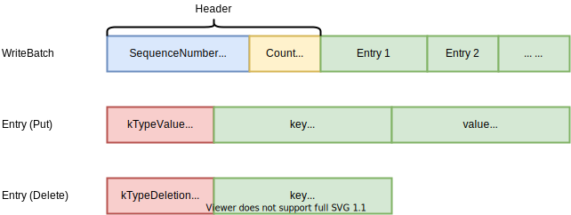

*本文为原创文章，转载请严格遵守[CC BY-NC-SA协议](https://creativecommons.org/licenses/by-nc-sa/4.0/)。*


<!--more-->

## 0. 引言

本文主要介绍LevelDB中增删改查操作的设计与实现。

在此之前，本系列已经通过近10篇文章对LevelDB的各个组件进行了介绍与分析，而本文是对之前所有文章的“集大成者”。在读写LevelDB的读写过程中，几乎会用到之前介绍的所有内容。因此，对LevelDB不熟悉的读者可以先阅读本系列之前的文章。

本文将LevelDB的增删改查操作分为两类介绍：一类是会修改数据内容的操作，本文称之为Mutation，包括增、删、改；另一类是只读操作，本文称之为ReadOnly操作，由于LevelDB实现了Snapshot Read，因此笔者将Snapshot也放在ReadOnly操作中一并介绍。

## 1. Mutation

### 1.1 Mutation接口

LevelDB提供了3个Mutation类型的接口：

```cpp

  // Set the database entry for "key" to "value".  Returns OK on success,
  // and a non-OK status on error.
  // Note: consider setting options.sync = true.
  virtual Status Put(const WriteOptions& options, const Slice& key,
                     const Slice& value) = 0;

  // Remove the database entry (if any) for "key".  Returns OK on
  // success, and a non-OK status on error.  It is not an error if "key"
  // did not exist in the database.
  // Note: consider setting options.sync = true.
  virtual Status Delete(const WriteOptions& options, const Slice& key) = 0;

  // Apply the specified updates to the database.
  // Returns OK on success, non-OK on failure.
  // Note: consider setting options.sync = true.
  virtual Status Write(const WriteOptions& options, WriteBatch* updates) = 0;

```

其中`Put`接口用来插入或修改数据；`Delete`用来删除已有数据；而`Write`接口用来批量执行`Put`或`Delete`操作，在同一批（即同一个`WriteBatch`）中的操作，其插入的entry的SequenceNumber相同。

虽然LevelDB为不同类型的Mutation操作提供了不同接口，但其实这些接口都是对`DBImpl::Write`方法的封装：

```cpp

// Convenience methods
Status DBImpl::Put(const WriteOptions& o, const Slice& key, const Slice& val) {
  return DB::Put(o, key, val);
}

Status DBImpl::Delete(const WriteOptions& options, const Slice& key) {
  return DB::Delete(options, key);
}

// Default implementations of convenience methods that subclasses of DB
// can call if they wish
Status DB::Put(const WriteOptions& opt, const Slice& key, const Slice& value) {
  WriteBatch batch;
  batch.Put(key, value);
  return Write(opt, &batch);
}

Status DB::Delete(const WriteOptions& opt, const Slice& key) {
  WriteBatch batch;
  batch.Delete(key);
  retu

```

因此，本章后面的内容，主要介绍LevelDB中的WriteBatch及Write接口的实现。

### 1.2 WriteBatch

`WriteBatch`是用来记录需要批处理的若干个`Put`或`Delete`操作的结构体。LevelDB会为同一个`WriteBatch`中所有操作分配相同的SequenceNumber。`WriteBatch`的接口与实现位于`include/leveldb/write_batch.h`、`db/write_batch_internal.h`和`db/write_batch.cc`中，其实现非常简单，这里不再赘述。下面仅对`WriteBatch`的结构进行简要描述，`WriteBatch`的结构如下图所示：



每个`WriteBatch`在内存中是一个连续的字节数组，其头12个字节是WriteBatch的Header，其中前8字节是该WriteBatch的SequenceNumber，后4字节是该WriteBatch中Entry的数量。Header后面连续存放着WriteBatch中的Entry。每个Entry的头一个字节标识了该Entry的操作类型。对于Put操作的Entry，在类型标识后以LengthPrefixedSlice编码存放着key和value；对于Delete操作的Entry，在类型标识后以LengthPrefixedSlice编码存放着待删除忽的key。

### 1.3 Write

`Write`是LevelDB写入Mutation的方法。为了维护LSM-Tree结构不被破坏，LevelDB必须保证写入的Mutation的SequenceNumber有序。在并发写入场景下，如果采用多线程同时写入的方式，将需要很大的同步开销。

`Write`方法对此进行了优化，该方法会“投机地”将多个并发的WriteBatch合并到一个`Write`线程中写入。WriteBatch的合并通过队列实现，这不会导致被合并的WriteBatch中有相同的SequenceNumber。

LevelDB为每个调用了`Write`方法线程分配一个`Writer`，Writer记录了三个字段：需要写入的WriteBatch `batch`、是否需要同步写入`sync`、和写入是否完成`done`。

LevelDB中，同时只有一个Write线程在向LevelDB中写入数据。在有Write线程正在写入LevelDB时，其它Write线程先将自己的`Writer`加入到队列`writers_`中并阻塞。当上一个向LevelDB中写入数据的Write线程执行完成时，其会唤醒队列中第一个Writer所在线程。该线程会将`writers_`队列中所有Writer待写入的数据写入到LevelDB中，并将这些Writer的`done`字段置为true。在`writers_`队列中的线程被唤醒后，其会检查自己的`done`字段是否已被置为`true`，如果是则说明其WriteBatch已经被队列前的Writer写入，直接返回即可；否则，说明当前Write线程为队列中第一个Writer所在线程，由该线程负责当前队列中所有Writer数据的写入。

这样，`Write`方法只需要保证`writers_`队列的同步即可，在真正写入数据时，不会影响后续Write线程向`writers_`队列中写入任务。

`DBImpl::Write`方法的实现如下：

```cpp

Status DBImpl::Write(const WriteOptions& options, WriteBatch* updates) {
  // (1)
  Writer w(&mutex_);
  w.batch = updates;
  w.sync = options.sync;
  w.done = false;

  // (2)
  MutexLock l(&mutex_);
  writers_.push_back(&w);
  while (!w.done && &w != writers_.front()) {
    w.cv.Wait();
  }
  if (w.done) {
    return w.status;
  }

  // (3)
  // May temporarily unlock and wait.
  Status status = MakeRoomForWrite(updates == nullptr);
  uint64_t last_sequence = versions_->LastSequence();
  Writer* last_writer = &w;
  if (status.ok() && updates != nullptr) {  // nullptr batch is for compactions
    WriteBatch* write_batch = BuildBatchGroup(&last_writer);
    WriteBatchInternal::SetSequence(write_batch, last_sequence + 1);
    last_sequence += WriteBatchInternal::Count(write_batch);

    // (4)
    // Add to log and apply to memtable.  We can release the lock
    // during this phase since &w is currently responsible for logging
    // and protects against concurrent loggers and concurrent writes
    // into mem_.
    {
      mutex_.Unlock();
      status = log_->AddRecord(WriteBatchInternal::Contents(write_batch));
      bool sync_error = false;
      if (status.ok() && options.sync) {
        status = logfile_->Sync();
        if (!status.ok()) {
          sync_error = true;
        }
      }
      if (status.ok()) {
        status = WriteBatchInternal::InsertInto(write_batch, mem_);
      }
      mutex_.Lock();
      if (sync_error) {
        // The state of the log file is indeterminate: the log record we
        // just added may or may not show up when the DB is re-opened.
        // So we force the DB into a mode where all future writes fail.
        RecordBackgroundError(status);
      }
    }
    if (write_batch == tmp_batch_) tmp_batch_->Clear();

    versions_->SetLastSequence(last_sequence);
  }

  // (5)
  while (true) {
    Writer* ready = writers_.front();
    writers_.pop_front();
    if (ready != &w) {
      ready->status = status;
      ready->done = true;
      ready->cv.Signal();
    }
    if (ready == last_writer) break;
  }

  // Notify new head of write queue
  if (!writers_.empty()) {
    writers_.front()->cv.Signal();
  }

  return status;
}

```

下面笔者分段介绍`Write`方法的设计与实现：

段(1)部分，Write方法为当前线程分配`Writer`，此时每个Write线程互不影响，不需要锁。

段(2)部分，Write方法加锁操作`writers_`队列，其将当前线程的Writer追加到`writers_`队列的最后。然后通过信号量循环等待被唤醒，直到当前线程的Writer的`done`字段被置为了`true`，或当前线程的Writer成为了队列中的第一个Writer。若干`done`被置为了`true`，说明当前线程的Writer需要写入的WriteBatch已经被队列中之前的Writer写入，可以直接返回；否则，当前线程的Writer作为队列的第一个Writer，负责写入此时队列中所有Writer的WriteBatch。

段(3)部分我们先来关注持有锁时的操作（即非段(4)的部分）。在仍持有以锁时，当前Write线程需要通过`MakeRoomForWrite`方法为写入的数据留出足够的buffer。`MakeRoomForWrite`方法会根据当前MemTable的使用率来选择是否触发Minor Compaction（如果当前updates为空，则为Manual Compaction用来强制触发Minor Compaction的操作）。随后，Write线程会根据`writers_`队列和上一次写入的最新的SequenceNumber，构建需要写入的WriteBatchGroup。

段(4)部分是Write线程真正将数据写入到LevelDB的部分。在Write真正写入数据时，其会暂时释放锁，以避免阻塞后续Write线程向`writers_`中提交任务。在写入阶段，Write线程首先写入WAL，并根据传入的`WriteOptions`的`sync`字段决定是否需要等待WAL同步到稳定存储。然后，Write方法再将数据插入到MemTable中。最后，Write线程重新上锁，完成对`writes_`队列的处理等。

段(5)是Write线程完成写入后的收尾阶段，该阶段会在持有锁的情况下将`writers_`队列中已完成写入的Writer的`done`字段置为true，并将这些Writer从`writers_`中移除。最后，Write线程通过信号量通知后续Write线程继续执行。

## 2. ReadOnly

### 2.1 ReadOnly接口

本章主要介绍与读取LevelDB中数据相关的接口，其包括`Get`、`GetSnapshot`、`ReleaseSnapshot`方法。除了这些方法外，LevelDB还提供了获取能够改变遍历方向遍历所有数据的Iterator的方法`NewIterator`和获取LevelDB统计量和估算占用量等方法，但本文主要介绍LevelDB读写流程的设计与实现，因此本章不会介绍这些方法。

```cpp

  // If the database contains an entry for "key" store the
  // corresponding value in *value and return OK.
  //
  // If there is no entry for "key" leave *value unchanged and return
  // a status for which Status::IsNotFound() returns true.
  //
  // May return some other Status on an error.
  virtual Status Get(const ReadOptions& options, const Slice& key,
                     std::string* value) = 0;

  // Return a handle to the current DB state.  Iterators created with
  // this handle will all observe a stable snapshot of the current DB
  // state.  The caller must call ReleaseSnapshot(result) when the
  // snapshot is no longer needed.
  virtual const Snapshot* GetSnapshot() = 0;

  // Release a previously acquired snapshot.  The caller must not
  // use "snapshot" after this call.
  virtual void ReleaseSnapshot(const Snapshot* snapshot) = 0;

```

### 2.2 Snapshot

LevelDB中与Snapshot相关的接口实现非常简单，其只需要在加锁的条件下，向`snapshot_`中加入最新的SequenceNumber的Snapshot即可。而Snapshot Read主要体现在LevelDB的Get方法与Compaction中（详见[深入浅出LevelDB —— 0x09 Compaction](/posts/code-reading/leveldb-made-simple/9-compaction/)中介绍的Major Compaction中drop key/value的条件）。

```cpp

const Snapshot* DBImpl::GetSnapshot() {
  MutexLock l(&mutex_);
  return snapshots_.New(versions_->LastSequence());
}

void DBImpl::ReleaseSnapshot(const Snapshot* snapshot) {
  MutexLock l(&mutex_);
  snapshots_.Delete(static_cast<const SnapshotImpl*>(snapshot));
}

```

### 2.3 Get


# 施工中 ... ...