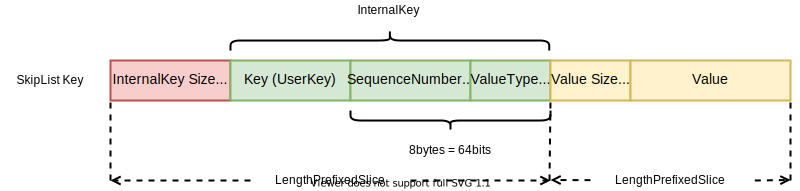

*本文为原创文章，转载请严格遵守[CC BY-NC-SA协议](https://creativecommons.org/licenses/by-nc-sa/4.0/)。*


<!--more-->

## 0. 引言

LSM-Tree中的MemTable既作为整合随机写入的buffer，又最为加速热数据读取的cache，是LSM-Tree的重要组件之一。

由于MemTable是保存在内存中的，其I/O开销比保存在稳定存储上的SSTable要小得多，因此LevelDB在实现MemTable时，查找结构采用的是跳表SkipList。

无论是MemTable还是Immutable MemTable，其实现均为`leveldb::Memtable`，当MemTable写满后，LevelDB会将其从`DBImpl`的`mem_`字段转移到`imm_`字段，不再对其进行写入。

本文主要介绍并分析LevelDB中MemTable的设计与实现。

相关文件：`db/skiplist.h`、`db/memtable.h`、`db/memtable.cc`、`db/dbformat.h`、`db/dbformat.cc`、`util/arena.h`、`util/arena.cc`。

## 1. 内存分配器Arena

SkipList几乎是MemTable中唯一需要在堆上分配内存的部分。为了尽可能将SkipList的内存连续分配以充分利用缓存局部性，LevelDB在分配SkipList链表节点的内存时，没有通过默认的new/delete实现，而是自己实现了一个内存分配器Arena。因此，在介绍SkipList与MemTable前，我们先来关注内存分配器Arena的实现。

相关文件：`util/arena.h`、`util/arena.cc`。

`Arena`是LevelDB的内存分配器，Arena会按需以“块”为单位申请内存，每个块是一个连续的内存空间。SkipList通过Arena分配内存可以避免其链表节点的内存在内存堆中过于分散，以便利用缓存局部性。

Arena在其生命周期中不会释放已获取的内存。此外，向Arena申请内存的数据结构也不会在Arena的生命周期中归还其占用的内存，这与数据结构的使用场景及使用相关。Arena的生命周期是与MemTable绑定的，每个MemTable都有自己的Arena。当MemTable销毁时，会将作为其字段的arena_一并销毁。

Arena对外提供了以下方法：

```cpp

class Arena {
 public:
  Arena();

  Arena(const Arena&) = delete;
  Arena& operator=(const Arena&) = delete;

  ~Arena();

  // Return a pointer to a newly allocated memory block of "bytes" bytes.
  char* Allocate(size_t bytes);

  // Allocate memory with the normal alignment guarantees provided by malloc.
  char* AllocateAligned(size_t bytes);

  // Returns an estimate of the total memory usage of data allocated
  // by the arena.
  size_t MemoryUsage() const {
    return memory_usage_.load(std::memory_order_relaxed);
  }

  // ... ...

}

```

Arena对外的分配方法有两种，区别在于是否按照机器位数对齐。Arena内部主要通过4个字段实现：

```cpp

class Arena {

  // ... ...

 private:
  char* AllocateFallback(size_t bytes);
  char* AllocateNewBlock(size_t block_bytes);

  // Allocation state
  char* alloc_ptr_;
  size_t alloc_bytes_remaining_;

  // Array of new[] allocated memory blocks
  std::vector<char*> blocks_;

  // Total memory usage of the arena.
  //
  // TODO(costan): This member is accessed via atomics, but the others are
  //               accessed without any locking. Is this OK?
  std::atomic<size_t> memory_usage_;
};

```

`std::vector<char*> blocks_`字段按block来保存已申请的内存空间，`char* alloc_ptr_`指向当前块中还未分配的内存地址，`size_t alloc_bytes_remaining_`记录了当前块中剩余的未分配空间大小，`std::atomic<size_t> memory_usage_`记录了Arena获取的总内存大小（包括了每个block的header大小）。注意，这里“当前块”并非Arena创建的最后一个块，因为Arena为了避免浪费，会为较大的请求分配单独的块（详见下文），这里的“当前块”是指除了这些单独分配的块外获得的最后一个块。

当LevelDB通过`Allocate`方法向Arena请求内存时，Arena首先会检查当前块的剩余空间，如果当前块剩余空间能够满足分配需求，则直接将剩余空间分配给调用者，并调整`alloc_ptr`与`alloc_bytes_remaining`：

```cpp

inline char* Arena::Allocate(size_t bytes) {
  // The semantics of what to return are a bit messy if we allow
  // 0-byte allocations, so we disallow them here (we don't need
  // them for our internal use).
  assert(bytes > 0);
  if (bytes <= alloc_bytes_remaining_) {
    char* result = alloc_ptr_;
    alloc_ptr_ += bytes;
    alloc_bytes_remaining_ -= bytes;
    return result;
  }
  return AllocateFallback(bytes);
}

```

如果当前块剩余空间不足，Arena会调用内部的`AllocateFallback方法`：

```cpp

char* Arena::AllocateFallback(size_t bytes) {
  if (bytes > kBlockSize / 4) {
    // Object is more than a quarter of our block size.  Allocate it separately
    // to avoid wasting too much space in leftover bytes.
    char* result = AllocateNewBlock(bytes);
    return result;
  }

  // We waste the remaining space in the current block.
  alloc_ptr_ = AllocateNewBlock(kBlockSize);
  alloc_bytes_remaining_ = kBlockSize;

  char* result = alloc_ptr_;
  alloc_ptr_ += bytes;
  alloc_bytes_remaining_ -= bytes;
  return result;
}

```

`AllocateFallback`会判断需要分配的大小，如果需要分配的大小超过了默认块大小的$\frac{1}{4}$，为了避免浪费当前块的剩余空间，Arena会为其单独分配一个大小等于需求的块，此时不需要调整`alloc_ptr`与`alloc_bytes_remaining`字段，这样做的另一个好处是这一逻辑也可以用于分配需求大于默认块大小的空间；如果需要分配的大小没有超过默认块大小的$\frac{1}{4}$，此时不再使用当前块的剩余空间浪费也很小，因此直接申请一个默认大小的块，并从新块分配空间，同时调整`alloc_ptr`与`alloc_bytes_remaining`字段。

`AllocateNewBlock`会通过`new`关键字创建连续的内存块，并将获得的内存块保存到`blocks_`中，同时更新`memory_usage_`字段：

```cpp

char* Arena::AllocateNewBlock(size_t block_bytes) {
  char* result = new char[block_bytes];
  blocks_.push_back(result);
  memory_usage_.fetch_add(block_bytes + sizeof(char*),
                          std::memory_order_relaxed);
  return result;
}

```

在计算`memory_usage_`时，使用的空间除了需求的空间大小`block_bytes`外，还要加上`new`关键字为数组分配空间时为数组加上的header大小（这样`delete[]`关键字才能知道需要释放的数组大小）。

## 2. SkipList的实现

SkipList是一种多层链表查找结构，其实现较其它查找结构比简单很多。有关SkipList的概念本文不再赘述，不了解的读者可以自行查找其它资料。

LevelDB的跳表实现位于`db/skiplist.h`文件中，其对外提供了插入、判断键是否存在的功能，此外还提供了一个用来更细粒度访问跳表的迭代器，通过迭代器可以顺序地正反遍历跳表，或按照索引随机查找。

LevelDB中的SkipList只插入，不修改或删除，MemTable的修改或删除是通过插入有响应标识或序号的key实现的。

SkipList通过template可以实现自定义Key类型与Key的比较方式。自定义`Comparator`只需要实现`include/comparator.h`中的虚类`Comparator`即可。

`leveldb::SkipList`及其迭代器`leveldb::SkipList::Iterator`的声明如下：

```cpp

template <typename Key, class Comparator>
class SkipList {
 private:
  struct Node;

 public:
  // Create a new SkipList object that will use "cmp" for comparing keys,
  // and will allocate memory using "*arena".  Objects allocated in the arena
  // must remain allocated for the lifetime of the skiplist object.
  explicit SkipList(Comparator cmp, Arena* arena);

  SkipList(const SkipList&) = delete;
  SkipList& operator=(const SkipList&) = delete;

  // Insert key into the list.
  // REQUIRES: nothing that compares equal to key is currently in the list.
  void Insert(const Key& key);

  // Returns true iff an entry that compares equal to key is in the list.
  bool Contains(const Key& key) const;

  // Iteration over the contents of a skip list
  class Iterator {
   public:
    // Initialize an iterator over the specified list.
    // The returned iterator is not valid.
    explicit Iterator(const SkipList* list);

    // Returns true iff the iterator is positioned at a valid node.
    bool Valid() const;

    // Returns the key at the current position.
    // REQUIRES: Valid()
    const Key& key() const;

    // Advances to the next position.
    // REQUIRES: Valid()
    void Next();

    // Advances to the previous position.
    // REQUIRES: Valid()
    void Prev();

    // Advance to the first entry with a key >= target
    void Seek(const Key& target);

    // Position at the first entry in list.
    // Final state of iterator is Valid() iff list is not empty.
    void SeekToFirst();

    // Position at the last entry in list.
    // Final state of iterator is Valid() iff list is not empty.
    void SeekToLast();

   private:
    const SkipList* list_;
    Node* node_;
    // Intentionally copyable
  };

 private:
  enum { kMaxHeight = 12 };

  inline int GetMaxHeight() const {
    return max_height_.load(std::memory_order_relaxed);
  }

  Node* NewNode(const Key& key, int height);
  int RandomHeight();
  bool Equal(const Key& a, const Key& b) const { return (compare_(a, b) == 0); }

  // Return true if key is greater than the data stored in "n"
  bool KeyIsAfterNode(const Key& key, Node* n) const;

  // Return the earliest node that comes at or after key.
  // Return nullptr if there is no such node.
  //
  // If prev is non-null, fills prev[level] with pointer to previous
  // node at "level" for every level in [0..max_height_-1].
  Node* FindGreaterOrEqual(const Key& key, Node** prev) const;

  // Return the latest node with a key < key.
  // Return head_ if there is no such node.
  Node* FindLessThan(const Key& key) const;

  // Return the last node in the list.
  // Return head_ if list is empty.
  Node* FindLast() const;

  // Immutable after construction
  Comparator const compare_;
  Arena* const arena_;  // Arena used for allocations of nodes

  Node* const head_;

  // Modified only by Insert().  Read racily by readers, but stale
  // values are ok.
  std::atomic<int> max_height_;  // Height of the entire list

  // Read/written only by Insert().
  Random rnd_;
};

```

SkipList的节点由`leveldb::SkipList::Node`类实现，`Node`的内存是在堆中分配的，其通过Arena分配器分配。有

`Node`的实现如下：

```cpp

// Implementation details follow
template <typename Key, class Comparator>
struct SkipList<Key, Comparator>::Node {
  explicit Node(const Key& k) : key(k) {}

  Key const key;

  // Accessors/mutators for links.  Wrapped in methods so we can
  // add the appropriate barriers as necessary.
  Node* Next(int n) {
    assert(n >= 0);
    // Use an 'acquire load' so that we observe a fully initialized
    // version of the returned Node.
    return next_[n].load(std::memory_order_acquire);
  }
  void SetNext(int n, Node* x) {
    assert(n >= 0);
    // Use a 'release store' so that anybody who reads through this
    // pointer observes a fully initialized version of the inserted node.
    next_[n].store(x, std::memory_order_release);
  }

  // No-barrier variants that can be safely used in a few locations.
  Node* NoBarrier_Next(int n) {
    assert(n >= 0);
    return next_[n].load(std::memory_order_relaxed);
  }
  void NoBarrier_SetNext(int n, Node* x) {
    assert(n >= 0);
    next_[n].store(x, std::memory_order_relaxed);
  }

 private:
  // Array of length equal to the node height.  next_[0] is lowest level link.
  std::atomic<Node*> next_[1];
};

```

从`Node`的源码中，可以发现其next指针是通过原子类型`std::atomic<Node*>[]`实现的。为了优化原子类型的操作性能，`Node`分别提供了*Read Acquire*和*Write Release*、与*Relaxed*的**Memory Order**，以便在适当场景选择适当一致性，在保证**Memory Coherence**安全性的条件下优化原子类型性能。

有关**C++11 Memory Order**及有关体系结构的知识，可以参考知乎[高并发编程--多处理器编程中的一致性问题(上)](https://zhuanlan.zhihu.com/p/48157076)与[高并发编程--多处理器编程中的一致性问题(下)](https://zhuanlan.zhihu.com/p/48161056)（作者：[三四](https://www.zhihu.com/people/graysen)）

通过原子类实现的Node，SkipList能够保证“读读并发”、“读写并发”的线程安全。而对于并发写入，则需要使用者通过额外的同步机制实现。



Thread safety :

Writes require external synchronization, most likely a mutex. Reads require a guarantee that the SkipList will not be destroyed while the read is in progress.  Apart from that, reads progress without any internal locking or synchronization.



而SkipList的仅插入及对Arena分配器的使用，让SkipList由两个不变的特性：

1. 在SkipList销毁前，其中Node永远不会被删除。SkipList的代码保证了永远不会删除跳表中的节点。

2. Node在被插入到SkipList中后，除了其next/prev指针外，其它数据都不会被修改。

## 3. MemTable的实现

### 3.1 MemTable概览

Memtable对SkipList进行了封装，SkipList只能提供key的插入与查找，而Memtable并对外提供了key/value的增删改查操作。MemTable还提供了正向迭代器与反向迭代器，让使用者能够更细粒度地访问MemTable中的数据。

MemTable的声明如下：

```cpp

class InternalKeyComparator;
class MemTableIterator;

class MemTable {
 public:
  // MemTables are reference counted.  The initial reference count
  // is zero and the caller must call Ref() at least once.
  explicit MemTable(const InternalKeyComparator& comparator);

  MemTable(const MemTable&) = delete;
  MemTable& operator=(const MemTable&) = delete;

  // Increase reference count.
  void Ref() { ++refs_; }

  // Drop reference count.  Delete if no more references exist.
  void Unref() {
    --refs_;
    assert(refs_ >= 0);
    if (refs_ <= 0) {
      delete this;
    }
  }

  // Returns an estimate of the number of bytes of data in use by this
  // data structure. It is safe to call when MemTable is being modified.
  size_t ApproximateMemoryUsage();

  // Return an iterator that yields the contents of the memtable.
  //
  // The caller must ensure that the underlying MemTable remains live
  // while the returned iterator is live.  The keys returned by this
  // iterator are internal keys encoded by AppendInternalKey in the
  // db/format.{h,cc} module.
  Iterator* NewIterator();

  // Add an entry into memtable that maps key to value at the
  // specified sequence number and with the specified type.
  // Typically value will be empty if type==kTypeDeletion.
  void Add(SequenceNumber seq, ValueType type, const Slice& key,
           const Slice& value);

  // If memtable contains a value for key, store it in *value and return true.
  // If memtable contains a deletion for key, store a NotFound() error
  // in *status and return true.
  // Else, return false.
  bool Get(const LookupKey& key, std::string* value, Status* s);

 private:
  friend class MemTableIterator;
  friend class MemTableBackwardIterator;

  struct KeyComparator {
    const InternalKeyComparator comparator;
    explicit KeyComparator(const InternalKeyComparator& c) : comparator(c) {}
    int operator()(const char* a, const char* b) const;
  };

  typedef SkipList<const char*, KeyComparator> Table;

  ~MemTable();  // Private since only Unref() should be used to delete it

  KeyComparator comparator_;
  int refs_;
  Arena arena_;
  Table table_;
};

}  // namespace leveldb

```

MemTable的实例采用了引用计数，其初始计数为0，因此其构造方法的调用者需要手动调用其`Ref`方法将其初始引用计数置为1；在读取MemTable时或MemTable在Compact时，LevelDB会通过`Ref`方法增大MemTable的引用计数，避免其在读取过程中被回收而导致的无效内存访问，在操作完成后再通过`Unref`减小其引用计数；当调用`Unref`方法使其引用计数器减至0时，MemTable会自己销毁。

本节，我们主要关注MemTable是如何封装SkipList以实现key/value的增删改查的。

### 3.2 MemTable的实现

#### 3.2.1 key的封装

如前文所述，SkipList数据结构是一个只有key的查找结构，为了能够通过 SkipList同时保存key/value等数据，就要将key/value及其它数据封装成一个key。LevelDB中key的封装规则如下图所示。



SkipList的key从大体上可以分为三部分（颜色不同的部分）：InternalKey Size、InternalKey、Value。其中，InternalKey是LevelDB为了在Insert-Only的SkipList上实现增删改查而封装的结构，也是SkipList中Node的默认排序依据；InternalKey Size即InternalKey的大小，通过varint32编码；Value由用户插入的value与其大小组成，其value size同样通过varint32编码实现。接下来，我们重点介绍InternalKey的设计。

InternalKey内部由3部分组成：
- key：用户插入的key，也叫做UserKey。
- SequenceNumber：全局单调递增序号，当LevelDB更新数据时（增/删/改）递增，保证后发生操作的SequenceNumber值大于先发生的操作，MemTable通过该字段在Insert-Only的SkipList上实现MVCC的增删改查。
- ValueType：用来表示操作类型枚举值，其值只有两种：`kTypeDeletion`与`kTypeValue`。其中`kTypeDeletion`表示该Key是删除操作，`kTypeValue`表示该Key是增/改操作。

#### 3.2.2 增删改查的实现

在介绍了MemTable对SkipList的Key封装后，我们来分析MemTable如何通过这种封装来在Insert-Only的SkipList上实现key/value的增删改查操作。

在上一节中，笔者提到过InternalKey是SkipList中Node的默认排序依据。LevelDB中SkipList的默认排序是通过`leveldb::InternalKeyComparator`实现的，其声明与实现在`db/dbformat.h`与`db/dbformat.cc`中。

`InternalKeyComparator`的`Compare`方法按照如下优先级，依次对`InternalKey`进行排序：
1. 按照UserKey**升序**排序；
2. 按照SequenceNumber**降序**排序；
3. 按照ValueType**降序**排序（由于SequenceNumber已经足以对Key排序，因此这条规则永远不会用到）。

通过`InternalKeyComparator`，SkipList可以保证对于同一key（UserKey），新的操作永远在旧的操作的前面。因此，只要找到key（UserKey）在SkipList中第一次出现的位置，即可保证得到的是该key最新的版本。

在分析MemTable如何实现查找key（UserKey）前，我们先来看一下MemTable实现增/删/查操作的实现：

```cpp

void MemTable::Add(SequenceNumber s, ValueType type, const Slice& key,
                   const Slice& value) {
  // Format of an entry is concatenation of:
  //  key_size     : varint32 of internal_key.size()
  //  key bytes    : char[internal_key.size()]
  //  value_size   : varint32 of value.size()
  //  value bytes  : char[value.size()]
  size_t key_size = key.size();
  size_t val_size = value.size();
  size_t internal_key_size = key_size + 8;
  const size_t encoded_len = VarintLength(internal_key_size) +
                             internal_key_size + VarintLength(val_size) +
                             val_size;
  char* buf = arena_.Allocate(encoded_len);
  char* p = EncodeVarint32(buf, internal_key_size);
  std::memcpy(p, key.data(), key_size);
  p += key_size;
  EncodeFixed64(p, (s << 8) | type);
  p += 8;
  p = EncodeVarint32(p, val_size);
  std::memcpy(p, value.data(), val_size);
  assert(p + val_size == buf + encoded_len);
  table_.Insert(buf);
}

```

从`Add`方法中可以看出，MemTable不需要进行额外的操作，只需要将需要插入SkipList的Key按照上节中介绍的格式编码，然后直接插入到SkipList中即可。

而对于查找操作，由于在查找时MemTable无法得知需要查找的key（UserKey）最新的SequenceNumber或ValueType，因此在查找时，无法构造出恰好与SkipList中的InternalKey相等的查找键。但这并不影响MemTable查找UserKey的“当前”版本（*注：由于LevelDB实现了MVCC，这里的“当前”版本只对该操作可见的最新版本，下文同理*），根据InternalKey的排序顺序，只要构造出的查找键的UserKey与需要查找的UserKey相同，且SequenceNumber大于等于该UserKey当前SequenceNumber，MemTable即可根据查找键找到待查找的UserKey的最新版本可能出现的位置。然后判断该位置上的UserKey是否与我们要查找的UserKey相同，如果相同则说明我们找到了该UserKey的最新版本，如果不同则说明MemTable没有该UserKey的记录。

为了便于生成查找键，LevelDB定义了`levelDB::LookupKey`，其结构相当于InternalKey Size与InternalKey部分连接在一起，其中SequenceNumber部分为构造时的SequenceNumber，ValueType为1。在查找时，只需要传入UserKey及“当前”的SequenceNumber，即可构造出在SkipList中位于我们要查找的UserKey的最新版本可能出现的位置处的LookupKey。

MemTable中查找操作的实现如下：

```cpp

bool MemTable::Get(const LookupKey& key, std::string* value, Status* s) {
  Slice memkey = key.memtable_key();
  Table::Iterator iter(&table_);
  iter.Seek(memkey.data());
  if (iter.Valid()) {
    // entry format is:
    //    klength  varint32
    //    userkey  char[klength]
    //    tag      uint64
    //    vlength  varint32
    //    value    char[vlength]
    // Check that it belongs to same user key.  We do not check the
    // sequence number since the Seek() call above should have skipped
    // all entries with overly large sequence numbers.
    const char* entry = iter.key();
    uint32_t key_length;
    const char* key_ptr = GetVarint32Ptr(entry, entry + 5, &key_length);
    if (comparator_.comparator.user_comparator()->Compare(
            Slice(key_ptr, key_length - 8), key.user_key()) == 0) {
      // Correct user key
      const uint64_t tag = DecodeFixed64(key_ptr + key_length - 8);
      switch (static_cast<ValueType>(tag & 0xff)) {
        case kTypeValue: {
          Slice v = GetLengthPrefixedSlice(key_ptr + key_length);
          value->assign(v.data(), v.size());
          return true;
        }
        case kTypeDeletion:
          *s = Status::NotFound(Slice());
          return true;
      }
    }
  }
  return false;
}

```

正如上文中分析的那样，在根据LookupKey找到待查找的UserKey最新版本可能出现的位置后，还需要通过如下操作判断当前UserKey是否存在：
1. 判断当前位置非空，以避免待查找的UserKey在所有已有的UserKey记录之后导致的找到空指针；
2. 判断当前位置的UserKey是否是待查找的Userkey，如果不是则说明MemTable中没有待查找的UserKey的记录；
3. 检查该Key的ValueType，如果是`kTypeDeletion`说明该UserKey被用户删除；如果是`kTypeValue`说明待查找的UserKey存在，返回当前最新版本即可。

#### 3.2.3 key类型小结

LevelDB为了在Insert-Only的SkipList上实现key/value的增删改查封装了多种不同的key，这里总结一下出现的key以避免混淆：

- UserKey：用户插入的key。
- InternalKey：封装了用户插入的key、序号（时间戳）及操作类型，该key是在Insert-Only实现增删改查的关键，也是SkipList中key的排序依据。
- LookupKey：根据UserKey与查找操作发生时的SequenceNumber生成的用来查找SkipList的key，其相当于InternalKey size与InternalKey的连接。该key在SkipList中的位置对应待查找的UserKey的最新版本可能出现的位置。
- SkipList的Key：SkipList中的Key，保存了用户插入的key/value及相关元数据的所有信息。