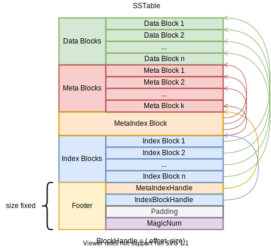

*本文为原创文章，转载请严格遵守[CC BY-NC-SA协议](https://creativecommons.org/licenses/by-nc-sa/4.0/)。*

<!--more-->

## 0. 引言

sstable（sorted-string table）是LevelDB中数据在稳定存储中的格式。当memtable中的数据超过一定阈值时，LevelDB会将memtable转为immutable memtable，LevelDB的后台线程会将immutable memtable通过compaction操作将其以sstable的格式写入到稳定存储。

本文主要介绍sstable的格式，有关compaction操作会在本系列后续的文章中介绍。

## 1. sstable格式

### 1.1 sstable文件格式概览

sstable的文件格式可表示为下图：

sstable中的数据按照功能可以分为如下几块区：
1. Data Block区：存放key/value数据。
2. Meta Block区：存放与当前sstable相关的统计数据。
3. MetaIndex Block：仅有1个Block，该Block中存放了所有Meta Block的索引。
4. Index Block区：所有Data Block的索引。
5. Footer：大小固定的一个区域（48B），该区域中有两个Handle，分别标识了MetaIndex Block区和Index Block区的偏移量与大小；文件末尾的MagicNum用来标识该文件是LevelDB的sstable文件；剩余空间被填充为Padding。



Footer大小48B原因：Footer中有2个Handle和1个64bit的MagicNumber，每个Handle中有2个varint64编码的字段。varint64编码最大长度为10B，因最多需要 (10B + 10B) * 2 + 8 = 48B。



在sstable中，无论是Footer中的Handler，还是各种索引中的Handler，都由两个varint64编码的字段组成：`offset`、`size`。这两个字段分别标识了指向的Block的*偏移量*与*内容大小*。每个Block除了其包含的内容的数据外，还有压缩类型标识符（1B）与校验和（4B）。Handle的`size`字段是不包含块尾元数据（1B+4B=5B）的大小。

其中，合法的压缩类型标识符共两种：

| 压缩类型 | 值 | 描述 |
| :-: | :-: | :- |
| kNoCompression | 0x0 | 不压缩。 |
| kSnappyCompression | 0x1 | 采用Snappy算法压缩。 |

### 1.2 Block通用格式

sstable中所有的Block（content）都以下图格式组织：

从功能上，Block

# 施工中 ... ...

Memtable::Table::Iterator -> SkipList<Key, Comparator>::Iterator

key -> InternalKey
value -> Value .