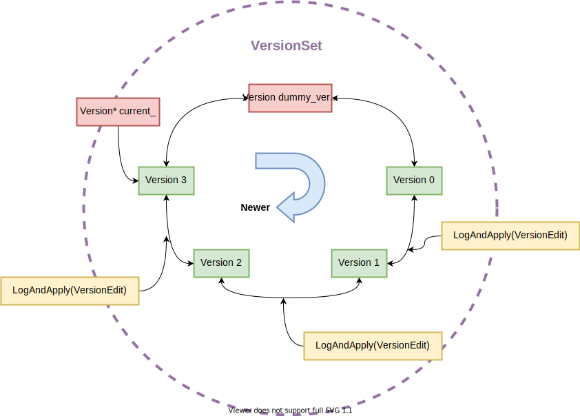

*本文为原创文章，转载请严格遵守[CC BY-NC-SA协议](https://creativecommons.org/licenses/by-nc-sa/4.0/)。*


<!--more-->

## 0. 引言

在介绍LevelDB中“Version”的设计前，我们先来了解LevelDB中的MVCC。

MVCC是存储系统中常用来优化“读读并发”与“读写并发”并行的设计，LevelDB也不例外。LevelDB的MVCC机制不但使其能够并行化“读读并发”与“读写并发”操作，还使其能够实现快照读（Snapshot Read）。LevelDB的用户可以通过其提供的接口要求其保留一定时间之前的快照，在用户释放快照前，该快照创建时LevelDB中存在的数据就不会被释放。

《An Empirical Evaluation of In-Memory Multi-Version Concurrency Control》一文介绍了MVCC在内存中的实现(这里放上笔者之前的翻译版[《An Empirical Evaluation of In-Memory Multi-Version Concurrency Control》论文翻译](/posts/paper-reading/wu-vldb2017/#41-仅追加存储append-only-storage))。这篇综述剖析的MVCC实现中的层次与每个层次的常见方案。这里我们主要关注LevelDB的MVCC实现中的“版本存储”的设计。

想要实现MVCC，存储系统就要存储数据的多个版本。笔者将LevelDB的多版本存储设计分为了三个层次：

**从key/value的角度：** 每次变更操作的记录（Batch Writer可视为一次操作）都有不同且递增的SequenceNumber。对于一个UserKey，当存在SequenceNumber更高的的记录时，旧的记录不会被立即删除，至少要在该SequenceNumber之前的所有Snapshot都被释放后才能删除（具体删除时间与Compaction时间有关）。这是LevelDB实现Snapshot Read的基础。

**从MemTable的角度：** LevelDB中的MemTable通过引用计数来控制释放时间。在需要读取MemTable时（无论是Get操作还是Minor Compaction时），读取前会增大其引用计数，读取后减小引用计数。这样，即使MemTable已被通过Minor Compaction操作写入到Level-0文件，MemTable在被读取，它就不会被释放。

**从数据库文件的角度：** LevelDB的文件同样需要引用计数，当执行Major Compaction时，LevelDB不会立即删除已被合并的数据库文件，因为此时可能还有未完成的读取该文件的操作。

key/value的版本实际上也是依赖于内存与稳定存储，其分别在Compaction与Put/Get操作中体现，因此这里我们主要关注后两者。MemTable的多版本与Snapshot信息是不需要直接持久化的，因为数据库关闭时无法进行Snapshot Read，也就没有了Snapshot的概念，而最新的MemTable会通过WAL重建，旧的MemTable也不再会被依赖。而数据库文件则不同，LevelDB必须记录数据库文件的版本信息，否则在数据库重启时无法快速确定哪些文件是有效的（LevelDB提供了文件版本信息损坏时的修复机制）。而LevelDB中Version及相关概念就是为此设计的。

本文主要围绕LevelDB中Version、VersionEdit、VersionSet的设计与实现介绍与分析。

## 1. 相关类型与文件

在LevelDB中，与Version相关的类有三个，分别是：`VersionEdit`、`Version`与`VersionSet`，而相关文件主要有`Manifest`和`Current`

正如引言中所述，LevelDB中Version相关信息记录的是LevelDB生成的文件的版本信息与相关元数据。LevelDB的版本信息是增量存储的，其存储方式与WAL相同，将版本的增量变化信息作为Record顺序写入Manifest文件中（详见本系列文章[深入浅出LevelDB —— 0x03 Log](/posts/code-reading/leveldb-made-simple/3-log/)）。

### 1.1 VersionEdit、Manifest、Current

LevelDB的版本增量数据在内存中的类型是`VersionEdit`，其`EncodeTo`与`DecodeFrom`方法分别用来序列化或反序列化`VersionEdit`，以便将其保存在文件中或从文件中读取。

目前`VersionEdit`类中需要持久化到Manifest文件中的数据共有8种：

```cpp

// Tag numbers for serialized VersionEdit.  These numbers are written to
// disk and should not be changed.
enum Tag {
  kComparator = 1,
  kLogNumber = 2,
  kNextFileNumber = 3,
  kLastSequence = 4,
  kCompactPointer = 5,
  kDeletedFile = 6,
  kNewFile = 7,
  // 8 was used for large value refs
  kPrevLogNumber = 9
};

```

这些Tag分别对应以下数据：
1. Comparator Name：InternalKey比较器的名称字符串。
2. Log Number：当前Log文件编号。
3. Prev Log Number：前一个Log文件编号。
4. Last SequenceNumber：当前版本最后一个SequenceNumber的值（仅对于SSTable文件而言，在LevelDB掉电后恢复时，还需要从WAL中恢复MemTable的状态，WAL中的SequenceNumber比文件中的更高）。
5. Compact Pointers：(level, compaction key)记录上次Compaction的位置，以便出错后数据库恢复时，可以选择其它Compaction位置重试。
6. Deleted File：(level, file number)该版本中删除的元数据。
7. New File：(level, file number, file size, smallest key, largest key)该版本中新增文件的元数据。
8.  ~~已弃用~~
9. Prev Log Number：前一个Log文件编号。

因为VersionEdit是增量数据，因此并非每个VersionEdit中都有所有类型的数据，因此序列化VersionEdit的每种类型的数据前会将该类型对应的Tag以Varint32的编码方式写入到其数据之前。

每次LevelDB启动时，会创建一个新的Manifest文件，并创建一个当前状态的全量快照（首次调用`LogAndApply`方法时除了写入增量的Record，还会调用`WriteSnapshot`方法写入其余的全量数据，这两个方法位于`version_set.h`与`version_set.cc`中），以裁剪增量记录的长度。在创建新的Manifest文件同时，LevelDB还会修改Current文件，将其指向最新的Manifest文件。Current文件中只有一个内容，即当前Manifest文件名。

### 1.2 VersionEdit、Version、VersionSet

Manifest与Current文件是LevelDB保存在稳定存储中的文件版本信息，在LevelDB被打开后，其会先通过Current文件找到当前的Manifest文件，读取并反序列化其中数据，并在内存中维护文件版本信息，以便后续操作。

LevelDB在内存中将每个版本的文件信息封装为`Version`保存，Version主要保存了该版本每个level中都有哪些文件（Version中还包括下一个Compact Pointer），Version中文件元数据被按层组织为`FileMetaData`结构体数组的vector容器。`FileMetaData`中的字段如下：

```cpp

struct FileMetaData {
  FileMetaData() : refs(0), allowed_seeks(1 << 30), file_size(0) {}

  int refs;
  int allowed_seeks;  // Seeks allowed until compaction
  uint64_t number;
  uint64_t file_size;    // File size in bytes
  InternalKey smallest;  // Smallest internal key served by table
  InternalKey largest;   // Largest internal key served by table
};

```


LevelDB将Version以双向链表的形式组织，每个Version的`next_`指针指向下一个Version，`prev_`指针指向上一个Version。

LevelDB通过`VersionSet`结构来保存Version的双向链表，及其它不需要多版本记录的文件信息等（如`db_name`、`last_sequence_`、`log_number_`、`table_cache_`等）。`VersionSet`的`dummy_versions_`是Version双向链表的链头，其是一个无实际意义的Version对象，因此`dummy_versions_`的下一个Version是内存中保存的最旧的Version、`dummy_versions_`的上一个Version是最新的Version，`VersionSet`中还有一个`current_`指针指向链表中最新的Version。



在创建新版本时，LevelDB首先构造VersionEdit，然后通过`VersionSet::LogAndApply`方法，先将VersionEdit应用到Current Version，然后将增量的VersionEdit写入Manifest文件中。

## 2. LevelDB重启后的恢复与修复

LevelDB重启时，无论是正常关闭还是异常退出，都需要恢复其状态。这个状态既包括内存中VersionSet的状态，也包括MemTable的状态。

在正常情况情况下，LevelDB可以通过Current文件找到当前的Manifest文件，并根据该文件恢复期VersionSet的状态；在通过WAL文件恢复其MemTable的状态。但是，如果数据库上一次关闭时异常退出（如掉电宕机等），且当时正在写Manifest文件或SSTable，可能导致Manifest或SSTable文件损坏。此时，需要用户通过`db/Repairer.cc`中提供的`Repairer`类的`Run()`方法来尝试手动修复LevelDB。

本节主要介绍并分析LevelDB恢复与修复的流程与实现。

### 2.1 LevelDB的恢复

LevelDB被通过`DB::Open`方法打开时，在非常简单的初始化后，会调用`DB::Recover`方法来恢复自身状态。该方法会检查Lock文件是否被占用（LevelDB通过名为`LOCK`的文件避免多个LevelDB进程同时访问一个数据库）、目录是否存在、Current文件是否存在等。然后主要通过`VersionSet::Recover`与`DBImpl::RecoverLogFile`两个方法，分别恢复其VersionSet的状态与MemTable的状态。

`VersionSet::Recover`方法在恢复VersionSet时，会读取Current文件来找到当前的Manifest文件。随后，LevelDB会读取Manifest中的全量数据，并通过这些数据构造单个Version，而不是为每条VersionEdit都创建一个Version。接下来，LevelDB需要写入新的Manifest文件，如果当前的Manifest文件较小，LevelDB会复用旧的Manifest文件，否则创建新的Manifest文件。

`DBImpl::RecoverLogFile`方法在恢复MemTable的状态时，只需要顺序读取WAL，并根据其中Record构建MemTable中即可。需要注意的是，由于每次打开LevelDB时的Options可能不能，因此在RecoverLogFile期间，也可能出现MemTable超过`write_buffer_size`的情况。此时，LevelDB不会将MemTable转为Immutable MemTable，而是直接将其写入level-0。

如果LevelDB恢复不成功，其会报告错误。此时，用户必须通过`Repairer`来尝试手动修复LevelDB。

### 2.2 LevelDB的修复

在Manifest或SSTable文件损坏时，LevelDB为用户提供了`Repairer`（位于`db/repair.cc`）来尝试修复数据库文件。`Repaier`类中只提供了一个可见方法`Run`。

`Run`方法会依次调用如下4个方法对LevelDB的数据进行修复：
1. `FindFiles`：该方法会查找数据库目录中所有的Manifest、Log与SSTable文件。
2. `ConvertLogFilesToTables`：该方法会依次遍历所有的Log文件，并对每个Log文件通过`ConvertLogToTable`方法生成SSTable文件。这一过程不会产生新的VersionEdit，VersionEdit由后续流程生成。
3. `ExtractMetaData`：该方法会通过`ScanTable`方法扫描所有的SSTable，并生成其`FileMetaData`对象，以便恢复当前的Version。该方法遇到完全无法读取的SSTable时，会将其归档到`lost/`目录下；在遍历SSTable期间，会尽可能跳过无法解析的key；如果遇到无法解析并导致之后的文件都无法读取的key，则会通过`RepairTable`方法，将该key前能解析的key写入到新的SSTable中，并将原SSTable归档到`lost/`目录中。
4. `WriteDescriptor`：该方法会根据恢复的Version，重新生成编号为1的Manifest文件，并将旧的Manifest文件归档到`lost/`目录下。