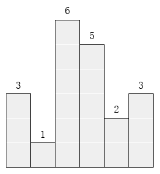
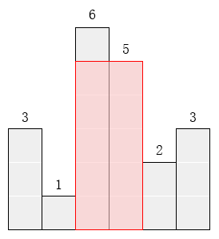

# CCF CSP 201312 T3 最大的矩形

## 题目

### **问题描述**

在横轴上放了n个相邻的矩形，每个矩形的宽度是1，而第i（1 ≤ i ≤ n）个矩形的高度是hi。这n个矩形构成了一个直方图。例如，下图中六个矩形的高度就分别是3, 1, 6, 5, 2, 3。



请找出能放在给定直方图里面积最大的矩形，它的边要与坐标轴平行。对于上面给出的例子，最大矩形如下图所示的阴影部分，面积是10。



### 输入格式

第一行包含一个整数n，即矩形的数量(1 ≤ n ≤ 1000)。

第二行包含n 个整数h1, h2, … , hn，相邻的数之间由空格分隔。(1 ≤ hi ≤ 10000)。hi是第i个矩形的高度。

### 输出格式

输出一行，包含一个整数，即给定直方图内的最大矩形的面积。

### 样例输入

```
6
3 1 6 5 2 3
```

### 样例输出

```
10
```

### 时间限制

```
1.0s
```

### 内存限制

```
256.0MB
```

## 题解

动态规划题。

定义`f[i][j]`为以第`i`个矩形为左边界、第`j`个矩形为右边界的最大矩形面积。显然，当左右边界确定时，最大矩形面积由从左边界到右边界中最低的矩形高度决定。若定义`minh[i][j]`为`左边界到右边界中最低的矩形高度`，则有`f[i][j] = minh[i][j] * (j-i+1)`。因此此题只需要统计举行高度`h[i]`在任意区间的最小值。

数组任意区间最小值有很多方法统计，对于静态的值我们可以直接使用动态规划的方法在$O(n^2)$的时间复杂度内统计，根据本题的数据规模与时间限制来看是可以接受的。

$$\text{minh}[i][j]=\begin{cases} \text{h}[i] & \text{if }i=j \\\ \min(\text{minh}[i][j-1],\text{h}[j]) & \text{if }i\lt j \end{cases}$$

根据动态转移方程可以看出我们可以在读入的同时求解，只需要扫描一次，降低常数。

## 代码

```c++
#include <iostream>
#include <cstring>

#define N 1050

using namespace std;

int h[N];
int minh[N][N];

int main()
{
    memset(minh, 0x7f, sizeof(minh));
    int n, ans = 0;
    cin >> n;
    for (int j = 0; j < n; j++)
    {
        cin >> h[j];
        minh[j][j] = h[j];
        if (minh[j][j] > ans)
            ans = minh[j][j];
        for (int i = 0; i < j; i++)
        {
            minh[i][j] = min(minh[i][j-1], h[j]);
            if (minh[i][j] * (j - i + 1) > ans)
                ans = minh[i][j] * (j - i + 1);
        }
    }
    cout << ans;

    return 0;
}
```

