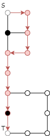

# CCF CSP 201403 T4 无线网络

## 题目

### 问题描述

目前在一个很大的平面房间里有 n 个无线路由器,每个无线路由器都固定在某个点上。任何两个无线路由器只要距离不超过 r 就能互相建立网络连接。
除此以外,另有 m 个可以摆放无线路由器的位置。你可以在这些位置中选择至多 k 个增设新的路由器。
你的目标是使得第 1 个路由器和第 2 个路由器之间的网络连接经过尽量少的中转路由器。请问在最优方案下中转路由器的最少个数是多少?

### 输入格式

第一行包含四个正整数 n,m,k,r。(2 ≤ n ≤ 100,1 ≤ k ≤ m ≤ 100, 1 ≤ r ≤ 108)。
接下来 n 行,每行包含两个整数 xi 和 yi,表示一个已经放置好的无线 路由器在 (xi, yi) 点处。输入数据保证第 1 和第 2 个路由器在仅有这 n 个路由器的情况下已经可以互相连接(经过一系列的中转路由器)。
接下来 m 行,每行包含两个整数 xi 和 yi,表示 (xi, yi) 点处可以增设 一个路由器。
输入中所有的坐标的绝对值不超过 108,保证输入中的坐标各不相同。

### 输出格式

输出只有一个数,即在指定的位置中增设 k 个路由器后,从第 1 个路 由器到第 2 个路由器最少经过的中转路由器的个数。

### 样例输入

    5 3 1 3
    0 0
    5 5
    0 3
    0 5
    3 5
    3 3
    4 4
    3 0

### 样例输出

	2

### 时间限制

	1.0s

### 内存限制

	256.0MB

## 题解

这道题是一道限制经过某类点最大次数的最短路问题,这类问题可以通过二维距离解决。由于图的边权均为1，因此直接使用二维距离BFS即可，如`dis[i][j]`表示从0号路由器到`i`号路由器，在新增了`j`个路由器时的最少总路由器数。

之前在网上查看大多数的题解都是直接在一维的距离上使用BFS，由于这道题数据比较弱，可以AC，但是实际上这样如下问题:

当在BFS过程中，已经过的新增路由器已经耗尽了可以添加的最大次数，而未经过的路由器中存在添加后可以缩短的路径长度大于已添加某一新增路由器能够缩短的路径长度。由于dis只有一维，BFS对每个路由器只会遍历一次，因此不会跳过在前面的新增路由器，导致得到的答案大于最优解。

如果上面这段话比较绕嘴，可以通过如下的一组数据来演示：

    13 2 1 1
    0 0
    6 0
    0 1
    1 1
    2 1
    2 0
    3 0
    4 0
    4 1
    4 2
    5 2
    6 2
    6 1
    1 0
    5 0

将这组数据绘制成图，虚线表示0号和1号路由器，白点表示已有的路由器，黑点表示可以添加的路由器。可以互相连通的路由器中间使用直线连接：


在这组数据中，`k=1`。如果`dis`只有一维，在遇到第一个黑点时会经过，这样到黑点后的第一个路由器的距离为`2`，我们设这个点为`x`点。当绕过黑点的路径到达该点时，该点已被遍历，不会再次遍历。而到达第二个黑点时，由于第一个黑点已经耗尽了增加路由器的次数，因此只能绕更远的路。最终导致得到的答案为`9`。其路径如下图所示；


而使用二维距离时，`dis[i][j]`表示从0号路由器到`i`号路由器，在新增了`j`个路由器时的最少总路由器数。因此对于我们命名为`x`的点时，有两种不同的状态：`dis[x][1]=2`与`dis[x][0]=4`。这样，可以通过`dis[x][0]=4`继续遍历，经过第二个黑点找到到达终点的真正最短路`7`。其路径如下图所示：



通过比较网上一维BFS的结果与二维BFS在这组数据下得到的结果，证明这个问题确实存在。

## 代码

这里为了复习最短路的写法，使用SPFA的方式写的。

```c++
#include <iostream>
#include <cstring>
#include <vector>
#include <queue>

#define ll long long
#define N 205

using namespace std;

struct point
{
    ll x, y;
};

queue<int> q;
bool inq[N];
vector<int> nxt[N];
point pos[N]; // index < n : 已有
int dis[N][N];

bool reach(point a, point b, ll r)
{
    if ((a.x - b.x) * (a.x - b.x) + (a.y - b.y) * (a.y - b.y) <= r * r)
        return true;
    return false;
}

int main()
{
    int n, m, k;
    ll r;

    cin >> n >> m >> k >> r;
    memset(inq, 0, sizeof(inq));
    memset(dis, 0x7f, sizeof(dis));
    while (!q.empty())
        q.pop();

    for (int i = 0; i < n + m; i++)
        cin >> pos[i].x >> pos[i].y;

    for (int i = 0; i < n + m; i++)
        for (int j = 0; j < n + m; j++)
            if (reach(pos[i], pos[j], r))
                nxt[i].push_back(j);

    q.push(0);
    inq[0] = true;
    dis[0][0] = 0;
    while (!q.empty())
    {
        int s = q.front();
        q.pop();
        inq[s] = false;
        if (s == 1)
            break;

        for (int c = 0; c <= k; c++)
            for (vector<int>::iterator it = nxt[s].begin(); it != nxt[s].end(); it++)
            {

                int t = *it;
                int ct = (s < n) ? (c) : (c + 1);
                if (ct > k)
                    continue;

                if (dis[t][ct] > dis[s][c] + 1)
                {

                    dis[t][ct] = dis[s][c] + 1;
                    if (!inq[t])
                    {
                        q.push(t);
                        inq[t] = true;
                    }
                }
            }
    }

    int ans = m + n + 1;
    for (int c = 0; c <= k; c++)
        if (dis[1][c] < ans)
            ans = dis[1][c];
    cout << ans - 1;
    return 0;
}
```