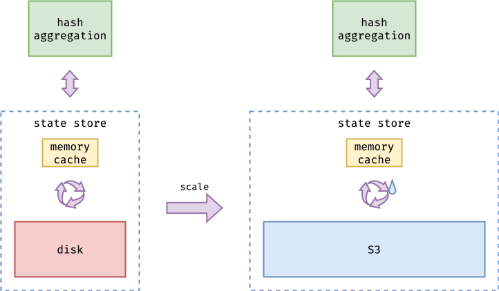
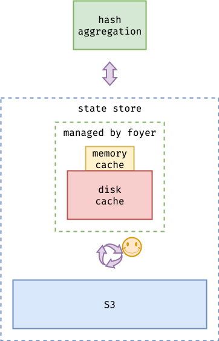
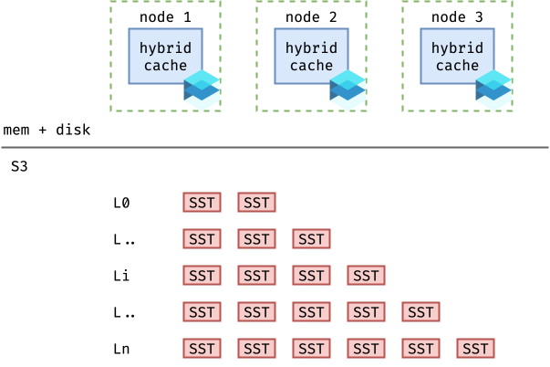
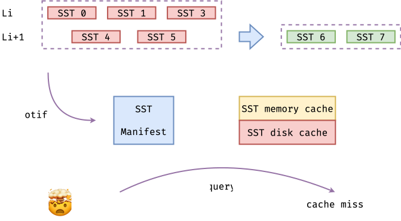
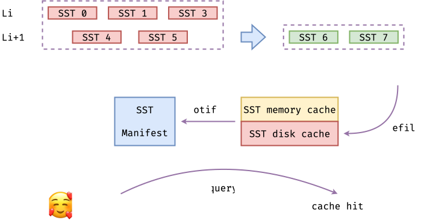
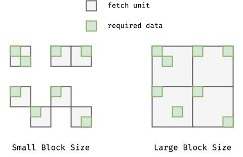
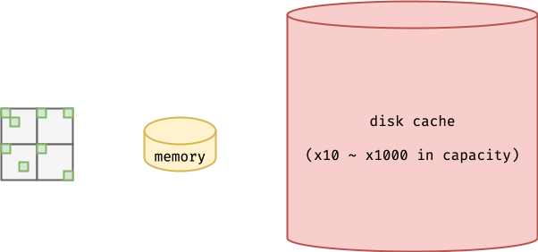
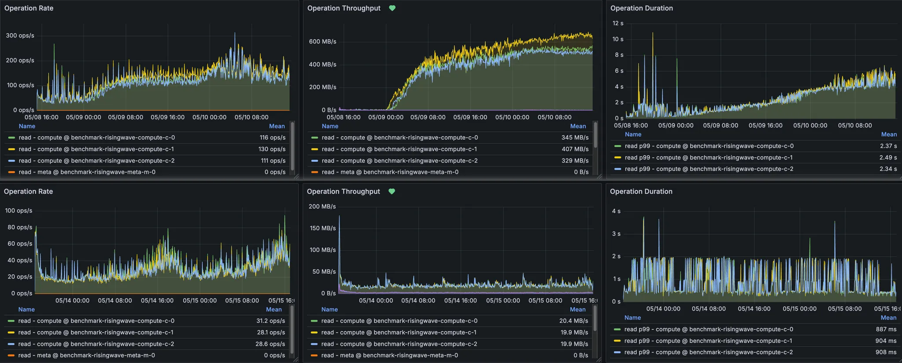

## 0. Some Opening Chit-chat

For those who may not know, over the past few months, I've been continuously developing and maintaining a hybrid cache library in Rust, [***Foyer***](https://github.com/foyer-rs/foyer).

However, from the very beginning until now, I haven’t had the chance to properly introduce this project through an article. On one hand, I’m not very skilled at writing in English, so I kept procrastinating. (Thanks to ChatGPT, I can focus more on the content rather than worrying about my limited English writing skill.) On the other hand, ***Foyer*** was evolving rapidly in its early stages, undergoing major refactoring almost every few months. As a result, it felt premature to formally introduce the project.

But now, ***Foyer*** has already gained more start on Github than than the project it was originally inspired by — Facebook’s [***CacheLib***](https://github.com/facebook/cachelib). This excites me and makes me worry even more about the future of ***Foyer***. So, I think it's time to write a proper blog to introduce it.


Just a heads-up, this blog mainly shares my thoughts and decisions about the ***Foyer*** project and its future. It might be quite verbose. If you only want to learn about ***Foyer***’s features, architecture, and how to use it, please check out the official ***Foyer*** documentation below.

- [Foyer - Github](https://github.com/foyer-rs/foyer)
- [Foyer - Homepage](https://foyer-rs.github.io/foyer/)
- [Foyer - Architecture](https://foyer-rs.github.io/foyer/docs/design/architecture)
- [Foyer - Case Study in RisingWave](https://foyer-rs.github.io/foyer/docs/case-study/risingwave)

## 1. Not Only Yet Another Hybrid Cache

The idea of building a hybrid cache (a combination of in-memory cache and disk cache) first started in 2020. Coincidentally, the project that inspired ***Foyer***, ***CacheLib***, also published its [OSDI paper](https://www.usenix.org/system/files/osdi20-berg.pdf) in the same year.

Back in 2020, I was an intern at ***PingCAP***, working on some development task of [***TiKV***](https://github.com/tikv/tikv), the distributed storage engine for the distributed OLTP database [***TiDB***](https://github.com/pingcap/tidb). At that time, most databases, including TiDB, still used local disk or EBS service as the main storage medium, while S3 was mainly used as a cold backup for snapshot data.

")

As S3 became more widely adopted, its remarkable availability, durability, scalability, and low storage cost became increasingly attractive. ***TiDB*** also wanted to move toward a cloud-native architecture that uses S3 as the main storage medium, just like some new databases at that time. There had already been many design discussions within ***PingCAP***, which later evolved into what is now ***Cloud-native TiDB*** (or maybe it's called ***Serverless TiDB***? I'm not quite sure).

> UPDATE: During my writing this blog, their CEO Dongxu just released a blog and announced the new architecture as TiDB X. Yet another 'X', fine. 🫠

Unfortunately, since I was pursuing my master’s degree at that time, I didn't have the energy to continue my internship at ***PingCAP***. However, this experience had a profound impact on my interests. My master's thesis focused on designing and optimizing an OLTP KV database based on S3. Later, when I had time to take another internship, I joined ***RisingWave Labs***. They were developing a streaming database based on Cloud and S3, [***RisingWave***](https://github.com/risingwavelabs/risingwave), which gave me the chance to apply my research to a real-world project.

")

As I expected, after experiencing the honeymoon phase with S3’s reliability, durability, scalability, and storage cost on databases or other data infrastructures based on S3, its shortcomings also gradually became apparent:

1. **High and unpredictable latency** makes it hard to meet performance requirements.
2. **Expensive API access fees** can make it even more costly than traditional solutions.

Fortunately, both of these problems can be solved with the same approach, which is **caching**. However, the bad news is, since ***RisingWave*** often needs to join two streams from OLTP database's CDC, its storage access patterns are highly random and the working set can be extremely large. Using an expensive in-memory cache alone is not enough to handle this scenario effectively. Therefore, ***RisingWave*** needs to introduce an additional disk cache, making its caching system a **hybrid cache**.

> For more details, please refer to [Foyer - Case Study - RisingWave - Challenge 1](https://foyer-rs.github.io/foyer/docs/case-study/risingwave#1-the-memory-cache-cannot-cover-the-working-set).
>
> There are also funny diagrams. 🤣

When researching options for hybrid caching, I also looked into the newly open-sourced ***CacheLib***. ***CacheLib***’s C++ code is very solid, especially the in-memory cache component. Moreover, ***CacheLib*** is backed by OSDI'20 papers. However, for several reasons, we ultimately decided not to use ***CacheLib***. Instead, we developed our own hybrid cache library in Rust. Here were our considrations:

1. ***CacheLib*** requires entries to use ***CacheLib***-allocated memory.

This limitation means that entries must be serialized, even if only in-memory cache is used and disk cache is not involved. 

> For more details, please refer to ***CacheLib***'s official document, [CacheLib - Write data to cache](https://cachelib.org/docs/Cache_Library_User_Guides/Write_data_to_cache#allocate-memory-for-data-from-cache). Here is a code snippet from it.
>
> ```cpp
> string data("new data");
>
> // Allocate memory for the data.
> auto handle = cache->allocate(pool_id, "key2", data.size());
> 
> // Write the data to the cache.
> std::memcpy(handle->getMemory(), data.data(), data.size());
> 
> // Insert the item handle into the cache.
> cache->insertOrReplace(handle);
> ```

Since disk bandwidth is much lower than memory bandwidth, not all entries can be written to disk cache under heavy load. This is especially true when using EBS in the cloud. Some entries need to be dropped in advance to avoid OOM issues. Additionally, hot entries may not need to use disk cache when they are updated or deleted. Under this limitation, some entries will be unnecessarily serialized, resulting in extra performance overhead.

Moreover, we were not fully confident in the effectiveness of hybrid cache at that time. Therefore, we needed a way to configure the system so that hybrid cache could seamlessly fall back to pure in-memory cache without any overhead. Clearly, this limitation did not meet our requirements.

2. ***CacheLib***, as a C++ project, cannot be easily integrated with the Rust ecosystem of ***RisingWave***.

This is quite obvious. Maintaining the version, build scripts, and FFI for a C++ project within a Rust project requires extra effort. But what I'm taking about here is more than these.

Debugging performance issues and annoying concurrency problems requires comprehensive observability support, including logging, metrics, and tracing. Without patching the ***CacheLib*** code, it is impossible to achieve full observability. Even if we patch the code and maintain a fork, integrating with Rust’s observability ecosystem would still require significant additional effort. These uncertainties could be even greater than rewriting the component in Rust.

3. (**For me**) Rewriting a production-grade system is always an interesting challenge.

There are many ways to learn from a project’s experience, such as trying it yourself, reading the source code, browsing the issues and pull requests, or discussing it with experts. However, none of these methods are as effective as rewriting the project, or rewriting it in a different way.

Other methods help you understand the current state of a project, but rewriting it in your own way gives you deeper insight into why the project evolved as it did. It is about learning the decisions, the trade-offs, the design philosophy, and also black-box technologies that can be used directly without the need for learning.

In the end, we decided to rewrite a hybrid cache in Rust, which is ***Foyer***. And personally, I did't expect ***Foyer*** to be just yet another "**RIIR (Rewrite it in Rust)**" project, but a production-ready solution with unique and outstanding features.

## 2. Build to be Solid

Nowadays, especially with the help of AI, most startups and developers aim to move as fast as possible. But in my career at a database company, I want do something a bit different — to build **solid** systems, especially for infrastructures.

A complex production environment is the best way to test whether a system is solid. The more widely a project is used, the more opportunities it has to be tested in various real-world scenarios. The best way to make a project widely adopted is to build with **open source**, build in **public**, and build for **general** scenarios. This has always been the core philosophy of the ***Foyer***.

And with the inspiration from many excellent open source project, such as [***CacheLib***](https://github.com/facebook/CacheLib), [***Caffeine***](https://github.com/ben-manes/caffeine), [***Moka***](https://github.com/moka-rs/moka), and [***Quick Cache***](https://github.com/arthurprs/quick-cache), ***Foyer*** aims to achieve the following goals:

1. Suitable for most general scenarios.
2. Meanwhile, performance is not compromised.
3. A user- and developer-friendly experience.

The first and second goals seem to be in conflict with each other. That's true, at least under peak performance conditions. Many of ***Foyer***'s key trade-offs are also about balancing these two goals. Let's talk about them.

### 2.1 Flexible Architecture for Most General Scenarios

> This section is mostly taken from ***Foyer***'s official document [Foyer - Architecture](https://foyer-rs.github.io/foyer/docs/design/architecture). But reorganized to fit the blog.

In production environments, different systems have diverse caching requirements. This is also the one of the philosophies in ***CacheLib***'s paper. Hence, to build a hybrid cache system suitable for most general scenarios, it must offer enough flexibility to handle a wide range of caching requirements. The flexibility includes, but is not limited to, the following aspects:

1. The flexibility to switch between various cache algorithms.
2. The flexibility to switch between cache engines to be optimal for specified workload.
3. Minimizing the effort for develops to switch between different configurations.

To achieve this, ***Foyer*** learned from the excellent architecture of ***CacheLib*** — adopts a **plug-and-play** modular design throughout its architecture. Let's go through it.

#### 2.1.1 Hybrid Cache Architecture


As a hybrid cache, ***Foyer*** automatically manages the behavior and lifecycle of cache entries between the in-memory cache and the disk cache. It consists of three components to provide hybrid cache functionality.

1. **Memory Cache (provided by crate `foyer-memory`):** Pure in-memory cache library. Similar to other in-memory cache libraries, it provides functionalities such as adding, deleting, updating, and querying cache entries. Besides, to be compatible with the disk cache, it also provides optimizations such as request merging and support for asynchronous interfaces. (This crate can be used separately as a pure in-memory cache with minimal overhead.)
2. **Disk Cache (provided by crate `foyer-storage`):** Includes the disk cache engines, IO engines, and device driver layer. It cannot be used independently and can only be utilized through ***Foyer***.
3. **Cooperator (Integrated in crate `foyer`):** A lightweight wrapper to coordinate in-memory cache and disk cache.

Besides the hybrid cache mode, ***Foyer*** can also operate as a pure in-memory cache in compatibility mode. This mode doesn't require any API modifications based on the hybrid cache and is therefore suitable for systems that need both pure in-memory cache and hybrid cache operation. In this mode, ***Foyer*** provisions a no-op disk cache engine. This introduces only a minimal overhead in exchange for API compatibility.


If you only need to use ***Foyer*** as a pure in-memory cache, you can directly use `Cache` instead of `HybridCache`. `Cache` is a re-export from the `foyer-memory` crate. It provides APIs and usage similar to mainstream cache libraries, and also offers all the features of the in-memory cache part within the ***Foyer*** hybrid cache, including: interchangeable cache algorithms, request deduplication optimization, etc.


#### 2.1.2 In-memory Cache Architecture

***Foyer***'s memory cache provides a high-performance, flexible, and composable pure in-memory cache implementation with the following key features:

- **Plug-and-Play Algorithms**: Empowers users with easily replaceable caching algorithms, ensuring adaptability to diverse use cases.
- **Fearless Concurrency**: Built to handle high concurrency with robust thread-safe mechanisms, guaranteeing reliable performance under heavy loads.
- **Zero-Copy In-Memory Cache Abstraction**: Leveraging Rust's robust type system, the in-memory cache in foyer achieves a better performance with zero-copy abstraction.


***Foyer***'s in-memory cache consists of three main components:

1. **Flexible & Composable Framework:** A framework that adopts a flexible and composable design. Supports arbitrary combinations of different indexer implementations and eviction algorithm implementations. Provides basic CRUD operation support, lock/lock-free algorithm supports, automatic cache refill and request dedup supports on cache miss.
2. **Indexer:** Pluggable indexer implementations. Currently, hash table implementation provided by hashbrown is supported to enable point get queries. In future versions, indexer implementations based on trie are planned to support advanced functions like prefix queries.
3. **Eviction Algorithm:** Pluggable cache eviction algorithm implementations. Currently, ***Foyer*** provides algorithms such as FIFO, LRU with high priorities, w-TinyLFU, S3-FIFO, and SIEVE. More production-ready algorithms and a simpler custom algorithm framework will be supported in future versions.

#### 2.1.3 Disk Cache Architecture

***Foyer***'s disk cache is designed to support disk caches ranging from tens of gigabytes to hundreds of terabytes in size with minimal overhead. It consists of the following main components:

1. **Flexible & Composable Framework:** A flexible and composable framework adaptable to various disk cache engines, IO engines, and IO devices.
2. **Disk Cache Engine:** Pluggable disk cache engine. Users can choose a specific engine for their own scenarios to better adapt to their workload. Currently, ***Foyer*** provides or plans to provide the following types of disk cache engines:
    - *Set-Associated Engine (WIP):*: Optimized for ~4KiB cache entries.  
    - *Block Engine:* General-proposed engine that is optimized for 4KiB~1GiB cache entries.
    - *Object Engine (WIP):* Optimized for 1MiB~ cache entries.
    - *Customized Engine*: Users can customize the disk cache engine, or combine the existing disk cache engines provided by ***Foyer*** according to rules.
3. **IO Engine:** Engine for performing disk cache IO operations. Currently, ***Foyer*** provides or plans to provide the following types of io engines:
    - *Psync Engine:* Use a thread pool and blocking `pread(2)/pwrite(2)` syscalls to perform IO operations.
    - *Libaio Engine (WIP):* Use `libaio` asynchronous IO to perform IO operations.
    - *Uring Engine:* Use `io_uring` asynchronous IO toe perform IO operations.
4. **IO Device:** Device abstraction layer. Currently supports single file, raw block device, and filesystem directory.


### 2.2 Uncompromised Performance

As mentioned before, it’s challenging to achieve optimal performance with a flexible architecture. It requires careful design and optimizaion. This sections will talk about some techniques that ***Foyer*** applied for it.

#### 2.2.1 Sharding for High Concurrency

The memory cache framework of ***Foyer*** adopts sharding design to improve performance under high concurrency loads. Each shard has its own indexer and eviction algorithm container. This design greatly simplifies the engineering of concurrent data structures. Although usage imbalance between shards may occur when the capacity is extremely small, such severe data skew rarely happens in production environments.


#### 2.2.2 Intrusive Data Structures

For ultimate performance optimization, ***Foyer***'s in-memory cache is implemented using intrusive data structures. This not only increases ***Foyer***'s performance ceiling but also enables ***Foyer*** to model the indexer and eviction algorithm as containers. The in-memory cache data structure is designed as a multi-indexer data structure, providing more flexible and composable support for the indexer and eviction algorithm.


It is not easy to implement this kind of intrusive multi-container data structure in Rust. ***Foyer*** uses an implementation that based on [crates.io - intrusive-collections](https://crates.io/crates/intrusive-collections) to provide an efficient and safe API

In addition, ***Foyer*** also has a proposal based on **Arena** Memory Allocator. However, there is no obvious advantage in microbench, so it has not been adopted for the time being.

#### 2.2.3 "All-in-one" API for Concurrent Queries

***Foyer*** provides a powerful `fetch()` API. When using the `fetch()` API to access an entry, the caller can provide an async task that fetches the entry from remote storage. If a cache miss occurs, ***Foyer*** will automatically call this async task to retrieve the entry and backfill it into the cache. Additionally, this interface is optimized for concurrent requests for the same key. If multiple concurrent `fetch()` requests access the same key, only one request will be sent to remote storage; other callers will wait for the task to backfill the entry into the cache and then retrieve the result directly from the cache, thereby reducing the load on remote storage.

 API")

Moreover, hybrid cache also provides a `fetch()` API. Unlike the `fetch()` API of memory cache, the `fetch()` API of the hybrid cache offers additional compatibility and optimization for disk cache: when concurrent requests encounter a memory cache miss, only one request will be sent to the disk cache. If the disk cache also misses, then only one request will be sent to the remote storage. In addition, the `fetch()` API of this hybrid cache will also perform targeted optimizations based on the causes of disk cache misses: for example, if the miss is due to disk cache performance throttling, cache refill will not be triggered, and so on.

With `fetch()` API, an "all-in-one" query can be written as:

```rust
let entry = hybrid
    .fetch(20230512, || async {
        let value = s3.get(&20230512).await?;
        Ok(value)
    })
    .await?;
```

> The APIs are being refactored to be more and more user- and developer-friendly.
>
> [2.3.2 Improving the APIs](#232-improving-the-apis) will provide more details on this topic.

#### 2.2.4 Encode/Decode on Demand

In [1. Not Only Yet Another Hybrid Cache](#1-not-only-yet-another-hybrid-cache), I mentioned one of the reason that ***RisingWave*** didn't choose ***CacheLib*** as its hybrid cache implementation, which is, it always requires the entry to be copied to the ***cacheLib***'s managed memory, which involves encoding and decoding for complex structs on writing and reading, not matter if an entry actually goes to the disk cache.

In contrast, ***Foyer*** only requires entries to be encoded ordecoded when writing to or reading from the disk cache. If an entry only lives in memory, it is never required to be encoded or decoded. 

And thanks to Rust's powerful type system, ***Foyer***'s APIs are always typed with the key and value's type. ***Foyer*** carefully hides unsafe implementations behind safe interfaces, achieving a balance between performance and usability.

#### 2.2.5 Make the Hidden Overhead Controllable

Before this blog, there were some articles, presentations and discussions about ***Foyer***, such as this [Hacker News Topic](https://news.ycombinator.com/item?id=45349218). (The referenced article was actually written by *Yingjun Wu*, the CEO of ***RisingWave***, based on ***Foyer***'s documentation. Thank you *Yingjun* for promoting ***Foyer***. 🙏) The most common question is: Operating systems already have mechanisms like **swap** and **page cache**. Why do we need to build our own hybrid cache system to achieve similar functionality?

Although the underlying mechanisms can be complex, the answer to this question is actually quite simple: ***Make the hidden overhead controllable***.

To build applications with higher performance and lower overhead, modern programming languages and developers often use coroutine programming for IO-intensive applications. The ***Rust*** ecosystem follows the same approach. ***Rust*** provides built-in `async`/`await` support at the language level.

For readers who are not familiar with coroutine programming, here's a brief explanation. Coroutine programming shifts task scheduling to a user-space runtime and handles slow IO tasks asynchronously. When a slow IO operation begins, the user-level scheduler can switch to other tasks to keep executing, without blocking and waiting for the IO operation to finish. Because switching between coroutines is much lighter than switching between threads, this approach can greatly increase system throughput and reduce the overhead caused by thread switching. **In the coroutine programming model, blocking the current thread is very costly.**

Let's continue the topic about why ***Foyer*** doesn't directly use **swap** or **page cache** to implement a hybrid cache.

When reading, **swap** is triggered by a **page fault**. Unfortunately, due to hardware limitations, a **page fault** can only be handled synchronously, blocking the entire thread. Frequent **page fault**s can cause significant performance degradation in coroutine-based programming. Moreover, it is difficult to predict when **swap** will be triggered. Even when using synchronous programming, **swap** can still seriously impact performance in critical paths. This is why most performance-sensitive systems recommend disabling swap in production environments. THe same goes for ***Foyer***.

In contrast, the **page cache** is not as harmful to performance. In fact, in the latest version, ***Foyer*** also recommends that general users use IO devices that support the page cache (that is, not using direct IO mode). However, since ***Foyer*** itself offers an in-memory cache, and its algorithm can be tuned to better fit the workload. Enabling the **page cache** may lead to redundant data being cached in some cases. Additionally, to support efficient index compression and compatibility with raw block devices, ***Foyer***’s disk cache engine often aligns read and write addresses to 4K boundaries. Therefore, for special scenarios, users can choose Direct IO mode to bypass the **page cache**.

In addition, operating systems need to handle a wide range of complex requirements. A dedicated system can focus on a single use case, eliminate unnecessary overhead, and deliver better performance. 

Here's another example that ***Foyer*** encountered previously. One of ***Foyer***'s disk cache engines may perform concurrent reads and writes on the same block under high concurrency. When using a filesystem directory instead of a raw block device as the IO device, we observed increased read tail latency. Because it is the tail latency of syscall `pread(2)` to be observed, I used **eBPF** probes to trace it.

```text
vfs_read                     |  39.767ms | ========================================
ext4_file_read_iter          |  39.756ms | =======================================
iomap_dio_rw                 |   4.270ms |                                  ======
filemap_write_and_wait_range |   4.146µs |                                  =
```

The result shows that the abnormal latency comes from a **inode** mutex in **ext4** file system.

```c
static ssize_t ext4_dio_read_iter(struct kiocb *iocb, struct iov_iter *to)
{
    ssize_t ret;
    struct inode *inode = file_inode(iocb->ki_filp);

    if (iocb->ki_flags & IOCB_NOWAIT) {
        if (!node_trylock_shared(inode))
            return -EAGAIN;
    } else {
        inode_lock_shared(inode); // <============ here
    }

    // ... ...
}
```

In fact, **inode** locks like this exist in most filesystem implementations. It is hard to avoid with file systems. Therefore, ***Foyer*** supports using the disk cache directly on raw block devices. Since the operating system requires raw block devices to be accessed with Direct IO, the **page cache cannot** be used in this setup. Meanwhile, by eliminating an intermediate layer, it also helps reduce NAND erasures to some extent, which is beneficial for SSD lifespan.

#### 2.2.6 Asynchronous I/O Engine Support — `io_uring`

To further improve disk cache performance, ***Foyer*** also supports the true asynchronous I/O engine, such as `io_uring`. However, ***Foyer*** is not only for **Linux** users, so it still needs to support other I/O engines, such as an engine powered by `pread(2)`/`pwrite(2)` and thread pool.

To achieve this, ***Foyer*** uses a plug-and-play I/O engine design. (You can find the disk cache architecture in [2.1.3 Disk Cache Architecture](#213-disk-cache-architecture).)

Inheriting design concepts from the file system in operating systems, ***Foyer***’s I/O Engine operations directly with the file descriptors (`fd`), or `FileHandle` in Windows. And ***Foyer***'s Device abstraction works as a translator that maps logical addresses to file descriptors (`fd`) or `FileHandle`s and their corresponding offsets. This design hides the implementation details of different I/O engines, and can be easily fallback to other I/O engiens if some is not supported on the specified platforms.

According to benchmark results, with proper parameter settings, the `io_uring` engine can reduce the p50 latency of ***Foyer*** disk cache by more than 30%.

> `io_uring` is not always better than using `pread(2)`/`pwrite(2)` with a thread pool, but it offers more configurable parameters, making it easier to tune and debug in extreme situations.

### 2.3 Evolving User- and Developer-friendly Experience

Although ***Foyer***’s architecture, API design, and development and benchmark tools have gone through several iterations of refinement, its goal of providing a user-friendly and developer-friendly experience has never changed.

#### 2.3.1 Out-of-the-box Observability

Whether you are debugging or optimizing performance, it is always important to observe into the system.

For observability, ***Foyer*** leverages **Rust**’s strong ecosystem to provide a out-of-the-box observability experience.

**Foyer** provides observability for monitoring in 3 aspects:

- **Logging**: Provides logging in trace/debug/info/warn/error levels with tracing ecosystem.
- **Meter**: Provides operation counters, operation duration histograms, information gauges with metrics ecosystem.
- **Tracing**: Provide tail-based tracing for slow operation diagnosis with fastrace.

To simplify the configuration process, each setting in the ***Foyer*** side can be completed with just a single line of code. Of course, you still need to configure the settings required by the related ecosystem itself.

> Please refer to [Foyer - Setup Monitor System](https://foyer-rs.github.io/foyer/docs/getting-started/monitor) to setup monitor system.

***Foyer*** uses the following tools from the ecosystem to achieve observability.

| Observability | Crate | Notes |
| :-: | :-: | :- |
| Logging | [`tracing`](https://crates.io/crates/tracing) | The most widely used logging ecosystem in Rust. Can connect to other systems through exporters. |
| Meter | [`mixtrics`](https://crates.io/crates/mixtrics) | A meter adapter also maintained under GIthub Org [***foyer-rs***](https://github.com/foyer-rs). Can connect to other Rust crates, such as [`prometheus`](https://crates.io/crates/prometheus), [`prometheus-client`](https://crates.io/crates/prometheus-client), [`opentelemetry`](https://crates.io/crates/opentelemetry). |
| Tracing | [`tracing`](https://crates.io/crates/tracing) & [`fastrace`](https://crates.io/crates/fastrace) | With no performance requirements, the [`tracing`](https://crates.io/crates/tracing) ecosystem can still be used. However, when observing high-concurrency core functions, it is recommended to use [`fastrace`](https://crates.io/crates/fastrace) for tail-based tracing. |

These Rust ecosystem components have greatly helped ***Foyer*** with debugging and performance optimization.

For example, when troubleshooting query tail latency issues in a canary environment, we needed to trace the lifecycle of slow queries from millions of concurrent cache queries. Most tracing methods struggle to keep overhead acceptable under such high concurrency. The extra overhead may affect the results and hide the real issues. But with [`fastrace`](https://crates.io/crates/fastrace), It can capture tracing with minimal overhead and only report the necessary traces, such as the slower tasks in this example.


Finally, we obtained the tracing shown in the figure under a concurrency of one million. As shown, during the full **3.44 s** of the long-tail task, ***Foyer*** only took **1.15 ms**, and S3 access took **742 ms**. The unusual part is that the tokio runtime waited **2,687 ms** after the task finished before polling the result. This finding guided us in optimizing our system.

#### 2.3.2 Improving the APIs

To provide more and more user- and developer-friendly experiences, ***Foyer*** is continuously improving the APIs.

Previously, ***Foyer***’s APIs have experienced several major refactorings. For example:

- The integration of memory and disk cache in the hybrid cache has been refactored.
- The architecture evolved from a disk cache engine design similar to ***CacheLib***, to a layered and plug-and-play architecture with disk cache engine, IO engine, and IO device.
- Each disk cache engine has its own internal refactories.
- ... and more.

Even though Foyer is still under active development, all changes since the v0.1.0 release have been documented in [Foyer - Changelog](https://foyer-rs.github.io/foyer/blog/remote/CHANGELOG). This makes it easy for developers and users to track changes.

Even now, ***Foyer*** is still evolving itself.

For example, here is a upcoming update. In ["All-in-one" API for Concurrent Queries](#223-all-in-one-api-for-concurrent-queries), I introduced ***Foyer***’s powerful `fetch()` API, and I'm working to make it even better.

***Foyer*** is refining the design of the interfaces for querying. It will combine the current complex interfaces like `get()`, `obtain()`, and `fetch()`. (Don't worry if you are not familiar with other APIs. They will soon become things of the past.)

With the new design, you can use `get()` API to query entryes through a `Future` that returns a result of optilnal entry like with any other cache library . And `.fetch_on_miss()` API can be applied before awaiting the `Future` to achieve the same functionality as the current `fetch()` API. For example:

```rust
// Get an result of an optional entry.
let entry_or_nothing = hybrid
    .get(&20230512)
    .await?;

// Get an result of an entry, or fetch it from
// remote storage on cache miss with optimization.
let entry = hybrid
    .get(&20230512)
    .fetch_on_miss(|| async {
        let value = s3.get(&20230512).await?;
        Ok(value)
    })
    .await?;
```

#### 2.3.3 Refining Related Utilities

Improvements to related tools are just as important as API enhancements.

To make it easier for developers to develop, debug, and benchmark Foyer, a utility called `foyer-bench` is provided. With `foyer-bench`, developers can easily benchmark `foyer` with various configurations and wordloads. It also provides the ability of fine-grained tuning. Here is an example of the arguments and options that `foyer-bench` accepts.

```text
> foyer-bench -h

bench tool for foyer - Hybrid cache for Rust

Usage: foyer-bench [OPTIONS] <--file <FILE>|--dir <DIR>|--no-disk>

Options:
      --no-disk
          Run with in-memory cache compatible mode
  -f, --file <FILE>
          File for disk cache data. Use `DirectFile` as device
  -d, --dir <DIR>
          Directory for disk cache data. Use `DirectFs` as device
      --mem <MEM>
          In-memory cache capacity [default: "1.0 GiB"]
      --disk <DISK>
          Disk cache capacity [default: "1.0 GiB"]
  -t, --time <TIME>
          (s) [default: 60]
      --report-interval <REPORT_INTERVAL>
          (s) [default: 2]
      --w-rate <W_RATE>
          Write rate limit per writer [default: "0 B"]
      --r-rate <R_RATE>
          Read rate limit per reader [default: "0 B"]
      --entry-size-min <ENTRY_SIZE_MIN>
          Min entry size [default: "64.0 KiB"]
      --entry-size-max <ENTRY_SIZE_MAX>
          Max entry size [default: "64.0 KiB"]
      --get-range <GET_RANGE>
          Reader lookup key range [default: 10000]
      --block-size <BLOCK_SIZE>
          Disk cache blocks size [default: "64.0 MiB"]
      --flushers <FLUSHERS>
          Flusher count [default: 4]
      --reclaimers <RECLAIMERS>
          Reclaimer count [default: 4]
      --writers <WRITERS>
          Writer count [default: 16]
      --readers <READERS>
          Reader count [default: 16]
      --recover-mode <RECOVER_MODE>
          [default: none] [possible values: none, quiet, strict]
      --recover-concurrency <RECOVER_CONCURRENCY>
          Recover concurrency [default: 16]
      --disk-write-iops <DISK_WRITE_IOPS>
          Disk write iops throttle [default: 0]
      --disk-read-iops <DISK_READ_IOPS>
          Disk read iops throttle [default: 0]
      --disk-write-throughput <DISK_WRITE_THROUGHPUT>
          Disk write throughput throttle [default: "0 B"]
      --disk-read-throughput <DISK_READ_THROUGHPUT>
          Disk read throughput throttle [default: "0 B"]
      --clean-block-threshold <CLEAN_BLOCK_THRESHOLD>
          `0` means use default [default: 0]
      --shards <SHARDS>
          Shards of both in-memory cache and disk cache indexer [default: 64]
      --metrics
          weigher to enable metrics exporter
      --user-runtime-worker-threads <USER_RUNTIME_WORKER_THREADS>
          Benchmark user runtime worker threads [default: 0]
      --runtime <RUNTIME>
          Dedicated runtime type [default: disabled] [possible values: disabled, unified, separated]
      --runtime-worker-threads <RUNTIME_WORKER_THREADS>
          Dedicated runtime worker threads [default: 0]
      --runtime-max-blocking-threads <RUNTIME_MAX_BLOCKING_THREADS>
          Max threads for blocking io [default: 0]
      --write-runtime-worker-threads <WRITE_RUNTIME_WORKER_THREADS>
          Dedicated runtime for writes worker threads [default: 0]
      --write-runtime-max-blocking-threads <WRITE_RUNTIME_MAX_BLOCKING_THREADS>
          Dedicated runtime for writes Max threads for blocking io [default: 0]
      --read-runtime-worker-threads <READ_RUNTIME_WORKER_THREADS>
          Dedicated runtime for reads worker threads [default: 0]
      --read-runtime-max-blocking-threads <READ_RUNTIME_MAX_BLOCKING_THREADS>
          Dedicated runtime for writes max threads for blocking io [default: 0]
      --compression <COMPRESSION>
          compression algorithm [default: none] [possible values: none, zstd, lz4]
      --engine <ENGINE>
          Disk cache engine [default: block] [possible values: block]
      --distribution <DISTRIBUTION>
          Time-series operation distribution [default: none]
      --distribution-zipf-n <DISTRIBUTION_ZIPF_N>
          For `--distribution zipf` only [default: 100]
      --distribution-zipf-s <DISTRIBUTION_ZIPF_S>
          For `--distribution zipf` only [default: 0.5]
      --warm-up <WARM_UP>
          [default: 2]
      --flush

      --invalid-ratio <INVALID_RATIO>
          [default: 0.8]
      --eviction <EVICTION>
          [default: lru] [possible values: lru, lfu, fifo, s3fifo]
      --policy <POLICY>
          [default: eviction] [possible values: eviction, insertion]
      --buffer-pool-size <BUFFER_POOL_SIZE>
          [default: "16.0 MiB"]
      --blob-index-size <BLOB_INDEX_SIZE>
          [default: "4.0 KiB"]
      --set-size <SET_SIZE>
          [default: "16.0 KiB"]
      --set-cache-capacity <SET_CACHE_CAPACITY>
          [default: 64]
      --trace-insert <TRACE_INSERT>
          Record insert trace threshold. Only effective with "tracing" feature [default: 1s]
      --trace-get <TRACE_GET>
          Record get trace threshold. Only effective with "tracing" feature [default: 1s]
      --trace-obtain <TRACE_OBTAIN>
          Record obtain trace threshold. Only effective with "tracing" feature [default: 1s]
      --trace-remove <TRACE_REMOVE>
          Record remove trace threshold. Only effective with "tracing" feature [default: 1s]
      --trace-fetch <TRACE_FETCH>
          Record fetch trace threshold. Only effective with "tracing" feature [default: 1s]
      --flush-on-close

      --block-engine-fifo-probation-ratio <BLOCK_ENGINE_FIFO_PROBATION_RATIO>
          [default: 0.1]
      --io-engine <IO_ENGINE>
          [default: psync] [possible values: psync, io_uring]
      --direct

      --io-uring-threads <IO_URING_THREADS>
          [default: 1]
      --io-uring-cpus <IO_URING_CPUS>

      --io-uring-iodepth <IO_URING_IODEPTH>
          [default: 64]
      --io-uring-sqpoll

      --io-uring-sqpoll-idle <IO_URING_SQPOLL_IDLE>
          [default: 10]
      --io-uring-sqpoll-cpus <IO_URING_SQPOLL_CPUS>

      --io-uring-weight <IO_URING_WEIGHT>
          [default: 1]
      --io-uring-iopoll

      --latency <LATENCY>
          Simulated fetch on cache miss latency [default: 0ms]
      --write-io-latency <WRITE_IO_LATENCY>
          Simulated additional write I/O latency for testing purposes
      --read-io-latency <READ_IO_LATENCY>
          Simulated additional read I/O latency for testing purposes
  -h, --help
          Print help (see more with '--help')
  -V, --version
          Print version
```

After the benchmark, `foyer-bench` will output relevant metrics and histograms. For example:

```text
Total:
disk total iops: 35866.0
disk total throughput: 3.2 GiB/s
disk read iops: 19018.7
disk read throughput: 1.2 GiB/s
disk write iops: 16847.3
disk write throughput: 2.0 GiB/s
insert iops: 16204.9/s
insert throughput: 1.0 GiB/s
insert lat p50: 5us
insert lat p90: 14us
insert lat p99: 30us
insert lat p999: 183us
insert lat p9999: 863us
insert lat p99999: 2351us
insert lat pmax: 16063us
get iops: 34524.8/s
get miss: 6.11%
get throughput: 2.0 GiB/s
get hit lat p50: 127us
get hit lat p90: 403us
get hit lat p99: 1455us
get hit lat p999: 6431us
get hit lat p9999: 18047us
get hit lat p99999: 34303us
get hit lat pmax: 60927us
get miss lat p50: 134us
get miss lat p90: 431us
get miss lat p99: 1359us
get miss lat p999: 4383us
get miss lat p9999: 14207us
get miss lat p99999: 34303us
get miss lat pmax: 56063us

Close takes: 1.400514ms
```

Additionally, if the `--metrics` option is enabled, it can be integrated with ***Prometheus*** and ***Grafana*** to monitor various metrics in real time during the benchmark.


To further simplify the process of setting up the environment for developers, such as installing dependency scripts, setting up ***Prometheus*** and ***Grafana*** for `foyer-bench`, and performing quick checks and tests, ***Foyer*** also provides an automated command-line build system.

```text
> cargo x -h

Usage: xtask [OPTIONS] [COMMAND]

Commands:
  all      Run all checks and tests
  tools    Install necessary tools for development and testing
  check    Static code analysis and checks
  test     Run unit tests
  example  Run examples
  udeps    Find unused dependeicies
  license  Check licenses headers
  madsim   Run checks and tests with madsim
  msrv     Run checks and tests with MSRV toolchain
  json     Minimize Grafana Dashboard json files
  monitor  Setup monitoring environment for foyer benchmark
  help     Print this message or the help of the given subcommand(s)

Options:
  -y, --yes   Automatically answer yes to prompts
  -f, --fast  Skip slow or heavy checks and tests for a fast feedback
```

The command-line utilitity is inspired by [***cargo-x***](https://github.com/liuchong/cargo-x). This tool only depends on the ***Rust*** toolchain and does not require other build tools like make or just. You can use it directly and it will compile itself.

With `cargo x` utility, the developers can easily setup the monitor environment for `foyer-bench` with:

```bash
> cargo x monitor up    # Bring up monitor env.
> cargo x monitor down  # Tear down monitor env.
> cargo x monitor clear # Clear monitor data.
```

Or run necessary checks and tests or all checks and tests with:

```bash
> cargo x        # Run necessary checks and tests.
> cargo x --fast # Run all checks and tests.
```

When the tool detects a missing dependency, it will ask the user whether to install it automatically. Users can also use the `-y` or `--yes` flag to automatically confirm all prompts.


## 3. Refined in production

Writing a toy project is always exciting, but it's easy to stop there. To help a project grow, it needs to be continuously refined in real-world production. 

Fortunately, ***Foyer*** has this opportunity. Thanks for the support from ***RisingWave Labs***. The open work environment at ***RisingWave Labs*** gives ***Foyer*** both the chance to grow and the opportunity to be refined in real production scenarios.

In this chapter, I will introduce how ***Foyer*** is used in ***RisingWave*** and the results it has achieved.

> This chapter is mostly taken from ***Foyer***'s official document [Foyer - Case Study in RisingWave](https://foyer-rs.github.io/foyer/docs/case-study/risingwave). But reorganized to fit the blog.

### 3.1 Foyer and RisingWave - Background

[***RisingWave***](https://github.com/risingwavelabs/risingwave) is a real-time event streaming platform based on **S3**. This sector will introduce how RisingWave uses ***Foyer*** to improve performance and reduce costs.

***RisingWave***'s storage engine, ***Hummock***, is a distributed LSM-Tree storage engine based on **S3**. Just like most data infrastructure that uses S3 for storage, ***RisingWave*** has the following advantages and disadvantages when using S3 as storage:

- **Pros:**
    1. **Simplified design:** Using S3 as shared storage and the source of truth can greatly simplify the design of distributed storage systems, eliminating the need to spend significant effort on obscure consistency protocols and complex fault tolerance.
    2. **High availability:** Fully leverage S3's high availability and durability to ensure service SLA.
    3. **Strong scalability:** S3's scalability is virtually unlimited. Storage can be easily scaled out at any time as the service grows.
    4. **Lower storage costs:** Compared with other storage services, S3 has lower storage costs. The larger the amount of data, the greater the cost advantage.
- **Cons:**
    1. **High latency:** S3’s latency is several orders of magnitude higher compared to other storage services (such as local NVME drives, EBS, etc.). Without optimization, this will lead to overall system performance degradation.
    2. **High access cost:** S3 charges based on the number of accesses. Without optimization, frequent S3 access will negate the storage cost advantage, or even make it worse.

Based on the above issue, ***RisingWave*** initially introduced a pure memory `ShardedLruCache`, adapted from ***RocksDB***, to cache SSTable blocks of the S3-based LSM-tree. However, simply introducing an in-memory cache is not enough. In production environments, RisingWave still faces the issues discussed in the next section.

### 3.2 Foyer and RisingWave - Challenges and Solutions

#### 3.2.1 Working Set is Large

***RisingWave***, as an S3-based streaming system, is often used to handle large-scale streaming computation tasks. Compared to disk-based streaming systems, its tasks often have a larger working set. 

For example, ***RisingWave*** is often used to handle streaming join tasks where the state ranges from tens of gigabytes to several terabytes. The state of the hash aggregation operator far exceeds the capacity of the memory cache. Data needs to be frequently swapped in and out between the memory cache and S3.



However, due to the high latency of S3 and its charge-by-access pricing model. This can result in severe performance degradation and increased costs. Also, because memory resources are more expensive and limited, it is often difficult to the scale as large as disk.

After introducing ***Foyer***, ***Foyer*** can use both memory and disk as cache and automatically manage them. If you need more advanced features, such as automatic cache refill on miss or request deduplication, only very minor modifications are required.




After introducing ***Foyer*** as a hybrid cache, when the operator's state is relatively large, the total of memory cache and disk cache can fully accommodate the state, or accommodate much more state than pure memory alone. This reduces the amount of data that needs to be swapped in and out with S3, improves system performance, and lowers data access costs. This makes the solution comparable to a pure disk-based state store approach.

#### 3.2.2 Cache Miss Caused by LSM-tree Compaction

***RisingWave***'s storage engine uses an S3-based **LSM-tree** as main data structure. Its structure can be simplified as shown in the diagram.



> The diagram is simplified; in reality, ***RisingWave*** uses the block of an SSTable as the smallest unit of retrieval, not the SSTable itself.

LSM-tree needs compaction to optimize the index structure, reclaim expired data, and reduce space amplification and read amplification. LSM-tree compaction selects a group of SSTables, merges them, and generates a new group of SSTables. Compaction is executed asynchronously. When the compaction task is completed, the cluster’s meta node notifies other nodes, which asynchronously update the SSTable manifest. Therefore, compaction can cause entries in the cache that use the old SSTable to become invalid, resulting in cache misses during subsequent access and generating additional S3 accesses.



To avoid cache misses caused by LSM-tree compaction, ***RisingWave*** introduces **compaction-aware cache refill**. After compaction is completed and the compute node is notified to update the manifest, the compute node first refills the new SSTables into the cache, and then updates the local manifest. In this way, the new SSTables are already in the cache during the next access, preventing cache misses on the critical path. Therefore, system performance is improved.



In addition, to avoid the impact of refilled data on the hot cache, cache refill will directly place the data into the disk cache instead of the memory cache. In this way, hot cache jitter is minimized.

Moreover, as mentioned in the tips above, RisingWave actually fetches S3 in blocks rather than SSTables. During normal reads, only a single block is fetched, while a refill can fetch dozens to thousands of consecutive blocks in one request, reducing S3 access, improving system performance, and lowering costs.


#### 3.2.3 Block Size, S3 Access Ops, and Cache Fragmentation

As a stream processing system, ***RisingWave*** often gets its upstream data from the CDC of OLTP systems, and its access tend to favor random reads rather than large-scale sequential reads. Also, since S3 has relatively high access latency and charges based on the number of accesses, selecting an appropriate minimum unit for fetching S3 data, that is, the block size is very important for ***RisingWave***.



For example, in the image above, the gray squares are fetch S3 units, and the green part is the actual required data.

- If the unit is too small, more S3 accesses are needed to obtain the required data.
- If the fetch unit is too large, although the number of S3 accesses decreases, it will create more internal fragmentation when caching blocks.

If there is only a memory cache, it is difficult to achieve a balanced trade-off because memory is more valuable and has a smaller capacity.

After introducing ***Foyer***, ***Foyer*** can fully utilize both memory and disk to form a hybrid cache, with disk cache often being 10 to 1000 times larger than memory cache. Therefore, even if a relatively large block size is selected, the overhead caused by cache fragmentation is still acceptable.



This gives ***RisingWave*** the opportunity to optimize the performance and cost overhead caused by S3 access by fetching more data at once through operations such as prefetching and refilling.

### 3.3 Foyer and RisingWave - Comparison w/wo Foyer

> The benchmark result is taken from [RisingWave - Introducing Elastic Disk Cache in RisingWave](https://risingwave.com/blog/risingwave-elastic-disk-cache/). Thanks to *Heng* for helping write the article.

To quantify the benefits, we put ***Foyer*** through its paces in a demanding benchmark scenario, comparing ***RisingWave***'s performance and S3 usage with and without the cache enabled. The difference was dramatic, especially in reducing the load on S3.

This benchmark was conducted under the following conditions to simulate a continuous, high-throughput streaming analytics environment:

| Key | Value |
| :-: | :-: |
| ***RisingWave*** Version | 2.3 |
| Compute Node Replica | 3 |
| Compute Node Setup | 8c16g |
| Nexmark Workload | q0, q1, q2, q3, q4, q5, q6-group-top1, q7, q8, q9, q10, q12, q14, q15, q16, q17, q18, q19, q20, q21, q22, q101, q102, q103, q104, q105 |
| Nexmark Repeat (per query) | 8 |
| Total Nexmark Jobs | 208 |
| Job Parallelism (per job) | 3 |
| Event Ingestion Rate (per job) | 10,000 events/s|
| Benchmark Duration | 48h |

**1. S3 Access Cost**

| | S3 GET Cost | S3 PUT Cost | S3 Total Cost | Comparison
| :-: | :-: | :-: | :-: | :-: |
| w/o ***Foyer*** Hybrid Cache | $24.60 | $1.88 | $26.48 | |
| w/ ***Foyer*** Hybrid Cache | $6.14 | $2.22 | $8.36 | **-75%** |


**2. S3 Read Metrics**

| | S3 Read IOPS AVG (per node) | S3 Read Throughput AVG (per node) | S3 Read Latency P99 |
| :-: | :-: | :-: | :-: |
| w/o ***Foyer*** Hybrid Cache | 120 IOPS | 360 MB/s | over 5 s |
| w/ ***Foyer*** Hybrid Cache | 30 IOPS **(-75%)** | 20 MB/s **(-94.4%)** | around 900 ms **(-82%)** |



**3. Data Freshness**

*w/o Foyer Hybrid Cache:*

Average barrier latency progressively increased, and there was a growing accumulation of barriers. This resulted in deteriorating freshness.

*w/ Foyer Hybrid Cache:*

Both average barrier latency and barrier accumulation remained stable. Consequently, freshness stabilized at a consistently low (and therefore desirable) level.

**Benchmark Note: Interpreting Barrier Latency**

The ~30-second barrier latency shown with **Foyer** reflects a demanding I/O stress test. In such scenarios, systems often experience escalating latency due to frequent main-memory cache misses, forcing slow reads from object storage. This benchmark highlights how ***Foyer*** effectively mitigates this I/O bottleneck by serving reads from faster local disk, thus maintaining stable performance under pressure.


**4. Resource Utilization**

*w/o Foyer Hybrid Cache:*

Around the 30-hour mark, the working set exceeded the capacity of the memory cache. Consequently, the workload began to transition from being CPU-bound to I/O-bound. CPU utilization has started to decline significantly.

*w/ Foyer Hybrid Cache:*

Throughout the 48-hour test, the working set consistently remained within the combined capacity of the memory cache and the disk cache. As a result, the workload remained CPU-bound, and the CPUs were fully utilized.


**Summary**

Enabling ***Foyer*** hybrid cache demonstrated substantial and multifaceted improvements:

- **Drastically Reduced S3 Read Load:**
  - S3 read throughput (data volume from S3) decreased by **approximately 94.4%**.
  - S3 read IOPS (GET requests to S3) were reduced by around **80%**.
- **Significantly Improved Read Latency:**
  - S3 read P99 latency stabilized around 900ms, an improvement of **over 82%** from the >5 seconds observed without the cache.
- **Substantial Cost Savings:**
  - S3 GET costs were reduced by around **80%** over the 48-hour test period.
- **Enhanced System Stability and Efficiency:**
  - Data freshness remained consistently good, with stable barrier latency and no excessive barrier accumulation.
  - The workload remained CPU-bound, preventing the system from becoming I/O-bound and ensuring efficient resource utilization.

## 4. Looking Ahead