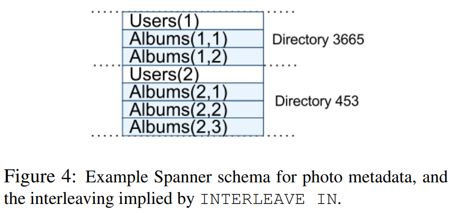

*本篇文章是对论文[In Search of an Understandable Consensus Algorithm (Extended Version)](http://pages.cs.wisc.edu/~remzi/Classes/739/Spring2004/Papers/raft.pdf)的原创翻译，转载请严格遵守[CC BY-NC-SA协议](https://creativecommons.org/licenses/by-nc-sa/4.0/)。*

<!--more-->

## 作者

James C. Corbett, Jeffrey Dean, Michael Epstein, Andrew Fikes, Christopher Frost, JJ Furman, Sanjay Ghemawat, Andrey Gubarev, Christopher Heiser, Peter Hochschild, Wilson Hsieh,Sebastian Kanthak, Eugene Kogan, Hongyi Li, Alexander Lloyd, Sergey Melnik, David Mwaura, David Nagle, Sean Quinlan, Rajesh Rao, Lindsay Rolig, Yasushi Saito, Michal Szymaniak, Christopher Taylor, Ruth Wang, Dale Woodford

Google, Inc.

## 摘要

Spanner是Google的可伸缩（scalable）、多版本（multi-version）、全球化分布式（globally-distributed）、同步多副本（synchronously-replicated）数据库。它是在全球范围分布数据的系统，支持外部一致性（externally-consistent）分布式事务。本文描述了Spanner的结构、特性、多种底层设计决策的原理、和一种暴露时钟不确定度（uncertainty）的新型时间API。该API和它的实现对支持外部一致性和多种强大的特性来说非常重要，这些特性包括：跨所有Spanner的过去数据的非阻塞读取、无锁只读事务、和原子性模型（schema）修改。

## 1. 引言

Spanner是一个可伸缩、全球化分布的数据库，其由Google设计、构建、并部署。在抽象的最高层，Spanner是一个分布在全世界的多个数据中心中的跨多个Paxos[21]状态机集合分片（shard）数据的数据库。副本被用作全球的可用性和地理位置优化；客户端自动地在副本间进行故障转移。在数据总量或服务器的数量变化时，Spanner自动地跨机器重分片数据，并自动地在机器间（甚至在数据中心间）迁移数据来平衡负载和应对故障。Spanner被设计为能扩展到跨数百个数据中心的数百万台机器与数万亿个数据库行。

应用程序可以使用Spanner来实现高可用，即使在面对大范围自然灾害时，Spanner也可以通过在大洲内甚至跨大洲间备份数据。我们最初的使用者是F1[35],F1是对Google的广告后端的重写。F1使用了5份分布在美国的副本。大部分的其它的应用程序可能在同一个地理区域但故障模式相对独立的3到5个数据中心中备份数据。因此，大多数应用程序选择了低延迟而不是高可用，只要它们能够容忍1或2个数据中心故障即可。

Spanner的主要目标是管理跨数中心的副本数据，但是我们还花了很多时间设计并实现了在我们的分布式系统基础架构之上的重要的数据库特性。尽管Bigtable[9]能够很好地满足很多项目的需求，但我们还是不断收到用户的抱怨，生成Bigtable对一些类型的应用程序来说难以使用：如那些有复杂、不断演进的模型的程序或那些想要在广域副本中维护强一致性的程序。（其他作者也提出了类似的主张[37]。）Google的许多应用程序选择使用Megastore[5]，因为它支持半结构化数据模型和副本同步，尽管它的写入吞吐量相对较弱。为此，Spanner从一个类似Bigtable的版本化键值存储（versioned key-value store）演进成了一个多版本时态数据库（temporal multi-version database）。数据被存储在模型化的半关系型表中；数据被版本化，且每个版本自动按照提交时间标记时间戳；旧版本遵循可配置的垃圾回收策略；应用程序可以读取旧实践出ode数据。Spanner支持通用的事务，且提供了基于SQL的查询语言。

作为全球化分布的数据库，Spanner提供了许多有趣的特性。第一，应用程序可以细粒度地动态控制数据的副本配置。应用程序可以执行约束来控制那个数据中心包含哪些数据、数据离它的用户多远（以控制读取延迟）、副本间多远（以控制写入延迟）、维护了多少份副本（以控制持久性、可用性、和读取性能）。数据还能被系统动态、透明地在数据中心间迁移以平衡数据中心间的资源使用率。第二，Spanner有两个在分布式数据库中难以实现的两个特性：Spanner提供了外部一致性（externally-consistent）[16]读写和对一个时间戳的跨数据库全球一致性读取。这些特性让Spanner能支持一致性备份（consistent backups）、一致性MapReduce执行[12]和原子性模型更新，这些操作全在全球范围，甚至在正在进行的事务中。

这些特性有效的原因在于，Spanner会为事务分配在全局都有意义的提交时间戳，尽管事务可能是分布式的。该时间戳反映了串行顺序。另外，串行顺序满足外部一致性（或等价的线性一致性[20]）：如果事务$T_1$在另一个事务$T_2$开始前提交，那么$T_1$的时间戳比$T_2$的小。Spanner是首个能在全球范围提供这些保证的系统。

实现这些属性的关键是一个新的TrueTime API及其实现。该API直接暴露了时钟不确定度，并保证了Spanner的时间戳基于其实现提供的界限内。如果不确定度较大，Spanner会减速以等待该不确定度。Google的集群管理软件提供了TureTime API的一种实现。该实现通过使用多种现代时钟参考（GPS和原子时钟）来让不确定度保持较小（通常小于10ms）。

[第二章](#2-)描述了Spanner实现的结构、它的特定集合、和渗透进设计中的工程决策。[第三章](#3-)描述了我们的新TureTime API并概述了其实现。[第四章](#4-)描述了Spanner如何使用TrueTime来实现具有外部一致性的分布式事务、无锁只读事务、和原子性模型更新。[第五章](#5-)提供了Spanner性能和TrueTime表现的一些benchmark，并讨论了F1的经验。[第六、七、八章](#6-)，描述了相关工作和展望，并总结了我们的结论。

## 2. 实现

本章描述了Spanner的结构和Spanner底层实现的原理。然后，我们描述了*目录（directory）*抽象，其被用作管理副本和局部性（locality），它还是数据移动的单位。最后，我们描述了我们的数据模型、为什么Spanner看上去像关系型数据库而不是键值存储、怎样能让应用程序控制数据的局部性。

一份Spanner的部署被称为一个*universe*。因为Spanner在全球范围管理数据，所以只有少数的几个运行中的universe。我们目前运行了一个测试/练习场universe、一个开发/生产universe、和一个仅生产的universe。

Spanner被组织为*zone*的集合，每个zone都大致类似于一份Bigtable服务器集群[9]的部署。zone是管理部署的单位。zone的集合还是数据能够跨位置分布的位置集合。当有新的数据中心加入服务或旧的数据中心被关闭时，zone可以加入运行中的系统或从运行中的系统移除。zone也是物理隔离的单位：在一个数据中心中可能有一个或多个zone，例如，如果不同的应用程序的数据必须跨同数据中心的不同的服务器的集合分区时会出现这种情况。

**图1**描述了Sppanner universe中的服务器。一个zone有一个*zonemaster*和几百到几千个*spanserver*。前者为spannerserver分配数据，后者向客户端提供数据服务。客户端使用每个zone的*location proxy*来定位其分配到的为其提供数据服务的spanserver。*universe master*和*placement driver*目前是单例。universe master主要是一个控制台，其显示了所有zone的状态信息，以用来交互式调试。placement driver分钟级地处理zone间的自动化迁移。placement driver定期与spanserver交互来查找需要移动的数据，以满足更新后的副本约束或平衡负载。出于空间的原因，我们仅详细描述spanserver。

### 2.1 spanserver软件栈

本节着眼于spanserver的实现以阐述副本和分布式事务如何被分层到我们的基于Bigtable的实现中。软件栈如**图2**所示。在最底层，每个spanserver负责100到1000个被称为*tablet*的数据结构实例。每个tablet都类似于Bigtable的tablet抽象，其实现了一系列如下的映射：

$$ (key:string, timestamp:int64) \rightarrow string $$

不像Bigtable，Spannner为数据分配时间戳，这是一种让Spanner更像多版本数据库而不是键值存储的重要的方式。tablet的状态被保存在一系列类B树的文件和一个预写日志（write-ahead log，WAL）中，它们都在一个被称为Colossus的分布式文件系统中（Google File System[15]的继任者）。

为了支持副本，每个spanserver在每个tablet上实现了一个Paxos状态机。（早期的Spanner原型支持为每个tablet实现多个Paxos状态机，这让副本配置更加灵活。但是其复杂性让我们放弃了它。）每个状态机在它相关的tablet中保存其元数据和日志。我们的Paxos实现通过基于事件的leader租约（lease）来支持长期领导者，租约的默认长度为10秒。目前Spanner的实现记录每次Paxos写入两次：一次在tablet的日志中，一次在Paxos的日志中。这种选择是权宜之策，我们最终很可能会改进这一点。我们的Paxos实现是流水线化的，以在有WAN延迟的情况下提高Spanner的吞吐量；但是Paxos会按顺序应用写入（[第四章](#4-)会依赖这一点）。

Paxos状态机被用来实现一致性的多副本映射的集合。每个副本的键值映射状态被保存在其对应的tablet中。写操作必须在leader处启动Paxos协议；读操作直接从任意足够新的副本处访问其底层tablet的状态。副本的集合是一个Paxos *group*。

在每个spanserver的每个leader副本中，都实现了一个*lock table*来实现并发控制。lock table包括2阶段锁（two-phase lock）状态：它将键的范围映射到锁状态。（值得注意的是，长期Paxos leader对高效管理lock table来说十分重要。）在Bigtable和Spanner中，lock table都是为长期事务设计的（例如报告生成，其可能需要几分钟的时间），其在存在冲突的乐观并发控制协议下表现不佳。需要获取同步的操作（如事务性读取）会在lock table中请求锁；其它的操作会绕过lock table。

在每个spanserver的每个leader副本中，还实现了一个*transaction manager*来提供分布式事务支持。transaction manager被用来实现*participant leader*；group中的其它副本称为*participant slave*。如果事务仅有一个Paxos group参与（大多数事务都是这种情况），它可以绕过transaction manager，因为lock table和Paxos共同提供了事务性。如果事务有超过一个Paxos group参与，那些group的leader会协调执行两阶段提交（two-phase commit，2PC）。参与的group之一会被选为*coordinator*：该group的participant leader会作为*coordinator leader*，该group的salve会作为*coordinator slave*。每个transaction manager的状态会被保存在底层Paxos group中（因此它也是多副本的）。

### 2.2 目录和放置

在键值映射集合的上层，Spanner的实现支持一种被称为*目录（directory）*的*桶（bucket）*抽象，它是一系列共享相同的前缀（prefix）的连续的键的集合。（术语*目录*的选择处于历史上的偶然，更好的术语可能是*桶*。）我们将在[章节2.3](#23-)中解释前缀的来源。对目录的支持让应用程序能够通过谨慎地选取键来控制它们的数据的局部性。

目录是数据放置（placement）的单位。在同一个目录的所有数据都有相同的副本配置。当数据在Paxos group间移动时，它是以目录为单位移动，如**图3**所示。Spanner可能会为分流Paxos group的负载移动目录、可能为了把经常被一起访问的目录放在同一个group中而移动目录、或为了使目录靠近其访问者而移动目录。目录可以在客户端操作正在运行时移动。50MB的目录的移动期望在几秒内完成。

一个Paxos group可能包含多个目录，这意味着Spanner的tablet与Bigtable的tablet不同：Spanner的tablet并非必须是行空间上按字典序连续的分区。Spanner的tablet是一个装有多个行空间的分区的容器。因为这样做可以一起定位多个经常被一起访问的目录，所以我们做了这样的决策。

*movedir*是用来在Paxos group间移动目录的后台任务[14]。movedir也被用作为Paxos group添加或移除副本[25]，因为Spanner目前不支持Paxos内的配置变更。movedir没被实现为单个事务，这样可以避免阻塞大量数据移动时进行的读写。相反，moveidr会在开始移动数据时注册该事件，并在后台移动数据。当它已经移动完所有数据时，它会启动一个事务来原子性地移动剩余的少量数据，并更新两个Paxos group的元数据。

目录也是能由应用程序指定的副本地理属性（geographic-replication property，或者简称”放置“，*placement*）的最小单位。我们的放置专用语言（placement-specification language）分离了管理副本配置的职责。管理员能控制两个维度：副本的数量和类型、那些副本的地理上的放置。管理员会在这两个维度上创建一个由命名选项组成的菜单（例如，北美，5路副本与1个witness）。应用程序通过通过给每个数据库和（或）每个独立的目录打上一个由这些选项组合而成的标签来控制数据副本策略。例如，应用程序可能将每个终端用户的数据保存在各自的目录中，这让用户A的数据能在欧洲有3个副本，并让用户B的数据能在北美有5个副本。

为了解释的简介，我们对其做了简化。事实上，如果目录增长得过大，Spanner会将其分片成多个*段（fragment）*。段可能由不同的Paxos group提供服务（因此也由不同的服务器提供）。事实上，movedir在group之间移动的是段，而不是整个目录。

### 2.3 数据模型

Spanner为应用程序暴露了如下一系列的数据特性：数据模型基于模型化的（schematized）半关系型表、一种查询语言、和通用的事务。驱动支持这些特性的因素有很多。支持模型化半关系型表和副本同步的需求来自于Megastore的流行[5]。Google内部至少有300个应用程序使用Megastore（尽管其性能相对较低），因为它的数据模型管理起来比Bigtable的更简单，且它支持跨数据中心的副本同步。（Bigtable仅支持跨数据中心的副本最终一致性。）使用Megastore的比较出名的Google应用程序的例子有Gmail、Picase、Calendar、Android Market、AppEngine。支持类SQL查询语言的需求也很清晰，因为Dremel[28]作为一款交互式数据分析工具十分流行。最后，Bigtable缺少跨行事务经常被抱怨，构建Percolator[32]的部分原因就是为了解决这一问题。一些作者声称支持通用的两端提交带来的性能或可用性问题导致的开销太过昂贵[9, 10, 19]。我们认为让应用程序开发者解决因过度使用事务而导致的性能瓶颈更好，而不让开发者总是围绕缺少事务的问题写代码。

应用程序数据模型在Spanner的实现提供的“目录-桶”键值映射（directory-bucketed key-value mapping）的上层。应以讴歌in程序在universe中创建一个或多个*数据库（database）*。每个数据库可以容纳数量无限的模型化*表（table）*。表看上去像关系型数据库的表，有行、列、和版本值。我们不会深入Spanner的查询语言的细节。它看上去像有支持protocol-buffer值字段扩展的SQL。

Spanner的数据模型不是纯关系型的，其行必须有名字。更精确地说，每个表要求有一个由一个或多个主键列组成的有序集合。这一需求让Spanner看起来仍然像一个键值存储：主键构成了行名，每张表定义了主键列到非主键列的映射。行仅当其键的某个值（即使是NULL）被定义时才存在。采用这种结构很有用，因为它让应用程序能够通过它们对键的选择来控制数据的局部性。

**图4**中有一个照片元数据的Spanner模型的示例，每个用户的每个相册（album）都有有一条元数据。该模型语言与Megastore的类似，另外它还要求每个Spanner数据库必须通过客户端分区为一个或多个有层次结构的表。客户端程序通过`INTERLEAVE IN`在数据库模型中声明该结构层次。结构层次上层的表是目录表。目录表的每行的键为$K$，它与所有后继（descendant）表中按字典序以$K$开头的行一起构成一个目录。`ON DELETE CASCADE`表示删除目录表中的行时删除所有相关的子行。图中还阐释了样例数据库的交错结构（interleave）：例如，$Albums(2,1)$表示$Albums$表中$user\ id\ 2, album\ id\ 1$的行。这种通过表交错形成目录的方式十分重要，因为这让客户端可以描述多个表间存在的局部性的关系，这是高性能分布式分片数据库必须的。如果没有它，Spanner将无从得知最重要的局部性关系。

## 3. TrueTime

本章描述了TrueTime API并概述其实现。我们将大部分的细节放在了另一篇论文中，本文的目标是证明这一API的能力。**表1**列出了API的方法。TrueTime显式地将时间表示为$TTinterval$，其为一个有时间不确定性界限的间隔时间（不像标准的时间接口，标准时间接口不会给客户端不确定性的概念）。$TTinterval$的接入点（endpoint）是$TTstamp$类型。$TT.now()$方法返回一个$TTinterval$，该时间间隔保证了包含$TT.now()$被调用的绝对时间。该时间类似于带有闰秒（leap-second）的UNIX时间。（译注：此处原文为“The time epoch is analogous to UNIX time with leap-second smearing.”）定义瞬时错误的界限为$\epsilon$，其为间隔宽度的一半，定义平均错误界限为$\bar{\epsilon}$。$TT.after()$和$TT.before()$是对$TT.now()$的方便的封装。

函数$t_{abs}(e)$表示事件$e$的绝对时间。用更加正式的术语来说，TrueTime能够保证，对于一次调用$tt = TT.now()$来说，$tt.earliest \le t_{abs}(e_{now}) \le tt.latest$，其中$e_{now}$表示调用事件。

TrueTime在底层使用的参考时间为GPS和原子时钟。TrueTime使用了两种形式的参考时间，因为它们有不同的故障模式。GPS参考源的弱点有天线和接收器故障、本地无线电干扰、相关故障（例如，如闰秒处理不正确的设计故障、和欺骗等）、和GPS系统停机。原子时钟可能会以与GPS和彼此不相关的方式发生故障，且在长时间后会由于频繁错误而发生明显的漂移。

TrueTime通过每个数据中心的*time server*机器集合和每个机器的*timeslave daemon*的实现。大多数的master都有带专用天线的GPS接收器；这些master在物理上被划分开，以减少天线故障、无线电干扰、和欺骗的影响。其余的master（我们称其为*Armageddon master*）配备了原子时钟。原子时钟并没有那么贵：Armageddon master的成本与GPS master的成本在同一数量级。所有master的参考时间通常彼此不同。每个master还会通过它自己的本地时钟较差验证其参考时间提前的速率，如果二者有实质性的分期，则自己退出集合。在同步期间，Armageddom master会保守地给出从最坏的情况下的时钟漂移得出的缓慢增长的时间不确定性。GPS master会给出通常接近零的的不确定性。

每个daemon会轮询各种master[29]来减少任意一个master的错误的影响。一些是从就近的数据中心选取的GPS master，一些是从更远的数据中心的GPS master，对Armageddon master来说也是一样。daemon使用一种Marzullo算法的变体[27]来检测并拒绝说谎者，并与没说谎的机器同步本地的机器时钟。为了防止本地时钟故障，应该淘汰掉发生偏移频率大于从组件规格和操作环境得出的界限的机器。

在同步期间，daemon会给出缓慢增长的时间不确定性。$\epsilon$保守地从最坏的本地市中偏移得出。$\epilson$还依赖time master的不确定性和到time master的通信延迟。在我们的生产环境中，$\epsilon$通常是时间的锯齿波函数（sawtooth functon），每次轮询的间隔大概在1ms到7ms间。因此，大部分时间里$\bar{\epsilon}$为4ms。目前，daemon的轮询间隔为30秒，且当前的漂移速率被设置为200ms/s，二者一起组成了0到6ms的锯齿边界。剩下的1ms来自于到time master的通信延迟。在出现故障时，锯齿波可能会出现偏移。例如，偶尔的time master的不可用可能导致数据中心范围的$\epsilon$增加。同样，机器和网络连接过载可能导致$\epsilon$偶尔出现局部峰值。

## 4. 并发控制

本章描述了如何使用TrueTime确保并发控制相关的正确性属性与如何使用那些属性来实现如外部一致事务、无锁只读事务、和过去数据的非阻塞读取等特性。这些特性能实现例如确保整个数据库在时间戳$t$时刻的读取能够准确的看到截止$t$时刻的每个提交的事务的影响等功能。

此外，将Paxos可见的写入（我们称之为*Paxos write*，除非上下文明确提到）与Spanner客户端写入区分开非常重要。例如，两阶段提交会在准备阶段（prepare phase）生成一个Paxos write，而没有相关的Spanner客户端写入。

### 4.1 时间戳管理

**表2**列出了Spanner支持的操作类型。Spanner的实现支持读写事务（read-write transaction）、只读事务（read-only transaction））（即预先声明的快照隔离事务，(predeclared snapshot-isolation transactions）、和快照读取（snapshot read）。单独我的写入作为读写事务实现；单独的非快照读作为只读事务实现。二者都在内部重试。（客户端不需要自己编写重试循环。）

只读事务是一种有快照隔离[6]的优势的事务。只读事务必须预先声明其没有任何写入；这并非只是没有任何写入操作的读写事务。只读事务中的读取会以系统选取的时间戳无锁执行，这样可以让到来写入不会被阻塞。只读事务中的读取操作可以在任何足够新的副本上执行（见[章节4.1.3](#413-)）。

快照读取是无锁执行的对过去数据的读取操作。客户端可能为每个快照读取制定一个时间戳，也可能提供一个所需的时间戳的过期上限并让Spanner选取一个时间戳。在任一种情况下，快照读取都可以在任何足够新的副本上执行。

对于只读事务和快照读取来说，一旦时间戳被选取后，不可避免地需要提交，除非该时间戳的数据已经被垃圾回收掉了。因此，客户端可以避免在重试循环中缓冲结果。当一个服务器故障时，客户端可以在内部对另一台服务器重复该时间戳和当前读取的位置继续执行查询。

#### 4.1.1 Paxos leader租约

Spanner的Paxos实现使用了定时的租约来长期保持领导权（默认为10秒）。潜在的leader回发送请求以获得定时的*lease vote（租约投票）*，当leader收到异性数量的lease vote后，leader会知道其持有了租约。副本会在成功的写入操作中隐式地延长其lease vote，且leader会在lease vote快要过期时请求延长lease vote。定义leader的*lease interval（租约区间）*的起始时间为leader发现了它收到了一定数量的lease vote的时间，结束时间为它不再有一定数量的lease vote的时间（因为一些lease vote过期了）。Spanner依赖如下的不相交的定性（invariant）：对于每个Paxos group，每个Paxos的leader的lease interval与所有其它的leader的lease interval不相交。附录A描述了该定性是如何成立的。

Spanner的实现允许Paxos leader通过让slave释放其lease vote来退位（abdicate）。为了保持不相交性不变，Spanner对可以退位的时间进行了约束。定义$s_{max}$为leader使用的最大的时间戳。后面的章节会说明何时可以增加$s_{max}$的值。在退位前，leader必须等到$TT.after(s_{max})$为true。

#### 4.1.2 为读写事务分配时间戳

事务的读写使用两阶段锁。因此，可以在已经获取了所有锁之后与任何锁被释放之前的任意时间里为其分配时间戳。对一个给定的事务，Spanner为其分配的时间戳是Paxos为Paxos write分配的表示事务提交的时间戳。

Spanner依赖如下的单调定性：在每个Paxos group内，Spanner以单调增加的顺序为Paxos write分配时间戳，即使跨leader也是如此。单个leader副本可以单调递增地分配时间戳。通过使用不相交定性，可以在跨leader的情况下保证该定性：leader必须仅在它的leader租约的期限内分配时间戳。注意，每当时间戳$s$被分配时，$s_{max}$会增加到$s$，以保持不相交性。

Spanner还保证了如下的的外部一致性定性：如果事务$T_2$的开始在事务$T_1$提交之后，那么$T_2$的提交时间戳一定比$T_1$的提交时间戳大。定义事务$T_i$的开始事件与提交事件分别为$e_i^{start}$和$e_i^{commit}$、事务$T_i$的提交时间戳为$s_i$。该定性可以使用$t_{abs}(e_1^{commit}) < t_{abs}(e_2^{start}) \implies s_1 < s_2$表示。这一用来执行事务与分配时间戳的协议遵循两条规则，二者共同保证了定性，如下所示。定义写入事务$T_i$的提交请求到达coordinator leader的事件为$e_i^{server}$。

**开始（Start）：** 写入事务$T_i$的coordinator leader在$e_i^{server}$会为其计算并分配值不小于$TT.now().latest$的时间戳$s_i$。注意，participant leader于此无关；[章节4.2.1](#421-)描述了participant如何参与下一条规则的实现。

**提交等待（Commit Wait）：** coordinator leader确保了客户端在$TT.after(s_i)$为true之前无法看到任何由$T_i$提交的数据。提交等待确保了$s_i$比$T_i$的提交的绝对时间小，或者说$s_i < t_{abs}(e_i^{commit})$。该提交等待的实现在[章节4.2.1](#421-)中描述。证明：

$$ s_1 < t_{abs}(e_1^{commit}) \tag{commit wait} $$
$$ t_{abs}(e_1^{commit}) < t_{abs}(e_2^{start}) \tag{assumption} $$
$$ t_{abs}(e_2^{start}) \le t_{abs}(e_2^{server}) \tag{causality} $$
$$ t_{abs}(e_2^{server}) \le s_2 \tag{start} $$
$$ s_1 < s_2 \tag{transitivity} $$

#### 4.1.3 在某时间戳处提供读取服务

[章节4.1.2](#412-)中描述的单调性定性让Spanner能够正确地确定副本的状态对一个读取操作来说是否足够新。每个副本会追踪一个被称为*safe time（安全时间）*的值$t_{safe}$，它是最新的副本中的最大时间戳。如果读操作的时间戳为$t$，那么当$t \le t_{safe}$时，副本可以满足该读操作。

定义$t_{safe} = \min(t_{safe}^{Paxos},t_{safe}^{TM})$，其中每个Paxos状态机有safe time $t_{safe}^{Paxos}$，每个transaction manager有safe time $t_{safe}^{TM}$。$t_{safe}^{Paxos}$简单一些：它是被应用的最高的Paxos write的时间戳。因为时间戳单调增加，且写入操作按顺序应用，对于Paxos来说，写入操作不会发生在$t_{safe}^{Paxos}$或更低的时间。

如果没有准备好的（还没提交的）事务（即处于两阶段提交的两个阶段中间的事务），那么$t_{safe}^{TM}$为$\infty$。（对于participant slave，$t_{safe}^{TM}$实际上表示副本的leader的transaction manager，slave可以通过Paxos write中传递的元数据来推断其状态。）如果有任何的这样的事务存在，那么受这些事务影响的状态是不确定的：particaipant副本还不知道这样的事务是否将会提交。如我们在[章节4.2.1](#421-)中讨论的那样，提交协议确保了每个participant知道准备好了的事务的时间戳的下界。对group $g$来说，每个事务$T_i$的participant leader会给其准备记录（prepare record）分配一个准备时间戳（prepare timestamp）$s_{i,g}^{prepare}$。coordinator leader确保了在整个participant group $g$中，事务的提交时间戳$s_i \ge s_{i,g}^{prepare} $。因此，对于group $g$中的每个副本，对$g$中的所有事务$T_i$，$t_{safe}^{TM} = \min_i(s_{i,g^{prepare}})-1$。

#### 4.1.4 为只读事务分配时间戳

只读事务以两阶段执行：分配时间戳$s_{read}$[8]，然后在$s_{read}$处以快照读取的方式执行事务的读取。快照读取能够在任何足够新的副本上执行。

在事务开始后的任意时间分配的$s_{read}=TT.now()$，可以通过像[章节4.1.2](#412-)中针对写入操作提供的参数的方式来保证外部一致性。然而，对这样的时间戳来说，如果$t_{safe}$还没有足够大的时候，在$s_{read}$是对块的读取操作可能需要被阻塞。（另外，在选取$s_{read}$的值的时候，可能还需要增大$s_{max}$的值来保证不相交性。）为了减少阻塞的可能性，Spanner应该分配能保证外部一致性的最老的时间戳。[章节4.2.2](#422-)解释了如何选取这样的时间戳。

### 4.2 细节分析

本节解释了读写事务和只读事务中之前省略的一些使用的细节，以及用来实现原子性模型变更的特殊事务类型的实现。然后还描述了对之前描述的基本方案的一些改进

#### 4.2.1 读写事务

像Bigtable，事务中的写入操作在提交前会在客户端缓冲。这样，事务中的读取操作无法看到事务的写入操作的效果。这种设计在Spanner中很好，因为读操作会返回任何读取的数据的时间戳，而未提交的写入操作还没有被分配时间戳。

读写事务中的读操作使用了伤停等待（wound-wait）[33]来避免死锁。客户端将读取提交给响应的group中的leader副本，请求读取锁并读取最新的数据。当事务保持打开（open）时，它会发送保活消息（keepalive message）以避免participant leader将其事务超时。当客户端完成了所有的读取并缓冲了所有的写入后，它会开始两阶段提交。客户端选取一个coordinator group并向每个participant的leader发送带有该coordinator的标识和和所有缓冲的写入的提交消息。让客户端驱动两阶段提交能够避免跨广域链路发送两次数据。

非coordinator participant的leader先获取写入锁。然后它会选取一个必须大于任意它已经分配给之前的事务的准备时间戳（以保证单调性），并通过Paxos将准备记录写入日志。然后每个participant会通知coordinator其准备时间戳。

coordinator leader同样会获取写入锁，但是跳过准备阶段。它在收到其它所有的participant leader的消息后为整个事务选取一个时间戳。该提交时间戳$s$必须大于或等于所有的准备时间戳（以满足[章节4.1.3](#413-)中讨论的约束）、大于coordinator收到其提交消息的时间$TT.now().latest$、并大于任何该leader已经分配给之前事务的时间戳（同样为了保证单调性）。然后，coordinator leader会通过Paxos将提交记录写入日志（或者，如果在等待其它participant是超时，那么会打断它）。

