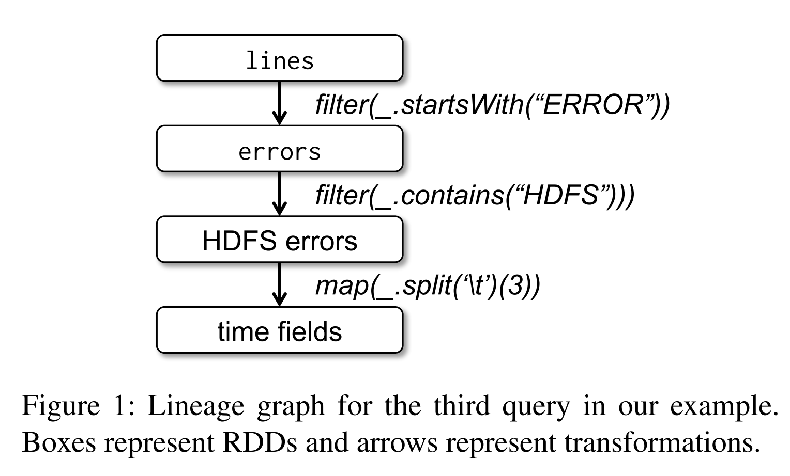
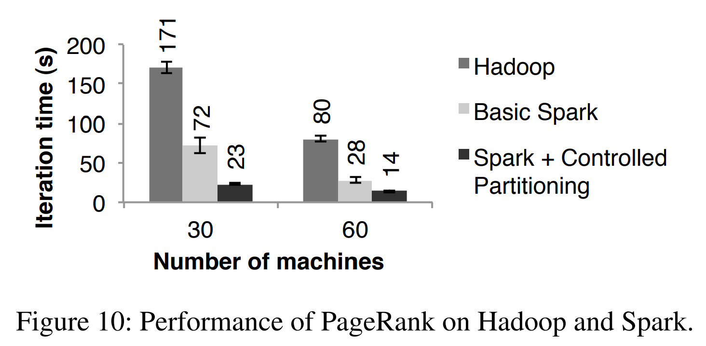

*本篇文章是对论文[RDD-NSDI12-FINAL138](https://www.usenix.org/system/files/conference/nsdi12/nsdi12-final138.pdf)的原创翻译，转载请严格遵守[CC BY-NC-SA协议](https://creativecommons.org/licenses/by-nc-sa/4.0/)。*


<sup>[]</sup>

<!--more-->

## 摘要

我们提出了一个能够使开发者在大型集群上执行内存式计算且带有容错的分布式内存的抽象——Resilient Distributed Datasets（RDD，弹性分布式数据集）。RDD的想法由在当前计算框架中处理效率不高的两类应用程序驱动：迭代算法和交互式数据挖掘工具。在这两种情况下，将数据保存在内存中能够将性能提高一个数量级。为了实现有效地容错，RDD提供了共享内存的一个受限的形式，其基于粗粒度的变换而不是细粒度的共享状态更新。然而，我们发现RDD足以表示很广泛的计算类型，包括最近像Pregel一样的专门针对迭代任务的程序模型，以及在新应用程序中这些模型表达不出的模型。我们在被称为Spark的系统中实现了RDD，并通过各种用户程序和benchmark来评估这个系统。

## 1. 引言

像MapReduce<sup>[10]</sup>和Dryad<sup>[19]</sup>之类的集群计算框架已广泛引用于大规模数据分析。这些系统让用户可以通过一系列高层操作来编写并行计算，不需要担心工作的分布与容错。

尽管当前的框架提供了大量访问集群资源的抽象，它们仍缺少对利用分布式内存的抽象。这使它们对一类新兴的重要应用程序来说效率很低。这类新兴的应用程序会复用（reuse）多个计算的中间结果。数据复用在很多迭代（iterative）式机器学习和图算法（包括PageRank、K-means聚类、逻辑回归等）中很常见。另一个备受关注的使用场景是交互式数据挖掘，该场景下用户会在同一个数据的子集上运行多个临时查询。不幸的是，在大部分当前的框架中，在计算间（如两个MapReduce的job间）复用数据的唯一方式是将其写入外部稳定存储系统，如分布式文件系统。由于这样做需要数据副本、磁盘I/O和序列化等占用大部分程序执行时间的操作，这会导致非常可观的额外开销。

由于意识到了这一问题，研究者们已经开发了为一些需要复用数据的应用程序专门设计的框架。例如，Pregel<sup>[22]</sup>是一个为迭代式图计算设计的系统，其能将中间数据保存在内存中；HaLoop<sup>[7]</sup>提供了迭代式MapReduce接口。然而，这些框架仅支持特殊的编程模式（例如，循环一系列MapReduce的step），并在这些模式中进行隐式数据共享。它们不支持更普遍的数据复用抽象，如允许用户将几个数据集加载到内存中并运行跨这些数据集的临时查询。

在本文中，我们提出了一种新的抽象——resilient distributed datasets（RDD），其能在广泛的应用程序中进行高效数据复用。RDD是能容错的并行数据结构，其使用户能够显式地将中间结果在内存中持久化，并控制它们的分区以优化数据位置，且能够对其使用丰富的操作。

设计RDD的主要挑战是定义能够高效地提供容错的编程接口。已有的为集群中内存式存储（分布式共享内存<sup>[24]</sup>、键值存储<sup>[25]</sup>数据库和Piccolo<sup>[27]</sup>等）设计的抽象，提供了基于细粒度更新（fine-grained update）变更状态（如表中的单元格）的接口。在这种接口中，提供容错的唯一几种方式是将数据跨机器做副本或跨机器记录更新日志。这两种方法对于数据敏感性工作负载来说开销过于高昂，因为它们需要通过集群的网络复制大量的数据，而集群的网络带宽远低于RAM，且它们造成了大量的存储额外开销。

与这些系统不同，RDD提供了基于粗粒度（coarse-grained）的变换（如map、filter和join）接口，其对许多数据项应用相同的操作。这使它们能够通过记录构建数据集（它的普系统）使用的变换而不是对实际数据使用的变换的方式，来高效地提供容错<sup>注1</sup>。如果RDD的一个分区丢失，RDD有足够的关于它如何被从其它RDD导出的信息，来重新计算仅这一分区。因此，丢失的数据可被恢复，数据恢复速度通常非常快，且不需要开销高昂的副本。

> 注1：在一些RDD中，当数据的延伸链增长得很大时，对数据建立检查点非常有用。我们将在[章节5.4](#54-)中讨论如何操作。

尽管基于粗粒度变换的接口最初似乎非常有限，但RDD仍非常适用于许多并行程序，因为这些程序本身就对许多数据项应用相同的操作。事实上，我们发现RDD可以高效地表示很多集群编程模型，目前这些模型被不同的系统分别提出，其包括MapReduce、DryadLINQ、SQL、Pregel和HaLoop，以及新式应用程序中无法表示的模型，如交互式数据挖掘。RDD的这种仅通过引入新的框架就能适配过去已经满足了的计算需求的能力，在我们看来是RDD抽象能力最令人信服的证据。

我们在被称为Spark的系统中实现了RDD，该系统被在UC Berkeley和许多公司的研究和生产应用程序中使用。Spark在Scala编程语言<sup>[2]</sup>中提供了一个类似DryadLINQ<sup>[31]</sup>的很方便的语言集成的编程接口（language-integrated programming interface）。另外，Spark可被在Scala解释器中交互式查询大数据集时使用。我们认为Spark是第一个能够以交互所需的速度使用通用编程语言在集群中进行内存数据挖掘的系统。

我们通过小批量benchmark和在我们的应用程序中测量的方式来评估RDD和Spark的性能。我们发现Spark在迭代式应用程序中比Hadoop快了20倍，在真实的数据分析报告中快了40倍，且可在交互时以5~7秒的延时来扫描1TB的数据集。更重要的是，为了说明RDD通用性，我们在Spark之上实现了Pregel和HaLoop编程模型作为相对小的库（每个200行代码），包括他们使用的位置优化。

本文从RDD（[第二章](#2-)）和Spark（[第三章](#3-)）的概览开始。接着我们讨论了RDD的内部表示法（[第四章](#4-)）、我们的实现（[第五章](#5-)）和实验结果（[第六章](#6-)）。最后，我们讨论了RDD如何实现现有的几个集群编程模型（[第七章](#7-)），调查了相关工作（[第八章](#8-)）并进行总结。

## 2. Resilient Distributed Datasets（RDD）

本章提供了RDD的概览。首先，我们定义了RDD（[章节2.1](#21-)），然后介绍了它们在Spark中的编程接口（[章节2.2](#22-)）。接着，我们将RDD与细粒度的共享内存抽象进行了对比（[章节2.3](#23-)）。最后，我们讨论了RDD模型的限制（[章节2.4](#24-)）。

### 2.1 RDD抽象

从形式上看，RDD是一个只读的分区的记录的集合。RDD仅能通过确定性（deterministic）操作，从（1）稳定存储中的数据或（2）其他RDD上创建。我们将这些操作成为“变换”，以与RDD上的其他操作进行区分。变换的例子包括*map*、*filter*和*join*。<sup>注2</sup>

> 注2：尽管单独一个RDD是不可变的，但是还是可以通过使用多个RDD来实现可变状态，以表示数据集的多个版本。我们使RDD不可变是为了使其能够更容易描述谱系图，但这等价于将我们的抽象变为多版本数据集并在谱系图中跟踪版本号。

RDD不需要在所有时间都被实体化（materialized）。RDD有足够关于它是如何从其他数据集（它的谱系图）导出的信息，以能够从稳定存储中的数据计算它的分区。这是一个很强大的属性：本质上讲，如果RDD不能再故障后重构，那么应用程序就无法引用它。

最后，用户还能控制RDD的另两个方面：持久化（persistence）和分区（partitioning）。用户可以指出他们需要复用哪个RDD并为其选自一个存储策略（如内存存储）。用户还可以要求RDD的元素基于每个记录中的key跨机器分区。这对位置优化很有帮助，如保证两个将要被*join*到一起的数据集会按照相同的哈希分区。

### 2.2 Spark编程接口

Spark通过类似DryadLINQ<sup>[31]</sup>和FlumeJava<sup>[8]</sup>的语言集成的API来暴露RDD，每个数据集被表示为一个对象，变换通过调用这些对象中的方法来实现。

编程人员从通过对稳定存储中的数据进行变换（如*map*和*filter*）来定义一个或更多的RDD开始。接下来，编程人员可以在action中使用这些RDD，actions是给应用程序返回值或将数据导出到存储系统的操作。action的例子包括*count*（返回数据集中元素数）、*collect*（返回元素本身）、*save*（将数据集输出至存储系统）。像DryadLINQ一样，Spark在RDD第一次被在action使用时懒式计算它，因此Spark可以将变换流水线化。

另外，编程人员可以调用*persist*方法来指定他们在未来的操作中需要复用的RDD。Spark默认会会将RDD在内存中持久保存，但Spark会在没有足够RAM的时候将其写入磁盘。用户可以可用*persisi*的标识请求其他的存储策略，如仅在磁盘中存储RDD或跨机器对RDD做副本。最后，用户可以对每个RDD设置持久化优先级，以指定内存中的那个数据会最先被写入到磁盘。

#### 2.2.1 样例：终端日志挖掘

假设一个Web服务发生了错误，且有一个想要通过搜索Hadoop文件系统（HDFS）中TB级的日志来找到原因的操作。通过使用Spark，该操作可以仅将跨一系列节点的错误信息从日志装入RAM，并交互式地查询它们。该编程人员首先需要编写如下Scala代码：

```scala

lines = spark.textFile("hdfs://...")
errors = lines.filter(_.startsWith("ERROR"))
errors.persist()

```

第一行定义了一个以HDFS文件（该文件由多行纯文本组成）作为后端的RDD，第二行获取了一个从该RDD过滤得到的新RDD。第三行要求`errors`在内存中持久化，这样它就可以被其他的查询共享。注意*filter*的参数是一个Scala闭包的表达式。

此时，集群中没有任何任务执行。然而，用户现在可以在action中使用这个RDD。例如，想要统计消息数量：

```scala

errors.count()

```

用户也可以使用该RDD和其变换结果进行更多变换，就像下面代码中的那样：

```scala

// Count errors mentioning MySQL:
errors.filter(_.contains("MySQL")).count()

// Return the time fields of errors mentioning
// HDFS as an array (assuming time is field
// number 3 in a tab-separated format):
errors.filter(_.contains("HDFS"))
      .map(_.split('\t')(3))
      .collect()

```

在第一个涉及`errors`的action执行后，Spark会将`errors`的分区保存在内存中，这样大大提高了随后对其的计算速度。需要注意的是，基RDD `lines`没有被载入到RAM中。因为错误信息可能仅占数据的一小部分（小到足够放入内存中），所以这样是合理的。

最后，为了阐明我们的模型如何实现容错，我们在**图1**中展示了第三个查询的谱系图。在该查询中，我们从基于`lines`上过滤器的结果`errors`开始，在运行*collect*前对其应用更多的*filter*和*map*。Spark的调度器会后续的两个变换流水线化，并向持有`errors`分区缓存的节点发送一系列任务来对计算它们。另外，如果`errors`的一个分区丢失，Spark会通过仅对其响应的`lines`的分区应用`filter`来重建这一分区。



### 2.3 RDD模型的优势

为了理解作为分布式内存抽象（distributed memory abstraction）的RDD模型的好处，我们在**表1**中将其与分布式共享内存（distributed shared memory，DSM）进行了对比。在DSM系统中，应用程序可以读写全局地址空间的任意位置。主要注意的是，在该定义下，不寂寞包括了传统的共享内存系统<sup>[24]</sup>，还包括应用程序对共享状态进行细粒度写入的系统，这类系统包括Piccolo<sup>[27]</sup>，其提供了共享的DHT（Distributed Hash Table）和分布式数据库。DSM是一种非常通用的抽象，但是它的通用性使其很难以在商用集群上实现高性能和容错能力。

<table style="text-align:center;">
  <tr>
    <th colspan=3>表1 RDD与DSM的对比</th>
  </tr>
  <tr>
    <th>方面</th>
    <th>RDD</th>
    <th>DSM</th>
  </tr>
  <tr>
    <td>读</td>
    <td>粗粒度或细粒度</td>
    <td>细粒度</td>
  </tr>
  <tr>
    <td>写</td>
    <td>粗粒度</td>
    <td>细粒度</td>
  </tr>
  <tr>
    <td>一致性</td>
    <td>不重要（不可变）</td>
    <td>取决于app或runtime</td>
  </tr>
  <tr>
    <td>故障恢复</td>
    <td>细粒度且使用谱系图额外开销较小</td>
    <td>需要检查点和程序回滚</td>
  </tr>
  <tr>
    <td>掉队者缓解</td>
    <td>可通过任务备份实现</td>
    <td>难</td>
  </tr>
  <tr>
    <td>任务位置选择</td>
    <td>基于数据位置自动化</td>
    <td>取决于app（runtime目标为透明性）</td>
  </tr>
  <tr>
    <td>没有足够RAM的行为</td>
    <td>类似现有的数据流系统</td>
    <td>性能低（使用swap？）</td>
  </tr>
</table>

RDD和DSM的主要区别是，RDD只能通过粗粒度的变换创建（“写入”），而DSM允许对每个内存位置进行读写。<sup>注3</sup>这将RDD的使用限制在执行批量写入的应用程序中，但也使其能够进行更高效的容错。在实际情况下，RDD不需要承担检查点的开销，因为其可通过谱系图恢复。<sup>注4</sup>除此之外，在故障发生时，RDD中仅丢失的分区需要被重新计算且它们可以在不同节点上并行地重新计算，不需要回滚整个程序。

> 注3：需要注意的是，RDD的读操作仍可以使细粒度的。例如，应用程序将RDD当做大型只读查找表来对待。

> 注4：在一些应用程序中，其仍可以对谱系图链较长的RDD创建检查点，我们将在[章节5.4](#54-)中讨论。然而，因为RDD是不可变的，这一操作可造后台执行，并且不需要像DSM一样对整个应用程序进行快照。

RDD的第二个好处是它们本身不可变的性质让系统能够通过备份较慢的任务的方式缓解较慢的节点（掉队者），就像MapReduce中的那样<sup>[10]</sup>。备份任务在DSM中很难实现，因为一个任务的两份副本会访问内存中相同的位置，并干扰彼此的更新。

最后，RDD还比DSM多提供了两个好处。第一，对于RDD中的批量操作，运行时可以基于数据位置来调度任务以提高性能。第二，当没有足够内存来保存RDD时，只要它仅会被基于扫描的操作使用，那么它就可以优雅地降级（degrade）。RAM放不下的分区可被保存在磁盘中，并将提供与当前的并行数据系统相似的性能表现。

### 2.4 不适用于RDD的应用程序

正如引言中讨论的那样，RDD最适合对数据集中所有元素应用相同操作的的批处理程序。在这些情况下，RDD可以将每一次变换作为谱系图中的一步来高效地记住它们，并在不需要记录当量数据的情况下恢复丢失的分区。RDD不太适用于对共享状态进行细粒度的一不更新，例如为Web应用程序或增量Web爬虫设计的存储系统。对于这些应用程序，使用执行传统的更新日志和数据检查点的系统会更高效，如数据库、RAMCloud<sup>[25]</sup>、Percolator<sup>[26]</sup>和Piccolo<sup>[27]</sup>。我们的目标是为批量分析提供高效的编程模型，将异步应用程序的问题留给专用的系统解决。

## 3. Spark编程接口

Spark在Scala<sup>[2]</sup>（一种运行在Java VM上的静态类型函数式编程语言）中提供了类似DryadLINQ<sup>[31]</sup>的RDD抽象的语言继承的API。我们选择Scala的原因是其集简介（便于交互式使用）和高效（因为其采用静态类型）于一身。然而， RDD的抽象并不一定需要函数式语言。

为了使用Spark，开发者需要编写一个连接集群中worker的驱动程序，如**图2**中所示。该驱动程序定义了一个或多个RDD和在RDD智商的变换。驱动程序中的Spark代码还会追踪RDD的谱系图。worker是长久存在的进程，它们可以将操涉及的RDD分区存储在RAM中。


正如我们在[章节2.2.1](#221-)中的日志挖掘样例一样，用户提供通过传递闭包（字面函数，function literals）的方式为像*map*之类的RDD操作提供参数。Scala将每个闭包表示为一个Java对象，这些对象可被序列化，以通过网络床底该闭包并在另一个节点上载入。Scala还会将任何绑定在闭包中的变量作为Java对象的字段保存。例如，用户可以编写如`var x=5; rdd.map(_ + x)`的代码来将RDD中的每个元素加5.<sup>注5</sup>

> 我们在每个闭包被创建时保存，因此在这个*map*的例子中，尽管$x$改变了，也会被加5。

RDD本身是由元素类型确定的静态类型对象。例如，`RDD[Int]`是整型的RDD。然而，我们大部分的例子都省略的类型，因为Scala支持类型推断。

尽管我们在Scala中暴露RDD的方法从概念上讲很简单，我们还是=不得不使用反射<sup>[33]</sup>来处理Scala闭包对象的相关问题。我们还需要更多的工作来使Spark在Scala解释器中可用，这将在[章节5.2](#52-)中讨论。尽管如此，我们仍不必修改Scala编译器。

### 3.1 Spark中的RDD操作

**表2**列出了Spark中可用的主要的RDD变换和aciton。我们给出了每个操作的签名，在方括号中给出了参数类型。变换是定义一个新的RDD的懒式操作，而action会启动计算以向程序返回值或将数据写入外部存储。

需要注意的是，有些操作（如*join*）仅在RDD的键值对上可用。另外，我们的选择的函数名与其他Scala中的API和其他函数式语言相匹配。例如，*map*是一个一对一的映射，而*flatMap*会将每个输入值映射为一个或多个输出（类似于MapReduce中的*map*）。

除了这些操作外，用户来可以请求持久化RDD。另外，用户可以获取RDD分区顺序，它通过Partitioner类表示，用户可以根据它对另一个数据集进行分区。如*groupByKey*、*reduceByKey*、*sort*等操作会自动地产生按哈希或范围分区的RDD。

![表2 Spark中可用的RDD变换和aciton。Seq[T]表示一个类型的T的元素序列。](table-2.png "表2 Spark中可用的RDD变换和aciton。Seq[T]表示一个类型的T的元素序列。")

### 3.2 应用程序样例

我们用两个迭代式应用程序补充了[章节2.2.1](#221-)中的数据挖掘样例：逻辑回归和PageRank。后者还展示了如何控制RDD的分区来提高性能。

#### 3.2.1 逻辑回归

许多机器学习算法本身就是迭代式的，因为它们运行如梯度下降法等迭代优化生成器以获得最大化的函数。因此。如果将数据保存在内存中，它们可以运行的快得多。

作为一个样例，如下的程序实现了逻辑回归<sup>[14]</sup>，逻辑回归是一种通用的分类算法，其寻找一个能够最佳划分两个点集（如垃圾邮件与非垃圾邮件）的超平面$w$。该算法使用梯度下降法：$w$从一个随机值开始，在每一轮迭代中，会对$w$的函数求和，以使$w$向更优的方向移动。

```scala

val points = spark.textFile(...)
                  .map(parsePoint).persist()
var w = // random initial vector
for (i <- 1 to ITERATIONS) {
  val gradient = points.map{ p =>
    p.x * (1/(1+exp(-p.y*(w dot p.x)))-1)*p.y
  }.reduce((a,b) => a+b)
  w -= gradient
}

```

我们从定义一个持久化的RDD `points`开始，它是在文本文件上使用*map*变换的结果，*map*变换将文本的每一行解析为一个`Point`对象。接下来，我们对`points`循环执行*map*和*reduce*来对当前$w$的函数求和，进而计算每一步的梯度。在多次迭代间，将`points`保存在内存中可以得到20倍的速度提升，正如我们在[章节6.1](#61-)中展示的那样。

#### 3.2.2 PageRank

在PageRank<sup>[6]</sup>中有更复杂的数据共享模式。PageRank算法对每个文档，迭代地累加其他链接到它的文档的贡献值，来更新该文档的rank值。在每一轮迭代中，每个文档向与它相邻的文档发送$\frac{r}{n}$的贡献值，其中$r$是它的rank，$n$是与它相邻的文档数。接下来，更新其rank值到$ \alpha / N + ( 1 - \alpha ) \sum c_i$，其中$ \sum c_i $是其收到的贡献值的和，$N$是其收到来自其他文档贡献值的文档数。我们可以在Spark中按如下方式编写PageRank：

```scala

// Load graph as an RDD of (URL, outlinks) pairs
val links = spark.textFile(...).map(...).persist()
var ranks = // RDD of (URL, rank) pairs
for (i <- 1 to ITERATIONS) {
  // Build an RDD of (targetURL, float) pairs
  // with the contributions sent bu each page
  val contribs = links.join(ranks).flatMap {
    (url, (links, rank)) => 
      links.map(dest => (dest, rank/links.size))
  }
  // Sum contributions by URL and get new ranks
  ranks = contribs.reduceByKey((x,y) => x+y)
                  .mapValues(sum => a/N + (1-a)*sum)
}

```

这个程序的RDD谱系图如**图3**所示。在每轮迭代中，我们基于上一轮迭代的`contribs`和`ranks`和静态的`lnks`数据集创建了一个新的`ranks`数据集。<sup>注6</sup>该图的一个有趣的特征是，随着迭代次数的增加，该图会越来越长。因此，在有许多次迭代地任务中，有必要可靠地备份`ranks`的某些版本，以减少故障恢复次数<sup>[20]</sup>。用户通过一个`RELIABLE`标识符调用*persist*来实现这一点。然而，需要注意的是，`links`数据集不需要被备份，因为它的分区可通过在输入文件的块上重跑*map*来高效地重建。通常情况下，这个数据集要比`ranks`大得多，因为每个文档中有许多连接，但每个文档仅有它自己的一个rank值，所以采用谱系图的方式对其进行恢复比对程序在内存中的整个状态设置检查点会节省更多系统时间。

> 注6：需要注意的是，尽管RDD是不可变的，程序中的`ranks`和`contribs`变量在每轮迭代中都指向不同的RDD。


最后，我们可以通过控制RDD的分区方式来优化PageRank中的通信。如果我们为`links`指定一个分区方式（例如，将link的列表基于哈希算法在节点间分区），我们可以将`ranks`采用同样的方式分区，以保证对`links`和`ranks`的*join*操作不需要进行通信（因为每个URL的rank将于其link的列表在相同的机器上）。我们还可以编写一个自定义的Partitioner类对互相链接的页面进行分组（例如按照域名分区）这两种优化都可以在我们定义`links`时通过调用*partitionBy*来表达：

```scala

links = spark.textFile(...).map(...)
             .partitionsBy(myPartFunc).persist()

```

在这次最初的调用后，`links`和`ranks`间的*join*操作会自动地将给每个URL的贡献聚合到该link所在的机器上，计算其新的rank值，并将改值加入到它的link中。这种迭代间的一致分区方式是类似Pregel的专用框架的主要优化方式之一。RDD让用户能够直接地表达这一目标。

## 4. RDD的表示

将RDD作为一种抽象提供的挑战之一是为其选择一种可以在大量的变换中追踪谱系图的表示法。在理想情况下，实现RDD的系统需要提供尽可能多的变换操作（如**表2**中的操作），且允许用户以任意方式组合这些操作。我们提出了一个简单的基于图的RDD表示法，其实现了这些目标。我们在Spark中使用了这种表示法，以在不为每一个调度器添加特殊逻辑的情况下支持大量变换，这大大简化了系统设计。

简而言之，我们提出了一种能够通过通用的结构来表示每个RDD的方式，其暴露了5种信息：分区的集合，分区是数据集的原子单位；对父RDD的依赖的集合；一个基于其父数据集计算该数据集的函数；分区策略和数据放置位置的元数据。例如，有一个表示HDFS文件的RDD，其对该文件的每个块都有一个分区，且知道每个块在哪台机器上。同时，该RDD上的*map*操作结果的分区数与该RDD相同，在计算该RDD的元素时，会对其父级数据应用*map*函数。我们在**表3**中总结了这些接口。

<table style="text-align:center;">
  <tr>
    <th colspan=2>表3 Spark中用来表示RDD的接口</th>
  </tr>
  <tr>
    <th>操作</th>
    <th>含义</th>
  </tr>
  <tr>
    <td>partitions()</td>
    <td>返回Partition对象的列表</td>
  </tr>
  <tr>
    <td>preferredLocations(<i>p</i>)</td>
    <td>列出<i>p</i>因数据位置而可被快速访问的节点</td>
  </tr>
  <tr>
    <td>dependencies()</td>
    <td>返回依赖的列表</td>
  </tr>
  <tr>
    <td>iterator(<i>p</i>,<i>parentIters</i>)</td>
    <td>给定对其父分区上的迭代器，计算分区<i>p</i>的元素</td>
  </tr>
  <tr>
    <td>partitioner()</td>
    <td>返回用来指定RDD是通过哈希还是范围分区的元数据</td>
  </tr>
</table>

在设计这个接口的过程中最有趣的问题是，如何表示两个RDD间的依赖关系。我们发现将依赖分为以下两种类型是足够且有帮助的：窄（narrow）依赖，父RDD中每个分区都仅被最多一个子RDD使用；宽（wide）依赖，多个子分区可能依赖同一个父分区。例如，*map*会产生窄依赖，而*join*会产生宽依赖（除非父分区是基于哈希分区的）。**图4**展示了其他的例子。


这一划分很有用，其原因有二。窄依赖允许在集群的节点上流水线式执行计算，该节点可以计算所有的祖先分区（译注：即可以将多步窄依赖压缩，在一个节点上对之前所有的窄依赖流水线式计算）。例如，用户可以在基于逐元素计算的*filter*操作后紧接着进行一个*map*操作。相反，宽依赖需要所有来自父分区的数据都可用，而且需要将这些数据通过类似MapReduce方式的操作将这些数据在节点间“shuffle”。第二，窄依赖的节点在故障后可以更高效地恢复，因为其仅都是的父分区需要被重新计算且这些分区可以在不同节点中并行地重新计算。相反，对于有宽依赖的谱系图，单节点故障可能导致RDD的所有祖先分区中都有部分分区丢失，其需要完整地重新执行。

该RDD的通用接口使在Spark中通过少于20行代码实现大部分变换成为了可能。事实上，即使是Spark的新用户也可以在不知道调度细节的情况下实现新的变换（例如，简单地和各种各样的*join*操作）。我们在下文中描述了一些RDD的实现。

- **HDFS文件：** 我们的样例中输入RDD为HDFS中的文件。对于这些RDD，*partitions*会返回该文件每个块的分区（以及每个Partition对象中保存的块的偏移量），*preferredLocations*给出块所在的节点，*iterator*会读取块。

- **map：** 对任何RDD调用*map*都会返回一个MappedRDD对象。该对象与其父RDD有相同的分区数和首选位置，但是在它的*iterator*方法中，会将传递到*map*中的函数应用到其父RDD的记录中。

- **union：** 在两个RDD上调用*union*会返回一个分区为这两个父RDD的分区的并的RDD。每个子分区通过对应的父分区通过窄依赖计算得到。<sup>注7</sup>

- **sample：** *sample*操作与*map*操作类似，但是其RDD会为每个分区保存一个随机数生成器种子，以确定性地采样父RDD中的记录。

- **join：** 对两个RDD*join*可能产生两种窄依赖（如果它们都使用相同的partitioner来以哈希或范围的方式分区）、两种宽依赖、和一种宽依赖与窄依赖的混合（日过一个父RDD有partitioner而另一个没有）。在其中任一种情况下，输出RDD都有一个partitioner（或者从父RDD中继承，或者是一个默认的哈希分区器）。

> 注7：需要注意的是，*union*操作不会丢弃重复的值。

## 5. 实现

我们在Scala中使用大概14000行代码实现了Spark。系统运行在Mesos集群管理器<sup>[17]</sup>上，使其能够与Hadoop、MPI和其他应用程序共享资源。每个Spark程序作为一个单独的Mesos应用程序运行，其有自己的驱动（master）和worker，且应用程序间的资源共享由Mesos处理。

Spark可以使用Hadoop现有的输入插件API从任意Hadoop输入源（如HDFS或HBase）读取数据，并运行原版的Scala。

现在我们将概括该系统中在技术上有趣的部分：作业调度器（[章节5.1](#51-)）、允许交互式使用的Spark解释器（[章节5.2](#52-)）、内存管理（[章节5.3](#53-)）和对检查点的支持（[章节5.4](#54-)）。

### 5.1 作业调度

Spark作业（译注：本文从此处开始区分作业`job`和任务`task`）调度器使用了在[第四章](#4-)中描述的RDD的表示法。

总的来看，我们的调度器与Dryad<sup>[19]</sup>的很像，但它会额外考虑被在被持久化的RDD中哪些分区在内存中可用。当用户在一个RDD上运行action（例如*count*或*save*）时，调度器会查阅RDD的谱系图并建立stage的DAG（Directed Acyclic Graph，有向无环图），如**图5**中的样例那样。每个stage包含尽可能多的能被流水线化的窄依赖变换。stage的便捷是宽依赖需要的shuffle操作，或任何可以缩短父RDD计算的已被计算过的分区。调度器会为每个stage启动task来计算缺失的分区，知道计算出目标RDD。


我们的调度器使用延时调度<sup>[32]</sup>的方式基于数据的位置将任务分配到机器上。如果一个任务需要出在一个节点的内存中可用的分区，我们会将任务发送到该节点上。否则，任务会被发送达到在分区所在的RDD提供的首选位置（例如HDFS文件）上处理。

对于宽依赖（即shuffle依赖），我们在持有其福分区的节点上计算中间记录以简化故障恢复，这很像MapReduce中计算*map*的输出的方式。

如果任务失败，只要其stage的父RDD仍可用，我们就会在另一个节点上重跑它。如果一些stage已经不可用（例如，因为shuffle的“map侧”的输出丢失），我们会重新提交任务来并行地计算缺失的分区。目前我们不需要对调度器故障进行容错，尽管备份RDD谱系图是一件很简单的事。

最后，尽管目前Spark中的所有计算都是为响应驱动程序中调用的action运行的，我们还是计划让集群中的任务（如*map*）调用*lookup*操作，该操作提供了按key对哈希分区的RDD中元素的随机访问功能。在这种情况下，任务将需要让调度器计算所需的缺失的分区。

### 5.2 集成解释器

Scala中包括一个交互式shell，其与Ruby和Python中的类似。考虑到内存中数据低延时的特性，我们希望能通过解释器交互地运行Spark来查询大型数据集。

正常情况下，Scala解释器会为用户输入的每一行编译一个类，将其加载到JVM中调用它的函数。这个类包括一个包含这行代码中变量和函数的单例对象，并在初始化方法中运行该行代码。例如，如果用户输入`var x = 5`并随后输入`println(x)`，解释器会定义一个包含`x`的类`Line1`，因此第二行代码会被编译成`println(Line1.getInstance().x)`。

我们对Spark中的解释器做了两种改变：

1. *类传输：* 允许worker节点获取每行代码创建的类的bytecode，我们让解释器通过HTTP来提供这些类的服务。

2. *代码生成修改：* 正常情况下， 为每行代码创建的单例对象会被对应的类的静态方法访问。这意味着，当我们序列化一个引用了之前行代码中变量的闭包时，如上例中的`Line1.x`，Java不会跟踪对象图来传递封装了`x`的`Line1`实例。因此，worker节点不会接受`x`。我们修改了代码生成逻辑，以直接在每行代码生成的对象中引用实例。

**图6**展示了在我们的修改后，解释器如何将用户输入的一系列代码翻译为Java对象。


我们发现Spark解释器在处理存储在HDFS中的轨迹数据时非常有用，这些数据是我们在研究和探索用的数据集的一部分。我们还计划交互式运行高层的查询语言，如SQL。

### 5.3 内存管理

Spark为提供了3个存储持久化的RDD的选项：作为反序列化的Java对象在内存中存储、作为序列化的数据在内存中存储、在磁盘中存储。第一个选项提供了最好的性能，因为Java VM可以直接访问每个RDD中的元素。第二个选项让用户在空间有限时，可以选择一个比Java对象图对内存利用率更高的表示，其代价是性能较低。<sup>注8</sup>第三个选项在RDD过大以至于无法在RAM中保存时很有用，但在每次使用时都需要较大开销来重新计算。

> 注8：开销取决于应用程序对每字节数据进行多少计算，对于轻量级处理，开销可能为2倍。

为了管理有限的可用内存，我们在RDD的级别上使用了LRU驱逐策略。当有一个新的RDD分区计算完成但是没有足够空间保存时，我们会将最早被访问的RDD的分区驱逐出去，除非它与新分区是同一个RDD。如果二者是同一个RDD，我们会在内存中保持旧的RDD，以防止同一个RDD的分区循环换入换出。因为大部分操作会在整个RDD上运行，这个在内存中的旧分区有很大可能在接下来会被使用，所以这样做非常重要。目前为止，这种默认的策略在我们的应用程序中表销量好，但是我们还是试过“持久化优先级（persistence proiority）”给用户对每个RDD的更多控制权。

最后，目前集群中的每个Spark都有其自己独立的内存空间。在未来的工作中，我们计划通过统一的内存管理器来跨Spark实例共享RDD。

### 5.4 对检查点的支持

尽管在发生故障后，总是可以使用谱系图来恢复RDD，但是当RDD的谱系图关系链很长时，这种方式会非常耗时。因此，将一些RDD在稳定存储中建立检查点是很有用的。

通常，检查点对有很长的宽依赖谱系图的RDD很有帮助，如在我们PageRake样例中的`ranks`数据集（[章节3.2.2](#322-)）。在这些情况下，集群中一个节点的故障可能会导致其每个祖先RDD中都有一些数据分片丢失，如要完整地重新计算<sup>[20]</sup>。相反，对于在稳定存储的窄依赖RDD，如我们逻辑回归样例中的`points`（[章节3.2.1](#321-)）和PageRank样例中的`links`（[章节3.2.2](#322-)），不值得使用检查点。如果一个节点故障，这些RDD中丢失的分区可以在其他节点中并行地重新计算，与复制整个RDD的开销相比仅占很小的比例。

目前，Spark提供了检查点API（`persist`参数的`REPLICATE`标识符），但将对哪些数据建立检查点的决定权留给了用户。然而，我们也在研究如何自动创建检查点。因为我们的调度器知道每个数据集的大小即第一次计算它使用的时间，调度器应该能够选择出一组最优的需要建立检查点的RDD来最小化系统恢复时间<sup>[30]</sup>。

最后，需要注意的是，RDD只读的特性使其在建立检查时比使用通用的共享内存策略监理检查点更简单。因为不需要考虑一致性问题，RDD可在后台被写出，而不需要暂停程序或分布式快照策略。

## 6. 性能评估

我们通过在Amazon EC2和用户程序的benchmark上的一系列实验对Spakr和RDD进行了评估。总体上看，我们得到的结果如下所示：

- Spark在迭代式机器学习和图应用程序中的速度比Hadoop快20倍。这个速度的提升来自于通过将Java对象保存在内存中而避免了I/O和反序列化的开销。

- 我们的用户编写的应用程序性能表现和扩展性良好。在实际环境中，我们使用Spark来加速一个分析报告的生成，其比在Hadoop中运行快了40倍。

- 当节点故障时，Spark可以通过仅重建丢失的RDD分区的方式快速恢复。

- Spark可在5~7秒内交互式查询1TB的数据集。

首先，我们我们给出了迭代式机器学习程序（[章节6.1](#61-)）和PageRank（[章节6.2](#62-)）中的benchmark，并与Hadoop进行对比。接着，我们评估了Spark中的故障恢复（[章节6.3](#63-)）和数据集无法放入内存时的行为（[章节6.4](#64-)）最后，我们用户应用程序的实验结果（[章节6.5](#65-)）和交互式数据挖掘（[章节6.6](#66-)）。

除非提到的另外情况，我们在测试中使用的都是m1.xlarge EC2节点，有4核和15GB的RAM。我们使用HDFS进行存储，块大小为256MB。在每个测试前，我们清理了OS缓冲区缓存以精确测量IO开销。

### 6.1 迭代式机器学习应用程序

我们实现了两个迭代式机器学习应用程序：逻辑回归、和k-means，来比较下列系统的性能表现：

- *Hadoop：* Hadoop 0.20.2 stable release。

- *HadoopBinMem：* 一种Hadoop的改进，在首次迭代时将输入数据转换为一种低开销的二进制格式，以消除在之后的迭代中的文本解析，并将其保存在仅使用内存的HDFS实例中。

- *Spark：* 我们的RDD实现。

我们使用25~100台机器，每个算法在100GB的数据集上迭代10次。两个程序的关键区别在于为每字节数据执行的计算量。k-meas每次迭代时间主要取决于计算，而逻辑回归较不计算敏感，其对反序列化和I/O的时间消耗更为敏感。

因为通常机器学习算法需要10次迭代才能收敛，我们单独报告了首轮迭代时间和之后的迭代时间。我们发现通过RDD来共享数据可以大幅加速后续的迭代。


**首轮迭代：** 所有三个系统在首轮迭代中都从HDFS中读取文本输入。正如**图7**所示，Spark在两个实验中比Hadoop稍快一点。这一不同是由于Hadoop中master和worker的心跳协议带来的巨大开销。HadoopBinMem最慢，因为其需要额外运行一个MapReduce作业来将数据转为二进制的，其还需要将数据通过网络在仅使用内存的HDFS实例中备份。


**后续迭代：** **图7**还展示了后续迭代的平均运行时间，而**图8**展示了这些计算在集群中伸缩到了多大规模。对于逻辑回归，在100台机器上时Spark分别比Hadoop和HadoopBinMen快了25.3倍和20.7倍。对于对计算更敏感的k-means应用程序来说，Spark仍能达到1.9倍和3.2倍的提速。

**对提速的理解：** 我们惊讶的法线Spark甚至比仅用内存存储二进制数据的Hadoop（HadoopBinMem）的性能表现还要好20倍。在HadoopBinMem中，我们使用了Hadoop的标准二进制格式（SeqenceFile），且块大小为较大的256MB，且我们强制HDFS的数据目录在内存文件系统上。然而，Hadoop仍更慢，其原因有以下几点：

1. Hadoop软件栈的最小开销；

2. HDFS提供数据服务的开销；

3. 将二进制记录转换为在内存中可用的Java对象的反序列化开销。

我们一依次研究了这些因素。为了测量（1），我们运行了不做任何操作的Hadoop作业。我们发现，为了完成作业配置的最小需求、任务启动和清理，这至少需要25秒的开销。考虑到（2），我们发现HDFS会执行多次内存拷贝，并对提供服务的每个块进行校验和。

最后为了测量（3），我们在单个机器上运行了一个微benchmark，在256MB的各种输入格式上运行逻辑回归运算。特别是，我们比较了从HDFS（其将显示HDFS栈的开销）和一个本地内存文件（内核可以高效地将数据传递给应用程序）输入的处理文本和二进制数据的处理时间。


我们将这些测试的结果展示在了**图9**中。内存式HDFS和本地文件的结果差异说明从HDFS读取会引入2秒的额外开销，即使数据在本地机器的内存中。文本和二进制输入的结果差异表明解析的开销为7秒。最后，即使从本地内存文件中读取，将预解析的二进制数据转为Java对象仍花费了3秒，这几乎与逻辑回归本身的开销一样。通过将RDD的元素直接作为Java对象保存在内存中，Spark可以避免所有的这些额外开销。

### 6.2 PageRank

我们比较了Spark与Hadoop在54GB Wikipedia数据转储上运行PageRank的性能。我们运行了10轮PageRank算法的迭代，以处理约4,000,000篇文章组成的连通图。**图10**显示了，在30个节点上，仅使用内存存储的Spark就比Hadoop快了2.4倍。另外，通过控制RDD的分区使其在多轮迭代间保持，正如我们在[章节3.2.2](#322-)中讨论的那样，让速度进一步提升到了7.4倍。其结果在伸缩到60台节点时接近线性增长。



我们还评估了一个使用了我们在Spark上实现的Pregel来编写的PageRank版本的性能，我们在[章节7.1](#71-)中描述了它。其迭代次数与**图10**中的相似，但是时间长了大概4秒，因为Pregel需要在每轮迭代时运行额外的操作以让节点（vertice）“投票”是否完成作业。

### 6.3 故障恢复

我们评估了k-means程序中一个节点故障后使用谱系图来重建RDD分区的开销。**图11**比较了在集群中的75台节点上运行的10轮迭代的k-means算法，在正常情况下与在第6轮迭代开始时有一台节点故障的情况下，每轮迭代的运行时间。在没有任何故障的情况下，每轮迭代由运行在100GB数据上的400个任务组成。


直到第5轮迭代结束时，迭代时间大概为58秒。在第6轮迭代开始时，其中一台机器被kill掉，这导致了运行在该机器上的任务和存储在其上的RDD分区丢失。Spark并行地在其他机器上重跑了这些任务，它们重读了相关的输入数据并通过谱系图重构了RDD，这使迭代时间增加到了80秒。当丢失的RDD分区被重建后，迭代时间又回到了58秒。

需要注意的是，即使使用了基于检查点的故障恢复机制，恢复时很有可能还是需要重跑至少几个迭代，这取决于建立检查点的频率。另外，系统需要通过网络复制100GB的工作集（输入数据的文本会被转为二进制），且需要在Spark中消耗而被的内存来备份它的RAM，或者需要等100GB的数据写入到磁盘。相反，在我们这个例子中的RDD的谱系图均小于10KB。

### 6.4 内存不足时的行为

目前，我们保证集群中的每个机器有足够的内存来存储所有迭代中的所有RDD。我们很自然地会想到一个问题，Spark如何在没有能存储作业数据的足够内存时怎样运行。在该实验中，我们配置Spark在每台机器上不使用超过一定百分比的内存来存储RDD。我们在**图12**中展示了逻辑回归在不同内存存储空间下的实验结果。我们发现随着空间减少，性能优雅地降级。


### 6.5 使用Spark构建的用户应用程序

**内存式分析：** Conviva公司是一个音频分发公司，该公司使用Spark来加速胆量的数据分析个报告，这些任务过去运行在Hadoop上。例如，一个报告以一系列Hive<sup>[1]</sup>查询的形式为每一位顾客计算各种分析数据。这些查询都运行在数据的同一个子集上（匹配用户提供的过滤器的记录），但是会在不同组的域上聚合（*average*、*percentile*、*COUNT DISTINCT*），其需要不同的MapReduce作业。通过在Spark中实现这些查询并将它们共享的数据的子集加载到RDD中，该公司可以将这些报告的速度提高40倍。200GB被压缩过的数据上的报告，在Hadoop集群中需要运行20个小时，现在，只需要使用两台Spark机器就可以再30分钟内运行完。另外，Spark程序仅需96GB的RAM，因为其只需要存储RDD中匹配客户过滤器的行和列，不需要解压整个文件。

**交通建模：** Berkeley的Mobile Millennium项目<sup>[18]</sup>研究并行化了一个通过稀疏的汽车GPS测量数据推断道路交通堵塞情况的算法。其源数据是一个大都市区域的有10,000个连接的道路网络，和600,000个来自装有GPS车辆的点到点旅程的时间样本（每个旅程的路径可能包含多条道路网络）。使用交通模型，该系统可以估算通过每条道路连接所需的时间。该研究使用了最大期望算法（expectation maximization，EM）来训练这个模型，该算法会循环迭代*map*和*reduceByKey*两步。该应用程序在4核机器上，从20个节点伸缩到80个节点时，其性能近似是线性增长的，如**图13(a)** 所示。

**Twitter垃圾邮件分类：** Berkeley的Monarch项目<sup>[29]</sup>使用Spark来识别Twitter消息中的垃圾连接。他们在Spark上实现了一个类似[章节6.1](#61-)中样例的逻辑回归分类器，但是他们使用了一个分布式的*reduceByKey*来对梯度向量并行地求和。在**图13(b)** 中，我们给出了在250,000个URL和$10^7$个与每个URL的网络和页面内容中的属性相关的特征（维度）数据的50GB子集训练分类器的比例结果。这个比例不接近线性，因为每次迭代需要很高的固定的通信开销。


### 6.6 交互式数据挖掘

为了演示Spark交互式查询大数据集的能力，我们用它来分析1TB的Wikipedia网页浏览日志（两年的数据）。在本实验中，我们使用了100个m2.4xlarge EC2实例，每个实例有8核和68GB的RAM。我们运行的查询的目的是计算下列数据的总视图：（1）所有页面（2）标题恰好匹配给定词的页面（3）标题部分匹配给定词的页面。每个查询都会扫描整个输入数据。


**图14**展示了分别在完整的数据集、一半的数据集和十分之一的数据上的查询的响应时间。即使在1TB数据下，Spark查询也仅需5~7秒。这比在磁盘上处理数据快乐一个数量级。例如，从磁盘上的文件查询数据需要170秒。这表明RDD使Spark成为了一个强大的数据挖掘工具。

## 7. 讨论

尽管RDD因为其不可变的性质和粗粒度的变换，而似乎提供的接口受限，我们发现其适合很广泛的程序类型。特别地，RDD可以表示惊人多的集群编程模型，这些模型目前在各种独立的框架中被提出，这使用户可以将这些模型组合在一个程序中（例如，运行MapReduce操作来建一个图，再在Pregel上运行它）并在这些模型间共享数据。在本章中，我们将讨论RDD可以表示哪些编程模型与为什么RDD适用范围这么广（[章节7.1](#71-)）另外，我们讨论RDD中谱系图信息的我们追求的另一个好处，这有助于跨这些模型进行调试（[章节7.2](#72-)）。

### 7.1 表示已存在的编程模型

RDD可以*高效*地表示大量集群编程模型，这些模型目前被相互独立地提出。这里的*高效*指RDD不仅可以被用作生产与这些编程模型相同的输出，RDD还可以应用这些框架中使用的优化，如将特定数据保存在内存中、分区以最小化通信、高效地从故障中恢复。这些能被RDD表示的模型包括：

**MapReduce：** 该模型可通过Spark中的*flatMap*和*groupByKey*操作表示，如果其有`combiner`，那么`combiner`可用*reduceByKey*表示。

**DryadLINQ：** DryadLINQ系统通过更通用的Dryad运行时，提供了比MapReduce范围更广的操作，但这些操作都是与Spark中可用的RDD变换对应的批处理操作（*map*、*groupByKey*、*join*等）。

**SQL：** 像DryadLINQ表达式一样，SQL查询也会对记录的集合执行并行的数据操作。

**Pregel：** Google的Pregel<sup>[22]</sup>是为迭代式图程序设计的专用模型，乍一看它与其他系统中面向集合的编程模型有很大的不同。在Pregel中，一个程序作为一系列协调的“超步骤（superstep）”运行。在每个超步骤中，图中的每个顶点运行一个用户函数，用户函数可以更新该顶点相关的状态、改变图的拓扑结构、在下一个超步骤中给其它顶点发送它们要使用的消息。该模型可以表达许多图算法，包括最短路、二分图匹配和PageRank。

让我们通过RDD来实现这个模型的关键是，Pregel在每轮迭代中对所有顶点应用*相同*的用户函数。因此，我们可以将每轮迭代的顶点状态存储在一个RDD中，并执行批量变换（*flatMap*）来应用这个函数并生成一个消息RDD。随后我们可以将该RDD与顶点状态进行*join*以执行消息交换。同样重要的是，RDD可以让我们像Pregel中那样将顶点状态保存在内存中、通过控制它们的分区来最小化通信、在故障发生时支持局部恢复。我们在Spark之上实现了一个200行代码的Pregel库，更多细节请参考<sup>[33]</sup>。

**迭代式MapReduce：** 在最近提出的多个系统中（包括HaLoop<sup>[7]</sup>和Twister<sup>[11]</sup>），提供了一个迭代式的MapReduce模型，即用户给系统一系列的MapReduce来循环执行。系统在迭代间分区地持久化了数据，且Twister可将数据保存在内存中。这两种优化都可用RDD简单地表达出，并且我们可以使用Spark通过200行代码实现HaLoop库。

**流批处理（Batched Stream Processing）：** 最近的研究提出了许多为应用程序设计的增量处理系统，它们每隔一段时间使用新数据更新结果<sup>[21， 15， 4]</sup>。例如，一个应用程序每15分钟更新一次广告点击的统计，在这15分钟的时间窗口中的新数据需要被合并成中间状态。这些系统执行类似Dryad的批量操作，但是在分布式文件系统中保存应用程序状态。将中间状态放在RDD中会加快处理速度。

**对RDD表达能力的解释：** 为什么RDD能够表达这些各式各样的编程模型？