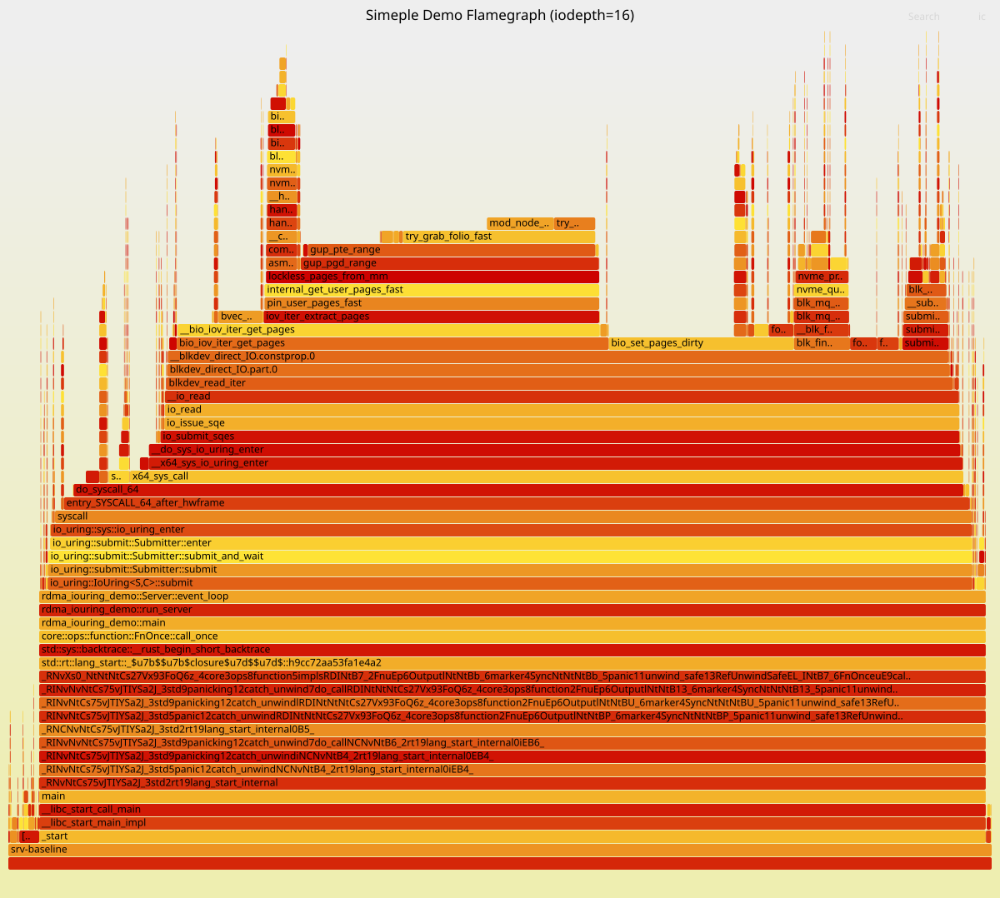

## 0. "Task Failed Successfully"

The AI era has arrived faster than most of us expected. Agentic coding has completely changed the way I work day to day. To be honest, I haven’t written a single line of code at work in quite a while. Yes, it is true. ***NOT A SINGLE LINE!!*** And yet, that hasn't stopped the code from running across clusters with hundreds of HPC servers at the peak performce.

Of course, not writing code (or even not fully reviewing it) does not mean we are just randomly poking around, like *monkey typing*. We still need to analyze requirements, refine the design with the agent, build demos, run mock experiments, study the results from small-scale tests, iterate on the problems we find, and maintain a complete, solid testing process, blah blah blah.

However, with AI and agentic coding, everything has become faster. Sometimes, code is churned out faster than we can fully understand it. And sometims, it is even faster than AI can understand it. You, you read that right. And this post comes from one such example.

After I gave my agent the prompt to optimize the performance of my system, the AI quickly took the it from roughly half throughput to full saturation. But its explanation of why it worked was completely wrong. It was a classic case of ***task failed successfully***.

This post doesn't talk about why the AI "failed successfully". It is a walkthrough of the analysis and debugging process behind this system performance optimization.

## 1. Optimize a demo with 1 NIC and 8 disks

Let's turn the system into a simple abstraction to foucus on the performance optimization rather than the complex business:

A single thread issues 1 MiB random direct I/O reads across 8 NVMe drives, then sends the data to a remote host via RDMA WRITE. Now, saturate the NIC bandwidth.

More specifically, each drive can deliver up to 7 GiB/s of read throughput, and the NIC provides 400 Gb/s of network bandwidth. All devices are attached to the same NUMA node. The worker thread is pinned to a non-CPU0 core. The host runs with the IOMMU in passthrough mode, and none of the I/O devices involved are translated through the IOMMU.

For the implementation, I (actually it was my AI agent) built a very simple event loop: the client sends read requests to the server; the server polls the RDMA CQ for incoming requests, submits the reads through io_uring, polls for the resulting CQEs, and then sends the data back via RDMA WRITE.

This demo setup is very straightforward and rules out almost all sources of interference. Other than the NIC we are trying to saturate, every component has plenty of headroom: the NIC’s theoretical maximum throughput is 46.6 GiB/s, each drive averages less than 6 GiB/s of read throughput, total IOPS stay below 50,000, and the CPU has more than enough capacity as well.

Now that everything is in place, let’s look at the results.

| inflight | GiB/s | avg µs | p50   | p90   | p99   | p99.9 |
|:--------:|------:|-------:|------:|------:|------:|------:|
| 4        | 8.87  | 440    | 430   | 519   | 632   | 759   |
| 8        | 15.56 | 501    | 486   | 616   | 784   | 955   |
| **16**   | **22.69** | 688 | 670   | 850   | 1118  | 1436  |
| 32       | 22.53 | 1386   | 1384  | 1696  | 1934  | 2272  |
| 64       | 22.15 | 2821   | 2819  | 3133  | 3366  | 3691  |

Surprisingly, the system already hits a bottleneck at an I/O depth of just 16, with aggregate throughput reaching only about half of the NIC’s bandwidth. And the CPU utilization reached 100%.

It was clear that there must have been something wrong, so I profiled the system with perf at an I/O depth of 16. Here is the flamegraph.

As the flamegraph shows, most of the CPU time is spent in `io_submit_sqes`, which accounts for 81.62% of the total CPU cost. Because the demo uses Direct I/O, every I/O submission requires the kernel to construct DMA metadata from the user-space buffer for the block device to consume. The most costly parts of this path are:

- `__bio_iov_iter_get_pages`: Turn `iov` into `bio` pages.
    - `pin_user_pages_fast`: Translates a user-space virtual address range into an array of `struct page` pointers, and pins those pages so they cannot be reclaimed, migrated, or swapped out while the device is performing DMA.
- `bio_set_pages_dirty`: Mark the buffer pages dirty. With Direct I/O, the NVMe device DMA-writes data directly into the pages backing the user-space buffer. Those pages must then be marked dirty so that the VM does not treat them as clean pages.
- `folio_*`: It updates VM state associated with the folio, including its reference count, dirty state, mapping, locking, and reclaim-related state. In the Linux VM, a folio is a unified abstraction for a physically contiguous set of pages.

In a word, the wide frame of `io_submit_sqes` represents the cumulative cost of preparing user memory for Direct I/O DMA. Each SQE contains only a user-space pointer and length. The kernel must walk the page tables, find and pin the backing struct pages, build bio_vec entries, update folio state, and submit the resulting bio.

Most of that work is paid per page. A 1 MiB read backed by 4 KiB pages touches roughly 256 pages, turning one logical read into hundreds of page-table lookups, page pins, folio updates, and bio-vector operations. At 20,000 to 50,000 reads per second, the system performs roughly 5 to 13 million GUPs (Get User Pages) per second. If the virtual address range is backed by heavily fragmented physical memory, there may be a comparable number of folio metadata updates and atomic refcount/pincount updates, along with potential cross-core cache-line ownership transfers.

Therefore, if we can avoid paying the cost of processing the user-space buffer on every I/O, we should be able to improve performance. Fortunately, `liburing` provides a way to do exactly that. `io_uring_register_buffers(3)` lets us register I/O buffers ahead of time, moving this metadata preparation work out of the per-I/O path. More specifically, `io_uring_register_buffers(3)` performs the following work up front:

- Validates the `iovecs` up front, checking address ranges, lengths, alignment, and count limits.
- Performs GUP on the buffers, translates the user-space virtual addresses into the corresponding struct pages / folios, and pins those pages for the lifetime of the registration.
- Constructs and retains kernel-side buffer metadata, build `io_mapped_ubuf` for each registered buffer.

These are exactly the major costs we just observed in the flamegraph! Let’s try it. In the demo, we introduce a 64 MiB read arena and divide it into 1 MiB slots, matching the I/O size. At startup, we register the 64-slot read arena as 64 io_uring fixed buffers through `io_uring_register_buffers(3)`, with one iovec per slot. For each read, we switch the opcode from `opcode::Read` to `opcode::ReadFixed` and set buf_index to the corresponding slot. This allows the I/O path to use registered buffers. Here is the results:

| inflight | GiB/s | avg µs | p50   | p90   | p99   | p99.9 |
|:--------:|------:|-------:|------:|------:|------:|------:|
| 4 | 9.09 | 429 | 421 | 519 | 641 | 767 |
| 8 | 16.78 | 465 | 447 | 590 | 775 | 966 |
| 16 | 28.08 | 556 | 514 | 774 | 1119 | 1425 |
| 32 | 39.87 | 783 | 705 | 1229 | 1754 | 2184 |
| **64** | **46.00** | 1358 | 1248 | 2089 | 3195 | 4214 |

As the I/O depth increases, throughput continues to rise. At an I/O depth of 64, it nearly saturates the NIC bandwidth.

| inflight | Baseline GiB/s | Step1 GiB/s | Δ | Baseline p99 | ReadFixed p99 |
|:--------:|---------------:|------------:|--:|-------------:|--------------:|
| 4 | 8.87 | 9.09 | +2% | 632 | 641 |
| 8 | 15.56 | 16.78 | +8% | 784 | 775 |
| 16 | 22.69 | 28.08 | +24% | 1118 | 1119 |
| 32 | 22.53 | 39.87 | **+77%** | 1934 | 1754 |
| 64 | 22.15 | 46.00 | **+108%** | 3366 | 3195 |

Compared with the baseline, throughput is similar up to an I/O depth of 16, where the CPU has not yet become the bottleneck. Beyond that point, per-I/O buffer handling in the baseline becomes CPU-bound. ReadFixed removes this bottleneck, allowing throughput to continue scaling until it saturates the NIC.

***TBC ... ...***

## X. "A Planet Upside Down"

In fact, my work should have been done as soon as the AI finished the initial performance optimization. Ironically, figuring out why the optimization worked ended up taking far more of my own time than the original task itself. As AI models become more capable, they can build surprisingly good systems even without a real understanding of the underlying principles.

But digging into those principles has always been one of my small obsessions as a programmer. In the flood of AI, it may also be one of the ways I keep myself from slipping into a sense of meaninglessness.

To close, I want to share a few lines from a song I’ve been listening to lately. A toast to everyone still trying to stay grounded in this era.

> You used to wonder why, 
> 
> but now you wonder how.
>
> ...
> 
> But you're still trying hard to understand,
> 
> to comprehend,
> 
> to wrap your head around
> 
> all the things that don't make sense,
> 
>  that don't mix in
> 
> a planet upside down.
>
> --- A Planet Upside Down (Pearl & The Oysters)

